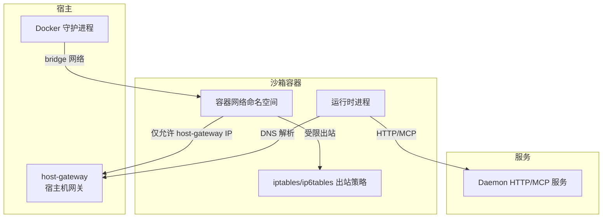
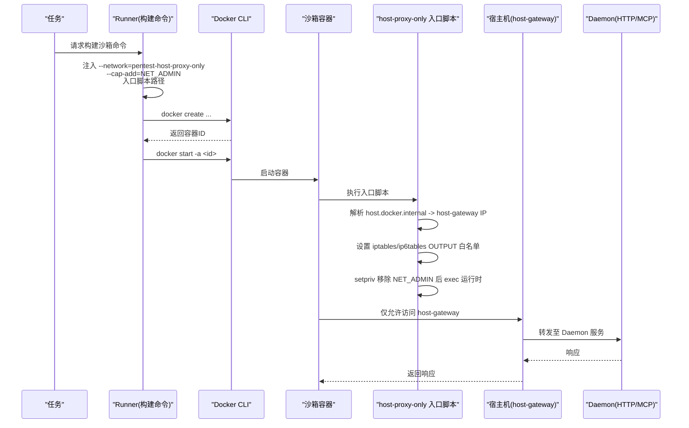
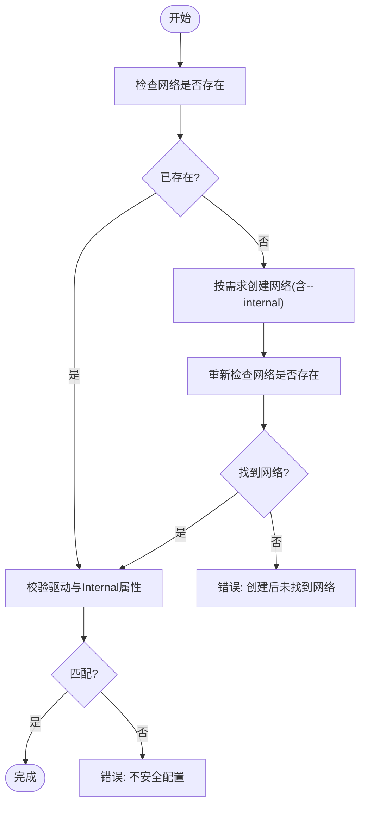
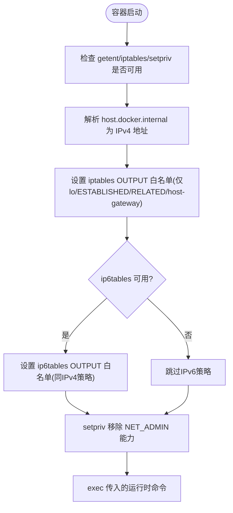
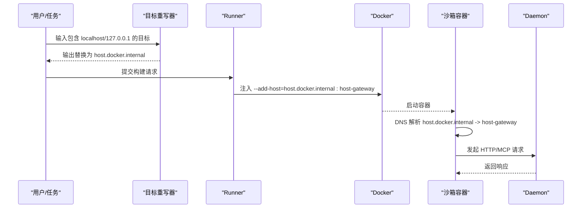

# 网络配置与访问控制

<cite>
**本文引用的文件**   
- [internal/runtime/docker_sandbox.go](file://internal/runtime/docker_sandbox.go)
- [internal/runner/runner.go](file://internal/runner/runner.go)
- [docker/pentest-sandbox/Dockerfile](file://docker/pentest-sandbox/Dockerfile)
- [docker/pentest-sandbox/host-proxy-only-entrypoint.sh](file://docker/pentest-sandbox/host-proxy-only-entrypoint.sh)
- [internal/runner/target.go](file://internal/runner/target.go)
- [internal/daemon/server.go](file://internal/daemon/server.go)
- [internal/daemon/mcp_handlers.go](file://internal/daemon/mcp_handlers.go)
- [internal/runner/mcp.go](file://internal/runner/mcp.go)
- [internal/runner/runner_test.go](file://internal/runner/runner_test.go)
</cite>

## 目录
1. [简介](#简介)
2. [项目结构](#项目结构)
3. [核心组件](#核心组件)
4. [架构总览](#架构总览)
5. [详细组件分析](#详细组件分析)
6. [依赖关系分析](#依赖关系分析)
7. [性能考量](#性能考量)
8. [故障排查指南](#故障排查指南)
9. [结论](#结论)

## 简介
本文件聚焦于沙箱运行时的 Docker 网络配置与访问控制机制，重点解释：
- internal 网络的创建与校验流程（驱动选择、隔离属性验证）
- host_proxy_only 模式的实现（代理转发规则、端口映射、流量过滤）
- 网络隔离策略如何阻止沙箱容器直接访问外部网络，并通过受控通道进行通信
- DNS 解析在 host.docker.internal 与 host-gateway 上的行为与限制

## 项目结构
与网络与访问控制相关的代码主要分布在以下位置：
- 运行时适配器负责确保 Docker 网络存在并满足安全要求
- Runner 负责构建沙箱容器的启动参数，包括网络模式、入口点与能力裁剪
- 镜像与入口脚本提供 iptables 出站白名单与能力裁剪
- 目标重写逻辑将本地回环地址改写为 host.docker.internal，配合 --add-host 指向 host-gateway
- Daemon 侧对来自 host.docker.internal 的请求进行来源校验

[此图为概念性示意，不直接映射具体源码文件]

## 核心组件
- Docker 网络需求与校验：确保指定名称的 Docker 网络存在且具备期望的驱动与隔离属性。若不存在则按需求创建，并在竞态情况下二次校验。
- host_proxy_only 模式：通过专用 bridge 网络 + 容器内 iptables 出站白名单，仅允许访问宿主机网关；同时移除 NET_ADMIN 能力，防止运行时修改防火墙规则。
- 目标重写与 DNS：将任务目标中的 localhost/127.0.0.1 改写为 host.docker.internal，并通过 --add-host=host.docker.internal:host-gateway 将其解析到宿主机网关，从而在受限网络下可达。
- Daemon 来源校验：Daemon 接受来自 host.docker.internal 的请求，作为沙箱侧可信来源之一。

章节来源
- [internal/runtime/docker_sandbox.go:365-428](file://internal/runtime/docker_sandbox.go#L365-L428)
- [internal/runner/runner.go:60-76](file://internal/runner/runner.go#L60-L76)
- [internal/runner/runner.go:196-216](file://internal/runner/runner.go#L196-L216)
- [docker/pentest-sandbox/host-proxy-only-entrypoint.sh:1-46](file://docker/pentest-sandbox/host-proxy-only-entrypoint.sh#L1-L46)
- [internal/runner/target.go:1-130](file://internal/runner/target.go#L1-L130)
- [internal/daemon/server.go:507](file://internal/daemon/server.go#L507)

## 架构总览
下图展示了 host_proxy_only 模式下，沙箱容器如何通过受限网络与受控代理进行通信。

图表来源
- [internal/runner/runner.go:196-216](file://internal/runner/runner.go#L196-L216)
- [docker/pentest-sandbox/host-proxy-only-entrypoint.sh:16-45](file://docker/pentest-sandbox/host-proxy-only-entrypoint.sh#L16-L45)
- [internal/daemon/server.go:507](file://internal/daemon/server.go#L507)

## 详细组件分析

### Docker 网络需求与校验（internal 网络）
- 当需要强制内部网络时，系统会调用 ensureDockerNetwork 检查网络是否存在；若不存在则使用指定驱动创建，并在失败后进行竞态重试与再次校验。
- inspectDockerNetwork 通过 network inspect 获取实际驱动与 Internal 标志；validateDockerNetwork 对比期望与实际值，不一致即报错，避免不安全配置被复用。
- 该流程保证“内部网络”语义不被绕过，即使由其他任务并发创建，也会严格校验其属性。

图表来源
- [internal/runtime/docker_sandbox.go:365-428](file://internal/runtime/docker_sandbox.go#L365-L428)

章节来源
- [internal/runtime/docker_sandbox.go:365-428](file://internal/runtime/docker_sandbox.go#L365-L428)

### host_proxy_only 模式实现
- 网络模式常量与网络名：定义 SandboxNetworkHostProxyOnly 与 HostProxyOnlySandboxNetworkName，用于统一标识与引用。
- 构建命令时注入：
  - --network pentest-host-proxy-only
  - --cap-add NET_ADMIN（仅用于安装防火墙规则）
  - 入口脚本 /usr/local/bin/pentest-host-proxy-only
- 入口脚本职责：
  - 校验必要工具 getent/iptables/setpriv 可用
  - 解析 host.docker.internal 对应的 IPv4 地址（Docker Desktop host gateway）
  - 清空并设置 iptables/ip6tables OUTPUT 链默认 DROP，仅放行 lo、ESTABLISHED/RELATED 及 host-gateway 单主机路由
  - 使用 setpriv 从 bounding/inh/ambient caps 中移除 NET_ADMIN，再 exec 用户提供的运行时命令，防止运行时篡改防火墙规则
- 镜像层准备：Dockerfile 安装 iptables/util-linux，复制入口脚本并提供环境变量与工具集。

图表来源
- [docker/pentest-sandbox/host-proxy-only-entrypoint.sh:1-46](file://docker/pentest-sandbox/host-proxy-only-entrypoint.sh#L1-L46)
- [docker/pentest-sandbox/Dockerfile:124-131](file://docker/pentest-sandbox/Dockerfile#L124-L131)
- [internal/runner/runner.go:196-216](file://internal/runner/runner.go#L196-L216)

章节来源
- [internal/runner/runner.go:60-76](file://internal/runner/runner.go#L60-L76)
- [internal/runner/runner.go:196-216](file://internal/runner/runner.go#L196-L216)
- [docker/pentest-sandbox/Dockerfile:124-131](file://docker/pentest-sandbox/Dockerfile#L124-L131)
- [docker/pentest-sandbox/host-proxy-only-entrypoint.sh:1-46](file://docker/pentest-sandbox/host-proxy-only-entrypoint.sh#L1-L46)

### 目标重写与 DNS 解析（host.docker.internal）
- 目标重写：RewriteLoopbackTargets 将任务描述中的 127.0.0.1/localhost 替换为 host.docker.internal，保留端口与路径，避免误改子域名。
- DNS 解析：构建命令时添加 --add-host=host.docker.internal:host-gateway，使容器内对该域名的解析固定指向宿主机网关，从而在受限网络下可达。
- Daemon 来源校验：Daemon 将 host.docker.internal 视为可信来源之一，用于识别来自沙箱的请求。

图表来源
- [internal/runner/target.go:1-130](file://internal/runner/target.go#L1-L130)
- [internal/runner/runner.go:170](file://internal/runner/runner.go#L170)
- [internal/daemon/server.go:507](file://internal/daemon/server.go#L507)

章节来源
- [internal/runner/target.go:1-130](file://internal/runner/target.go#L1-L130)
- [internal/runner/runner.go:170](file://internal/runner/runner.go#L170)
- [internal/daemon/server.go:507](file://internal/daemon/server.go#L507)

### 代理转发规则、端口映射与流量过滤
- 代理转发规则：在 host_proxy_only 模式下，出站流量仅允许到达 host-gateway 的单主机路由，其余全部丢弃。这天然限制了对外部网络的访问，只允许通过宿主机上运行的代理或服务进行受控通信。
- 端口映射：当前实现未采用 -p 或 --publish 暴露容器端口到宿主，而是通过 host.docker.internal 访问宿主机服务。因此无需额外端口映射即可与宿主机服务交互。
- 流量过滤：iptables/ip6tables 的 OUTPUT 链默认 DROP，仅放行回环、已建立连接与 host-gateway 地址，形成强约束的出站白名单。

章节来源
- [docker/pentest-sandbox/host-proxy-only-entrypoint.sh:22-37](file://docker/pentest-sandbox/host-proxy-only-entrypoint.sh#L22-L37)
- [internal/runner/runner.go:196-216](file://internal/runner/runner.go#L196-L216)

### 网络隔离策略与受控通信
- 隔离策略：通过专用 bridge 网络 + 容器内 iptables 出站白名单，阻断沙箱容器直接访问任意外部网络。
- 受控通信：仅允许访问 host-gateway，结合目标重写与 DNS 解析，使得容器能可靠地访问宿主机上的代理服务或 Daemon 接口。
- 能力裁剪：在设置完防火墙规则后，立即移除 NET_ADMIN 能力，防止运行时进程修改规则，确保策略不可逃逸。

章节来源
- [docker/pentest-sandbox/host-proxy-only-entrypoint.sh:39-45](file://docker/pentest-sandbox/host-proxy-only-entrypoint.sh#L39-L45)
- [internal/runner/runner.go:196-216](file://internal/runner/runner.go#L196-L216)

## 依赖关系分析
- Runner 负责生成 docker create 参数，决定网络模式、入口脚本与能力。
- Docker 运行时负责创建/启动容器，并将容器加入指定网络。
- 容器内的入口脚本负责设置出站策略并裁剪能力。
- Daemon 接收来自 host.docker.internal 的请求并进行来源校验。

图表来源
- [internal/runner/runner.go:196-216](file://internal/runner/runner.go#L196-L216)
- [docker/pentest-sandbox/host-proxy-only-entrypoint.sh:1-46](file://docker/pentest-sandbox/host-proxy-only-entrypoint.sh#L1-L46)
- [internal/daemon/server.go:507](file://internal/daemon/server.go#L507)

章节来源
- [internal/runner/runner.go:196-216](file://internal/runner/runner.go#L196-L216)
- [docker/pentest-sandbox/host-proxy-only-entrypoint.sh:1-46](file://docker/pentest-sandbox/host-proxy-only-entrypoint.sh#L1-L46)
- [internal/daemon/server.go:507](file://internal/daemon/server.go#L507)

## 性能考量
- 网络创建与校验：ensureDockerNetwork 在首次创建时会触发一次网络 inspect 与可能的 create 操作，后续启动仅需校验，开销较小。
- iptables 初始化：每次容器启动都会执行 iptables/ip6tables 规则设置，属于一次性成本，通常可忽略。
- DNS 解析：--add-host 避免了额外的 DNS 查询，提升解析稳定性与速度。

[本节为通用指导，不直接分析具体文件]

## 故障排查指南
- 网络不存在或不匹配：
  - 现象：启动时报错提示网络不存在或配置不安全
  - 排查：确认网络名称、驱动与 Internal 标志是否符合预期；查看 ensureDockerNetwork 的日志与错误信息
  - 参考：[internal/runtime/docker_sandbox.go:365-428](file://internal/runtime/docker_sandbox.go#L365-L428)
- host.docker.internal 无法解析：
  - 现象：入口脚本报告无法解析 host.docker.internal
  - 排查：确认 Docker Desktop host gateway 可用；检查容器是否能解析该域名
  - 参考：[docker/pentest-sandbox/host-proxy-only-entrypoint.sh:16-20](file://docker/pentest-sandbox/host-proxy-only-entrypoint.sh#L16-L20)
- 出站被拒绝：
  - 现象：容器内访问外部网络超时或被拒绝
  - 排查：确认 iptables/ip6tables 策略是否正确设置；确认目标是否为 host-gateway
  - 参考：[docker/pentest-sandbox/host-proxy-only-entrypoint.sh:22-37](file://docker/pentest-sandbox/host-proxy-only-entrypoint.sh#L22-L37)
- 能力不足导致规则失效：
  - 现象：运行时尝试修改防火墙规则失败
  - 排查：确认 setpriv 已正确移除 NET_ADMIN 能力
  - 参考：[docker/pentest-sandbox/host-proxy-only-entrypoint.sh:39-45](file://docker/pentest-sandbox/host-proxy-only-entrypoint.sh#L39-L45)
- 目标未被正确重写：
  - 现象：任务仍尝试访问 127.0.0.1/localhost
  - 排查：确认 RewriteLoopbackTargets 是否启用；检查 --add-host 是否注入
  - 参考：[internal/runner/target.go:1-130](file://internal/runner/target.go#L1-L130), [internal/runner/runner.go:170](file://internal/runner/runner.go#L170)

章节来源
- [internal/runtime/docker_sandbox.go:365-428](file://internal/runtime/docker_sandbox.go#L365-L428)
- [docker/pentest-sandbox/host-proxy-only-entrypoint.sh:16-45](file://docker/pentest-sandbox/host-proxy-only-entrypoint.sh#L16-L45)
- [internal/runner/target.go:1-130](file://internal/runner/target.go#L1-L130)
- [internal/runner/runner.go:170](file://internal/runner/runner.go#L170)

## 结论
本项目通过“专用 bridge 网络 + 容器内 iptables 出站白名单 + 能力裁剪”的组合，实现了严格的沙箱网络隔离。借助目标重写与 --add-host 指向 host-gateway，沙箱可在受限网络下可靠访问宿主机上的受控服务与代理。网络需求的创建与校验保证了内部网络的隔离语义不被破坏，而 Daemon 的来源校验进一步增强了安全性。整体方案兼顾了可控性与可用性，适合渗透测试场景下的安全执行环境。