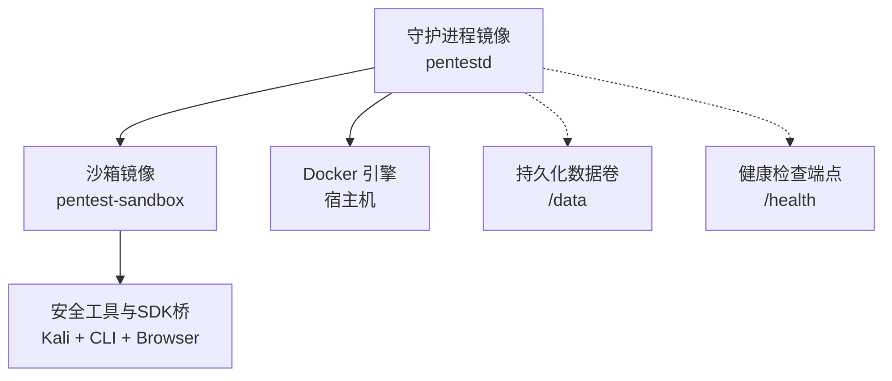
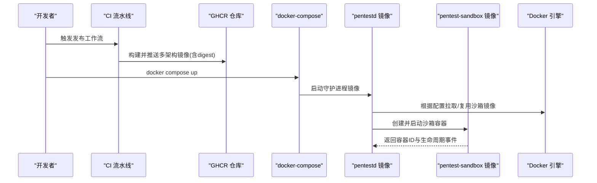
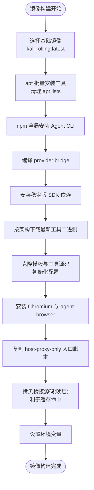
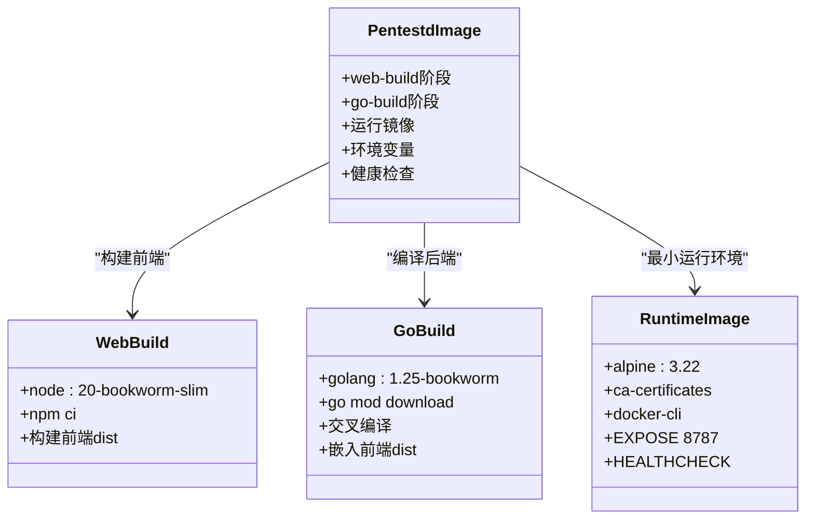
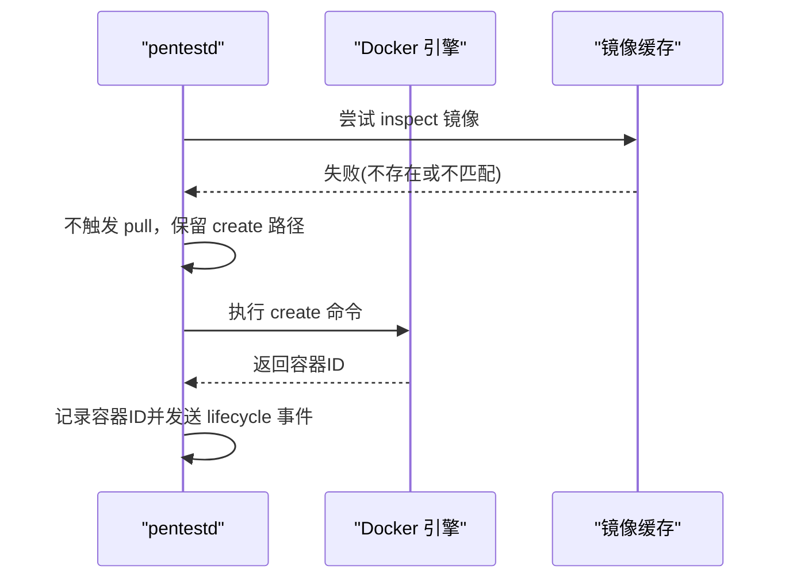
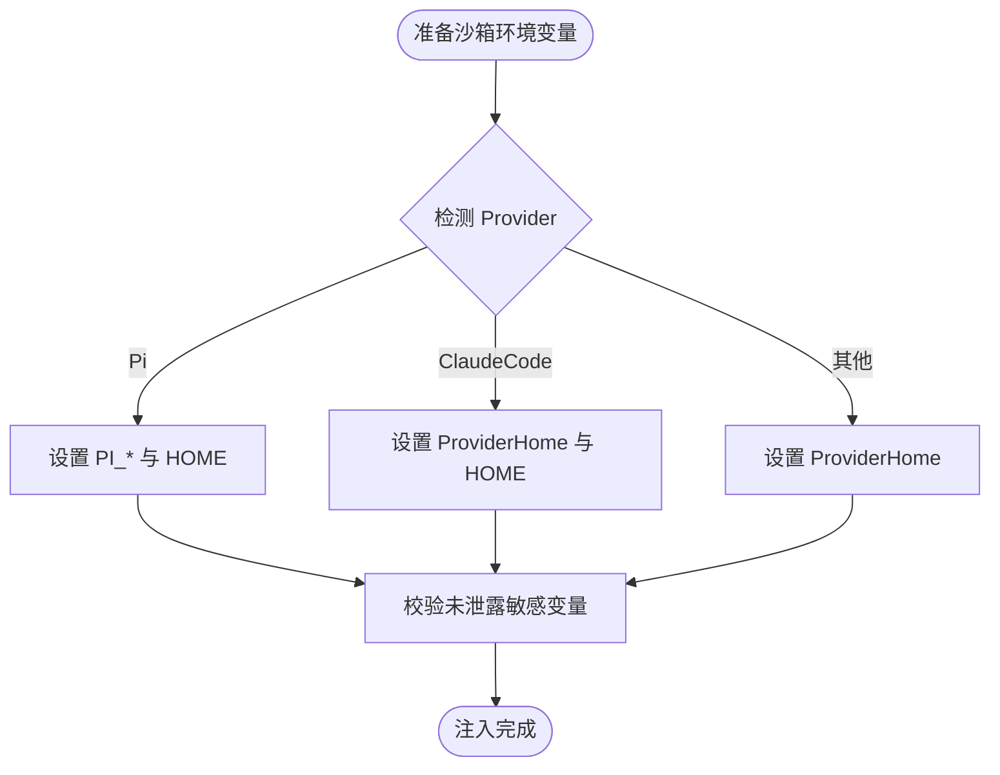
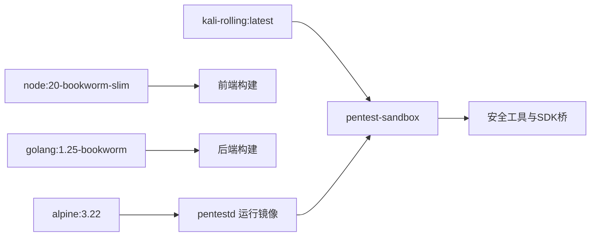
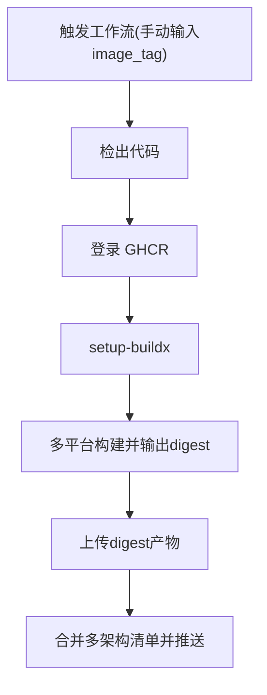
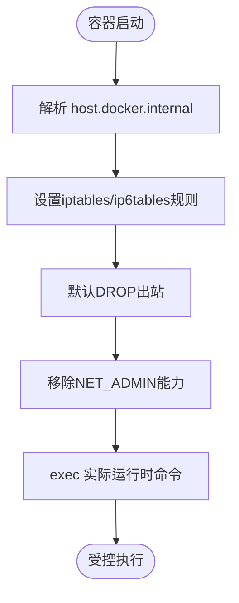

# 镜像管理与定制

<cite>
**本文引用的文件**
- [docker/pentest-sandbox/Dockerfile](file://docker/pentest-sandbox/Dockerfile)
- [docker/pentestd/Dockerfile](file://docker/pentestd/Dockerfile)
- [.github/workflows/publish-sandbox.yml](file://.github/workflows/publish-sandbox.yml)
- [docker-compose.yaml](file://docker-compose.yaml)
- [.dockerignore](file://.dockerignore)
- [Makefile](file://Makefile)
- [docker/pentest-sandbox/host-proxy-only-entrypoint.sh](file://docker/pentest-sandbox/host-proxy-only-entrypoint.sh)
- [internal/runtime/docker_sandbox.go](file://internal/runtime/docker_sandbox.go)
- [internal/runner/runner.go](file://internal/runner/runner.go)
- [internal/daemon/blackboard_v2_post_grant_atomicity_test.go](file://internal/daemon/blackboard_v2_post_grant_atomicity_test.go)
</cite>

## 目录
1. [简介](#简介)
2. [项目结构](#项目结构)
3. [核心组件](#核心组件)
4. [架构总览](#架构总览)
5. [详细组件分析](#详细组件分析)
6. [依赖关系分析](#依赖关系分析)
7. [性能与缓存优化](#性能与缓存优化)
8. [版本控制与更新机制](#版本控制与更新机制)
9. [安全加固措施](#安全加固措施)
10. [故障排查指南](#故障排查指南)
11. [结论](#结论)

## 简介
本文件围绕 Kali Linux 基础镜像的定制与优化，系统阐述 CyberPenda 项目中两个关键镜像的设计与实现：
- 渗透测试沙箱镜像（pentest-sandbox）：基于 Kali，预装大量安全工具、浏览器与 Agent SDK 桥接程序，为任务执行提供隔离环境。
- 守护进程镜像（pentestd）：Go 服务镜像，嵌入前端静态资源，负责编排任务、管理运行时与沙箱容器生命周期。

文档覆盖基础镜像选择、工具安装策略、环境变量配置、安全加固、镜像拉取与缓存优化、本地镜像管理、版本控制与更新机制、构建最佳实践与性能优化技巧等主题。

## 项目结构
与镜像相关的核心文件与职责如下：
- docker/pentest-sandbox/Dockerfile：定义沙箱镜像，包含基础镜像、工具链、Agent SDK 桥、浏览器与技能包、网络出口限制入口脚本等。
- docker/pentestd/Dockerfile：多阶段构建 Go 二进制并打包到最小 Alpine 运行镜像，暴露健康检查与数据卷。
- .github/workflows/publish-sandbox.yml：CI 中构建并推送多架构沙箱镜像，生成 digest 产物并创建多架构清单。
- docker-compose.yaml：本地一键启动守护进程与服务，挂载 Docker socket，注入环境变量与数据卷。
- Makefile：提供本地构建沙箱镜像、开发联调与冒烟测试目标。
- .dockerignore：减少构建上下文体积，提升缓存命中率。
- docker/pentest-sandbox/host-proxy-only-entrypoint.sh：在容器内通过 iptables 限制出站流量，仅允许宿主机网关，随后以受限能力集执行运行时命令。

图示来源
- [docker/pentestd/Dockerfile:1-37](file://docker/pentestd/Dockerfile#L1-L37)
- [docker/pentest-sandbox/Dockerfile:1-145](file://docker/pentest-sandbox/Dockerfile#L1-L145)
- [docker-compose.yaml:1-35](file://docker-compose.yaml#L1-L35)

章节来源
- [docker/pentest-sandbox/Dockerfile:1-145](file://docker/pentest-sandbox/Dockerfile#L1-L145)
- [docker/pentestd/Dockerfile:1-37](file://docker/pentestd/Dockerfile#L1-L37)
- [.github/workflows/publish-sandbox.yml:1-148](file://.github/workflows/publish-sandbox.yml#L1-L148)
- [docker-compose.yaml:1-35](file://docker-compose.yaml#L1-L35)
- [Makefile:1-98](file://Makefile#L1-L98)
- [.dockerignore:1-15](file://.dockerignore#L1-L15)
- [docker/pentest-sandbox/host-proxy-only-entrypoint.sh:1-46](file://docker/pentest-sandbox/host-proxy-only-entrypoint.sh#L1-L46)

## 核心组件
- 沙箱镜像（pentest-sandbox）
  - 基础镜像：kalilinux/kali-rolling:latest
  - 工具安装：apt 源一次性更新后批量安装，清理 apt lists；npm 全局安装多个 Agent CLI；GitHub Releases 动态解析最新版本并下载二进制；git clone --depth 1 获取模板与工具源码；pip 安装 Python 依赖；Chromium 及 agent-browser 集成。
  - 环境变量：CLAUDE_CODE_DISABLE_NONESSENTIAL_TRAFFIC、PENTEST_SANDBOX、PENTEST_SKILLS_DIR、AGENT_BROWSER_EXECUTABLE_PATH。
  - 安全边界：host-proxy-only 入口脚本设置 iptables/ip6tables 出站白名单，并以 setpriv 移除 NET_ADMIN 能力后再 exec 实际运行时命令。
- 守护进程镜像（pentestd）
  - 多阶段构建：Node 构建前端静态资源，Go 编译二进制，最终使用 alpine:3.22 最小运行镜像。
  - 运行时参数：监听地址、数据库路径、运行时根目录、健康检查、数据卷挂载。
- CI 发布流水线
  - 多平台构建（amd64/arm64），输出 digest 产物，合并为多架构清单并推送到 GHCR。
- 本地编排与运行
  - docker-compose 注入认证令牌、沙箱镜像名、容器 CLI 类型，挂载 Docker socket与数据卷，启用 no-new-privileges。
  - Makefile 提供 build-sandbox-image、smoke-sandbox-mcp、smoke-runtime-tasks 等便捷目标。

章节来源
- [docker/pentest-sandbox/Dockerfile:1-145](file://docker/pentest-sandbox/Dockerfile#L1-L145)
- [docker/pentestd/Dockerfile:1-37](file://docker/pentestd/Dockerfile#L1-L37)
- [.github/workflows/publish-sandbox.yml:1-148](file://.github/workflows/publish-sandbox.yml#L1-L148)
- [docker-compose.yaml:1-35](file://docker-compose.yaml#L1-L35)
- [Makefile:1-98](file://Makefile#L1-L98)
- [docker/pentest-sandbox/host-proxy-only-entrypoint.sh:1-46](file://docker/pentest-sandbox/host-proxy-only-entrypoint.sh#L1-L46)

## 架构总览
下图展示了守护进程与沙箱镜像的交互、镜像构建与发布流程以及本地运行时的关键要素。

图示来源
- [.github/workflows/publish-sandbox.yml:1-148](file://.github/workflows/publish-sandbox.yml#L1-L148)
- [docker-compose.yaml:1-35](file://docker-compose.yaml#L1-L35)
- [internal/runtime/docker_sandbox.go:133-155](file://internal/runtime/docker_sandbox.go#L133-L155)

## 详细组件分析

### 沙箱镜像（pentest-sandbox）
- 基础镜像选择
  - 采用 kalilinux/kali-rolling:latest，确保内置丰富的安全工具生态。
- 工具安装策略
  - 使用 apt 一次性安装大量工具，避免多次层失效；安装完成后清理 /var/lib/apt/lists/*。
  - npm 全局安装 Claude Code、Codex、Pi 等 Agent CLI，便于在沙箱内直接调用。
  - 通过 GitHub API 动态解析 ProjectDiscovery、Dalfox、CloudFox 等工具的最新发布标签，按架构下载对应二进制，保证工具版本可控且最新。
  - git clone --depth 1 克隆 nuclei-templates 与 jwt_tool，减少历史体积；nuclei 初始化并写入配置文件禁用自动更新检查，固定模板目录。
  - Chromium 与 agent-browser 集成，配置可执行路径，使浏览器自动化可用。
- 环境变量配置
  - CLAUDE_CODE_DISABLE_NONESSENTIAL_TRAFFIC=1：减少非必要网络请求。
  - PENTEST_SANDBOX=1：标识沙箱运行模式。
  - PENTEST_SKILLS_DIR=/opt/pentest/skills：集中存放技能包。
  - AGENT_BROWSER_EXECUTABLE_PATH=/usr/bin/chromium：指定浏览器可执行路径。
- 安全加固
  - host-proxy-only 入口脚本：
    - 解析 host.docker.internal 得到宿主机网关 IP。
    - 清空 OUTPUT 链，放行本地回环与已建立连接，放行宿主机网关，默认 DROP。
    - 对 IPv6 同样设置默认 DROP 策略，防止绕过。
    - 使用 setpriv 移除 NET_ADMIN 能力后 exec 实际运行时命令，确保运行时无法修改防火墙规则。
- 构建层顺序与缓存
  - 将频繁变更的桥接源码拷贝放在较后层，避免影响前面稳定的包管理器与工具安装层缓存。

图示来源
- [docker/pentest-sandbox/Dockerfile:1-145](file://docker/pentest-sandbox/Dockerfile#L1-L145)
- [docker/pentest-sandbox/host-proxy-only-entrypoint.sh:1-46](file://docker/pentest-sandbox/host-proxy-only-entrypoint.sh#L1-L46)

章节来源
- [docker/pentest-sandbox/Dockerfile:1-145](file://docker/pentest-sandbox/Dockerfile#L1-L145)
- [docker/pentest-sandbox/host-proxy-only-entrypoint.sh:1-46](file://docker/pentest-sandbox/host-proxy-only-entrypoint.sh#L1-L46)

### 守护进程镜像（pentestd）
- 多阶段构建
  - web-build：基于 node:20-bookworm-slim，安装依赖并构建前端静态资源。
  - go-build：基于 golang:1.25-bookworm，下载 Go 模块，拷贝源码与前端 dist，交叉编译二进制，剥离调试信息并注入版本号。
  - 运行镜像：alpine:3.22，仅安装 ca-certificates 与 docker-cli，复制二进制，暴露端口与健康检查。
- 运行时配置
  - 环境变量：PENTEST_LISTEN_ADDR、PENTEST_DB、PENTEST_RUNTIME_ROOT。
  - 数据卷：/data 用于持久化数据库与运行状态。
  - 健康检查：定期访问 /health 判定服务就绪。

图示来源
- [docker/pentestd/Dockerfile:1-37](file://docker/pentestd/Dockerfile#L1-L37)

章节来源
- [docker/pentestd/Dockerfile:1-37](file://docker/pentestd/Dockerfile#L1-L37)

### 镜像拉取策略与运行时行为
- 不主动触发 pull
  - 当容器 inspect 失败时，不应触发 image_pull 事件或执行 pull 操作，保持 create 路径不变，避免不必要的网络开销与不确定性。
- 生命周期事件
  - 容器创建成功后记录 container_id 并发送 lifecycle 事件，便于上层追踪。

图示来源
- [internal/runtime/docker_sandbox.go:133-155](file://internal/runtime/docker_sandbox.go#L133-L155)

章节来源
- [internal/runtime/docker_sandbox.go:133-155](file://internal/runtime/docker_sandbox.go#L133-L155)

### 环境变量与权限控制
- 沙箱环境变量注入
  - 针对不同 Provider（如 Pi、Claude Code），运行时注入 HOME、PI_CODING_AGENT_DIR、PI_CODING_AGENT_SESSION_DIR 等变量，确保会话与数据位于任务挂载目录内。
- 敏感信息保护
  - 测试用例验证不会将项目 ID、任务 ID、认证令牌、接口 URL 等敏感环境变量泄露给沙箱进程。

图示来源
- [internal/runner/runner.go:245-283](file://internal/runner/runner.go#L245-L283)
- [internal/daemon/blackboard_v2_post_grant_atomicity_test.go:260-279](file://internal/daemon/blackboard_v2_post_grant_atomicity_test.go#L260-L279)

章节来源
- [internal/runner/runner.go:245-283](file://internal/runner/runner.go#L245-L283)
- [internal/daemon/blackboard_v2_post_grant_atomicity_test.go:260-279](file://internal/daemon/blackboard_v2_post_grant_atomicity_test.go#L260-L279)

## 依赖关系分析
- 外部依赖
  - Kali 滚动发行版作为基础镜像，提供广泛的安全工具生态。
  - Node.js 与 Go 工具链用于构建前端与后端。
  - GitHub Releases API 用于动态解析工具版本。
- 内部依赖
  - pentestd 依赖 Docker 引擎与沙箱镜像。
  - 沙箱镜像依赖 iptables、setpriv、Chromium、Agent SDK 桥等。

图示来源
- [docker/pentest-sandbox/Dockerfile:1-145](file://docker/pentest-sandbox/Dockerfile#L1-L145)
- [docker/pentestd/Dockerfile:1-37](file://docker/pentestd/Dockerfile#L1-L37)

章节来源
- [docker/pentest-sandbox/Dockerfile:1-145](file://docker/pentest-sandbox/Dockerfile#L1-L145)
- [docker/pentestd/Dockerfile:1-37](file://docker/pentestd/Dockerfile#L1-L37)

## 性能与缓存优化
- 构建上下文精简
  - 使用 .dockerignore 排除 .git、dist、node_modules、*.db、runs 等无关文件，减小上下文体积，提高缓存命中率。
- 层顺序优化
  - 将频繁变更的桥接源码拷贝置于较后层，避免影响前面稳定的包管理器与工具安装层缓存。
- 一次性安装与清理
  - apt 一次性安装所有包并在同一 RUN 层清理 /var/lib/apt/lists/*，减少层数与镜像体积。
- 固定依赖与版本
  - 使用 npm ci 与 go mod download 锁定依赖，避免不可重复构建。
- 多阶段构建
  - 将构建环境与运行环境分离，最终镜像仅包含必要运行时依赖。

章节来源
- [.dockerignore:1-15](file://.dockerignore#L1-L15)
- [docker/pentest-sandbox/Dockerfile:1-145](file://docker/pentest-sandbox/Dockerfile#L1-L145)
- [docker/pentestd/Dockerfile:1-37](file://docker/pentestd/Dockerfile#L1-L37)

## 版本控制与更新机制
- 多架构镜像发布
  - CI 工作流支持 linux/amd64 与 linux/arm64 并行构建，输出 digest 产物并合并为多架构清单，推送到 GHCR。
- 标签策略
  - 支持手动输入 image_tag，结合 metadata-action 生成 OCI 标签与注解。
- 本地构建与冒烟测试
  - Makefile 提供 build-sandbox-image 目标，支持自定义 SANDBOX_IMAGE；提供 smoke-sandbox-mcp 与 smoke-runtime-tasks 进行端到端验证。
- 依赖更新
  - 工具版本通过 GitHub API 动态解析最新标签，确保工具链保持最新；nuclei 模板目录固定并禁用自动更新检查，避免运行时网络波动影响稳定性。

图示来源
- [.github/workflows/publish-sandbox.yml:1-148](file://.github/workflows/publish-sandbox.yml#L1-L148)

章节来源
- [.github/workflows/publish-sandbox.yml:1-148](file://.github/workflows/publish-sandbox.yml#L1-L148)
- [Makefile:1-98](file://Makefile#L1-L98)

## 安全加固措施
- 网络出口限制
  - host-proxy-only 入口脚本设置 iptables/ip6tables 出站白名单，仅允许本地回环、已建立连接与宿主机网关，默认 DROP。
- 能力集裁剪
  - 使用 setpriv 移除 NET_ADMIN 能力后再 exec 运行时命令，防止运行时修改防火墙规则。
- 最小权限原则
  - docker-compose 启用 no-new-privileges:true，降低特权提升风险。
- 敏感信息隔离
  - 运行时注入的环境变量不包含项目 ID、任务 ID、认证令牌等敏感信息，测试用例验证该约束。

图示来源
- [docker/pentest-sandbox/host-proxy-only-entrypoint.sh:1-46](file://docker/pentest-sandbox/host-proxy-only-entrypoint.sh#L1-L46)
- [docker-compose.yaml:1-35](file://docker-compose.yaml#L1-L35)

章节来源
- [docker/pentest-sandbox/host-proxy-only-entrypoint.sh:1-46](file://docker/pentest-sandbox/host-proxy-only-entrypoint.sh#L1-L46)
- [docker-compose.yaml:1-35](file://docker-compose.yaml#L1-L35)
- [internal/daemon/blackboard_v2_post_grant_atomicity_test.go:260-279](file://internal/daemon/blackboard_v2_post_grant_atomicity_test.go#L260-L279)

## 故障排查指南
- 镜像拉取问题
  - 若 inspect 失败，系统不会触发 pull，需确认本地是否已存在所需镜像或提前拉取。
- 健康检查失败
  - 检查 pentestd 健康检查端点 /health 是否可达，确认端口映射与环境变量。
- 沙箱网络不通
  - 确认 host-proxy-only 入口脚本是否正确设置 iptables 规则，宿主机网关是否可达。
- 环境变量泄露
  - 参考测试用例校验逻辑，确保敏感变量未被注入沙箱进程。

章节来源
- [internal/runtime/docker_sandbox.go:133-155](file://internal/runtime/docker_sandbox.go#L133-L155)
- [docker/pentestd/Dockerfile:1-37](file://docker/pentestd/Dockerfile#L1-L37)
- [docker/pentest-sandbox/host-proxy-only-entrypoint.sh:1-46](file://docker/pentest-sandbox/host-proxy-only-entrypoint.sh#L1-L46)
- [internal/daemon/blackboard_v2_post_grant_atomicity_test.go:260-279](file://internal/daemon/blackboard_v2_post_grant_atomicity_test.go#L260-L279)

## 结论
本项目通过精心设计的沙箱与守护进程镜像，实现了强大的渗透测试代理能力。沙箱镜像基于 Kali，集成了丰富的安全工具与 Agent SDK 桥，配合严格的网络出口限制与能力裁剪，确保了执行环境的安全性与可控性。守护进程镜像采用多阶段构建与最小运行镜像，提升了部署效率与安全性。CI 流水线支持多架构构建与 digest 产物管理，保证了版本一致性与可追溯性。通过合理的构建层顺序、依赖锁定与上下文精简，项目在性能与可维护性方面达到了良好平衡。建议在生产环境中持续监控工具版本与安全补丁，结合固定标签与 digest 引用，进一步提升供应链安全与稳定性。