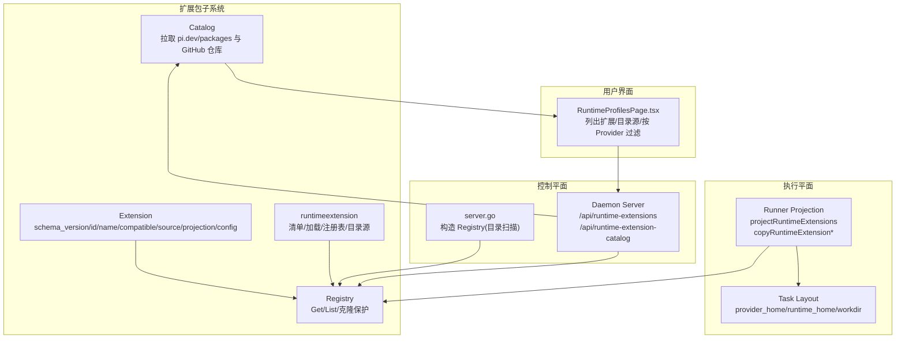
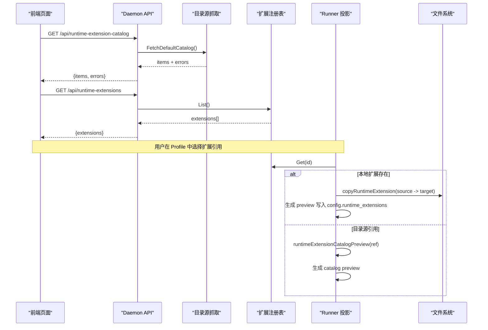
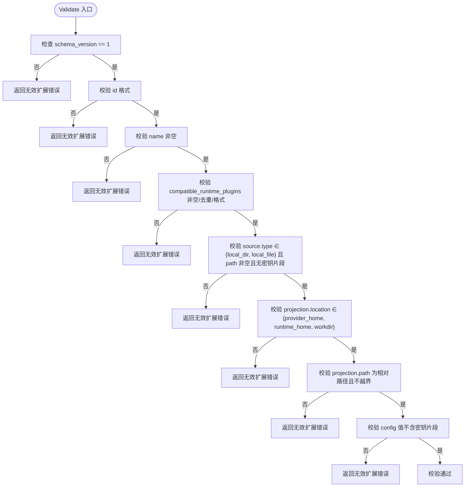
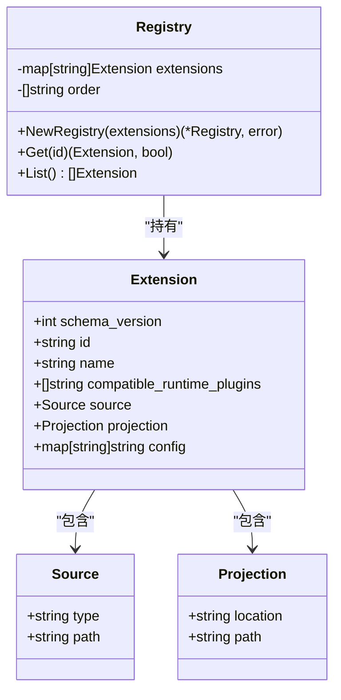
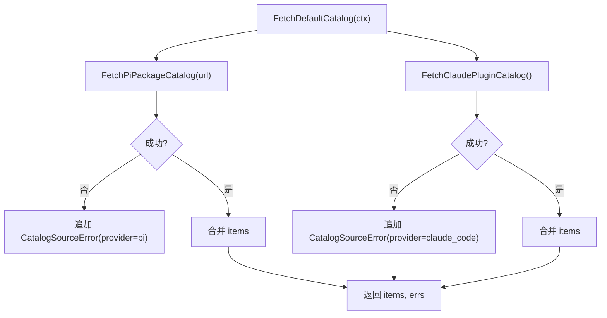
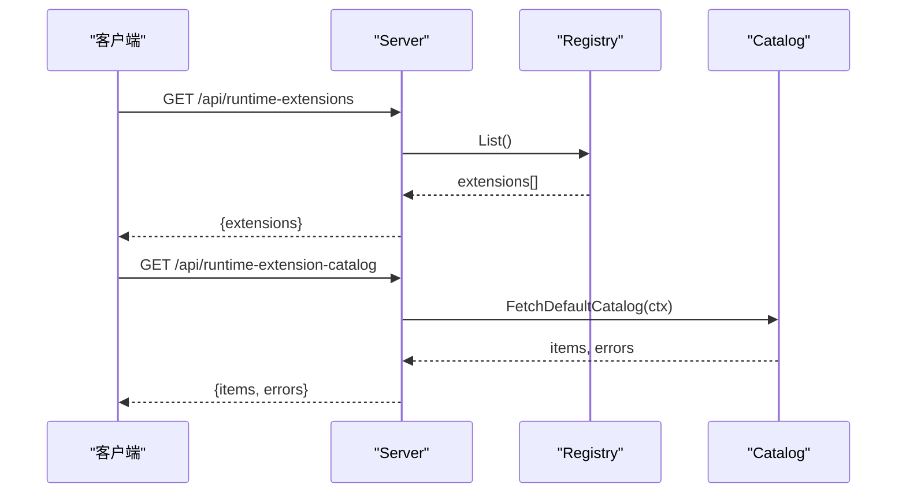
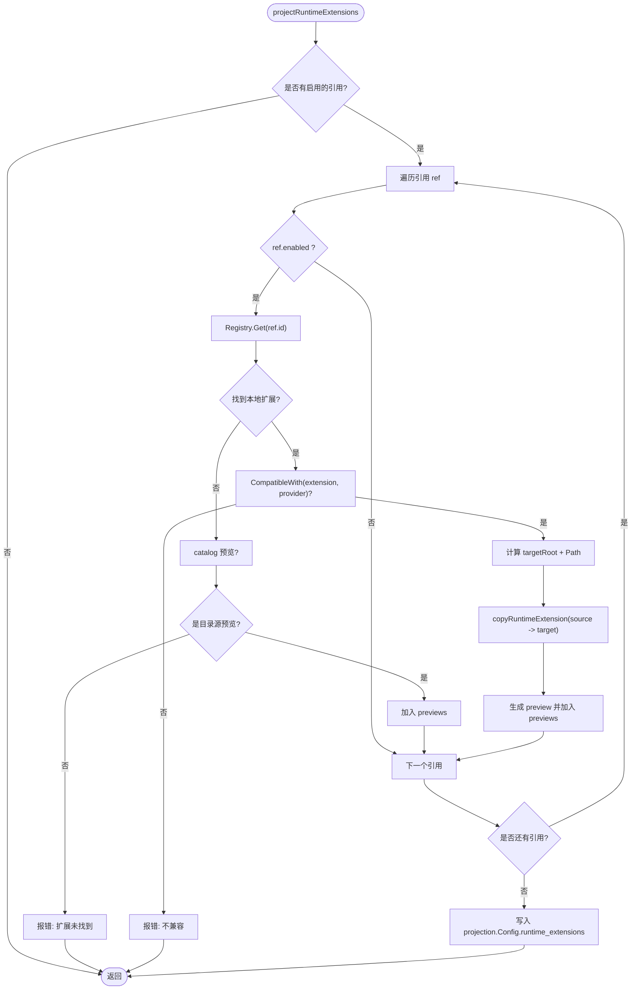
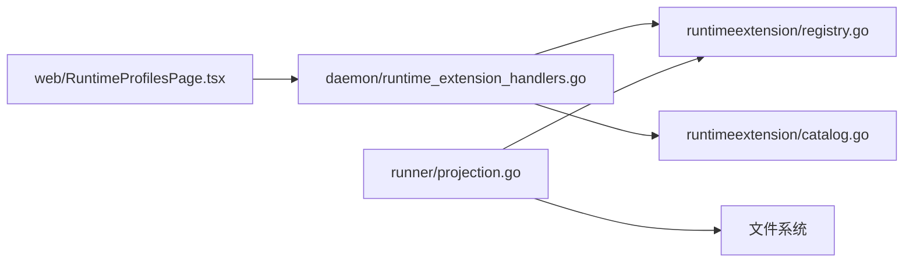

# Extension Pack 扩展包

<cite>
**本文引用的文件**   
- [internal/runtimeextension/extension.go](file://internal/runtimeextension/extension.go)
- [internal/runtimeextension/loader.go](file://internal/runtimeextension/loader.go)
- [internal/runtimeextension/registry.go](file://internal/runtimeextension/registry.go)
- [internal/runtimeextension/catalog.go](file://internal/runtimeextension/catalog.go)
- [internal/daemon/server.go](file://internal/daemon/server.go)
- [internal/daemon/runtime_extension_handlers.go](file://internal/daemon/runtime_extension_handlers.go)
- [internal/runner/projection.go](file://internal/runner/projection.go)
- [internal/runner/projection_extension_test.go](file://internal/runner/projection_extension_test.go)
- [web/src/pages/RuntimeProfilesPage.tsx](file://web/src/pages/RuntimeProfilesPage.tsx)
</cite>

## 目录
1. [简介](#简介)
2. [项目结构](#项目结构)
3. [核心组件](#核心组件)
4. [架构总览](#架构总览)
5. [详细组件分析](#详细组件分析)
6. [依赖关系分析](#依赖关系分析)
7. [性能与安全性考量](#性能与安全性考量)
8. [故障排查指南](#故障排查指南)
9. [结论](#结论)
10. [附录：开发规范、测试与部署](#附录开发规范测试与部署)

## 简介
本文件系统性阐述 Extension Pack（运行时扩展包）在系统中的发现机制、加载流程、生命周期管理，以及与运行时插件的兼容性与投影策略。重点覆盖：
- 扩展点定义与校验（Schema 版本、ID 命名、来源类型、投影路径安全等）
- 钩子函数注册、事件订阅与回调处理（通过配置投影到目标位置，由宿主进程消费）
- 扩展包依赖管理与版本兼容性（基于 compatible_runtime_plugins 的白名单匹配）
- 冲突解决（重复 ID 拒绝、未知引用报错、相对路径与符号链接限制）
- 开发规范、测试方法与部署策略（本地清单、目录扫描、目录级复制、预览输出）

## 项目结构
Extension Pack 相关代码主要分布在以下模块：
- runtimeextension：扩展包清单模型、目录加载、注册表、默认目录源抓取
- daemon：HTTP 接口暴露扩展列表与目录源；启动时从指定目录加载扩展清单并构建注册表
- runner：任务布局阶段将扩展包投影到 provider_home / runtime_home / workdir，并在配置中生成预览
- web：前端页面展示已启用扩展、目录源条目，支持按运行时插件过滤与选择

图表来源
- [internal/runtimeextension/extension.go:19-28](file://internal/runtimeextension/extension.go#L19-L28)
- [internal/runtimeextension/registry.go:8-27](file://internal/runtimeextension/registry.go#L8-L27)
- [internal/runtimeextension/catalog.go:37-57](file://internal/runtimeextension/catalog.go#L37-L57)
- [internal/daemon/server.go:360-372](file://internal/daemon/server.go#L360-L372)
- [internal/daemon/runtime_extension_handlers.go:9-36](file://internal/daemon/runtime_extension_handlers.go#L9-L36)
- [internal/runner/projection.go:183-229](file://internal/runner/projection.go#L183-L229)
- [web/src/pages/RuntimeProfilesPage.tsx:199-231](file://web/src/pages/RuntimeProfilesPage.tsx#L199-L231)

章节来源
- [internal/runtimeextension/extension.go:19-28](file://internal/runtimeextension/extension.go#L19-L28)
- [internal/runtimeextension/registry.go:8-27](file://internal/runtimeextension/registry.go#L8-L27)
- [internal/runtimeextension/catalog.go:37-57](file://internal/runtimeextension/catalog.go#L37-L57)
- [internal/daemon/server.go:360-372](file://internal/daemon/server.go#L360-L372)
- [internal/daemon/runtime_extension_handlers.go:9-36](file://internal/daemon/runtime_extension_handlers.go#L9-L36)
- [internal/runner/projection.go:183-229](file://internal/runner/projection.go#L183-L229)
- [web/src/pages/RuntimeProfilesPage.tsx:199-231](file://web/src/pages/RuntimeProfilesPage.tsx#L199-L231)

## 核心组件
- 扩展清单模型 Extension
  - 关键字段：schema_version、id、name、compatible_runtime_plugins、source(type/path)、projection(location/path)、config
  - 约束：ID 小写字母数字及点划线；名称必填；兼容插件列表非空且去重；source.type 仅允许 local_dir/local_file；projection.path 必须为相对路径且不可越界；config 值不得包含疑似密钥片段
- 目录加载器 LoadDirectory
  - 读取顶层 .json 清单，解码并 Validate，收集错误返回
- 注册表 Registry
  - 构建时去重与排序；提供 Get/List；内部 clone 以隔离外部修改
- 目录源 Catalog
  - FetchDefaultCatalog 聚合多个来源（pi.dev/packages 与 anthropics/claude-plugins-official），失败项以 CatalogSourceError 返回
- Daemon HTTP 接口
  - /api/runtime-extensions：列出当前注册表中的扩展
  - /api/runtime-extension-catalog：返回目录源条目与错误
- Runner 投影
  - projectRuntimeExtensions：根据 Profile 的 RuntimeExtensions 引用，解析本地扩展或目录源预览，拷贝源码至目标根目录，写入 projection.Config.runtime_extensions 预览数组
  - copyRuntimeExtensionDir/File：禁止符号链接，严格权限 0o600/0o700

章节来源
- [internal/runtimeextension/extension.go:51-96](file://internal/runtimeextension/extension.go#L51-L96)
- [internal/runtimeextension/loader.go:11-45](file://internal/runtimeextension/loader.go#L11-L45)
- [internal/runtimeextension/registry.go:13-27](file://internal/runtimeextension/registry.go#L13-L27)
- [internal/runtimeextension/catalog.go:37-57](file://internal/runtimeextension/catalog.go#L37-L57)
- [internal/daemon/runtime_extension_handlers.go:9-36](file://internal/daemon/runtime_extension_handlers.go#L9-L36)
- [internal/runner/projection.go:183-229](file://internal/runner/projection.go#L183-L229)
- [internal/runner/projection.go:273-316](file://internal/runner/projection.go#L273-L316)

## 架构总览
扩展包从“声明式清单”到“运行时可见”的关键链路如下：
- 启动期：Daemon 从配置的目录扫描扩展清单，构建全局 Registry
- 运行期：UI 调用 /api/runtime-extension-catalog 获取可安装条目；用户选择后保存至 Profile
- 任务准备：Runner 根据 Profile 的 RuntimeExtensions 引用，解析本地扩展或目录源预览，将扩展内容投影到目标目录，并将预览写入配置供宿主进程消费

图表来源
- [internal/daemon/runtime_extension_handlers.go:21-36](file://internal/daemon/runtime_extension_handlers.go#L21-L36)
- [internal/runtimeextension/catalog.go:37-57](file://internal/runtimeextension/catalog.go#L37-L57)
- [internal/runner/projection.go:183-229](file://internal/runner/projection.go#L183-L229)
- [internal/runner/projection.go:231-254](file://internal/runner/projection.go#L231-L254)

## 详细组件分析

### 扩展清单与校验（Extension）
- 字段与约束
  - schema_version：固定为 1，不匹配即拒绝
  - id：正则 ^[a-z][a-z0-9_.-]*$，唯一性由注册表保证
  - name：必填
  - compatible_runtime_plugins：非空、去重、每个元素符合 id 规则
  - source.type：仅允许 local_dir/local_file；source.path 必填且不能包含疑似密钥片段
  - projection.location：仅允许 provider_home/runtime_home/workdir
  - projection.path：相对路径，不允许绝对路径、反斜杠、.. 与空段
  - config：键值对，值不得包含疑似密钥片段
- 兼容性判断
  - CompatibleWith(extension, pluginID)：白名单匹配

图表来源
- [internal/runtimeextension/extension.go:51-96](file://internal/runtimeextension/extension.go#L51-L96)

章节来源
- [internal/runtimeextension/extension.go:51-96](file://internal/runtimeextension/extension.go#L51-L96)
- [internal/runtimeextension/extension.go:98-105](file://internal/runtimeextension/extension.go#L98-L105)

### 目录加载与注册表（Loader & Registry）
- 加载策略
  - 仅读取顶层 .json 文件，跳过目录与非 json 后缀
  - 逐个解码并 Validate，累积错误返回
- 注册表行为
  - NewRegistry 构建时进行 Validate、重复 ID 检测、顺序排序
  - Get/List 返回副本，避免外部修改影响内部状态
  - cloneExtension 深拷贝 Config 与兼容插件列表

图表来源
- [internal/runtimeextension/registry.go:8-27](file://internal/runtimeextension/registry.go#L8-L27)
- [internal/runtimeextension/registry.go:51-61](file://internal/runtimeextension/registry.go#L51-L61)
- [internal/runtimeextension/extension.go:19-38](file://internal/runtimeextension/extension.go#L19-L38)

章节来源
- [internal/runtimeextension/loader.go:11-45](file://internal/runtimeextension/loader.go#L11-L45)
- [internal/runtimeextension/registry.go:13-27](file://internal/runtimeextension/registry.go#L13-L27)
- [internal/runtimeextension/registry.go:51-61](file://internal/runtimeextension/registry.go#L51-L61)

### 目录源抓取（Catalog）
- 聚合来源
  - pi.dev/packages：HTML 解析提取 article 卡片，生成 CatalogItem
  - anthropics/claude-plugins-official：GitHub API 列举 plugins 与 external_plugins 目录下的子目录
- 错误处理
  - 单个来源失败不影响其他来源，返回 CatalogSourceError 列表
- 超时与大小限制
  - HTTP 客户端设置 8s 超时；响应体限制 4MB

图表来源
- [internal/runtimeextension/catalog.go:37-57](file://internal/runtimeextension/catalog.go#L37-L57)
- [internal/runtimeextension/catalog.go:59-94](file://internal/runtimeextension/catalog.go#L59-94)
- [internal/runtimeextension/catalog.go:96-141](file://internal/runtimeextension/catalog.go#L96-L141)

章节来源
- [internal/runtimeextension/catalog.go:37-57](file://internal/runtimeextension/catalog.go#L37-L57)
- [internal/runtimeextension/catalog.go:59-94](file://internal/runtimeextension/catalog.go#L59-94)
- [internal/runtimeextension/catalog.go:96-141](file://internal/runtimeextension/catalog.go#L96-L141)

### Daemon HTTP 接口
- /api/runtime-extensions
  - 返回当前注册表中的所有扩展
- /api/runtime-extension-catalog
  - 返回目录源条目与错误列表
- 启动期注册表构建
  - runtimeExtensionRegistry(dirs)：遍历 dirs，LoadDirectory 累加扩展，最后 NewRegistry

图表来源
- [internal/daemon/runtime_extension_handlers.go:9-36](file://internal/daemon/runtime_extension_handlers.go#L9-L36)
- [internal/daemon/server.go:360-372](file://internal/daemon/server.go#L360-L372)

章节来源
- [internal/daemon/runtime_extension_handlers.go:9-36](file://internal/daemon/runtime_extension_handlers.go#L9-L36)
- [internal/daemon/server.go:360-372](file://internal/daemon/server.go#L360-L372)

### Runner 投影与生命周期
- 投影流程
  - 若 Profile 未启用任何扩展，直接返回
  - 遍历 RuntimeExtensions 引用：
    - 若 enabled=false，跳过
    - 尝试从 Registry.Get(id) 解析本地扩展；不存在则尝试 catalog 预览
    - 若仍找不到且非 catalog 预览，返回错误
    - 校验 extension 与 profile.Provider 兼容
    - 计算 targetRoot（provider_home/runtime_home/workdir），拼接 Path，执行 copy
    - 生成 preview 写入 projection.Config.runtime_extensions
- 拷贝策略
  - local_dir：递归 WalkDir，禁止符号链接，逐文件写入 0o600，目录 0o700
  - local_file：单文件写入
- 目录源预览
  - runtimeExtensionCatalogPreview：保留 registry/install_ref/source_url/config 等元信息

图表来源
- [internal/runner/projection.go:183-229](file://internal/runner/projection.go#L183-L229)
- [internal/runner/projection.go:231-254](file://internal/runner/projection.go#L231-L254)
- [internal/runner/projection.go:273-316](file://internal/runner/projection.go#L273-L316)

章节来源
- [internal/runner/projection.go:183-229](file://internal/runner/projection.go#L183-L229)
- [internal/runner/projection.go:231-254](file://internal/runner/projection.go#L231-L254)
- [internal/runner/projection.go:273-316](file://internal/runner/projection.go#L273-L316)

### 前端集成与交互
- 页面初始化时并行请求：
  - /api/runtime-profiles
  - /api/runtime-plugins
  - /api/runtime-extensions
  - /api/model-providers
  - /api/runtime-extension-catalog
- 扩展选择逻辑：
  - 根据 form.provider 过滤 compatible_runtime_plugins
  - 支持手动输入扩展 ID，校验重复与兼容性
  - 显示 catalog 条目与本地扩展，支持启用/禁用与配置编辑

章节来源
- [web/src/pages/RuntimeProfilesPage.tsx:199-231](file://web/src/pages/RuntimeProfilesPage.tsx#L199-L231)
- [web/src/pages/RuntimeProfilesPage.tsx:740-771](file://web/src/pages/RuntimeProfilesPage.tsx#L740-L771)
- [web/src/pages/RuntimeProfilesPage.tsx:1180-1201](file://web/src/pages/RuntimeProfilesPage.tsx#L1180-L1201)

## 依赖关系分析
- 组件耦合
  - Daemon 依赖 runtimeextension.Registry 与 Catalog
  - Runner 依赖 runtimeextension.Registry 与文件系统
  - Web 依赖 Daemon 的 REST 接口
- 外部依赖
  - HTTP 客户端访问 pi.dev/packages 与 GitHub API
- 潜在循环依赖
  - 未发现循环导入；各层职责清晰

图表来源
- [web/src/pages/RuntimeProfilesPage.tsx:199-231](file://web/src/pages/RuntimeProfilesPage.tsx#L199-L231)
- [internal/daemon/runtime_extension_handlers.go:9-36](file://internal/daemon/runtime_extension_handlers.go#L9-L36)
- [internal/runtimeextension/registry.go:8-27](file://internal/runtimeextension/registry.go#L8-L27)
- [internal/runtimeextension/catalog.go:37-57](file://internal/runtimeextension/catalog.go#L37-L57)
- [internal/runner/projection.go:183-229](file://internal/runner/projection.go#L183-L229)

章节来源
- [web/src/pages/RuntimeProfilesPage.tsx:199-231](file://web/src/pages/RuntimeProfilesPage.tsx#L199-L231)
- [internal/daemon/runtime_extension_handlers.go:9-36](file://internal/daemon/runtime_extension_handlers.go#L9-L36)
- [internal/runtimeextension/registry.go:8-27](file://internal/runtimeextension/registry.go#L8-L27)
- [internal/runtimeextension/catalog.go:37-57](file://internal/runtimeextension/catalog.go#L37-L57)
- [internal/runner/projection.go:183-229](file://internal/runner/projection.go#L183-L229)

## 性能与安全性考量
- 性能
  - 目录扫描 O(n) 读取顶层 .json；注册表构建 O(n log n) 排序
  - 拷贝目录使用 WalkDir，I/O 为主；建议控制扩展体积与层级深度
  - 目录源抓取并发独立，超时 8s，响应体限制 4MB，避免长尾阻塞
- 安全性
  - 清单校验阻止绝对路径、符号链接、越界路径与疑似密钥
  - 文件写入权限严格：目录 0o700，文件 0o600
  - 注册表 Get/List 返回副本，防止外部篡改
  - Daemon 对 Origin 与认证做前置防护，扩展 API 受统一鉴权保护

章节来源
- [internal/runtimeextension/extension.go:75-96](file://internal/runtimeextension/extension.go#L75-L96)
- [internal/runner/projection.go:284-316](file://internal/runner/projection.go#L284-L316)
- [internal/runtimeextension/catalog.go:37-57](file://internal/runtimeextension/catalog.go#L37-L57)
- [internal/daemon/server.go:383-411](file://internal/daemon/server.go#L383-L411)

## 故障排查指南
- 常见错误与定位
  - “invalid runtime extension”：检查 schema_version、id 格式、name、compatible_runtime_plugins、source.type/path、projection.location/path、config 值
  - “duplicate id”：确保扩展清单文件名与 id 唯一
  - “unknown projection location”：仅允许 provider_home/runtime_home/workdir
  - “projection path must be relative / must not escape target root”：修正为相对路径，移除 .. 与空段
  - “source path looks like it contains a secret”：清理路径中的敏感片段
  - “config value for X looks like a secret”：清理配置值中的敏感片段
  - “runtime extension not found”：确认 ID 已在注册表中，或通过 catalog 预览正确引用
  - “not compatible with provider”：调整 compatible_runtime_plugins 或选择匹配的运行时插件
  - “unsupported runtime extension source type”：仅支持 local_dir/local_file
  - “symlinks not allowed”：替换为普通文件或目录
- 快速验证步骤
  - 使用 /api/runtime-extensions 确认扩展已加载
  - 使用 /api/runtime-extension-catalog 确认目录源可用
  - 在 Runner 日志中查看 projection.Config.runtime_extensions 预览是否正确生成
  - 检查目标目录下是否存在预期文件与权限

章节来源
- [internal/runtimeextension/extension.go:51-96](file://internal/runtimeextension/extension.go#L51-L96)
- [internal/runner/projection.go:183-229](file://internal/runner/projection.go#L183-L229)
- [internal/runner/projection.go:273-316](file://internal/runner/projection.go#L273-L316)
- [internal/daemon/runtime_extension_handlers.go:9-36](file://internal/daemon/runtime_extension_handlers.go#L9-L36)

## 结论
Extension Pack 系统通过“清单驱动 + 目录扫描 + 注册表 + 投影”的分层设计，实现了可扩展、可验证、可审计的运行时扩展能力。其关键优势在于：
- 强约束的清单校验与安全的投影路径控制
- 明确的兼容性与冲突解决策略
- 清晰的目录源集成与预览机制
- 前后端一致的可视化与操作体验

## 附录：开发规范、测试与部署

### 开发规范
- 清单命名与组织
  - 每个扩展一个 .json 清单文件，位于被扫描目录顶层
  - id 遵循小写字母、数字、点、下划线、连字符
- 来源与投影
  - source.type 使用 local_dir 或 local_file
  - projection.location 使用 provider_home/runtime_home/workdir
  - projection.path 使用相对路径，避免 .. 与空段
- 兼容性与配置
  - compatible_runtime_plugins 明确列出支持的运行时插件 ID
  - config 避免包含密钥片段，使用占位符或外部注入

章节来源
- [internal/runtimeextension/extension.go:51-96](file://internal/runtimeextension/extension.go#L51-L96)

### 测试方法
- 单元测试要点
  - 清单加载与校验：LoadDirectory + Validate
  - 注册表行为：NewRegistry 重复 ID 拒绝、Get/List 返回副本
  - 目录源抓取：FetchDefaultCatalog 成功与失败分支
  - 投影流程：projectRuntimeExtensions 本地扩展与目录源预览、错误路径
- 参考用例
  - 本地扩展投影与预览
  - 目录源引用保留 install_ref 与 registry
  - 未知本地扩展引用拒绝

章节来源
- [internal/runtimeextension/extension_test.go:12-54](file://internal/runtimeextension/extension_test.go#L12-L54)
- [internal/runner/projection_extension_test.go:13-67](file://internal/runner/projection_extension_test.go#L13-67)
- [internal/runner/projection_extension_test.go:69-107](file://internal/runner/projection_extension_test.go#L69-L107)
- [internal/runner/projection_extension_test.go:109-134](file://internal/runner/projection_extension_test.go#L109-L134)

### 部署策略
- 扩展清单部署
  - 将扩展清单与源码放置于 Daemon 配置的扩展目录，重启后自动发现
- 目录源集成
  - 通过 /api/runtime-extension-catalog 获取可安装条目，前端支持选择与预览
- 任务运行
  - 在 Profile 中启用扩展引用，Runner 在任务准备阶段完成投影与预览生成

章节来源
- [internal/daemon/server.go:360-372](file://internal/daemon/server.go#L360-L372)
- [web/src/pages/RuntimeProfilesPage.tsx:199-231](file://web/src/pages/RuntimeProfilesPage.tsx#L199-L231)
- [internal/runner/projection.go:183-229](file://internal/runner/projection.go#L183-L229)