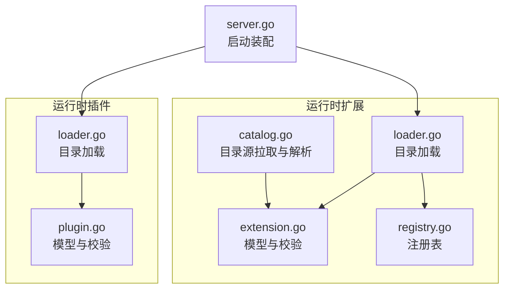
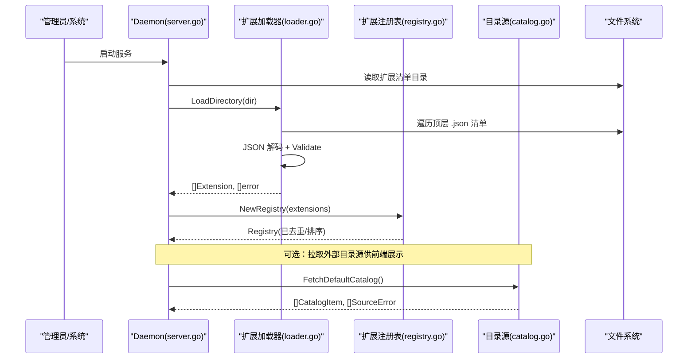
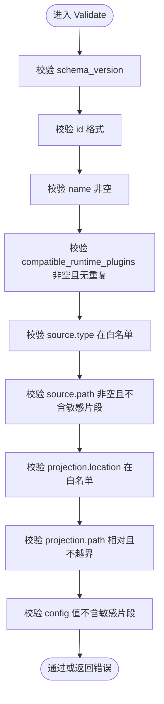
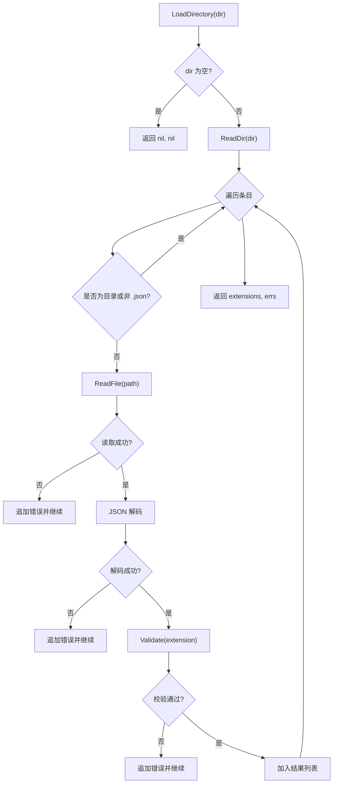
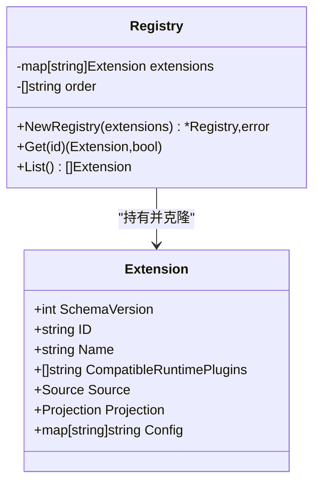
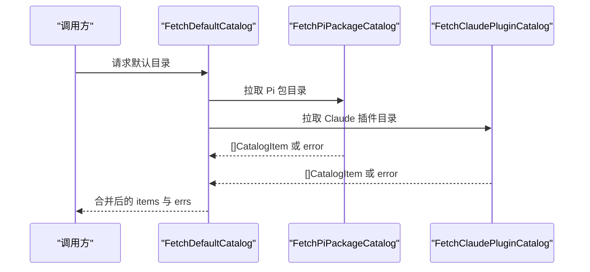
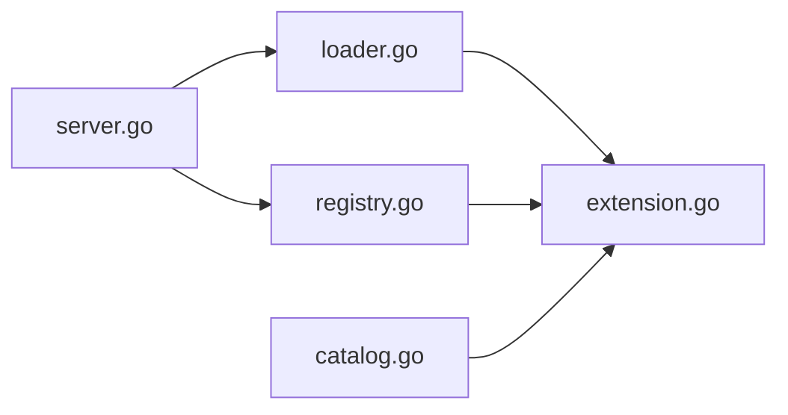

# 扩展发现与加载

<cite>
**本文引用的文件**
- [internal/runtimeextension/catalog.go](file://internal/runtimeextension/catalog.go)
- [internal/runtimeextension/loader.go](file://internal/runtimeextension/loader.go)
- [internal/runtimeextension/registry.go](file://internal/runtimeextension/registry.go)
- [internal/runtimeextension/extension.go](file://internal/runtimeextension/extension.go)
- [internal/runtimeplugin/plugin.go](file://internal/runtimeplugin/plugin.go)
- [internal/runtimeplugin/loader.go](file://internal/runtimeplugin/loader.go)
- [internal/daemon/server.go](file://internal/daemon/server.go)
</cite>

## 目录
1. [简介](#简介)
2. [项目结构](#项目结构)
3. [核心组件](#核心组件)
4. [架构总览](#架构总览)
5. [详细组件分析](#详细组件分析)
6. [依赖关系分析](#依赖关系分析)
7. [性能考虑](#性能考虑)
8. [故障排查指南](#故障排查指南)
9. [结论](#结论)

## 简介
本文件系统性说明“扩展包”的发现、清单解析、注册表管理与动态加载流程，覆盖以下关键主题：
- 扩展包目录结构与清单文件格式
- 清单校验与安全策略（含敏感信息检测）
- 扩展包注册表管理（去重、排序、克隆隔离）
- 动态加载流程（目录扫描、JSON 解析、验证、注册）
- 外部目录源（catalog）的拉取与解析（Pi 包目录与 Claude 插件仓库）
- 错误处理与可恢复性建议
- 性能优化策略（并发、超时、限制读取大小等）

注意：当前代码未实现签名检查与完整性校验；安全边界通过白名单目录与严格字段校验达成。

## 项目结构
与扩展包相关的关键模块位于 runtimeextension 与 runtimeplugin 两个子包中，并由 daemon 层统一装配：
- runtimeextension：运行时扩展包（Runtime Extension）的清单模型、校验、目录加载、注册表与目录源（catalog）拉取
- runtimeplugin：运行时插件（Runtime Plugin）的清单模型、校验与目录加载（作为扩展包的兼容目标）
- daemon：在启动时扫描并构建插件与扩展包的注册表

图示来源
- [internal/runtimeextension/extension.go:1-122](file://internal/runtimeextension/extension.go#L1-L122)
- [internal/runtimeextension/loader.go:1-46](file://internal/runtimeextension/loader.go#L1-L46)
- [internal/runtimeextension/registry.go:1-62](file://internal/runtimeextension/registry.go#L1-L62)
- [internal/runtimeextension/catalog.go:1-177](file://internal/runtimeextension/catalog.go#L1-L177)
- [internal/runtimeplugin/plugin.go:1-224](file://internal/runtimeplugin/plugin.go#L1-L224)
- [internal/runtimeplugin/loader.go:1-49](file://internal/runtimeplugin/loader.go#L1-L49)
- [internal/daemon/server.go:340-375](file://internal/daemon/server.go#L340-L375)

章节来源
- [internal/runtimeextension/extension.go:1-122](file://internal/runtimeextension/extension.go#L1-L122)
- [internal/runtimeextension/loader.go:1-46](file://internal/runtimeextension/loader.go#L1-L46)
- [internal/runtimeextension/registry.go:1-62](file://internal/runtimeextension/registry.go#L1-L62)
- [internal/runtimeextension/catalog.go:1-177](file://internal/runtimeextension/catalog.go#L1-L177)
- [internal/runtimeplugin/plugin.go:1-224](file://internal/runtimeplugin/plugin.go#L1-L224)
- [internal/runtimeplugin/loader.go:1-49](file://internal/runtimeplugin/loader.go#L1-L49)
- [internal/daemon/server.go:340-375](file://internal/daemon/server.go#L340-L375)

## 核心组件
- 扩展包清单模型与校验
  - 定义扩展包的结构体、受支持的 source/projection 类型、ID 格式、路径安全规则以及敏感值检测
  - 提供 Validate 函数进行强约束校验
- 目录加载器
  - 仅扫描顶层 .json 清单文件，逐条解析并调用 Validate
  - 返回已加载的扩展列表与错误集合（容错式加载）
- 注册表
  - 构建时再次校验、去重、按 ID 排序，并提供 Get/List 访问
  - 对外返回副本，避免共享可变状态
- 目录源（Catalog）
  - 从 Pi 包目录页面抓取并解析扩展卡片
  - 从 GitHub 官方仓库列出插件目录，生成安装引用
  - 使用 HTTP 客户端带超时与响应体大小限制
- 运行时插件（作为扩展包兼容目标）
  - 定义插件能力、配置投影、启动模板等
  - 提供 Validate 与 LoadDirectory 同构逻辑

章节来源
- [internal/runtimeextension/extension.go:1-122](file://internal/runtimeextension/extension.go#L1-L122)
- [internal/runtimeextension/loader.go:1-46](file://internal/runtimeextension/loader.go#L1-L46)
- [internal/runtimeextension/registry.go:1-62](file://internal/runtimeextension/registry.go#L1-L62)
- [internal/runtimeextension/catalog.go:1-177](file://internal/runtimeextension/catalog.go#L1-L177)
- [internal/runtimeplugin/plugin.go:1-224](file://internal/runtimeplugin/plugin.go#L1-L224)
- [internal/runtimeplugin/loader.go:1-49](file://internal/runtimeplugin/loader.go#L1-L49)

## 架构总览
扩展包的生命周期分为三个阶段：发现、解析与注册、按需查询。

图示来源
- [internal/daemon/server.go:340-375](file://internal/daemon/server.go#L340-L375)
- [internal/runtimeextension/loader.go:1-46](file://internal/runtimeextension/loader.go#L1-L46)
- [internal/runtimeextension/registry.go:1-62](file://internal/runtimeextension/registry.go#L1-L62)
- [internal/runtimeextension/catalog.go:1-177](file://internal/runtimeextension/catalog.go#L1-L177)

## 详细组件分析

### 扩展包清单模型与校验（extension.go）
- 关键字段
  - schema_version：固定版本，用于向后兼容控制
  - id/name：唯一标识与显示名，id 需符合小写字母开头及特定字符集
  - compatible_runtime_plugins：声明兼容的运行时插件 ID 列表
  - source：type/path，支持 local_dir/local_file，path 不得包含疑似敏感片段
  - projection：location/path，location 限定为 provider_home/runtime_home/workdir，path 必须相对且不可越界
  - config：键值对，禁止出现疑似敏感值
- 校验要点
  - 版本、必填项、ID 正则、重复项检测
  - source.type 白名单、source.path 非空与敏感检测
  - projection.location 白名单、path 相对性与路径穿越防护
  - config 值敏感检测

图示来源
- [internal/runtimeextension/extension.go:51-96](file://internal/runtimeextension/extension.go#L51-L96)

章节来源
- [internal/runtimeextension/extension.go:1-122](file://internal/runtimeextension/extension.go#L1-L122)

### 目录加载器（loader.go）
- 行为
  - 忽略空目录
  - 仅读取顶层 .json 文件
  - 逐个读取、解码、校验，收集错误并继续处理其他文件
  - 返回成功加载的扩展列表与错误切片
- 设计要点
  - 容错式加载：单个清单失败不影响其他清单
  - 错误分类清晰：读文件失败、解码失败、校验失败分别记录

图示来源
- [internal/runtimeextension/loader.go:11-45](file://internal/runtimeextension/loader.go#L11-L45)

章节来源
- [internal/runtimeextension/loader.go:1-46](file://internal/runtimeextension/loader.go#L1-L46)

### 注册表管理（registry.go）
- 功能
  - 构造时再次 Validate，确保一致性
  - 以 map 存储，key 为 extension.id，同时维护有序 ID 切片
  - 去重：重复 id 直接报错
  - 排序：按 id 字典序稳定输出
  - 访问：Get/List 均返回深拷贝，避免外部修改影响内部状态
- 复杂度
  - 构造：O(n log n)（排序），空间 O(n)
  - 查询：Get O(1)，List O(n)

图示来源
- [internal/runtimeextension/registry.go:8-61](file://internal/runtimeextension/registry.go#L8-L61)
- [internal/runtimeextension/extension.go:19-28](file://internal/runtimeextension/extension.go#L19-L28)

章节来源
- [internal/runtimeextension/registry.go:1-62](file://internal/runtimeextension/registry.go#L1-L62)

### 目录源（catalog.go）
- 默认目录源聚合
  - 并行拉取 Pi 包目录与 Claude 官方插件仓库
  - 任一来源失败不会中断整体，错误以结构化形式返回
- Pi 包目录解析
  - 基于 HTML 正则抽取 article 卡片，提取名称、描述、安装引用等
  - 去重：同名只保留一次
- Claude 插件目录
  - 通过 GitHub API 获取指定分支下的目录列表，过滤出目录项
  - 生成 install_ref 与 source_url
- 网络健壮性
  - 自定义 http.Client 设置超时
  - 响应体限制最大读取大小，防止大响应占用内存

图示来源
- [internal/runtimeextension/catalog.go:37-57](file://internal/runtimeextension/catalog.go#L37-L57)
- [internal/runtimeextension/catalog.go:59-94](file://internal/runtimeextension/catalog.go#L59-L94)
- [internal/runtimeextension/catalog.go:96-141](file://internal/runtimeextension/catalog.go#L96-L141)
- [internal/runtimeextension/catalog.go:143-162](file://internal/runtimeextension/catalog.go#L143-L162)

章节来源
- [internal/runtimeextension/catalog.go:1-177](file://internal/runtimeextension/catalog.go#L1-L177)

### 运行时插件（runtimeplugin）
- 作用
  - 定义运行时插件的元数据、能力、配置投影、启动模板、转录解析器等
  - 提供 Validate 与 LoadDirectory，与扩展包加载流程一致
- 与扩展包的关系
  - 扩展包通过 compatible_runtime_plugins 声明其适配的插件 ID
  - 运行期可按需匹配扩展与插件

章节来源
- [internal/runtimeplugin/plugin.go:1-224](file://internal/runtimeplugin/plugin.go#L1-L224)
- [internal/runtimeplugin/loader.go:1-49](file://internal/runtimeplugin/loader.go#L1-L49)

### 启动装配（daemon/server.go）
- 职责
  - 扫描本地可信目录中的运行时插件与扩展包清单
  - 构建各自的注册表，供上层使用
- 错误处理
  - 加载阶段将错误集中返回，不阻断整个进程启动（由调用方决策）

章节来源
- [internal/daemon/server.go:340-375](file://internal/daemon/server.go#L340-L375)

## 依赖关系分析
- 内聚与耦合
  - loader.go 依赖 extension.go 的 Validate，低耦合、高内聚
  - registry.go 依赖 extension.go 的模型与 Validate，保证注册前一致性
  - catalog.go 独立于加载器，仅产出 CatalogItem，便于前端展示
- 外部依赖
  - catalog.go 依赖 HTTP 客户端访问外部目录源
  - daemon/server.go 组合加载器与注册表，形成装配点

图示来源
- [internal/runtimeextension/loader.go:1-46](file://internal/runtimeextension/loader.go#L1-L46)
- [internal/runtimeextension/registry.go:1-62](file://internal/runtimeextension/registry.go#L1-L62)
- [internal/runtimeextension/extension.go:1-122](file://internal/runtimeextension/extension.go#L1-L122)
- [internal/runtimeextension/catalog.go:1-177](file://internal/runtimeextension/catalog.go#L1-L177)
- [internal/daemon/server.go:340-375](file://internal/daemon/server.go#L340-L375)

## 性能考虑
- 目录扫描
  - 仅顶层遍历，避免递归带来的开销
  - 使用 os.ReadDir 顺序枚举，I/O 成本可控
- 网络请求
  - 自定义 http.Client 设置超时，避免阻塞
  - 限制响应体大小，防止大响应导致内存膨胀
- 数据结构
  - 注册表使用 map+有序切片，Get O(1)、List O(n)
  - 返回深拷贝，避免共享可变状态导致的额外同步成本
- 可扩展优化
  - 若清单数量较大，可在加载阶段并发读取与解析（需注意错误聚合与资源清理）
  - 对目录源拉取可引入缓存与增量更新策略

[本节为通用指导，无需源码引用]

## 故障排查指南
- 常见错误定位
  - 清单文件无法读取：检查路径权限与存在性
  - JSON 解码失败：核对字段命名与类型
  - 校验失败：根据错误消息修正 id 格式、必填项、路径与敏感值
  - 重复 id：确保每个清单的 id 全局唯一
- 错误处理现状
  - 加载器采用“尽力而为”模式：单个清单失败不影响其他清单
  - 注册表构造时对重复 id 直接报错，需修复后重试
- 建议的重试机制
  - 针对网络类错误（目录源拉取）可实现指数退避重试
  - 针对文件系统错误，建议在更高层封装重试与告警

章节来源
- [internal/runtimeextension/loader.go:11-45](file://internal/runtimeextension/loader.go#L11-L45)
- [internal/runtimeextension/registry.go:13-27](file://internal/runtimeextension/registry.go#L13-L27)
- [internal/runtimeextension/catalog.go:37-57](file://internal/runtimeextension/catalog.go#L37-L57)

## 结论
- 扩展包通过“白名单目录 + 严格校验”的安全模型实现可信加载
- 目录加载器与注册表分工明确，具备良好容错与稳定性
- 目录源提供外部生态发现能力，适合前端展示与用户选择
- 当前未实现签名与完整性校验，后续可在清单与内容层面引入数字签名与哈希校验增强安全性
- 性能方面已具备基础优化，可根据规模引入并发与缓存进一步提升吞吐