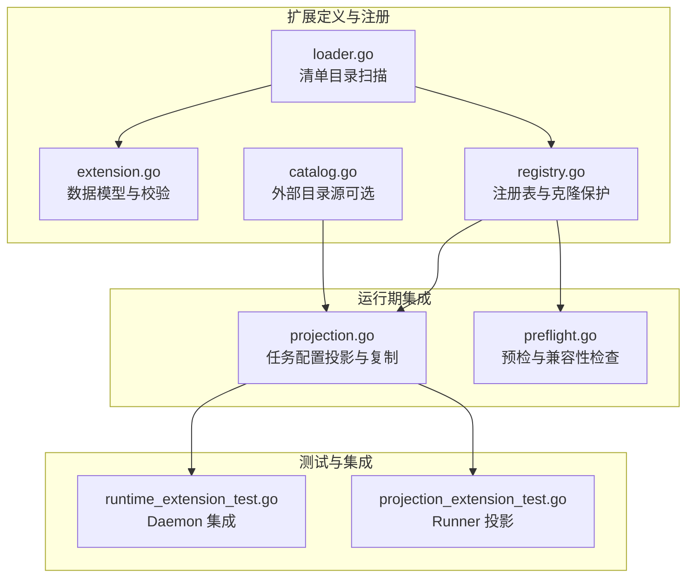
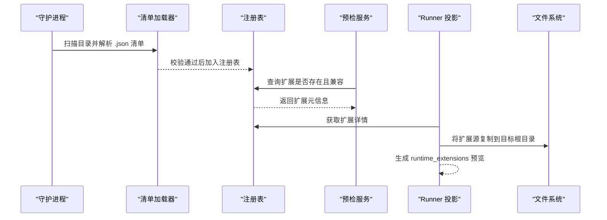
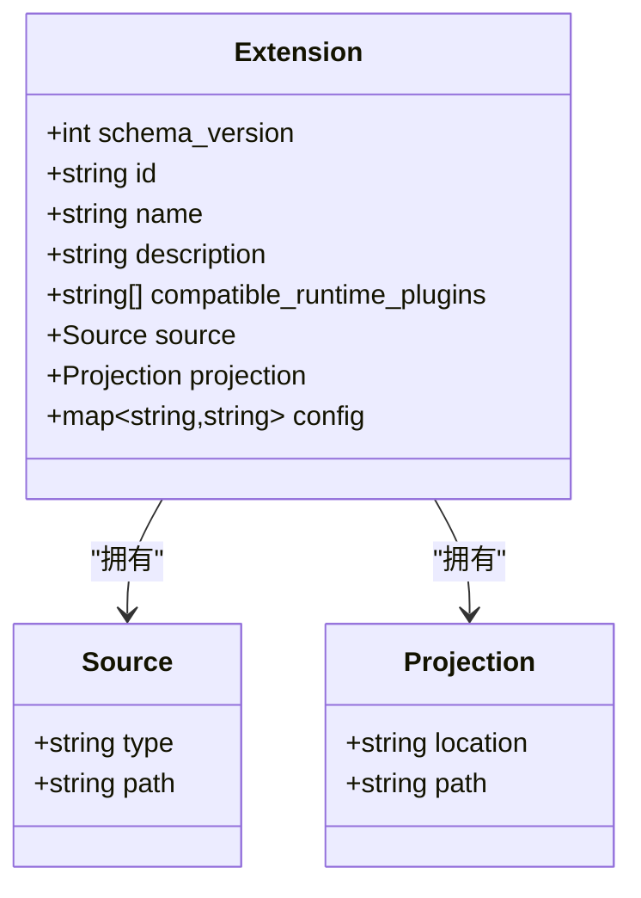
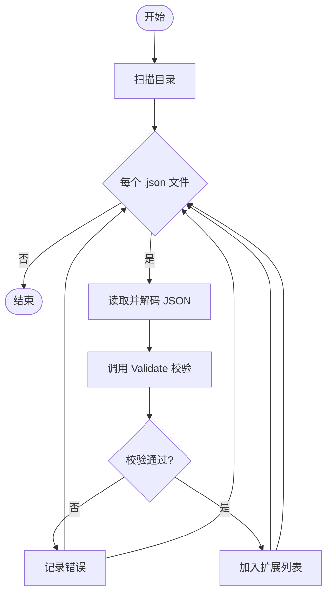
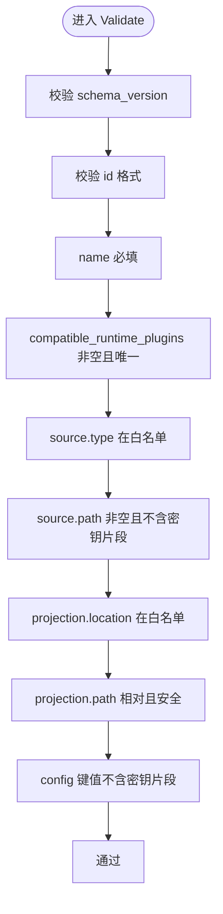
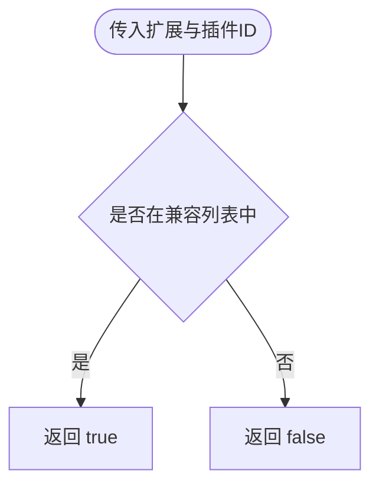
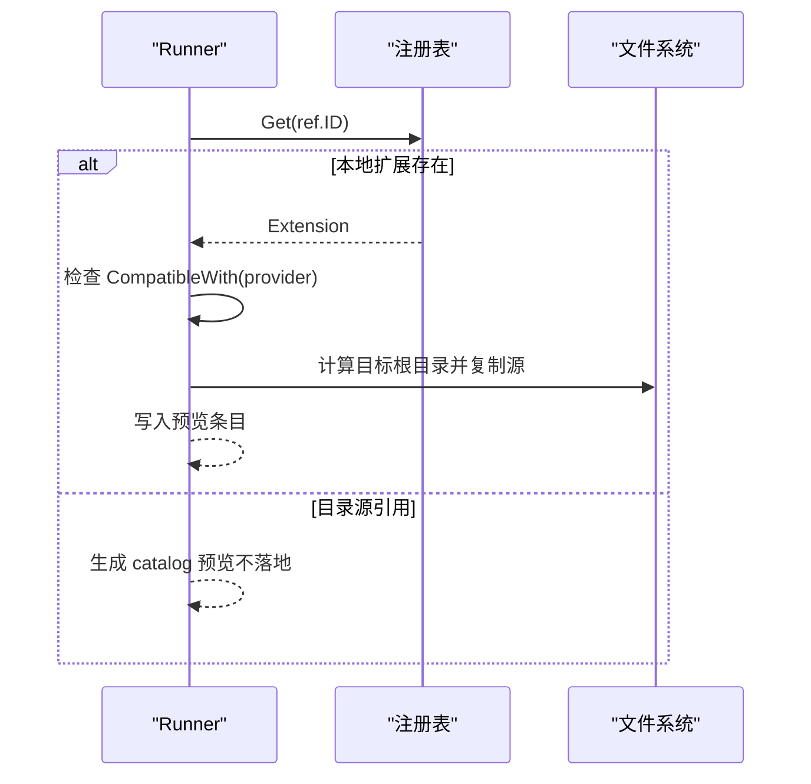
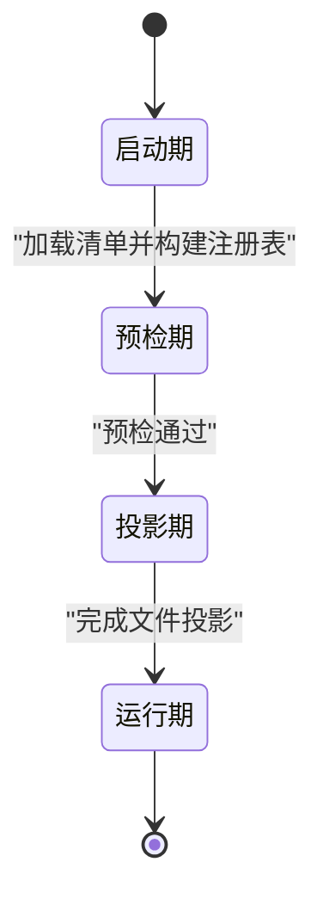
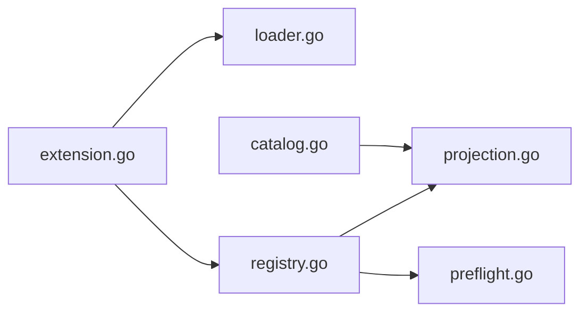

# 扩展点与钩子

<cite>
**本文引用的文件**   
- [extension.go](file://internal/runtimeextension/extension.go)
- [loader.go](file://internal/runtimeextension/loader.go)
- [registry.go](file://internal/runtimeextension/registry.go)
- [catalog.go](file://internal/runtimeextension/catalog.go)
- [projection.go](file://internal/runner/projection.go)
- [preflight.go](file://internal/preflight/preflight.go)
- [runtime_extension_test.go](file://internal/daemon/runtime_extension_test.go)
- [projection_extension_test.go](file://internal/runner/projection_extension_test.go)
</cite>

## 目录
1. [引言](#引言)
2. [项目结构](#项目结构)
3. [核心组件](#核心组件)
4. [架构总览](#架构总览)
5. [详细组件分析](#详细组件分析)
6. [依赖关系分析](#依赖关系分析)
7. [性能考虑](#性能考虑)
8. [故障排查指南](#故障排查指南)
9. [结论](#结论)
10. [附录](#附录)

## 引言
本文件聚焦于“扩展点与钩子”机制，围绕运行时扩展（Runtime Extension）的声明式配置、加载、校验、注册、投影与兼容性检查进行系统化说明。文档覆盖以下关键点：
- 扩展点接口规范：Extension、Source、Projection 的数据模型与约束
- 回调函数注册：通过清单（manifest）声明兼容的运行期插件族，并在启动时由目录扫描加载
- 事件总线设计：以“清单加载—注册—预检—投影”的流水线替代传统事件总线，保证可预测的执行顺序
- 生命周期与初始化顺序：从磁盘清单到内存注册表，再到任务级投影与资源落盘
- 版本兼容与废弃策略：SchemaVersion 强制匹配；未知类型或路径拒绝；向后兼容通过白名单与严格校验
- 深入分析：Validate 验证逻辑、CompatibleWith 兼容性检查、投影目标与拷贝安全边界

## 项目结构
扩展点与钩子相关代码集中在 runtimeextension 包，并由 runner 在任务配置投影阶段消费，precheck 在启动前做一致性检查。

图表来源
- [extension.go:19-96](file://internal/runtimeextension/extension.go#L19-L96)
- [loader.go:11-45](file://internal/runtimeextension/loader.go#L11-L45)
- [registry.go:13-62](file://internal/runtimeextension/registry.go#L13-L62)
- [catalog.go:37-57](file://internal/runtimeextension/catalog.go#L37-L57)
- [projection.go:183-229](file://internal/runner/projection.go#L183-L229)
- [preflight.go:330-359](file://internal/preflight/preflight.go#L330-L359)

章节来源
- [extension.go:19-96](file://internal/runtimeextension/extension.go#L19-L96)
- [loader.go:11-45](file://internal/runtimeextension/loader.go#L11-L45)
- [registry.go:13-62](file://internal/runtimeextension/registry.go#L13-L62)
- [catalog.go:37-57](file://internal/runtimeextension/catalog.go#L37-L57)
- [projection.go:183-229](file://internal/runner/projection.go#L183-L229)
- [preflight.go:330-359](file://internal/preflight/preflight.go#L330-L359)

## 核心组件
- Extension 结构体：描述一个运行时扩展的元信息、来源、投影位置与配置项
- Source 结构体：声明扩展的来源类型与路径
- Projection 结构体：声明扩展将被投影到的目标位置与相对路径
- Registry：内存注册表，提供按 ID 查询与有序遍历能力，并对返回对象进行深拷贝保护
- Loader：从指定目录扫描 .json 清单并调用 Validate 校验后入库
- Catalog：用于聚合外部目录源（如第三方仓库索引），供预览与安装引用
- Runner 投影：根据 Profile 中启用的扩展引用，执行兼容性检查与文件投影
- Preflight：在任务启动前对扩展进行可用性检查与兼容性断言

章节来源
- [extension.go:19-96](file://internal/runtimeextension/extension.go#L19-L96)
- [registry.go:13-62](file://internal/runtimeextension/registry.go#L13-L62)
- [loader.go:11-45](file://internal/runtimeextension/loader.go#L11-L45)
- [catalog.go:37-57](file://internal/runtimeextension/catalog.go#L37-L57)
- [projection.go:183-229](file://internal/runner/projection.go#L183-L229)
- [preflight.go:330-359](file://internal/preflight/preflight.go#L330-L359)

## 架构总览
扩展点与钩子的整体流程如下：
- 启动阶段：Daemon 读取 RuntimeExtensionDirs，调用 LoadDirectory 解析清单并构建 Registry
- 预检阶段：Preflight 基于 Registry 与 Profile 中的启用列表进行存在性与兼容性检查
- 投影阶段：Runner 在准备任务环境时，将已启用的扩展复制到任务本地目录，并生成预览
- 运行阶段：Runtimes 读取各自 Provider Home / Runtime Home / Workdir 下的投影内容

图表来源
- [loader.go:11-45](file://internal/runtimeextension/loader.go#L11-L45)
- [registry.go:13-62](file://internal/runtimeextension/registry.go#L13-L62)
- [preflight.go:330-359](file://internal/preflight/preflight.go#L330-L359)
- [projection.go:183-229](file://internal/runner/projection.go#L183-L229)

## 详细组件分析

### Extension 结构体与数据模型
- SchemaVersion：当前固定为 1，用于强一致校验
- ID：小写字母开头，仅允许字母数字、下划线、点、连字符
- Name：必填
- CompatibleRuntimePlugins：至少一项，用于声明兼容的运行期插件族
- Source.Type：仅支持 local_dir 与 local_file
- Source.Path：必填，不能包含疑似密钥片段
- Projection.Location：仅支持 provider_home、runtime_home、workdir
- Projection.Path：必须为相对路径，禁止绝对路径、反斜杠、空段、. 与 ..
- Config：键值对，键值拼接不得包含疑似密钥片段

图表来源
- [extension.go:19-38](file://internal/runtimeextension/extension.go#L19-L38)

章节来源
- [extension.go:19-96](file://internal/runtimeextension/extension.go#L19-L96)

### 清单加载与注册表
- LoadDirectory：遍历目录，仅处理 .json 文件；逐个解码并调用 Validate；收集错误与成功项
- NewRegistry：对输入集合再次 Validate，检测重复 ID，按 ID 排序维护稳定顺序
- Get/List：返回对象的副本，避免外部修改内部状态

图表来源
- [loader.go:11-45](file://internal/runtimeextension/loader.go#L11-L45)
- [extension.go:51-96](file://internal/runtimeextension/extension.go#L51-L96)

章节来源
- [loader.go:11-45](file://internal/runtimeextension/loader.go#L11-L45)
- [registry.go:13-62](file://internal/runtimeextension/registry.go#L13-L62)

### 验证逻辑 Validate
- 版本控制：SchemaVersion 必须等于常量
- 标识符：ID 与 CompatibleRuntimePlugins 均须符合正则
- 去重：CompatibleRuntimePlugins 内不可重复
- 来源类型：Type 必须在白名单内
- 路径安全：Source.Path 非空且不包含疑似密钥片段
- 投影位置：Location 必须在白名单内
- 投影路径：Path 必须为相对路径，且不允许越界片段
- 配置项：Config 键值拼接不得包含疑似密钥片段

图表来源
- [extension.go:51-96](file://internal/runtimeextension/extension.go#L51-L96)

章节来源
- [extension.go:51-96](file://internal/runtimeextension/extension.go#L51-L96)

### 兼容性检查 CompatibleWith
- 规则：若 extension.CompatibleRuntimePlugins 包含目标插件 ID，则视为兼容
- 使用场景：
  - Preflight：在任务启动前快速失败
  - Runner 投影：在生成任务配置前确保不会投影不兼容的扩展

图表来源
- [extension.go:98-105](file://internal/runtimeextension/extension.go#L98-L105)
- [preflight.go:377](file://internal/preflight/preflight.go#L377)
- [projection.go:200-202](file://internal/runner/projection.go#L200-L202)

章节来源
- [extension.go:98-105](file://internal/runtimeextension/extension.go#L98-L105)
- [preflight.go:330-359](file://internal/preflight/preflight.go#L330-L359)
- [projection.go:183-229](file://internal/runner/projection.go#L183-L229)

### 投影与资源管理
- 投影入口：ProjectRuntimeConfig 在生成各 Provider 配置后，调用 projectRuntimeExtensions
- 启用判定：仅处理 Enabled 为真或未显式禁用的引用
- 查找顺序：先在 Registry 中查找本地扩展；未找到但带有 registry/install_ref/source_url 时作为“目录源”预览
- 兼容性：必须与当前 Provider 兼容
- 目标根目录：根据 Projection.Location 映射到 layout.ProviderHome/RuntimeHome/Workdir
- 复制策略：
  - local_dir：递归复制，禁止符号链接
  - local_file：单文件复制
- 输出预览：在 Config["runtime_extensions"] 中列出已投影扩展的 id/name/target 及可选 config

图表来源
- [projection.go:183-229](file://internal/runner/projection.go#L183-L229)
- [projection.go:260-316](file://internal/runner/projection.go#L260-L316)

章节来源
- [projection.go:183-229](file://internal/runner/projection.go#L183-L229)
- [projection.go:260-316](file://internal/runner/projection.go#L260-L316)

### 外部目录源（Catalog）
- FetchDefaultCatalog：聚合多个外部目录源（例如 Pi 包目录与 Claude 官方插件仓库）
- 用途：为 UI 与管理面提供可安装的扩展清单，Profile 中以 install_ref 引用
- 注意：目录源仅在预览阶段生效，实际安装由对应 Runtime 负责

章节来源
- [catalog.go:37-57](file://internal/runtimeextension/catalog.go#L37-L57)
- [projection.go:231-254](file://internal/runner/projection.go#L231-L254)

### 生命周期与初始化顺序
- 启动期：Daemon 构造时将 RuntimeExtensionDirs 交给 loader，批量加载并构建 Registry
- 预检期：Preflight 对启用的扩展进行存在性与兼容性检查，失败则阻止启动
- 投影期：Runner 在准备任务环境时完成文件投影与预览生成
- 运行期：Runtimes 读取各自目录下的投影内容，无需再访问宿主侧清单

[此图为概念性流程图，不直接映射具体源码文件]

## 依赖关系分析
- 模块耦合
  - loader 依赖 extension.Validate 与标准库 I/O
  - registry 依赖 extension.Validate 与字符串排序
  - runner.projection 依赖 registry 与文件系统操作
  - preflight 依赖 registry 与 extension.CompatibleWith
- 外部依赖
  - catalog 依赖 HTTP 客户端与 HTML/JSON 解析
- 潜在循环
  - 无循环依赖；单向流向：loader → registry → runner/preflight

图表来源
- [extension.go:19-96](file://internal/runtimeextension/extension.go#L19-L96)
- [loader.go:11-45](file://internal/runtimeextension/loader.go#L11-L45)
- [registry.go:13-62](file://internal/runtimeextension/registry.go#L13-L62)
- [projection.go:183-229](file://internal/runner/projection.go#L183-L229)
- [preflight.go:330-359](file://internal/preflight/preflight.go#L330-L359)
- [catalog.go:37-57](file://internal/runtimeextension/catalog.go#L37-L57)

章节来源
- [extension.go:19-96](file://internal/runtimeextension/extension.go#L19-L96)
- [loader.go:11-45](file://internal/runtimeextension/loader.go#L11-L45)
- [registry.go:13-62](file://internal/runtimeextension/registry.go#L13-L62)
- [projection.go:183-229](file://internal/runner/projection.go#L183-L229)
- [preflight.go:330-359](file://internal/preflight/preflight.go#L330-L359)
- [catalog.go:37-57](file://internal/runtimeextension/catalog.go#L37-L57)

## 性能考虑
- 清单加载：目录扫描与 JSON 解码为 I/O 密集，建议限制清单数量与大小
- 注册表：Get/List 返回副本，避免共享可变状态，代价为浅拷贝开销
- 投影复制：local_dir 递归复制需关注大体积扩展；建议在清单中精简内容
- 预检：仅做存在性与兼容性判断，不涉及网络与重型计算

[本节为通用指导，不直接分析具体文件]

## 故障排查指南
- 清单无法加载
  - 现象：LoadDirectory 返回错误列表
  - 排查：确认 .json 文件名后缀、JSON 语法、字段是否满足 Validate 要求
- 重复 ID 或非法 ID
  - 现象：NewRegistry 报错或 Validate 失败
  - 排查：修正 ID 格式并确保全局唯一
- 不兼容的扩展
  - 现象：Preflight 或投影时报错“不兼容”
  - 排查：检查 CompatibleRuntimePlugins 是否包含当前 Provider
- 投影路径不安全
  - 现象：Validate 报“投影路径必须为相对路径/可能逃逸目标根”
  - 排查：修正 Projection.Path，移除绝对路径、.. 等危险片段
- 疑似密钥泄露
  - 现象：Validate 报“路径/配置值包含疑似密钥”
  - 排查：清理 Source.Path 与 Config 中的敏感片段
- 未知来源类型或投影位置
  - 现象：Validate 报“未知 source.type/location”
  - 排查：仅使用受支持的类型与位置

章节来源
- [extension.go:51-96](file://internal/runtimeextension/extension.go#L51-L96)
- [registry.go:13-27](file://internal/runtimeextension/registry.go#L13-L27)
- [preflight.go:330-359](file://internal/preflight/preflight.go#L330-L359)
- [projection.go:183-229](file://internal/runner/projection.go#L183-L229)

## 结论
扩展点与钩子采用“清单驱动 + 注册表 + 预检 + 投影”的轻量模式，避免了复杂的事件总线，保证了可预测的执行顺序与严格的边界控制。通过 SchemaVersion、白名单与路径安全校验，系统实现了严格的向后兼容与废弃策略。Runner 在任务级完成资源投影，既隔离了宿主环境，又提供了清晰的预览与诊断信息。

[本节为总结性内容，不直接分析具体文件]

## 附录
- 关键实现参考路径
  - 数据模型与校验：[extension.go:19-96](file://internal/runtimeextension/extension.go#L19-L96)
  - 清单加载：[loader.go:11-45](file://internal/runtimeextension/loader.go#L11-L45)
  - 注册表：[registry.go:13-62](file://internal/runtimeextension/registry.go#L13-L62)
  - 外部目录源：[catalog.go:37-57](file://internal/runtimeextension/catalog.go#L37-L57)
  - 任务投影：[projection.go:183-229](file://internal/runner/projection.go#L183-L229)
  - 预检检查：[preflight.go:330-359](file://internal/preflight/preflight.go#L330-L359)
  - 集成测试：[runtime_extension_test.go](file://internal/daemon/runtime_extension_test.go)、[projection_extension_test.go](file://internal/runner/projection_extension_test.go)