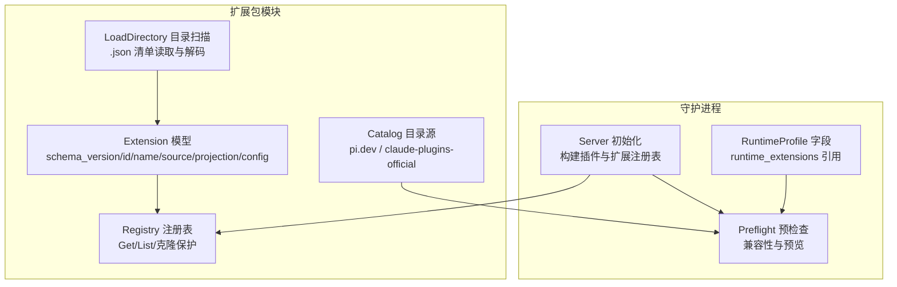
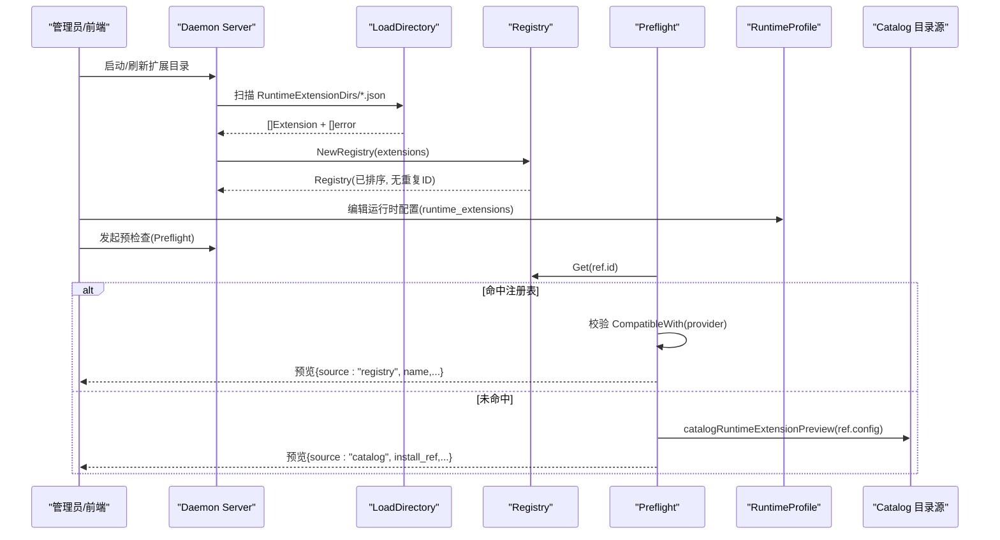
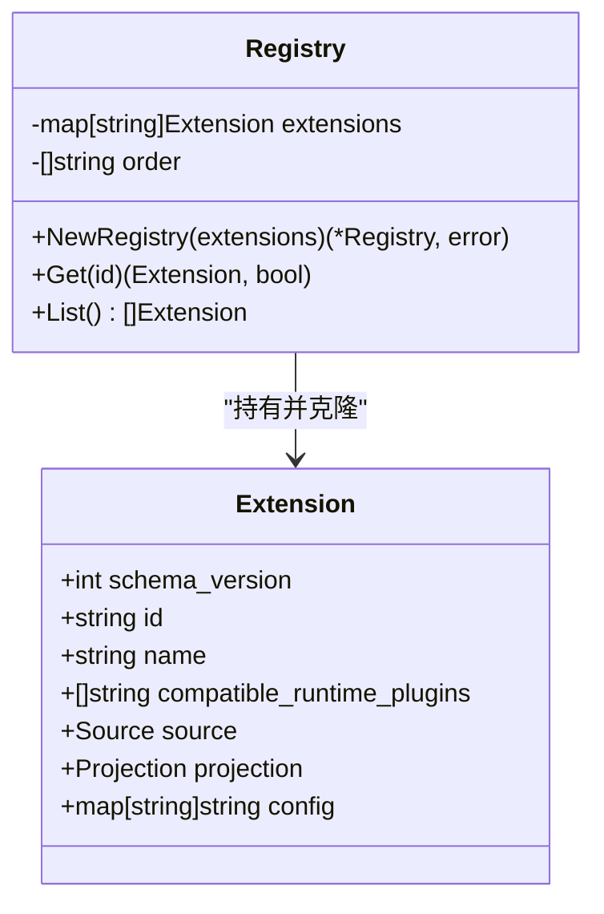
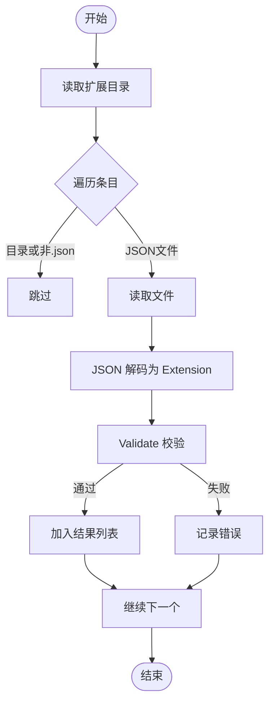
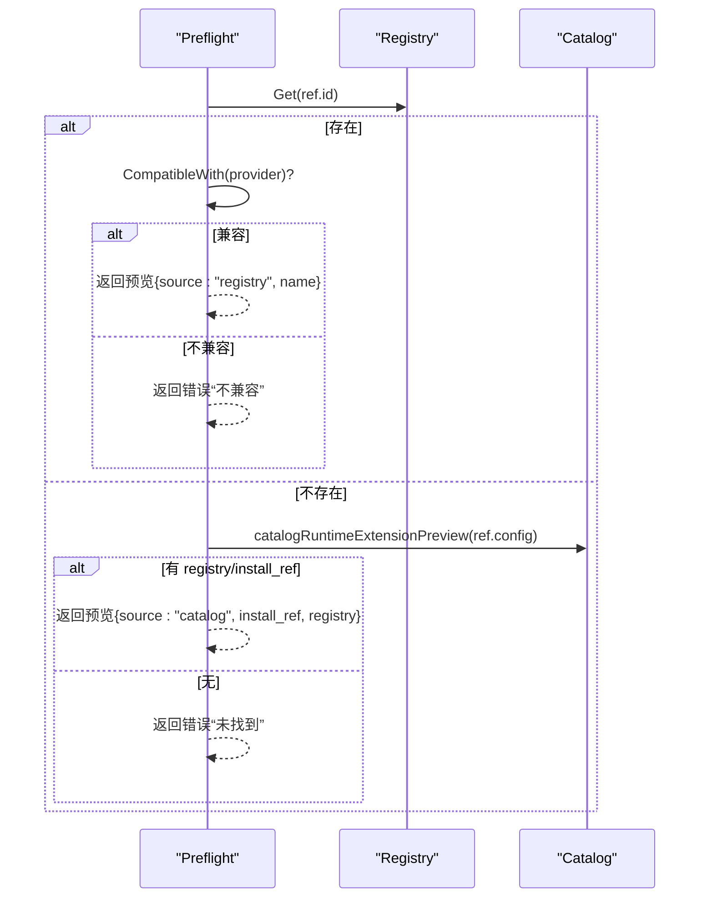
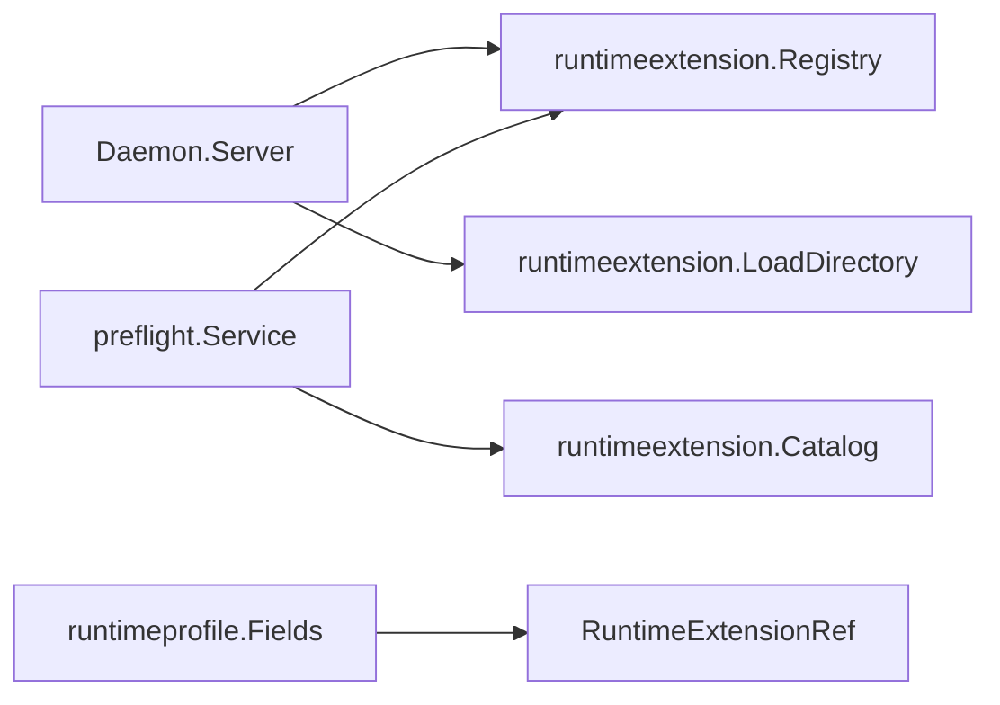

# 扩展生命周期管理

<cite>
**本文引用的文件**   
- [registry.go](file://internal/runtimeextension/registry.go)
- [loader.go](file://internal/runtimeextension/loader.go)
- [extension.go](file://internal/runtimeextension/extension.go)
- [catalog.go](file://internal/runtimeextension/catalog.go)
- [server.go](file://internal/daemon/server.go)
- [preflight.go](file://internal/preflight/preflight.go)
- [runtimeprofile.go](file://internal/runtimeprofile/runtimeprofile.go)
</cite>

## 目录
1. [引言](#引言)
2. [项目结构](#项目结构)
3. [核心组件](#核心组件)
4. [架构总览](#架构总览)
5. [详细组件分析](#详细组件分析)
6. [依赖关系分析](#依赖关系分析)
7. [性能与可扩展性](#性能与可扩展性)
8. [故障排查指南](#故障排查指南)
9. [结论](#结论)

## 引言
本文件系统性说明“运行时扩展包”的完整生命周期：从发现、验证、加载到注册、预检、启用与投影，以及卸载与热重载策略。重点解析 registry.go 中的注册表管理与状态跟踪，并给出依赖解析、冲突检测与解决策略，覆盖任务启动前预检查（Preflight）与配置投影（Config Projection）阶段的行为。

## 项目结构
围绕扩展包管理的核心代码位于 internal/runtimeextension 包，配合 daemon 服务在启动时构建全局注册表，并在 Preflight 阶段进行兼容性校验与预览展示；运行时配置文件（Runtime Profile）通过结构化字段声明启用的扩展引用，最终在任务启动前的配置投影阶段将扩展内容物化到任务本地边界。

图表来源
- [registry.go:1-61](file://internal/runtimeextension/registry.go#L1-L61)
- [loader.go:1-45](file://internal/runtimeextension/loader.go#L1-L45)
- [extension.go:1-122](file://internal/runtimeextension/extension.go#L1-L122)
- [catalog.go:1-177](file://internal/runtimeextension/catalog.go#L1-L177)
- [server.go:346-372](file://internal/daemon/server.go#L346-L372)
- [preflight.go:371-411](file://internal/preflight/preflight.go#L371-L411)
- [runtimeprofile.go:63-95](file://internal/runtimeprofile/runtimeprofile.go#L63-L95)

章节来源
- [registry.go:1-61](file://internal/runtimeextension/registry.go#L1-L61)
- [loader.go:1-45](file://internal/runtimeextension/loader.go#L1-L45)
- [extension.go:1-122](file://internal/runtimeextension/extension.go#L1-L122)
- [catalog.go:1-177](file://internal/runtimeextension/catalog.go#L1-L177)
- [server.go:346-372](file://internal/daemon/server.go#L346-L372)
- [preflight.go:371-411](file://internal/preflight/preflight.go#L371-L411)
- [runtimeprofile.go:63-95](file://internal/runtimeprofile/runtimeprofile.go#L63-L95)

## 核心组件
- Extension 模型与校验
  - 包含 schema_version、id、name、compatible_runtime_plugins、source、projection、config 等字段。
  - 校验规则包括：版本固定、ID 格式、名称必填、兼容插件列表非空且去重、source 类型白名单、路径安全（相对路径、禁止转义）、投影位置白名单、config 值不得疑似密钥。
- Registry 注册表
  - 维护 id -> Extension 映射与有序 ID 列表，提供 Get/List 访问。
  - 构造时执行 Validate 与重复 ID 检测，返回错误即中止注册。
  - 所有对外暴露的 Extension 均通过 cloneExtension 深拷贝，避免外部修改影响内部状态。
- Loader 目录加载器
  - 遍历指定目录下的 .json 清单，逐个读取、解码、Validate，收集成功项与错误集合。
- Catalog 目录源
  - 聚合 pi.dev/packages 与 anthropics/claude-plugins-official 两个上游目录，生成可安装条目（含 install_ref、registry_url 等）。
- Daemon 集成
  - 启动时按配置的 RuntimeExtensionDirs 调用 LoadDirectory 并构建 Registry，供后续 Preflight 与 UI 使用。
- Preflight 预检查
  - 根据 RuntimeProfile 中 runtime_extensions 引用，优先从 Registry 解析并校验与当前 Provider 的兼容性；若未命中则回退为目录源的预览信息。
- RuntimeProfile 结构化字段
  - Fields.RuntimeExtensions 以引用形式声明启用的扩展，支持 enabled 与 per-profile config。

章节来源
- [extension.go:19-96](file://internal/runtimeextension/extension.go#L19-L96)
- [registry.go:8-61](file://internal/runtimeextension/registry.go#L8-L61)
- [loader.go:11-45](file://internal/runtimeextension/loader.go#L11-L45)
- [catalog.go:37-106](file://internal/runtimeextension/catalog.go#L37-L106)
- [server.go:360-372](file://internal/daemon/server.go#L360-L372)
- [preflight.go:371-411](file://internal/preflight/preflight.go#L371-L411)
- [runtimeprofile.go:63-95](file://internal/runtimeprofile/runtimeprofile.go#L63-L95)

## 架构总览
扩展包的生命周期贯穿“管理期”和“运行期”。管理期负责发现、导入、发布与注册；运行期在任务启动前进行预检查与配置投影，确保扩展与目标运行时插件兼容，并将扩展内容物化到任务本地边界。

图表来源
- [server.go:360-372](file://internal/daemon/server.go#L360-L372)
- [registry.go:13-27](file://internal/runtimeextension/registry.go#L13-L27)
- [preflight.go:371-411](file://internal/preflight/preflight.go#L371-L411)
- [catalog.go:37-106](file://internal/runtimeextension/catalog.go#L37-L106)
- [runtimeprofile.go:63-95](file://internal/runtimeprofile/runtimeprofile.go#L63-L95)

## 详细组件分析

### 注册表与状态跟踪（registry.go）
- 数据结构
  - extensions map[string]Extension：以扩展 ID 为键的内存索引。
  - order []string：用于稳定枚举顺序（按 ID 排序）。
- 关键行为
  - NewRegistry：对输入逐一 Validate，拒绝重复 ID，深拷贝后入表，最后排序。
  - Get/List：返回深拷贝副本，防止外部篡改内部状态。
  - cloneExtension：递归复制切片与 map，保证隔离。
- 状态语义
  - 注册表是只读视图（构造后不变更），其“状态”由构造时的输入决定。
  - 列表顺序稳定，便于 UI 展示与测试断言。

图表来源
- [registry.go:8-61](file://internal/runtimeextension/registry.go#L8-L61)
- [extension.go:19-38](file://internal/runtimeextension/extension.go#L19-L38)

章节来源
- [registry.go:13-61](file://internal/runtimeextension/registry.go#L13-L61)

### 清单加载与校验（loader.go + extension.go）
- 加载流程
  - 仅处理顶层 .json 文件，跳过目录与非 JSON 文件。
  - 读取、JSON 解码、Validate，失败项累积到错误列表，不影响其他清单。
- 校验要点
  - schema_version 必须等于常量。
  - id 符合小写字母开头与允许字符集的正则。
  - name 非空。
  - compatible_runtime_plugins 非空、去重、每个元素符合 id 正则。
  - source.type 在白名单内（local_dir/local_file），path 非空且不疑似密钥。
  - projection.location 在白名单内（provider_home/runtime_home/workdir），path 相对且不可逃逸根。
  - config 值不得疑似密钥。

图表来源
- [loader.go:11-45](file://internal/runtimeextension/loader.go#L11-L45)
- [extension.go:51-96](file://internal/runtimeextension/extension.go#L51-L96)

章节来源
- [loader.go:11-45](file://internal/runtimeextension/loader.go#L11-L45)
- [extension.go:51-96](file://internal/runtimeextension/extension.go#L51-L96)

### 目录源与预览（catalog.go + preflight.go）
- 目录源
  - FetchDefaultCatalog 聚合 pi.dev/packages 与 anthropics/claude-plugins-official 两个来源，返回可安装条目与错误。
  - 解析 HTML 或 GitHub API 响应，提取 id、name、description、install_ref、registry_url 等。
- Preflight 解析
  - resolveRuntimeExtensionPreview：优先从 Registry.Get 获取并校验 CompatibleWith(provider)；否则尝试 catalogRuntimeExtensionPreview 基于 ref.config 生成预览。
  - 未命中任一来源则报错“扩展未找到”。

图表来源
- [preflight.go:371-411](file://internal/preflight/preflight.go#L371-L411)
- [catalog.go:37-106](file://internal/runtimeextension/catalog.go#L37-L106)

章节来源
- [preflight.go:371-411](file://internal/preflight/preflight.go#L371-L411)
- [catalog.go:37-106](file://internal/runtimeextension/catalog.go#L37-L106)

### 运行时配置与启用（runtimeprofile.go）
- RuntimeExtensionRef
  - id：扩展标识。
  - enabled：是否启用（可为 nil）。
  - config：每 profile 的非密钥配置。
- Fields.RuntimeExtensions
  - 作为结构化字段存储，参与 GeneratedConfig 预览输出。
- 生成配置
  - GeneratedConfig 会序列化 runtime_extensions 列表（id、enabled、config），不包含敏感值。

章节来源
- [runtimeprofile.go:63-95](file://internal/runtimeprofile/runtimeprofile.go#L63-L95)
- [runtimeprofile.go:389-402](file://internal/runtimeprofile/runtimeprofile.go#L389-L402)

## 依赖关系分析
- 组件耦合
  - Daemon 在启动时依赖 loader 与 registry 构建全局扩展注册表。
  - Preflight 依赖 registry 与 catalog 完成扩展解析与兼容性检查。
  - RuntimeProfile 通过结构化字段声明扩展引用，驱动 Preflight 与生成的配置预览。
- 直接依赖
  - server.go -> runtimeextension.LoadDirectory/NewRegistry
  - preflight.go -> runtimeextension.Registry.CompatibleWith
  - runtimeprofile.go -> runtimeextension.RuntimeExtensionRef（字段定义）

图表来源
- [server.go:360-372](file://internal/daemon/server.go#L360-L372)
- [preflight.go:371-411](file://internal/preflight/preflight.go#L371-L411)
- [runtimeprofile.go:63-95](file://internal/runtimeprofile/runtimeprofile.go#L63-L95)

章节来源
- [server.go:360-372](file://internal/daemon/server.go#L360-L372)
- [preflight.go:371-411](file://internal/preflight/preflight.go#L371-L411)
- [runtimeprofile.go:63-95](file://internal/runtimeprofile/runtimeprofile.go#L63-L95)

## 性能与可扩展性
- 时间复杂度
  - 目录加载 O(N)（N 为清单数量），每次清单解码与校验常数开销。
  - 注册表构造 O(N log N)（排序），Get/O(1)，List/O(N)。
- 空间复杂度
  - 注册表存储所有扩展副本，注意 deep copy 带来的额外内存占用。
- 可扩展性建议
  - 目录加载可并行化以提升大目录扫描性能。
  - 注册表可按 provider 维度分片，减少 Get 时的过滤成本。
  - Catalog 请求增加缓存与超时控制，避免网络抖动影响预检查。

[本节为通用指导，无需源码引用]

## 故障排查指南
- 常见错误与定位
  - 重复 ID：NewRegistry 返回“duplicate id”，检查清单 id 唯一性。
  - 校验失败：Validate 返回具体原因（如 schema_version、id 格式、路径疑似密钥、投影路径越界等）。
  - 兼容性问题：Preflight 报“not compatible with provider”，确认 compatible_runtime_plugins 包含目标 provider。
  - 未找到扩展：Preflight 报“not found”，确认已在目录加载并注册，或提供正确的 catalog 配置。
- 日志与事件
  - Daemon 启动阶段会汇总加载错误；Preflight 错误消息可直接用于前端提示。
- 恢复策略
  - 修复清单后重启或刷新扩展目录，重新构建注册表。
  - 对于目录源引用，确保 registry/install_ref 正确并可访问。

章节来源
- [registry.go:13-27](file://internal/runtimeextension/registry.go#L13-L27)
- [extension.go:51-96](file://internal/runtimeextension/extension.go#L51-L96)
- [preflight.go:371-411](file://internal/preflight/preflight.go#L371-L411)

## 结论
扩展包的生命周期以“清单驱动、注册表集中、预检查前置、配置投影落地”为核心原则。registry.go 提供的注册表实现了稳定的查找与安全的克隆保护；loader.go 与 extension.go 共同保障清单的安全与一致性；catalog.go 提供外部目录源能力；preflight.go 在任务启动前完成兼容性与可用性检查；runtimeprofile.go 通过结构化字段管理启用与配置。整体设计清晰、可观测、易排障，满足生产环境对安全性与稳定性的要求。