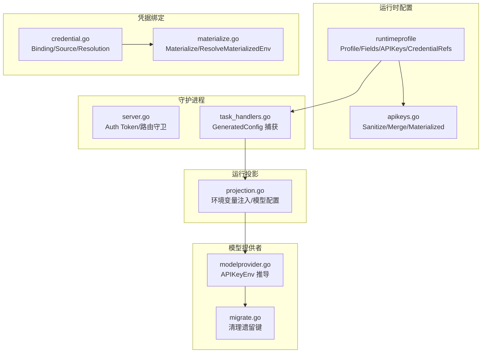
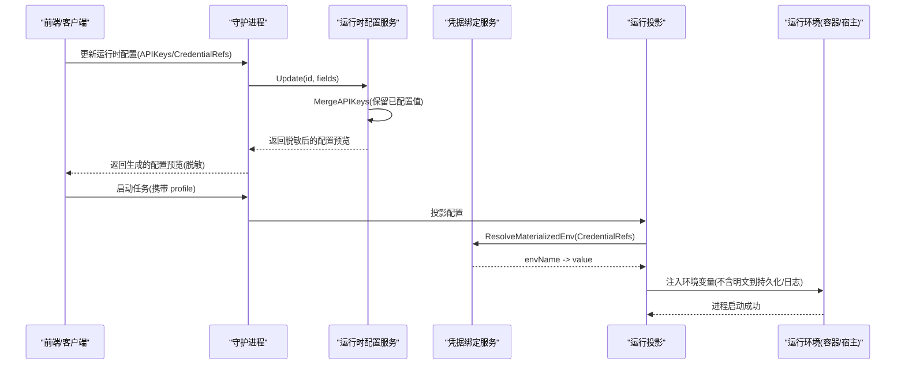
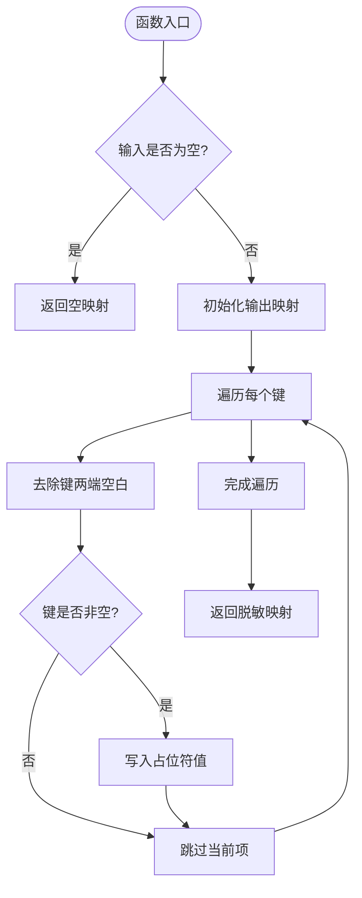
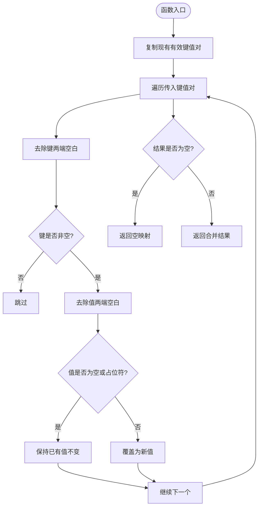
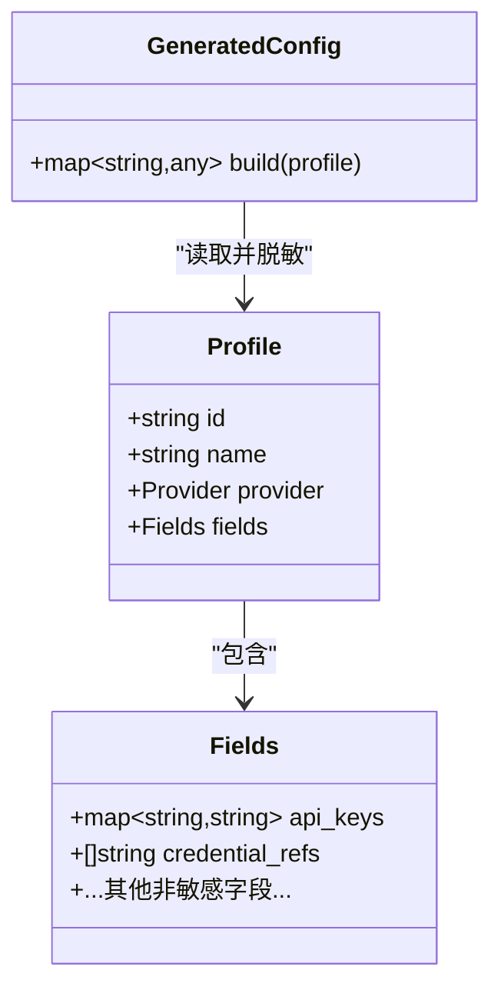
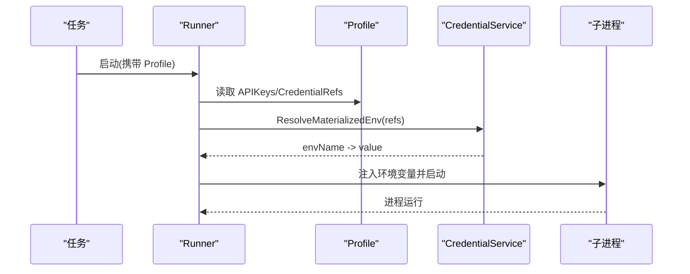
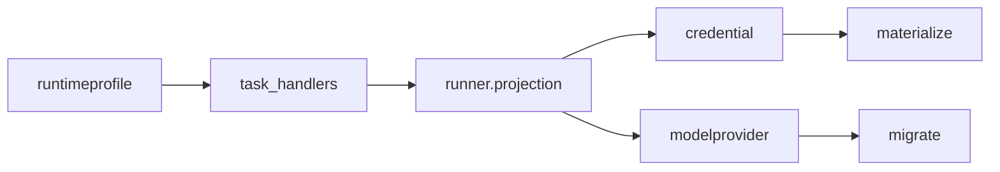

# API 密钥管理

<cite>
**本文引用的文件**
- [internal/runtimeprofile/apikeys.go](file://internal/runtimeprofile/apikeys.go)
- [internal/runtimeprofile/runtimeprofile.go](file://internal/runtimeprofile/runtimeprofile.go)
- [internal/credential/credential.go](file://internal/credential/credential.go)
- [internal/credential/materialize.go](file://internal/credential/materialize.go)
- [internal/daemon/server.go](file://internal/daemon/server.go)
- [internal/daemon/task_handlers.go](file://internal/daemon/task_handlers.go)
- [internal/runner/projection.go](file://internal/runner/projection.go)
- [internal/modelprovider/modelprovider.go](file://internal/modelprovider/modelprovider.go)
- [internal/modelprovidermigrate/migrate.go](file://internal/modelprovidermigrate/migrate.go)
</cite>

## 目录
1. [引言](#引言)
2. [项目结构](#项目结构)
3. [核心组件](#核心组件)
4. [架构总览](#架构总览)
5. [详细组件分析](#详细组件分析)
6. [依赖关系分析](#依赖关系分析)
7. [性能与安全特性](#性能与安全特性)
8. [故障排查指南](#故障排查指南)
9. [结论](#结论)

## 引言
本文件系统性说明本项目中 API 密钥的安全管理机制，覆盖存储格式、加密策略、访问控制与审计日志、轮换与过期检查、自动续期、多租户隔离、共享密钥管理、安全传输协议，并重点解析以下关键点：
- SanitizeAPIKeys 的脱敏机制
- MergeAPIKeys 的合并策略
- GeneratedConfig 输出中的安全处理方式
- APIKeys 与 CredentialRefs 的区别与使用场景

## 项目结构
围绕密钥管理的代码主要分布在运行时配置（runtimeprofile）、凭据绑定（credential）、守护进程（daemon）以及运行投影（runner）等模块。整体组织遵循“结构化字段为事实来源、生成配置仅用于预览”的原则，避免在持久化或对外输出中泄露敏感值。

**图示来源**
- [internal/runtimeprofile/runtimeprofile.go:347-433](file://internal/runtimeprofile/runtimeprofile.go#L347-L433)
- [internal/runtimeprofile/apikeys.go:22-74](file://internal/runtimeprofile/apikeys.go#L22-L74)
- [internal/credential/credential.go:77-100](file://internal/credential/credential.go#L77-L100)
- [internal/credential/materialize.go:28-143](file://internal/credential/materialize.go#L28-L143)
- [internal/daemon/server.go:120-200](file://internal/daemon/server.go#L120-L200)
- [internal/daemon/task_handlers.go:573-650](file://internal/daemon/task_handlers.go#L573-L650)
- [internal/runner/projection.go:1047-1095](file://internal/runner/projection.go#L1047-L1095)
- [internal/modelprovider/modelprovider.go:624-637](file://internal/modelprovider/modelprovider.go#L624-L637)
- [internal/modelprovidermigrate/migrate.go:391-461](file://internal/modelprovidermigrate/migrate.go#L391-L461)

**章节来源**
- [internal/runtimeprofile/runtimeprofile.go:1-120](file://internal/runtimeprofile/runtimeprofile.go#L1-L120)
- [internal/credential/credential.go:1-120](file://internal/credential/credential.go#L1-L120)
- [internal/daemon/server.go:120-200](file://internal/daemon/server.go#L120-L200)

## 核心组件
- 运行时配置 Profile/Fields
  - Fields.APIKeys：按环境名映射到密钥值的内联键集合，用于预览和导出时脱敏显示。
  - Fields.CredentialRefs：引用全局或项目级凭据绑定的非敏感指针列表，实际值在启动时解析。
- 凭据绑定 Service
  - Binding.Source.Kind：env/file/command/literal，支持多种来源；literal 在 API 响应中必须脱敏。
  - Resolution：按项目优先、全局回退的顺序解析，支持禁用。
- 守护进程 Server
  - AuthToken：对非本地监听强制鉴权，防止未授权暴露控制面。
- 运行投影 Runner
  - 将 Credentials 解析为环境变量注入到沙箱/宿主进程，确保密钥不进入持久化或日志。

**章节来源**
- [internal/runtimeprofile/runtimeprofile.go:71-95](file://internal/runtimeprofile/runtimeprofile.go#L71-L95)
- [internal/credential/credential.go:77-100](file://internal/credential/credential.go#L77-L100)
- [internal/daemon/server.go:120-200](file://internal/daemon/server.go#L120-L200)
- [internal/runner/projection.go:1047-1095](file://internal/runner/projection.go#L1047-L1095)

## 架构总览
下图展示从配置更新到任务启动过程中，API 密钥如何被安全处理、合并、脱敏并最终注入运行环境。

**图示来源**
- [internal/runtimeprofile/runtimeprofile.go:242-297](file://internal/runtimeprofile/runtimeprofile.go#L242-L297)
- [internal/runtimeprofile/apikeys.go:47-74](file://internal/runtimeprofile/apikeys.go#L47-L74)
- [internal/daemon/task_handlers.go:573-650](file://internal/daemon/task_handlers.go#L573-L650)
- [internal/credential/materialize.go:82-111](file://internal/credential/materialize.go#L82-L111)
- [internal/runner/projection.go:1047-1095](file://internal/runner/projection.go#L1047-L1095)

## 详细组件分析

### SanitizeAPIKeys 脱敏机制
- 行为要点
  - 输入为空则返回空；否则遍历键名，忽略空白键，将所有有效键的值替换为固定占位符。
  - 该函数用于对外 API 响应与生成配置预览，确保不会泄露真实密钥。
- 复杂度
  - 时间 O(n)，空间 O(n)，n 为键数量。
- 适用位置
  - 生成配置预览、Profile 序列化前、API 返回列表。

**图示来源**
- [internal/runtimeprofile/apikeys.go:33-46](file://internal/runtimeprofile/apikeys.go#L33-L46)

**章节来源**
- [internal/runtimeprofile/apikeys.go:22-46](file://internal/runtimeprofile/apikeys.go#L22-L46)

### MergeAPIKeys 合并策略
- 行为要点
  - 先复制现有有效键值对（键与值均非空）。
  - 再应用新值：若新值为空或等于占位符，则视为“保持不变”，不覆盖已有值；否则用新值覆盖。
  - 最终结果为空则返回 nil，保持存储整洁。
- 设计意图
  - 支持“部分更新”模式：客户端可只提交需要变更的键，其余键通过占位符表示“不修改”。
- 复杂度
  - 时间 O(m+n)，空间 O(m+n)。

**图示来源**
- [internal/runtimeprofile/apikeys.go:47-74](file://internal/runtimeprofile/apikeys.go#L47-L74)

**章节来源**
- [internal/runtimeprofile/apikeys.go:47-74](file://internal/runtimeprofile/apikeys.go#L47-L74)

### GeneratedConfig 输出中的安全处理
- 行为要点
  - 生成配置仅用于预览，不包含任何真实密钥。
  - 对于 APIKeys，统一调用 SanitizeAPIKeys 进行脱敏。
  - 对于 CredentialRefs，仅输出引用名称，不解析也不输出实际值。
- 安全保证
  - 即使 Profile 包含内联密钥，也不会出现在生成的配置预览中。
  - 结合测试断言，确保不会泄漏敏感字段。

**图示来源**
- [internal/runtimeprofile/runtimeprofile.go:347-433](file://internal/runtimeprofile/runtimeprofile.go#L347-L433)

**章节来源**
- [internal/runtimeprofile/runtimeprofile.go:347-433](file://internal/runtimeprofile/runtimeprofile.go#L347-L433)

### APIKeys 与 CredentialRefs 的区别与使用场景
- APIKeys（内联键）
  - 直接以“环境变量名 -> 密钥值”的形式存储在 Profile 中。
  - 适合快速演示或单用户单机场景；对外输出会被脱敏。
  - 更新时使用 MergeAPIKeys 实现增量更新。
- CredentialRefs（凭据引用）
  - 仅保存引用名，实际值来自全局或项目级绑定。
  - 支持 env/file/command/literal 四种来源；literal 在 API 响应中同样脱敏。
  - 适合多租户、集中化管理、轮换与审计。
- 选择建议
  - 生产环境优先使用 CredentialRefs，便于权限隔离、轮换与审计。
  - 内联 APIKeys 可作为临时或开发用途。

**章节来源**
- [internal/runtimeprofile/runtimeprofile.go:71-95](file://internal/runtimeprofile/runtimeprofile.go#L71-L95)
- [internal/credential/credential.go:77-100](file://internal/credential/credential.go#L77-L100)
- [internal/credential/credential.go:346-364](file://internal/credential/credential.go#L346-L364)

### 密钥存储格式与加密策略
- 存储格式
  - Profile.Fields.APIKeys：JSON 对象，键为环境变量名，值为密钥字符串。
  - Binding.Source：JSON 对象，包含 kind/value/destination_env 等字段。
- 加密策略
  - 代码层未实现静态加密；敏感值以明文形式存储在 SQLite 中。
  - 通过脱敏与最小可见性原则降低泄露风险：对外 API 与生成配置一律脱敏。
  - 建议配合操作系统/数据库层的透明加密或磁盘加密方案。

**章节来源**
- [internal/runtimeprofile/runtimeprofile.go:174-208](file://internal/runtimeprofile/runtimeprofile.go#L174-L208)
- [internal/credential/credential.go:166-183](file://internal/credential/credential.go#L166-L183)

### 访问控制与审计日志
- 访问控制
  - 守护进程在非本地监听时必须配置 AuthToken，拒绝未认证请求。
  - 支持 Authorization: Bearer 或查询参数 token 两种鉴权方式。
- 审计日志
  - 关键事件（如沙箱生命周期）会记录结构化日志，并对敏感信息进行脱敏。
  - 建议将日志接入集中式审计系统，并限制访问权限。

**章节来源**
- [internal/daemon/server.go:174-185](file://internal/daemon/server.go#L174-L185)
- [internal/daemon/logging.go:116-135](file://internal/daemon/logging.go#L116-L135)

### 密钥轮换、过期检查与自动续期
- 轮换
  - 通过更新 Profile 的 APIKeys 或 CredentialRefs 实现轮换。
  - 使用 MergeAPIKeys 可实现“仅替换指定键”的无感更新。
- 过期检查
  - 代码层未内置过期时间字段；建议在外部系统（如凭据库）维护有效期并在绑定层校验。
- 自动续期
  - 可通过外部调度器定期刷新绑定源（例如从密钥管理服务拉取最新值），或通过命令型 Source 动态获取。

**章节来源**
- [internal/runtimeprofile/apikeys.go:47-74](file://internal/runtimeprofile/apikeys.go#L47-L74)
- [internal/credential/materialize.go:51-67](file://internal/credential/materialize.go#L51-L67)

### 多租户密钥隔离与共享密钥管理
- 多租户隔离
  - 凭据绑定支持 Scope=project 与 Scope=global，项目级绑定可覆盖全局绑定。
  - 项目级禁用可阻止回退到全局绑定，实现强隔离。
- 共享密钥管理
  - 多个项目可共享同一全局绑定；也可通过不同 destination_env 映射到不同环境变量名。
  - 结合 Model Provider 的 APIKeyEnv 推导，可将通用密钥映射到标准环境变量。

**章节来源**
- [internal/credential/credential.go:214-245](file://internal/credential/credential.go#L214-L245)
- [internal/modelprovider/modelprovider.go:624-637](file://internal/modelprovider/modelprovider.go#L624-L637)

### 安全传输协议
- 守护进程默认监听本地地址；若绑定到非本地地址，必须设置 AuthToken。
- 建议使用反向代理（如 Nginx/Traefik）提供 TLS 终止，并将内部通信限制在本地环回。
- MCP 服务器在沙箱可达性调整时可能携带鉴权令牌作为查询参数，需确保传输通道安全。

**章节来源**
- [internal/daemon/server.go:174-185](file://internal/daemon/server.go#L174-L185)
- [internal/daemon/server.go:120-200](file://internal/daemon/server.go#L120-L200)

### 密钥在运行时的注入与投影
- 流程
  - 启动任务时，Runner 基于 Profile 生成配置，并通过凭据服务解析引用，得到 envName -> value。
  - 将结果注入到沙箱或宿主进程的环境变量中，避免写入持久化或日志。
- 兼容性与迁移
  - 针对旧版模型提供者键名，提供清理逻辑，避免遗留键污染新配置。

**图示来源**
- [internal/runner/projection.go:1047-1095](file://internal/runner/projection.go#L1047-L1095)
- [internal/credential/materialize.go:82-111](file://internal/credential/materialize.go#L82-L111)

**章节来源**
- [internal/runner/projection.go:1047-1095](file://internal/runner/projection.go#L1047-L1095)
- [internal/modelprovidermigrate/migrate.go:391-461](file://internal/modelprovidermigrate/migrate.go#L391-L461)

## 依赖关系分析
- 低耦合高内聚
  - runtimeprofile 负责配置结构与生成预览，不直接访问凭据绑定。
  - credential 独立管理绑定与解析，供 runner 在启动阶段按需调用。
- 潜在循环依赖
  - 当前未见循环导入；各模块职责清晰。
- 外部依赖
  - SQLite 用于持久化；文件系统与命令执行用于 file/command 类型凭据来源。

**图示来源**
- [internal/runtimeprofile/runtimeprofile.go:347-433](file://internal/runtimeprofile/runtimeprofile.go#L347-L433)
- [internal/daemon/task_handlers.go:573-650](file://internal/daemon/task_handlers.go#L573-L650)
- [internal/runner/projection.go:1047-1095](file://internal/runner/projection.go#L1047-L1095)
- [internal/credential/credential.go:214-245](file://internal/credential/credential.go#L214-L245)
- [internal/credential/materialize.go:82-111](file://internal/credential/materialize.go#L82-L111)
- [internal/modelprovider/modelprovider.go:624-637](file://internal/modelprovider/modelprovider.go#L624-L637)
- [internal/modelprovidermigrate/migrate.go:391-461](file://internal/modelprovidermigrate/migrate.go#L391-L461)

**章节来源**
- [internal/runtimeprofile/runtimeprofile.go:347-433](file://internal/runtimeprofile/runtimeprofile.go#L347-L433)
- [internal/daemon/task_handlers.go:573-650](file://internal/daemon/task_handlers.go#L573-L650)
- [internal/runner/projection.go:1047-1095](file://internal/runner/projection.go#L1047-L1095)
- [internal/credential/credential.go:214-245](file://internal/credential/credential.go#L214-L245)
- [internal/credential/materialize.go:82-111](file://internal/credential/materialize.go#L82-L111)
- [internal/modelprovider/modelprovider.go:624-637](file://internal/modelprovider/modelprovider.go#L624-L637)
- [internal/modelprovidermigrate/migrate.go:391-461](file://internal/modelprovidermigrate/migrate.go#L391-L461)

## 性能与安全特性
- 性能
  - SanitizeAPIKeys/MergeAPIKeys 均为线性复杂度，开销极低。
  - 生成配置仅在预览与捕获时计算，不影响运行时主路径。
- 安全
  - 对外输出严格脱敏；运行时仅以环境变量形式注入，避免落盘与日志泄露。
  - 非本地监听强制鉴权；命令型凭据默认禁用，需显式开启。

[本节为通用指导，无需特定文件来源]

## 故障排查指南
- 常见问题
  - 启动失败且提示缺少环境变量：检查 CredentialRefs 对应的绑定是否存在且未被禁用。
  - 更新 APIKeys 后未生效：确认是否使用了占位符导致“保持不变”；如需更新请传入新值。
  - 非本地监听无法启动：需设置 AuthToken。
- 定位方法
  - 查看生成的配置预览，确认 APIKeys 已被脱敏、CredentialRefs 仅显示引用名。
  - 检查守护进程日志，关注沙箱生命周期事件与错误信息。

**章节来源**
- [internal/credential/materialize.go:82-111](file://internal/credential/materialize.go#L82-L111)
- [internal/runtimeprofile/apikeys.go:47-74](file://internal/runtimeprofile/apikeys.go#L47-L74)
- [internal/daemon/server.go:174-185](file://internal/daemon/server.go#L174-L185)
- [internal/daemon/logging.go:116-135](file://internal/daemon/logging.go#L116-L135)

## 结论
本项目采用“结构化配置 + 引用绑定 + 运行时注入”的分层设计，结合严格的脱敏与鉴权策略，在保证可用性的同时显著降低了密钥泄露风险。推荐在生产环境中优先使用 CredentialRefs 并结合外部密钥管理系统，以实现更完善的轮换、审计与隔离能力。