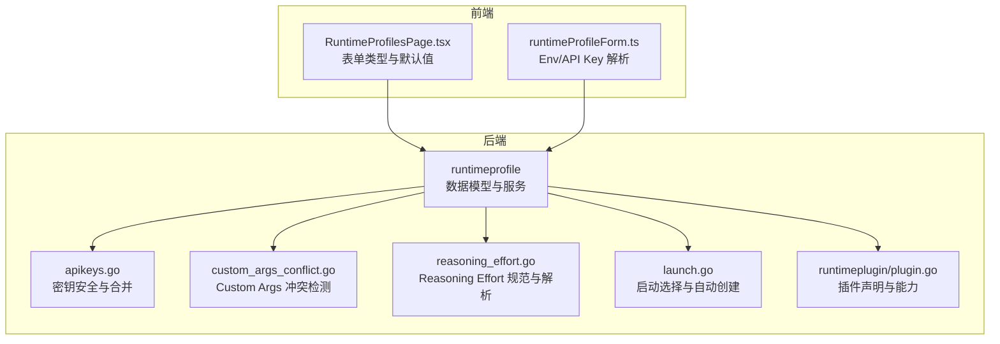
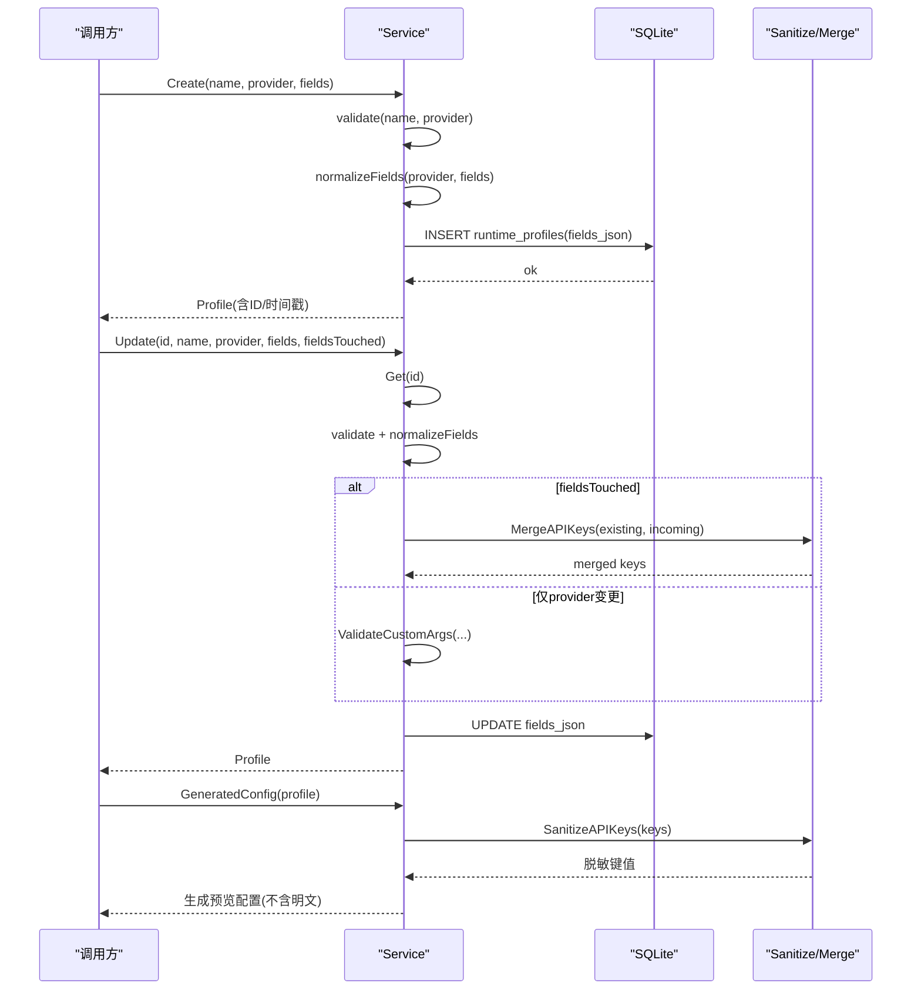
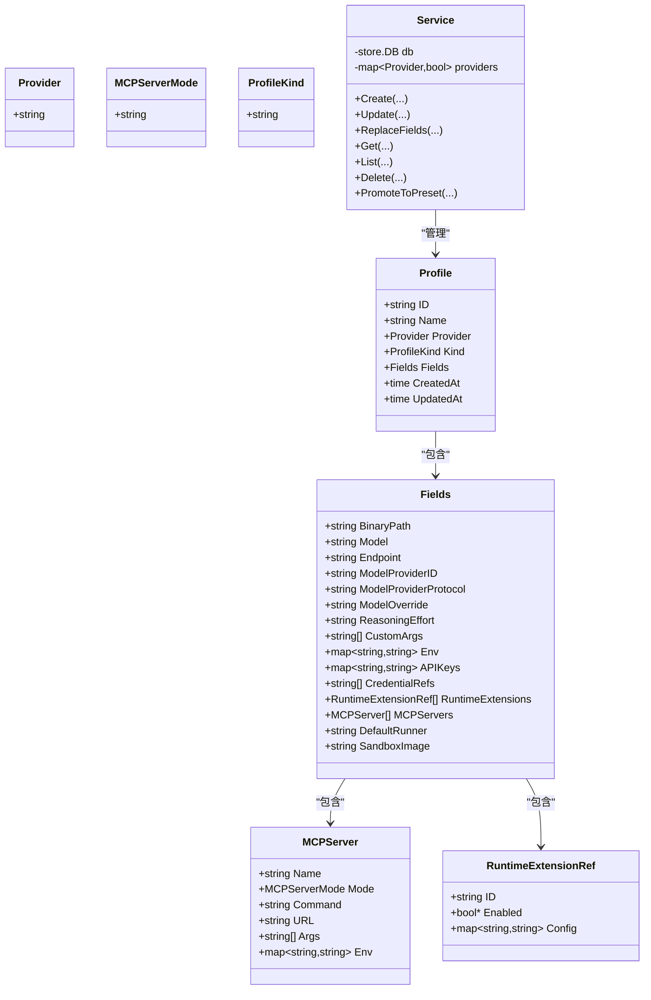
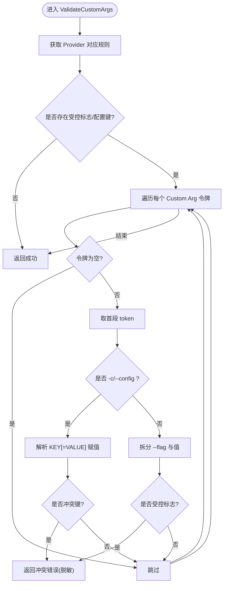
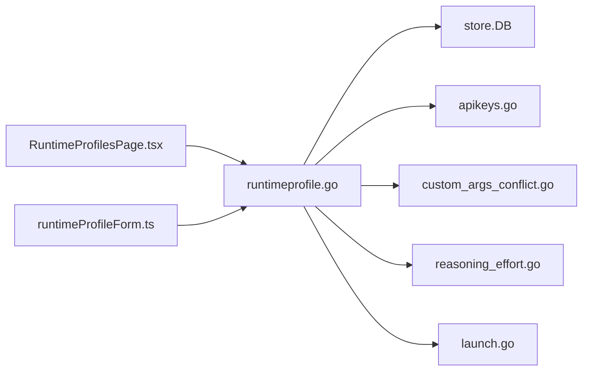

# Profile 结构与解析

<cite>
**本文引用的文件**   
- [internal/runtimeprofile/runtimeprofile.go](file://internal/runtimeprofile/runtimeprofile.go)
- [internal/runtimeprofile/apikeys.go](file://internal/runtimeprofile/apikeys.go)
- [internal/runtimeprofile/custom_args_conflict.go](file://internal/runtimeprofile/custom_args_conflict.go)
- [internal/runtimeprofile/reasoning_effort.go](file://internal/runtimeprofile/reasoning_effort.go)
- [internal/runtimeprofile/launch.go](file://internal/runtimeprofile/launch.go)
- [internal/runtimeplugin/plugin.go](file://internal/runtimeplugin/plugin.go)
- [web/src/pages/RuntimeProfilesPage.tsx](file://web/src/pages/RuntimeProfilesPage.tsx)
- [web/src/pages/runtimeProfileForm.ts](file://web/src/pages/runtimeProfileForm.ts)
</cite>

## 目录
1. [简介](#简介)
2. [项目结构](#项目结构)
3. [核心组件](#核心组件)
4. [架构总览](#架构总览)
5. [详细组件分析](#详细组件分析)
6. [依赖关系分析](#依赖关系分析)
7. [性能与扩展性考虑](#性能与扩展性考虑)
8. [故障排查指南](#故障排查指南)
9. [结论](#结论)
10. [附录：字段定义与约束](#附录字段定义与约束)

## 简介
本文件系统性说明 CyberPenda 中“运行时配置（Runtime Profile）”的数据模型、解析与校验机制，覆盖以下要点：
- Profile 的 JSON 序列化存储与生成预览；当前代码未实现 YAML 直接解析。
- Fields 结构体各字段的含义、类型约束、默认值与合并策略。
- ProfileKind 的分类（manual vs launch_resolve）及其生命周期。
- Provider 支持范围与自定义注入方式。
- Custom Args 冲突检测与 Reasoning Effort 规范化。
- API Keys 的安全处理、合并与材料化。
- 模板、条件分支与动态表达式：当前 Profile 层不内置模板引擎或表达式求值，但通过插件声明式能力与前端表单解析提供有限扩展点。

## 项目结构
Profile 相关逻辑集中在 internal/runtimeprofile 包，辅以 runtimeplugin 的插件声明与 web 前端的表单构建。



图表来源
- [internal/runtimeprofile/runtimeprofile.go:1-120](file://internal/runtimeprofile/runtimeprofile.go#L1-L120)
- [internal/runtimeprofile/apikeys.go:1-100](file://internal/runtimeprofile/apikeys.go#L1-L100)
- [internal/runtimeprofile/custom_args_conflict.go:1-125](file://internal/runtimeprofile/custom_args_conflict.go#L1-L125)
- [internal/runtimeprofile/reasoning_effort.go:1-64](file://internal/runtimeprofile/reasoning_effort.go#L1-L64)
- [internal/runtimeprofile/launch.go:1-117](file://internal/runtimeprofile/launch.go#L1-L117)
- [internal/runtimeplugin/plugin.go:42-134](file://internal/runtimeplugin/plugin.go#L42-L134)
- [web/src/pages/RuntimeProfilesPage.tsx:71-118](file://web/src/pages/RuntimeProfilesPage.tsx#L71-L118)
- [web/src/pages/runtimeProfileForm.ts:183-230](file://web/src/pages/runtimeProfileForm.ts#L183-L230)

章节来源
- [internal/runtimeprofile/runtimeprofile.go:1-120](file://internal/runtimeprofile/runtimeprofile.go#L1-L120)
- [internal/runtimeplugin/plugin.go:42-134](file://internal/runtimeplugin/plugin.go#L42-L134)
- [web/src/pages/RuntimeProfilesPage.tsx:71-118](file://web/src/pages/RuntimeProfilesPage.tsx#L71-L118)

## 核心组件
- Profile 与 Fields：Profile 是全局可复用的运行时配置实体，Fields 为结构化字段集合，作为生成配置的权威来源。
- Service：对 SQLite 进行 Profile 的增删改查、验证与归一化。
- LaunchResolution：根据启动选择匹配或自动创建最小 Profile。
- API Keys 工具：安全脱敏、合并与材料化。
- Custom Args 冲突检测：防止通过自定义参数覆盖结构化字段。
- Reasoning Effort：规范化与优先级解析。

章节来源
- [internal/runtimeprofile/runtimeprofile.go:71-116](file://internal/runtimeprofile/runtimeprofile.go#L71-L116)
- [internal/runtimeprofile/runtimeprofile.go:128-208](file://internal/runtimeprofile/runtimeprofile.go#L128-L208)
- [internal/runtimeprofile/launch.go:8-93](file://internal/runtimeprofile/launch.go#L8-L93)
- [internal/runtimeprofile/apikeys.go:22-100](file://internal/runtimeprofile/apikeys.go#L22-L100)
- [internal/runtimeprofile/custom_args_conflict.go:51-124](file://internal/runtimeprofile/custom_args_conflict.go#L51-L124)
- [internal/runtimeprofile/reasoning_effort.go:8-64](file://internal/runtimeprofile/reasoning_effort.go#L8-L64)

## 架构总览
Profile 的生命周期包括：创建（手动或自动）、更新（部分字段合并）、替换（全量覆盖）、删除；读取时返回脱敏后的预览。



图表来源
- [internal/runtimeprofile/runtimeprofile.go:143-208](file://internal/runtimeprofile/runtimeprofile.go#L143-L208)
- [internal/runtimeprofile/runtimeprofile.go:245-297](file://internal/runtimeprofile/runtimeprofile.go#L245-L297)
- [internal/runtimeprofile/runtimeprofile.go:348-433](file://internal/runtimeprofile/runtimeprofile.go#L348-L433)
- [internal/runtimeprofile/apikeys.go:22-74](file://internal/runtimeprofile/apikeys.go#L22-L74)

## 详细组件分析

### 数据结构与类图


图表来源
- [internal/runtimeprofile/runtimeprofile.go:20-116](file://internal/runtimeprofile/runtimeprofile.go#L20-L116)
- [internal/runtimeprofile/runtimeprofile.go:128-141](file://internal/runtimeprofile/runtimeprofile.go#L128-L141)

章节来源
- [internal/runtimeprofile/runtimeprofile.go:20-116](file://internal/runtimeprofile/runtimeprofile.go#L20-L116)

### 字段定义与约束（Fields）
- BinaryPath：二进制路径，可选。用于指定运行时的可执行文件位置。
- Model：模型名称，可选。
- Endpoint：端点地址，可选。
- ModelProviderID：模型提供者标识，可选。
- ModelProviderProtocol：模型提供者协议，可选。
- ModelOverride：模型覆盖名，可选。
- ReasoningEffort：推理努力级别，可选；空值在解析时按默认规则处理。
- CustomArgs：自定义参数列表，不可重定义结构化字段（见冲突检测）。
- Env：环境变量映射，可选。
- APIKeys：内联密钥映射，可选；写入时遵循合并策略，输出时脱敏。
- CredentialRefs：凭据引用列表，可选；通过全局凭据绑定解析。
- RuntimeExtensions：运行时扩展引用，可选。
- MCPServers：MCP 服务器配置，可选。
- DefaultRunner：默认运行器，可选。
- SandboxImage：沙箱镜像覆盖，可选。

章节来源
- [internal/runtimeprofile/runtimeprofile.go:71-95](file://internal/runtimeprofile/runtimeprofile.go#L71-L95)

### 类型验证与默认值处理
- Provider 校验：必须非空且属于支持的集合；可通过注入自定义 Provider 集限制。
- ReasoningEffort 规范化：空值保留不重写存储；非空值需落在允许集合内，否则报错。
- CustomArgs 冲突检测：禁止以 CLI 形式覆盖结构化字段（如 model、model_provider、reasoning_effort），不同 Provider 的规则不同。
- API Keys 合并：更新时若传入空值或占位符则保留已有值；若存在 ModelProviderID，则清空内联 APIKeys。

章节来源
- [internal/runtimeprofile/runtimeprofile.go:435-467](file://internal/runtimeprofile/runtimeprofile.go#L435-L467)
- [internal/runtimeprofile/reasoning_effort.go:31-64](file://internal/runtimeprofile/reasoning_effort.go#L31-L64)
- [internal/runtimeprofile/custom_args_conflict.go:51-124](file://internal/runtimeprofile/custom_args_conflict.go#L51-L124)
- [internal/runtimeprofile/runtimeprofile.go:265-276](file://internal/runtimeprofile/runtimeprofile.go#L265-L276)

### ProfileKind 的区别（manual vs launch_resolve）
- manual：用户手工创建的预设，适合高级启动场景。
- launch_resolve：由启动解析流程自动创建的最小 Profile，通常只包含必要字段并设置默认运行器。
- PromoteToPreset：可将 launch_resolve 提升为 manual，幂等。

章节来源
- [internal/runtimeprofile/runtimeprofile.go:97-105](file://internal/runtimeprofile/runtimeprofile.go#L97-L105)
- [internal/runtimeprofile/runtimeprofile.go:153-172](file://internal/runtimeprofile/runtimeprofile.go#L153-L172)
- [internal/runtimeprofile/launch.go:70-93](file://internal/runtimeprofile/launch.go#L70-L93)

### Provider 类型的支持范围
- 内置支持：fake、codex、claude_code、pi。
- 可扩展：通过 NewService 注入自定义 Provider 集合，从而限定或扩展可用 Provider。

章节来源
- [internal/runtimeprofile/runtimeprofile.go:23-41](file://internal/runtimeprofile/runtimeprofile.go#L23-L41)
- [internal/runtimeprofile/runtimeprofile.go:135-141](file://internal/runtimeprofile/runtimeprofile.go#L135-L141)

### 配置模板、条件分支与动态表达式
- Profile 层本身不包含模板引擎或表达式求值。
- 前端表单支持将多行文本解析为 env_map 或 secret_env_map，并在提交前做基本清洗。
- 插件声明式能力（runtimeplugin）定义了 Profile 字段类型、投影原语与转录解析器等，可用于扩展运行时行为，但不改变 Profile 层的模板/表达式语义。

章节来源
- [web/src/pages/runtimeProfileForm.ts:183-230](file://web/src/pages/runtimeProfileForm.ts#L183-L230)
- [internal/runtimeplugin/plugin.go:98-134](file://internal/runtimeplugin/plugin.go#L98-L134)

### 继承链、合并策略与覆盖规则
- 继承链：当前代码未实现 Profile 间的继承链。
- 合并策略：
  - Update 时 fieldsTouched=true：对 Structured Fields 进行归一化；API Keys 采用“保留已有、忽略空/占位符”的合并策略；当设置了 ModelProviderID 时，清空内联 APIKeys。
  - Update 时 fieldsTouched=false：仅校验 CustomArgs 是否与 Provider 兼容，不修改已存字段。
- 覆盖规则：
  - ReplaceFields：全量替换结构化字段，不进行 API Keys 合并。
  - GeneratedConfig：基于 Fields 生成预览配置，API Keys 值被脱敏。

章节来源
- [internal/runtimeprofile/runtimeprofile.go:245-329](file://internal/runtimeprofile/runtimeprofile.go#L245-L329)
- [internal/runtimeprofile/apikeys.go:48-74](file://internal/runtimeprofile/apikeys.go#L48-L74)
- [internal/runtimeprofile/runtimeprofile.go:348-433](file://internal/runtimeprofile/runtimeprofile.go#L348-L433)

### 关键流程图：Custom Args 冲突检测


图表来源
- [internal/runtimeprofile/custom_args_conflict.go:51-124](file://internal/runtimeprofile/custom_args_conflict.go#L51-L124)

章节来源
- [internal/runtimeprofile/custom_args_conflict.go:51-124](file://internal/runtimeprofile/custom_args_conflict.go#L51-L124)

### 关键序列图：启动解析与自动创建
```mermaid
sequenceDiagram
participant Caller as "调用方"
participant Svc as "Service"
participant List as "List()"
participant Match as "FindLaunchProfile()"
participant Create as "CreateLaunchResolved()"
Caller->>Svc : ResolveLaunchProfile(selection, providerName)
Svc->>Svc : normalizeLaunchSelection()
Svc->>List : 获取所有 Profiles
List-->>Svc : []Profile
Svc->>Match : 查找匹配的 Profile
alt 找到
Match-->>Svc : Profile
Svc-->>Caller : LaunchResolution(Profile, Created=false)
else 未找到
Svc->>Create : 创建最小 Profile(kind=launch_resolve)
Create-->>Svc : Profile
Svc-->>Caller : LaunchResolution(Profile, Created=true)
end
```

图表来源
- [internal/runtimeprofile/launch.go:70-93](file://internal/runtimeprofile/launch.go#L70-L93)
- [internal/runtimeprofile/launch.go:56-68](file://internal/runtimeprofile/launch.go#L56-L68)

章节来源
- [internal/runtimeprofile/launch.go:70-93](file://internal/runtimeprofile/launch.go#L70-L93)

## 依赖关系分析
- runtimeprofile 依赖 store.DB 进行持久化。
- apikeys.go 提供纯函数式工具，无外部依赖。
- custom_args_conflict.go 与 reasoning_effort.go 提供领域校验与规范化。
- launch.go 依赖 Service 的 List/CreateLaunchResolved。
- 前端页面与表单通过 API 与后端交互，负责输入解析与展示。



图表来源
- [internal/runtimeprofile/runtimeprofile.go:128-141](file://internal/runtimeprofile/runtimeprofile.go#L128-L141)
- [internal/runtimeprofile/launch.go:70-93](file://internal/runtimeprofile/launch.go#L70-L93)
- [web/src/pages/RuntimeProfilesPage.tsx:71-118](file://web/src/pages/RuntimeProfilesPage.tsx#L71-L118)
- [web/src/pages/runtimeProfileForm.ts:183-230](file://web/src/pages/runtimeProfileForm.ts#L183-L230)

章节来源
- [internal/runtimeprofile/runtimeprofile.go:128-141](file://internal/runtimeprofile/runtimeprofile.go#L128-L141)
- [internal/runtimeprofile/launch.go:70-93](file://internal/runtimeprofile/launch.go#L70-L93)

## 性能与扩展性考虑
- 存储层使用 SQLite，Profile 字段以 JSON 存储，读写开销较小，适合本地优先场景。
- 生成预览配置时避免序列化敏感值，减少泄露风险。
- 可扩展性：
  - 通过注入 Provider 集合控制可用运行时家族。
  - 通过插件声明式能力扩展 Profile 字段类型、投影原语与转录解析器，增强运行时适配面。

章节来源
- [internal/runtimeplugin/plugin.go:98-134](file://internal/runtimeplugin/plugin.go#L98-L134)
- [internal/runtimeprofile/runtimeprofile.go:135-141](file://internal/runtimeprofile/runtimeprofile.go#L135-L141)

## 故障排查指南
- 常见错误
  - 缺少名称或 Provider：创建/更新时会返回相应错误。
  - 未知 Provider：不在支持集合中会拒绝。
  - Custom Args 冲突：检测到覆盖结构化字段时返回明确错误，提示改用结构化字段。
  - Reasoning Effort 非法：不在允许集合时报错。
- 建议步骤
  - 检查 Provider 是否在支持集合内。
  - 确认 Custom Args 未包含受控标志或配置键。
  - 核对 Reasoning Effort 是否为低/中/高/x高/最高之一。
  - 查看生成的预览配置，确认 API Keys 已被脱敏。

章节来源
- [internal/runtimeprofile/runtimeprofile.go:435-467](file://internal/runtimeprofile/runtimeprofile.go#L435-L467)
- [internal/runtimeprofile/custom_args_conflict.go:51-124](file://internal/runtimeprofile/custom_args_conflict.go#L51-L124)
- [internal/runtimeprofile/reasoning_effort.go:31-64](file://internal/runtimeprofile/reasoning_effort.go#L31-L64)

## 结论
Profile 以结构化字段为核心，结合严格的校验与安全的密钥处理，提供了稳定可靠的运行时配置管理能力。尽管当前版本未实现 Profile 继承链与模板/表达式，但通过插件声明与前端解析，仍具备良好的扩展性与易用性。对于需要更复杂配置的场景，建议在插件层或上层编排中引入相应能力。

## 附录：字段定义与约束
- 字段类型与用途
  - binary_path：字符串，可选。
  - model：字符串，可选。
  - endpoint：字符串，可选。
  - model_provider_id：字符串，可选。
  - model_provider_protocol：字符串，可选。
  - model_override：字符串，可选。
  - reasoning_effort：枚举 low/medium/high/xhigh/max，可选；空值解析为 high。
  - custom_args：字符串数组，不可重定义结构化字段。
  - env：键值映射，可选。
  - api_keys：键值映射，可选；更新时遵循合并策略，输出时脱敏。
  - credential_refs：字符串数组，可选。
  - runtime_extensions：对象数组，可选。
  - mcp_servers：对象数组，可选。
  - default_runner：字符串，可选。
  - sandbox_image：字符串，可选。
- 默认值与覆盖
  - ReasoningEffort 空值：解析为 high，不重写存储。
  - API Keys 合并：忽略空值与占位符；若设置 ModelProviderID，则清空内联 APIKeys。
  - ReplaceFields：全量替换，不合并 API Keys。
- 模板/条件/表达式
  - Profile 层未内置模板引擎或表达式求值。
  - 前端表单支持 env_map/secret_env_map 解析，插件声明式能力可扩展字段类型与投影原语。

章节来源
- [internal/runtimeprofile/runtimeprofile.go:71-95](file://internal/runtimeprofile/runtimeprofile.go#L71-L95)
- [internal/runtimeprofile/reasoning_effort.go:31-64](file://internal/runtimeprofile/reasoning_effort.go#L31-L64)
- [internal/runtimeprofile/apikeys.go:48-74](file://internal/runtimeprofile/apikeys.go#L48-L74)
- [internal/runtimeplugin/plugin.go:98-134](file://internal/runtimeplugin/plugin.go#L98-L134)
- [web/src/pages/runtimeProfileForm.ts:183-230](file://web/src/pages/runtimeProfileForm.ts#L183-L230)