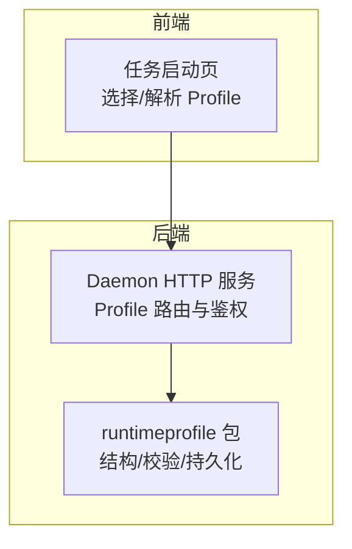
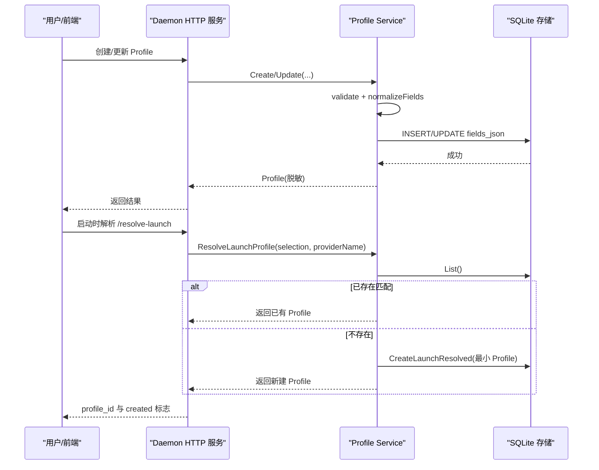
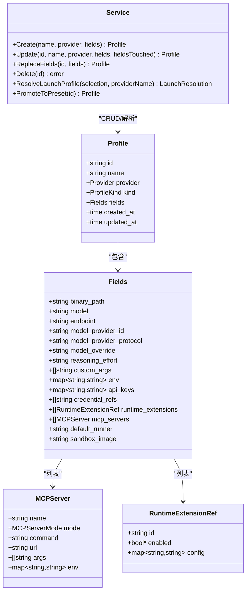
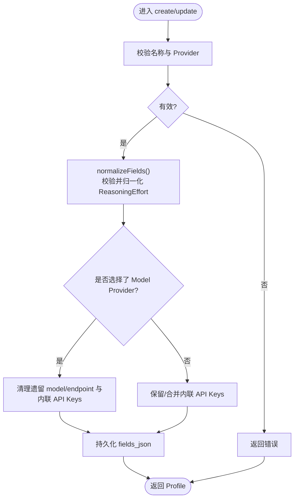
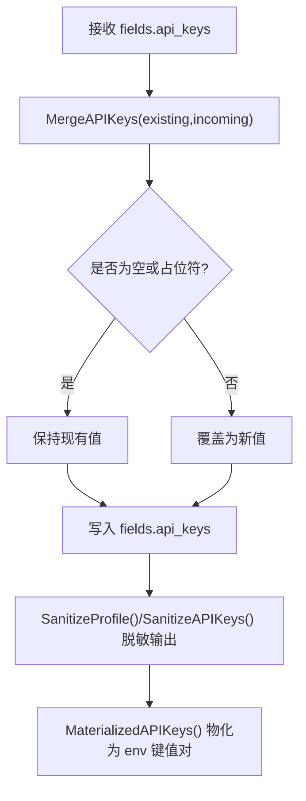
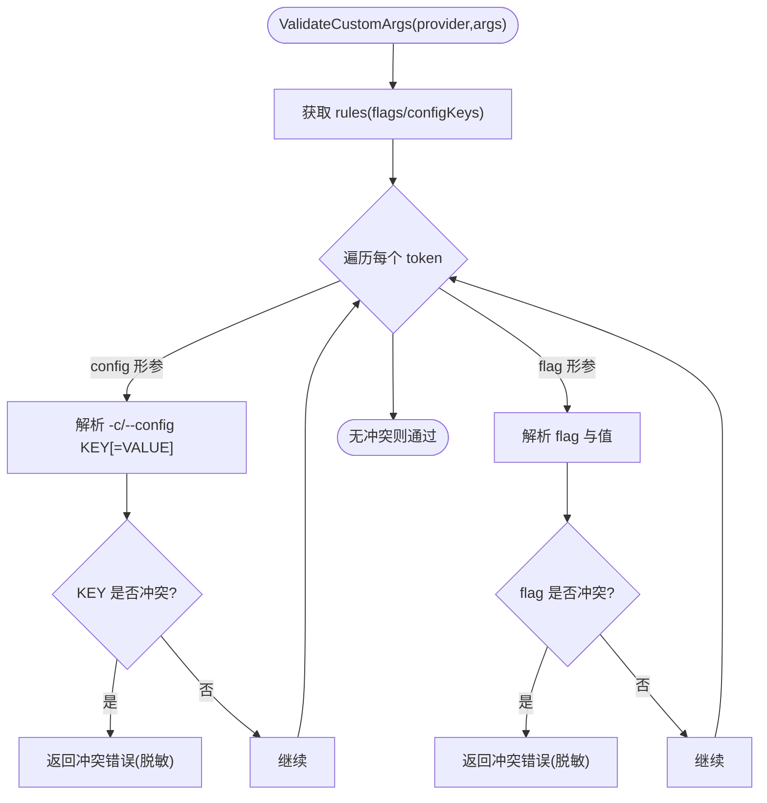
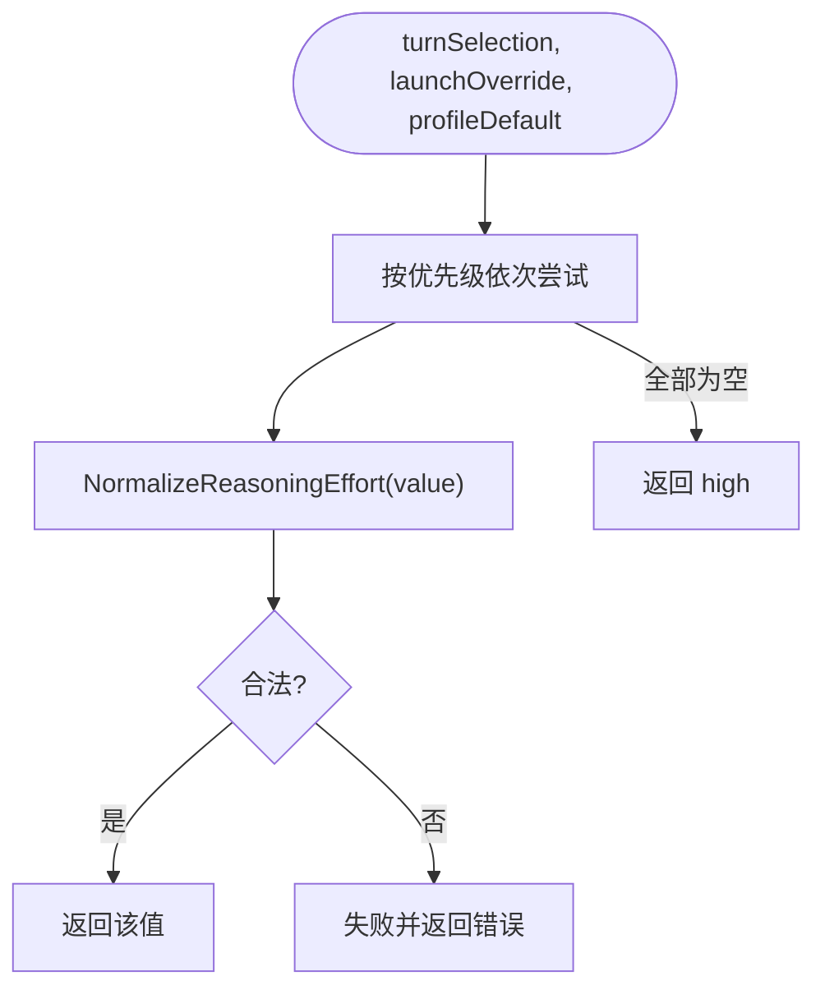
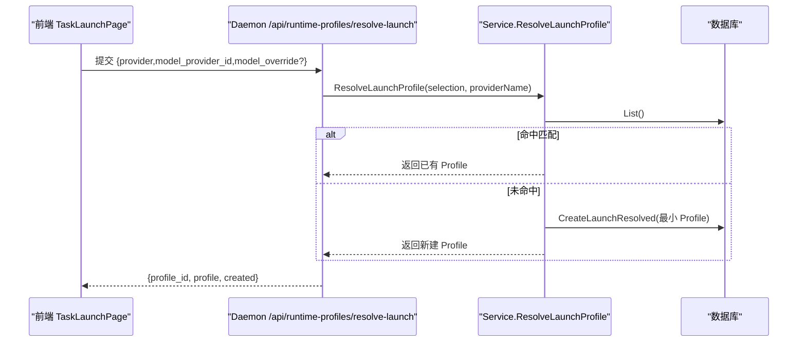
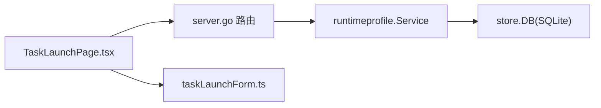

# Profile 配置管理

<cite>
**本文引用的文件**   
- [runtimeprofile.go](file://internal/runtimeprofile/runtimeprofile.go)
- [apikeys.go](file://internal/runtimeprofile/apikeys.go)
- [custom_args_conflict.go](file://internal/runtimeprofile/custom_args_conflict.go)
- [launch.go](file://internal/runtimeprofile/launch.go)
- [reasoning_effort.go](file://internal/runtimeprofile/reasoning_effort.go)
- [server.go](file://internal/daemon/server.go)
- [TaskLaunchPage.tsx](file://web/src/pages/TaskLaunchPage.tsx)
- [taskLaunchForm.ts](file://web/src/pages/taskLaunchForm.ts)
- [runtimeProfileKind.ts](file://web/src/pages/runtimeProfileKind.ts)
- [0002-separate-model-providers-from-runtime-profiles.md](file://docs/adr/0002-separate-model-providers-from-runtime-profiles.md)
- [implementation-plan.md](file://docs/product/implementation-plan.md)
</cite>

## 目录
1. [简介](#简介)
2. [项目结构](#项目结构)
3. [核心组件](#核心组件)
4. [架构总览](#架构总览)
5. [详细组件分析](#详细组件分析)
6. [依赖关系分析](#依赖关系分析)
7. [性能与扩展性](#性能与扩展性)
8. [故障排查指南](#故障排查指南)
9. [结论](#结论)
10. [附录](#附录)

## 简介
本文件系统性阐述运行时 Profile（运行配置）在系统中的定义、解析、验证与使用方式，覆盖以下关键主题：
- 运行时 Profile 的结构化字段、生成预览与持久化策略
- API 密钥管理与环境变量注入机制
- 自定义参数冲突检测规则与错误处理
- Profile 继承与默认值推导（推理强度等）
- 启动时自动解析与创建最小 Profile（Launch Resolution）
- 动态更新与热重载支持边界
- 配置迁移、版本兼容性与安全最佳实践

## 项目结构
Profile 相关能力集中在 internal/runtimeprofile 包中，并通过 Daemon HTTP 服务暴露接口；前端通过任务启动页触发“启动时解析”流程。

图表来源
- [runtimeprofile.go:1-120](file://internal/runtimeprofile/runtimeprofile.go#L1-L120)
- [server.go:863-992](file://internal/daemon/server.go#L863-L992)
- [TaskLaunchPage.tsx:206-234](file://web/src/pages/TaskLaunchPage.tsx#L206-L234)

章节来源
- [runtimeprofile.go:1-120](file://internal/runtimeprofile/runtimeprofile.go#L1-L120)
- [server.go:863-992](file://internal/daemon/server.go#L863-L992)
- [TaskLaunchPage.tsx:206-234](file://web/src/pages/TaskLaunchPage.tsx#L206-L234)

## 核心组件
- Profile 与 Fields：结构化字段为唯一事实源，包含模型、端点、Model Provider、推理强度、自定义参数、环境变量、API Keys、凭证引用、MCP 服务器、Runner 与沙箱镜像等。
- Service：提供 Create/Update/Delete/List/Get/PromoteToPreset/ReplaceFields 等能力，负责校验、归一化与持久化。
- Launch 解析：根据运行时、Model Provider ID 与可选 Model Override 匹配或创建最小 Profile。
- API Keys 工具：合并、脱敏、物化、存在性判断。
- 自定义参数冲突检测：拒绝与结构化字段冲突的 CLI 别名。
- 推理强度：标准化与优先级解析。

章节来源
- [runtimeprofile.go:71-126](file://internal/runtimeprofile/runtimeprofile.go#L71-L126)
- [runtimeprofile.go:128-172](file://internal/runtimeprofile/runtimeprofile.go#L128-L172)
- [launch.go:8-93](file://internal/runtimeprofile/launch.go#L8-L93)
- [apikeys.go:5-100](file://internal/runtimeprofile/apikeys.go#L5-L100)
- [custom_args_conflict.go:9-124](file://internal/runtimeprofile/custom_args_conflict.go#L9-L124)
- [reasoning_effort.go:8-64](file://internal/runtimeprofile/reasoning_effort.go#L8-L64)

## 架构总览
Profile 的生命周期包括：创建/编辑 → 校验与归一化 → 持久化 → 启动时解析 → 生成配置预览 → 运行时投影（由插件完成）。

图表来源
- [server.go:863-992](file://internal/daemon/server.go#L863-L992)
- [runtimeprofile.go:143-172](file://internal/runtimeprofile/runtimeprofile.go#L143-L172)
- [runtimeprofile.go:174-208](file://internal/runtimeprofile/runtimeprofile.go#L174-L208)
- [launch.go:70-93](file://internal/runtimeprofile/launch.go#L70-L93)

## 详细组件分析

### 数据结构与字段语义
- Provider：运行时家族（fake/codex/claude_code/pi），用于约束支持的 CLI 行为与冲突规则。
- MCPServer/MCPServerMode：声明式 MCP 服务器配置，区分可信与外部模式。
- RuntimeExtensionRef：启用/禁用与 per-profile 非敏感配置。
- Fields：结构化字段集合，作为生成配置的权威来源。
- Profile：全局可复用配置，含元数据与时间戳。

要点
- 结构化字段是“唯一事实源”，生成的配置预览仅用于展示与导入导出，不可直接编辑。
- 当选择 Model Provider 后，会清理遗留的 model/endpoint 与内联 API Keys，避免双真相。

章节来源
- [runtimeprofile.go:43-95](file://internal/runtimeprofile/runtimeprofile.go#L43-L95)
- [runtimeprofile.go:107-126](file://internal/runtimeprofile/runtimeprofile.go#L107-L126)
- [runtimeprofile.go:242-297](file://internal/runtimeprofile/runtimeprofile.go#L242-L297)

#### 类图（代码级）

图表来源
- [runtimeprofile.go:52-116](file://internal/runtimeprofile/runtimeprofile.go#L52-L116)
- [runtimeprofile.go:128-172](file://internal/runtimeprofile/runtimeprofile.go#L128-L172)

### 解析与验证规则
- 名称与 Provider 必填且受白名单约束。
- ReasoningEffort 为空时不重写存储，但解析时默认 high。
- Custom Args 会与结构化字段进行冲突检测，禁止重定义 model/model_provider/reasoning_effort。
- Update 支持部分字段保留（fieldsTouched=false）或全量替换（fieldsTouched=true）。

图表来源
- [runtimeprofile.go:435-467](file://internal/runtimeprofile/runtimeprofile.go#L435-L467)
- [runtimeprofile.go:242-297](file://internal/runtimeprofile/runtimeprofile.go#L242-L297)

章节来源
- [runtimeprofile.go:435-467](file://internal/runtimeprofile/runtimeprofile.go#L435-L467)
- [runtimeprofile.go:242-297](file://internal/runtimeprofile/runtimeprofile.go#L242-L297)

### API 密钥管理与环境变量注入
- 内联 API Keys：按 key→env var 映射存储，API 响应中统一脱敏为占位符。
- 合并策略：客户端发送空值或占位符表示“保持不变”，否则覆盖。
- 物化阶段：仅在运行时投影前将键值转换为环境变量名到值的映射。
- 默认环境变量名：不同 Provider 有各自的主变量名（如 Anthropic/OpenAI/Pi）。

图表来源
- [apikeys.go:48-94](file://internal/runtimeprofile/apikeys.go#L48-L94)
- [apikeys.go:22-46](file://internal/runtimeprofile/apikeys.go#L22-L46)

章节来源
- [apikeys.go:5-100](file://internal/runtimeprofile/apikeys.go#L5-L100)

### 自定义参数冲突检测
- 针对各 Provider 的已知 CLI 别名（如 --model/-m/--effort/--thinking/-c/--config 等）进行扫描。
- 若检测到与结构化字段冲突的别名，返回专用错误类型，包含原始 token 的安全脱敏形式。
- 输入数组不被修改、不剥离、不重排。

图表来源
- [custom_args_conflict.go:51-124](file://internal/runtimeprofile/custom_args_conflict.go#L51-L124)
- [custom_args_conflict.go:151-188](file://internal/runtimeprofile/custom_args_conflict.go#L151-L188)

章节来源
- [custom_args_conflict.go:9-124](file://internal/runtimeprofile/custom_args_conflict.go#L9-L124)

### 推理强度（Reasoning Effort）
- 允许值：low/medium/high/xhigh/max。
- 空值规范化为 high，但不重写存储。
- 解析优先级：当前 Turn 选择 > 启动覆盖 > Profile 默认 > high。

图表来源
- [reasoning_effort.go:31-64](file://internal/runtimeprofile/reasoning_effort.go#L31-L64)

章节来源
- [reasoning_effort.go:8-64](file://internal/runtimeprofile/reasoning_effort.go#L8-L64)

### 启动时解析与最小 Profile（Launch Resolution）
- 匹配条件：provider + model_provider_id + model_override（三者精确匹配）。
- 未找到时创建最小 Profile（kind=launch_resolve，default_runner=sandbox），并可被提升为用户预设。
- 前端在任务启动时调用 resolve-launch 接口，若无显式预设则自动解析。

图表来源
- [launch.go:70-93](file://internal/runtimeprofile/launch.go#L70-L93)
- [TaskLaunchPage.tsx:220-234](file://web/src/pages/TaskLaunchPage.tsx#L220-L234)

章节来源
- [launch.go:8-93](file://internal/runtimeprofile/launch.go#L8-L93)
- [TaskLaunchPage.tsx:206-234](file://web/src/pages/TaskLaunchPage.tsx#L206-L234)
- [taskLaunchForm.ts:59-79](file://web/src/pages/taskLaunchForm.ts#L59-L79)

### 动态配置更新与热重载
- 更新策略：
  - fieldsTouched=false：仅更新 name/provider，保留现有 structured fields；仍会校验 Custom Args。
  - fieldsTouched=true：以新 fields 覆盖（可能清空未传字段），并合并/清理内联 API Keys。
- 热重载边界：
  - Profile 变更不会回溯影响已启动任务的快照。
  - 任务内切换 Profile 会创建新的“运行时配置版本”，而非新任务。

章节来源
- [runtimeprofile.go:242-297](file://internal/runtimeprofile/runtimeprofile.go#L242-L297)
- [implementation-plan.md:146-153](file://docs/product/implementation-plan.md#L146-L153)

### 配置迁移与版本兼容性
- 从遗留 model-service 字段迁移至 Model Provider：
  - 迁移成功后清理 Profile 中的遗留字段与内联 API Keys。
  - 迁移过程需用户确认，预览不包含密钥值。
- 向后兼容：
  - 空 ReasoningEffort 不重写存储，解析时回退为 high。
  - 未知 Provider 明确报错，防止误用。

章节来源
- [runtimeprofile.go:242-297](file://internal/runtimeprofile/runtimeprofile.go#L242-L297)
- [0002-separate-model-providers-from-runtime-profiles.md:1-8](file://docs/adr/0002-separate-model-providers-from-runtime-profiles.md#L1-L8)

### 安全最佳实践
- 不在 Profile 中持久化明文密钥；API 响应一律脱敏。
- 优先使用 Model Provider 的环境变量注入路径，减少内联密钥。
- 严格拒绝与结构化字段冲突的自定义参数，避免绕过控制面。
- 对外暴露的配置预览不包含任何密钥值。

章节来源
- [apikeys.go:22-46](file://internal/runtimeprofile/apikeys.go#L22-L46)
- [custom_args_conflict.go:252-284](file://internal/runtimeprofile/custom_args_conflict.go#L252-L284)
- [runtimeprofile.go:348-433](file://internal/runtimeprofile/runtimeprofile.go#L348-L433)

## 依赖关系分析
- 前端依赖：
  - 任务启动页发起 resolve-launch 请求，依据返回的 profile_id 执行后续流程。
  - 表单工具函数构造解析载荷与显示逻辑。
- 后端依赖：
  - Daemon 路由层负责 JSON 编解码、错误映射与日志记录。
  - Profile Service 封装领域规则与 SQLite 访问。

图表来源
- [TaskLaunchPage.tsx:220-234](file://web/src/pages/TaskLaunchPage.tsx#L220-L234)
- [server.go:863-992](file://internal/daemon/server.go#L863-L992)
- [taskLaunchForm.ts:59-79](file://web/src/pages/taskLaunchForm.ts#L59-L79)

章节来源
- [TaskLaunchPage.tsx:206-234](file://web/src/pages/TaskLaunchPage.tsx#L206-L234)
- [server.go:863-992](file://internal/daemon/server.go#L863-L992)
- [taskLaunchForm.ts:59-79](file://web/src/pages/taskLaunchForm.ts#L59-L79)

## 性能与扩展性
- 解析与校验均为轻量操作，主要开销在数据库读写。
- 建议：
  - 批量列出 Profile 时使用分页（若数据量大）。
  - 对高频读取的 Profile 增加缓存层（注意失效策略）。
  - 自定义参数冲突检测基于固定规则表，复杂度与 args 长度线性相关，通常可忽略。

## 故障排查指南
- 常见错误与定位
  - 名称缺失/Provider 不支持：检查 Create/Update 入参与白名单。
  - 自定义参数冲突：查看错误中的 offending arg 与 flag，修正为使用结构化字段。
  - 推理强度非法：确保值为 low/medium/high/xhigh/max 之一。
  - 启动解析失败：确认 provider 与 model_provider_id 是否存在且匹配。
- 日志与脱敏
  - 冲突错误会自动脱敏敏感值，便于审计而不泄露密钥。
  - 更新失败时服务端会记录 provider 与相关 args 上下文。

章节来源
- [custom_args_conflict.go:31-49](file://internal/runtimeprofile/custom_args_conflict.go#L31-L49)
- [server.go:908-936](file://internal/daemon/server.go#L908-L936)

## 结论
Profile 配置管理以结构化字段为核心，结合严格的冲突检测与安全脱敏策略，实现了可复用、可演进且安全的运行时配置体系。通过启动时解析与最小 Profile 机制，既简化了日常使用，又保留了高级用户的精细控制能力。配合 Model Provider 分离与迁移路径，系统具备良好的长期兼容性与可维护性。

## 附录

### API 参考（概览）
- 获取 Profile：GET /api/runtime-profiles/{id}
- 更新 Profile：PUT /api/runtime-profiles/{id}
- 提升为预设：POST /api/runtime-profiles/{id}/promote
- 删除 Profile：DELETE /api/runtime-profiles/{id}
- 启动时解析：POST /api/runtime-profiles/resolve-launch

章节来源
- [server.go:863-992](file://internal/daemon/server.go#L863-L992)
- [TaskLaunchPage.tsx:220-234](file://web/src/pages/TaskLaunchPage.tsx#L220-L234)

### 前端辅助函数
- isManualRuntimeProfile/isLaunchResolvedProfile：用于区分手动预设与启动解析产生的 Profile。
- presetsForRuntime/presetMatchesRuntime：过滤与匹配预设。
- resolveLaunchPayload/launchRuntimeProfileId：构建解析载荷与最终使用的 Profile ID。

章节来源
- [runtimeProfileKind.ts:1-9](file://web/src/pages/runtimeProfileKind.ts#L1-L9)
- [taskLaunchForm.ts:88-141](file://web/src/pages/taskLaunchForm.ts#L88-L141)