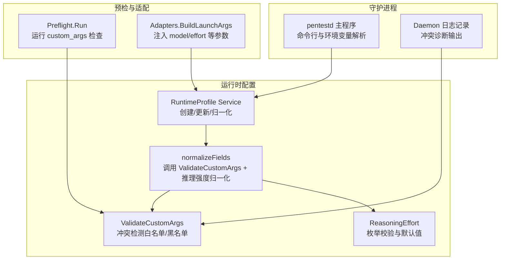
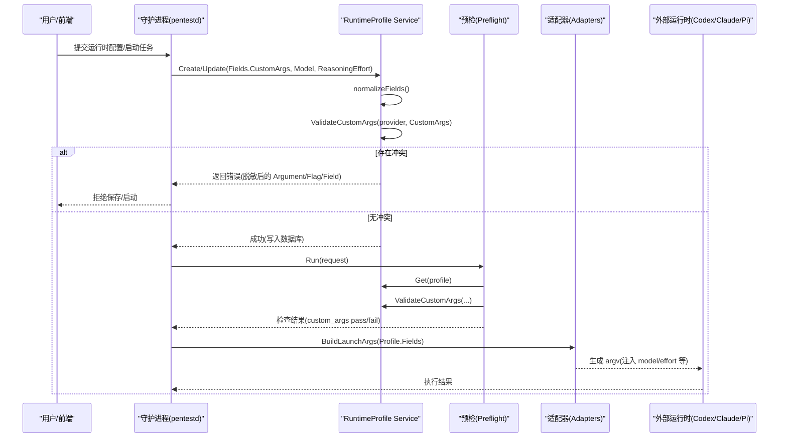
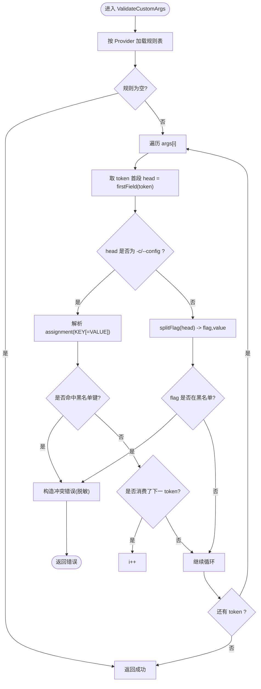
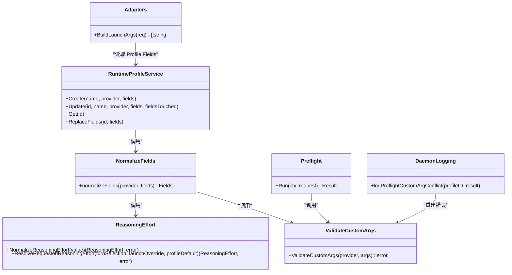

# 参数解析与冲突检测

<cite>
**本文引用的文件**
- [internal/runtimeprofile/custom_args_conflict.go](file://internal/runtimeprofile/custom_args_conflict.go)
- [internal/runtimeprofile/custom_args_conflict_test.go](file://internal/runtimeprofile/custom_args_conflict_test.go)
- [internal/runtimeprofile/runtimeprofile.go](file://internal/runtimeprofile/runtimeprofile.go)
- [internal/runtimeprofile/reasoning_effort.go](file://internal/runtimeprofile/reasoning_effort.go)
- [internal/preflight/preflight.go](file://internal/preflight/preflight.go)
- [internal/daemon/logging.go](file://internal/daemon/logging.go)
- [cmd/pentestd/main.go](file://cmd/pentestd/main.go)
- [internal/adapters/adapters.go](file://internal/adapters/adapters.go)
</cite>

## 目录
1. [引言](#引言)
2. [项目结构](#项目结构)
3. [核心组件](#核心组件)
4. [架构总览](#架构总览)
5. [详细组件分析](#详细组件分析)
6. [依赖关系分析](#依赖关系分析)
7. [性能考量](#性能考量)
8. [故障排查指南](#故障排查指南)
9. [结论](#结论)
10. [附录](#附录)

## 引言
本文件聚焦运行时参数的解析与冲突检测机制，覆盖命令行参数、环境变量、配置文件的多级优先级；说明参数类型转换、格式验证与语义检查；阐述冲突检测算法、告警机制与“不自动修复”策略；深入解析 ValidateCustomArgs 的冲突检测逻辑，解释如何防止自定义参数覆盖受保护的模型提供商设置、模型选择与推理强度控制，并说明 CustomArgs 的白名单与黑名单规则。

## 项目结构
围绕参数解析与冲突检测的关键代码集中在 runtimeprofile 包，并在 preflight 预检、daemon 日志记录以及适配器构建启动参数时联动使用。

图表来源
- [cmd/pentestd/main.go:22-43](file://cmd/pentestd/main.go#L22-L43)
- [internal/runtimeprofile/runtimeprofile.go:453-467](file://internal/runtimeprofile/runtimeprofile.go#L453-L467)
- [internal/runtimeprofile/custom_args_conflict.go:55-124](file://internal/runtimeprofile/custom_args_conflict.go#L55-L124)
- [internal/runtimeprofile/reasoning_effort.go:31-43](file://internal/runtimeprofile/reasoning_effort.go#L31-L43)
- [internal/preflight/preflight.go:131-162](file://internal/preflight/preflight.go#L131-L162)
- [internal/daemon/logging.go:174-207](file://internal/daemon/logging.go#L174-L207)
- [internal/adapters/adapters.go:154-185](file://internal/adapters/adapters.go#L154-L185)

章节来源
- [cmd/pentestd/main.go:22-43](file://cmd/pentestd/main.go#L22-L43)
- [internal/runtimeprofile/runtimeprofile.go:453-467](file://internal/runtimeprofile/runtimeprofile.go#L453-L467)
- [internal/runtimeprofile/custom_args_conflict.go:55-124](file://internal/runtimeprofile/custom_args_conflict.go#L55-L124)
- [internal/runtimeprofile/reasoning_effort.go:31-43](file://internal/runtimeprofile/reasoning_effort.go#L31-L43)
- [internal/preflight/preflight.go:131-162](file://internal/preflight/preflight.go#L131-L162)
- [internal/daemon/logging.go:174-207](file://internal/daemon/logging.go#L174-L207)
- [internal/adapters/adapters.go:154-185](file://internal/adapters/adapters.go#L154-L185)

## 核心组件
- 运行时 Profile 服务：负责创建、更新与持久化运行时配置，包含字段归一化与校验。
- 自定义参数冲突检测：ValidateCustomArgs 针对每个 Provider 的 CLI 别名进行黑名单拦截，确保结构化字段不被覆盖。
- 推理强度规范化：对 Reasoning Effort 做枚举校验与默认值处理。
- 预检流程：在任务启动前执行 custom_args 检查，失败则阻断。
- 守护进程日志：将冲突信息以脱敏形式输出，便于排障。
- 启动参数构建：适配器根据 Profile 的结构化字段生成最终 argv，避免被自定义参数覆盖。

章节来源
- [internal/runtimeprofile/runtimeprofile.go:245-297](file://internal/runtimeprofile/runtimeprofile.go#L245-L297)
- [internal/runtimeprofile/runtimeprofile.go:453-467](file://internal/runtimeprofile/runtimeprofile.go#L453-L467)
- [internal/runtimeprofile/reasoning_effort.go:31-43](file://internal/runtimeprofile/reasoning_effort.go#L31-L43)
- [internal/preflight/preflight.go:131-162](file://internal/preflight/preflight.go#L131-L162)
- [internal/daemon/logging.go:174-207](file://internal/daemon/logging.go#L174-L207)
- [internal/adapters/adapters.go:154-185](file://internal/adapters/adapters.go#L154-L185)

## 架构总览
下图展示从守护进程入口到运行时参数生成的关键路径，以及冲突检测在何处介入。

图表来源
- [cmd/pentestd/main.go:22-43](file://cmd/pentestd/main.go#L22-L43)
- [internal/runtimeprofile/runtimeprofile.go:245-297](file://internal/runtimeprofile/runtimeprofile.go#L245-L297)
- [internal/runtimeprofile/runtimeprofile.go:453-467](file://internal/runtimeprofile/runtimeprofile.go#L453-L467)
- [internal/preflight/preflight.go:131-162](file://internal/preflight/preflight.go#L131-L162)
- [internal/adapters/adapters.go:154-185](file://internal/adapters/adapters.go#L154-L185)

## 详细组件分析

### 自定义参数冲突检测（ValidateCustomArgs）
- 目标：阻止通过自定义参数覆盖受保护的结构化字段（模型、模型提供商、推理强度）。
- 输入：Provider 名称与一组 argv 风格的自定义参数。
- 行为：
  - 按 Provider 加载规则表（白名单允许的非冲突项由规则表之外的其他标志自然放行）。
  - 识别两类危险形式：
    - 直接 flag 覆盖：如 --model、--effort、--thinking、--provider。
    - Codex 配置键覆盖：-c/--config KEY[=VALUE] 中的 model、model_provider、model_reasoning_effort。
  - 发现冲突即返回结构化错误，包含脱敏后的完整参数形式、具体 Flag/Key 与对应结构化字段名。
  - 不修改、不重排、不剥离原始参数切片。
- 安全：对疑似密钥的值进行脱敏，避免在错误消息中泄露敏感信息。

图表来源
- [internal/runtimeprofile/custom_args_conflict.go:55-124](file://internal/runtimeprofile/custom_args_conflict.go#L55-L124)
- [internal/runtimeprofile/custom_args_conflict.go:126-132](file://internal/runtimeprofile/custom_args_conflict.go#L126-L132)
- [internal/runtimeprofile/custom_args_conflict.go:139-145](file://internal/runtimeprofile/custom_args_conflict.go#L139-L145)
- [internal/runtimeprofile/custom_args_conflict.go:190-201](file://internal/runtimeprofile/custom_args_conflict.go#L190-L201)
- [internal/runtimeprofile/custom_args_conflict.go:203-222](file://internal/runtimeprofile/custom_args_conflict.go#L203-L222)
- [internal/runtimeprofile/custom_args_conflict.go:226-235](file://internal/runtimeprofile/custom_args_conflict.go#L226-L235)
- [internal/runtimeprofile/custom_args_conflict.go:239-250](file://internal/runtimeprofile/custom_args_conflict.go#L239-L250)
- [internal/runtimeprofile/custom_args_conflict.go:255-284](file://internal/runtimeprofile/custom_args_conflict.go#L255-L284)

章节来源
- [internal/runtimeprofile/custom_args_conflict.go:55-124](file://internal/runtimeprofile/custom_args_conflict.go#L55-L124)
- [internal/runtimeprofile/custom_args_conflict.go:126-132](file://internal/runtimeprofile/custom_args_conflict.go#L126-L132)
- [internal/runtimeprofile/custom_args_conflict.go:139-145](file://internal/runtimeprofile/custom_args_conflict.go#L139-L145)
- [internal/runtimeprofile/custom_args_conflict.go:151-188](file://internal/runtimeprofile/custom_args_conflict.go#L151-L188)
- [internal/runtimeprofile/custom_args_conflict.go:190-201](file://internal/runtimeprofile/custom_args_conflict.go#L190-L201)
- [internal/runtimeprofile/custom_args_conflict.go:203-222](file://internal/runtimeprofile/custom_args_conflict.go#L203-L222)
- [internal/runtimeprofile/custom_args_conflict.go:226-235](file://internal/runtimeprofile/custom_args_conflict.go#L226-L235)
- [internal/runtimeprofile/custom_args_conflict.go:239-250](file://internal/runtimeprofile/custom_args_conflict.go#L239-L250)
- [internal/runtimeprofile/custom_args_conflict.go:255-284](file://internal/runtimeprofile/custom_args_conflict.go#L255-L284)

### 白名单与黑名单规则
- 黑名单（禁止覆盖的结构化字段）：
  - 模型：model
  - 模型提供商：model_provider
  - 推理强度：reasoning_effort
- 各 Provider 的具体拦截点（仅列出会触发冲突的别名）：
  - Codex：
    - 直接 flag：--model、-m
    - 配置键：model、model_provider、model_reasoning_effort（通过 -c/--config）
  - Claude Code：
    - 直接 flag：--model、--effort
  - Pi：
    - 直接 flag：--provider、--model、--thinking
- 白名单（允许保留的其他自定义参数）：
  - 不在上述黑名单内的任意非冲突标志或配置键均被允许，例如 Codex 的 --strict、--json、--dangerously-bypass-approvals-and-sandbox，Claude Code 的 --output-format stream-json、--verbose、--permission-mode 等，Pi 的 --mode、--session 等。
  - 注意：白名单并非显式列表，而是“未命中黑名单即放行”。

章节来源
- [internal/runtimeprofile/custom_args_conflict.go:151-188](file://internal/runtimeprofile/custom_args_conflict.go#L151-L188)
- [internal/runtimeprofile/custom_args_conflict_test.go:111-136](file://internal/runtimeprofile/custom_args_conflict_test.go#L111-L136)

### 推理强度（Reasoning Effort）类型转换与默认值
- 允许值：low、medium、high、xhigh、max。
- 空值归一化为 high，且不重写存储。
- 解析优先级（用于请求级别）：当前轮次选择 > 启动覆盖 > 运行时 Profile 默认 > high。

章节来源
- [internal/runtimeprofile/reasoning_effort.go:31-43](file://internal/runtimeprofile/reasoning_effort.go#L31-L43)
- [internal/runtimeprofile/reasoning_effort.go:45-63](file://internal/runtimeprofile/reasoning_effort.go#L45-L63)

### 多级优先级与来源
- 守护进程命令行参数与环境变量：
  - 监听地址、数据库路径、运行时根目录、制品根目录、沙箱镜像、容器 CLI、插件与扩展目录、鉴权令牌等。
  - 解析顺序：命令行优先，若未提供则回退至环境变量，再回退至内置默认值。
- 运行时 Profile 字段：
  - 结构化字段（Model、Endpoint、ModelProviderID、ReasoningEffort、CustomArgs 等）作为权威来源。
  - 创建/更新时进行归一化与校验（包括 ValidateCustomArgs 与 ReasoningEffort 规范化）。
- 预检阶段：
  - 再次执行 ValidateCustomArgs，确保存储的配置在启动前不会因冲突而失败。
- 启动参数构建：
  - 适配器基于 Profile 的结构化字段注入 model、endpoint、MCP 配置等，确保运行时实际使用的值来自受控字段而非自定义参数。

章节来源
- [cmd/pentestd/main.go:22-43](file://cmd/pentestd/main.go#L22-L43)
- [internal/runtimeprofile/runtimeprofile.go:245-297](file://internal/runtimeprofile/runtimeprofile.go#L245-L297)
- [internal/runtimeprofile/runtimeprofile.go:453-467](file://internal/runtimeprofile/runtimeprofile.go#L453-L467)
- [internal/preflight/preflight.go:131-162](file://internal/preflight/preflight.go#L131-L162)
- [internal/adapters/adapters.go:154-185](file://internal/adapters/adapters.go#L154-L185)

### 冲突检测算法与错误处理
- 算法要点：
  - 逐 token 扫描，支持单 token 内组合赋值（--flag=value）与双 token 形式（--flag value）。
  - 对 Codex 的 -c/--config 特殊处理，支持三种形态：
    - 单 token 组合：--config=key=value 或 -c=key=value
    - 单 token 含空格："-c key=value"
    - 双 token：-c 后跟 "key=value"
  - 匹配到黑名单键或 flag 立即返回错误，不继续后续 token。
- 错误对象：
  - 包含 Provider、Argument（完整且脱敏）、Flag/Key、Field（映射到的结构化字段）、原始 CustomArgs（只读）。
- 日志与告警：
  - 预检失败时，Daemon 会尝试重建类型化错误以便输出更清晰的诊断信息，并以脱敏方式记录。

章节来源
- [internal/runtimeprofile/custom_args_conflict.go:55-124](file://internal/runtimeprofile/custom_args_conflict.go#L55-L124)
- [internal/runtimeprofile/custom_args_conflict.go:23-29](file://internal/runtimeprofile/custom_args_conflict.go#L23-L29)
- [internal/daemon/logging.go:174-207](file://internal/daemon/logging.go#L174-L207)

### 自动修复策略
- 设计原则：Fail-closed，不进行任何自动修复、剥离或重排。
- 影响范围：
  - 创建/更新 Profile 时若检测到冲突，直接拒绝并持久化失败。
  - 预检阶段若检测到冲突，阻断任务启动。
  - 适配器在构建 argv 时始终采用结构化字段，避免被自定义参数覆盖。

章节来源
- [internal/runtimeprofile/custom_args_conflict.go:16-18](file://internal/runtimeprofile/custom_args_conflict.go#L16-18)
- [internal/runtimeprofile/runtimeprofile.go:245-297](file://internal/runtimeprofile/runtimeprofile.go#L245-L297)
- [internal/preflight/preflight.go:131-162](file://internal/preflight/preflight.go#L131-L162)
- [internal/adapters/adapters.go:154-185](file://internal/adapters/adapters.go#L154-L185)

## 依赖关系分析

图表来源
- [internal/runtimeprofile/runtimeprofile.go:245-297](file://internal/runtimeprofile/runtimeprofile.go#L245-L297)
- [internal/runtimeprofile/runtimeprofile.go:453-467](file://internal/runtimeprofile/runtimeprofile.go#L453-L467)
- [internal/runtimeprofile/custom_args_conflict.go:55-124](file://internal/runtimeprofile/custom_args_conflict.go#L55-L124)
- [internal/runtimeprofile/reasoning_effort.go:31-43](file://internal/runtimeprofile/reasoning_effort.go#L31-L43)
- [internal/preflight/preflight.go:131-162](file://internal/preflight/preflight.go#L131-L162)
- [internal/daemon/logging.go:174-207](file://internal/daemon/logging.go#L174-L207)
- [internal/adapters/adapters.go:154-185](file://internal/adapters/adapters.go#L154-L185)

章节来源
- [internal/runtimeprofile/runtimeprofile.go:245-297](file://internal/runtimeprofile/runtimeprofile.go#L245-L297)
- [internal/runtimeprofile/runtimeprofile.go:453-467](file://internal/runtimeprofile/runtimeprofile.go#L453-L467)
- [internal/runtimeprofile/custom_args_conflict.go:55-124](file://internal/runtimeprofile/custom_args_conflict.go#L55-L124)
- [internal/runtimeprofile/reasoning_effort.go:31-43](file://internal/runtimeprofile/reasoning_effort.go#L31-L43)
- [internal/preflight/preflight.go:131-162](file://internal/preflight/preflight.go#L131-L162)
- [internal/daemon/logging.go:174-207](file://internal/daemon/logging.go#L174-L207)
- [internal/adapters/adapters.go:154-185](file://internal/adapters/adapters.go#L154-L185)

## 性能考量
- ValidateCustomArgs 为线性扫描，时间复杂度 O(n)，n 为自定义参数数量，开销极小。
- 字符串操作均为轻量级分割与索引查找，内存分配可控。
- 建议：保持 CustomArgs 精简，避免过长 token 与过多无关参数，以减少解析与日志体积。

## 故障排查指南
- 常见错误现象：
  - 创建/更新运行时 Profile 时报错，提示自定义参数覆盖了结构化字段。
  - 预检阶段 custom_args 检查失败，任务无法启动。
- 定位步骤：
  - 查看预检结果中的 custom_args 检查详情。
  - 参考错误消息中的 Argument、Flag、Field，确认具体冲突的参数与受保护字段。
  - 检查是否存在以下形式的覆盖：
    - Codex：--model/-m 或 -c/--config 中的 model、model_provider、model_reasoning_effort。
    - Claude Code：--model、--effort。
    - Pi：--provider、--model、--thinking。
- 修复建议：
  - 将模型、提供商、推理强度调整到 Profile 的结构化字段中。
  - 移除或替换冲突的自定义参数。
  - 如需调试，可先清空 CustomArgs 逐步恢复，确认问题来源。

章节来源
- [internal/preflight/preflight.go:131-162](file://internal/preflight/preflight.go#L131-L162)
- [internal/daemon/logging.go:174-207](file://internal/daemon/logging.go#L174-L207)
- [internal/runtimeprofile/custom_args_conflict.go:55-124](file://internal/runtimeprofile/custom_args_conflict.go#L55-L124)

## 结论
本项目通过“结构化字段权威 + 自定义参数黑名单拦截”的策略，确保模型、提供商与推理强度等关键控制不会被自定义参数覆盖。ValidateCustomArgs 实现简洁高效、错误信息清晰且具备脱敏能力；预检与持久化路径双重拦截，配合适配器在启动时注入受控参数，形成闭环保障。整体设计遵循 fail-closed 原则，不自动修复，保证系统一致性与安全性。

## 附录
- 术语说明：
  - 结构化字段：Profile 中明确定义的字段（如 model、model_provider、reasoning_effort），作为权威来源。
  - 自定义参数：用户提供的额外 CLI 风格参数，保存在 CustomArgs 中。
  - 预检：在任务启动前进行的配置与依赖检查。
- 相关测试用例路径（便于复现与理解）：
  - 冲突检测与脱敏：[internal/runtimeprofile/custom_args_conflict_test.go:11-86](file://internal/runtimeprofile/custom_args_conflict_test.go#L11-L86)、[internal/runtimeprofile/custom_args_conflict_test.go:88-107](file://internal/runtimeprofile/custom_args_conflict_test.go#L88-L107)
  - 非冲突参数放行：[internal/runtimeprofile/custom_args_conflict_test.go:109-136](file://internal/runtimeprofile/custom_args_conflict_test.go#L109-L136)
  - 不修改输入参数：[internal/runtimeprofile/custom_args_conflict_test.go:138-149](file://internal/runtimeprofile/custom_args_conflict_test.go#L138-L149)
  - 创建/更新拒绝冲突：[internal/runtimeprofile/custom_args_conflict_test.go:151-243](file://internal/runtimeprofile/custom_args_conflict_test.go#L151-L243)