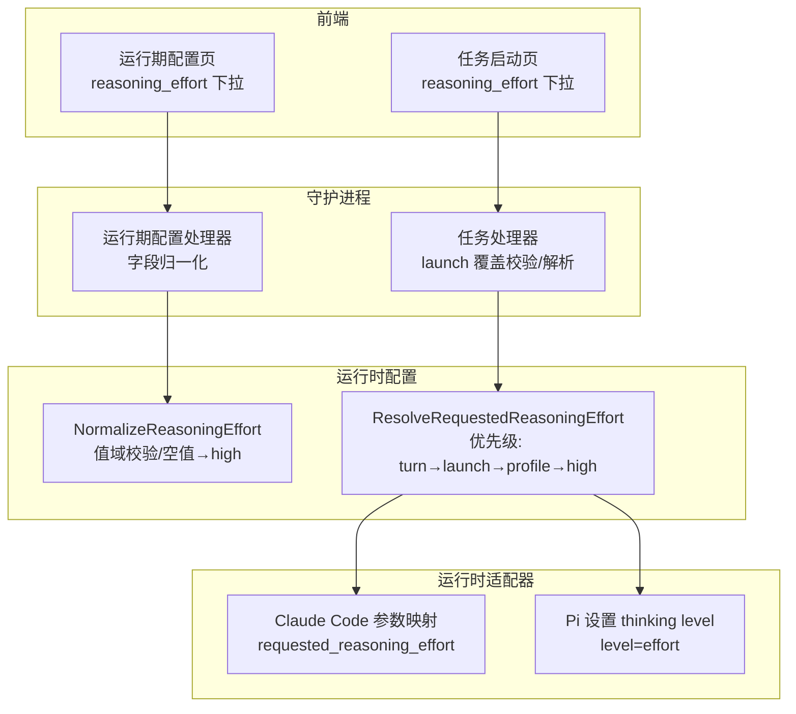
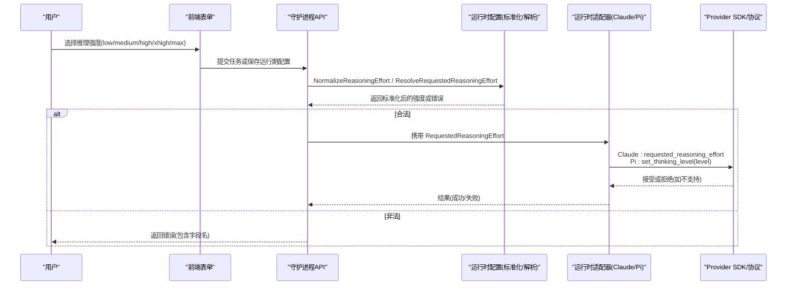
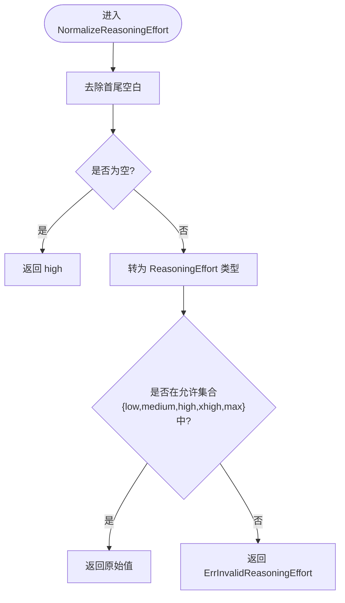
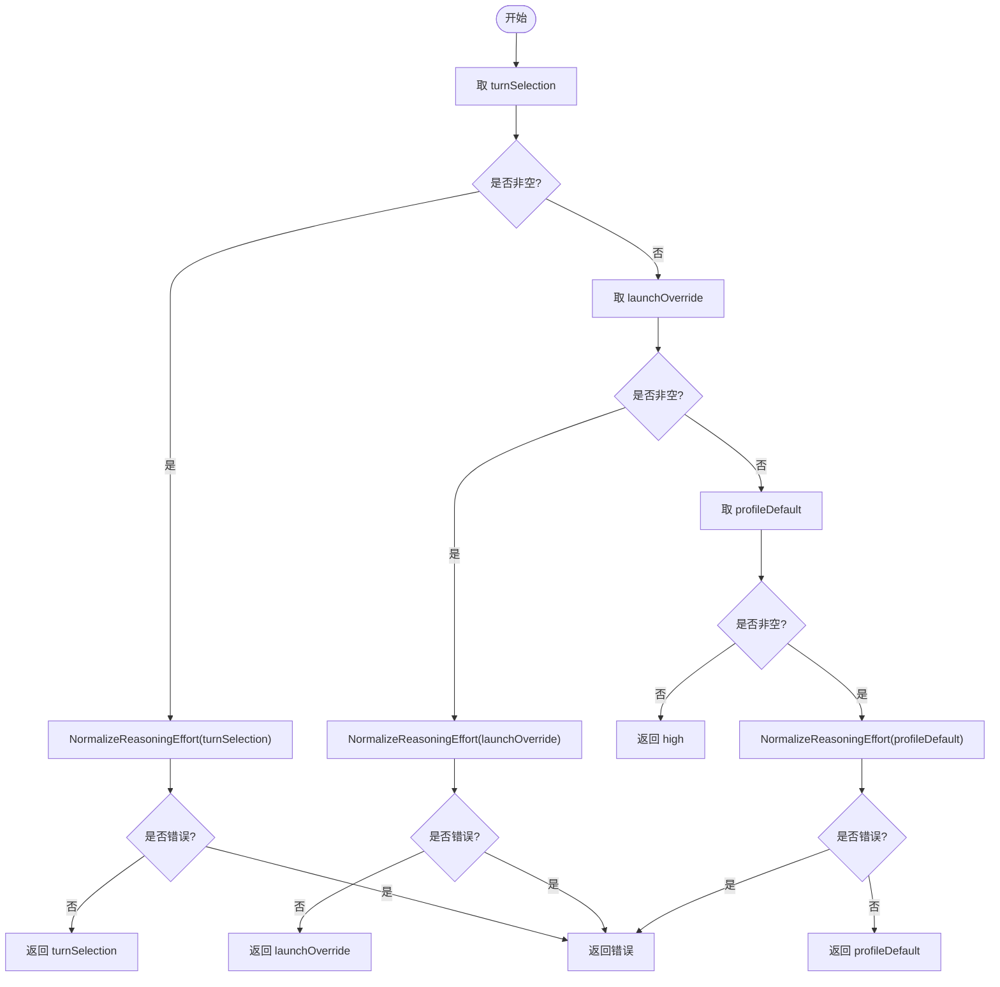
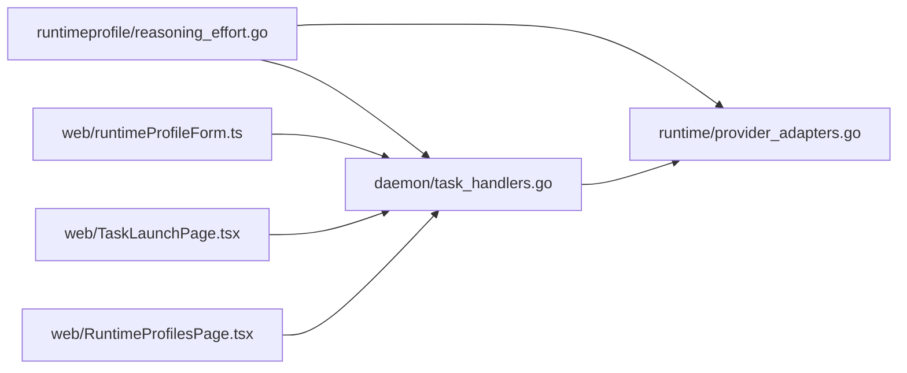

# 推理强度配置

<cite>
**本文引用的文件**   
- [internal/runtimeprofile/reasoning_effort.go](file://internal/runtimeprofile/reasoning_effort.go)
- [internal/runtimeprofile/reasoning_effort_test.go](file://internal/runtimeprofile/reasoning_effort_test.go)
- [internal/daemon/task_handlers.go](file://internal/daemon/task_handlers.go)
- [internal/daemon/reasoning_effort_test.go](file://internal/daemon/reasoning_effort_test.go)
- [internal/runtime/provider_adapters.go](file://internal/runtime/provider_adapters.go)
- [web/src/pages/runtimeProfileForm.ts](file://web/src/pages/runtimeProfileForm.ts)
- [web/src/pages/TaskLaunchPage.tsx](file://web/src/pages/TaskLaunchPage.tsx)
- [web/src/pages/RuntimeProfilesPage.tsx](file://web/src/pages/RuntimeProfilesPage.tsx)
- [CONTEXT.md](file://CONTEXT.md)
</cite>

## 目录
1. [简介](#简介)
2. [项目结构](#项目结构)
3. [核心组件](#核心组件)
4. [架构总览](#架构总览)
5. [详细组件分析](#详细组件分析)
6. [依赖关系分析](#依赖关系分析)
7. [性能考量](#性能考量)
8. [故障排查指南](#故障排查指南)
9. [结论](#结论)
10. [附录](#附录)

## 简介
本文件系统性说明“推理强度（Reasoning Effort）”的配置机制，包括：
- 强度级别与含义、对任务执行时间与资源消耗的影响
- NormalizeReasoningEffort 的标准化逻辑与值域校验
- 在不同 Provider（Codex、Claude Code、Pi）间的映射与兼容性处理
- 请求解析优先级与默认值策略
- 最佳实践与性能调优建议

## 项目结构
推理强度相关代码分布在以下模块：
- 运行时配置层：定义枚举、标准化与解析函数
- 守护进程层：HTTP 接口校验、任务启动时的覆盖与解析
- 运行时适配器层：将请求中的推理强度透传到各 Provider
- Web 前端：表单展示与选择项约束

图表来源
- [internal/runtimeprofile/reasoning_effort.go:31-63](file://internal/runtimeprofile/reasoning_effort.go#L31-L63)
- [internal/daemon/task_handlers.go:3038-3102](file://internal/daemon/task_handlers.go#L3038-L3102)
- [internal/runtime/provider_adapters.go:787-803](file://internal/runtime/provider_adapters.go#L787-L803)
- [web/src/pages/TaskLaunchPage.tsx:396-414](file://web/src/pages/TaskLaunchPage.tsx#L396-L414)
- [web/src/pages/RuntimeProfilesPage.tsx:940-951](file://web/src/pages/RuntimeProfilesPage.tsx#L940-L951)

章节来源
- [internal/runtimeprofile/reasoning_effort.go:1-63](file://internal/runtimeprofile/reasoning_effort.go#L1-L63)
- [internal/daemon/task_handlers.go:3038-3102](file://internal/daemon/task_handlers.go#L3038-L3102)
- [internal/runtime/provider_adapters.go:787-803](file://internal/runtime/provider_adapters.go#L787-L803)
- [web/src/pages/runtimeProfileForm.ts:5-19](file://web/src/pages/runtimeProfileForm.ts#L5-L19)
- [web/src/pages/TaskLaunchPage.tsx:396-414](file://web/src/pages/TaskLaunchPage.tsx#L396-L414)
- [web/src/pages/RuntimeProfilesPage.tsx:940-951](file://web/src/pages/RuntimeProfilesPage.tsx#L940-L951)

## 核心组件
- 推理强度类型与常量：low、medium、high、xhigh、max
- 标准化函数 NormalizeReasoningEffort：空值→high；非法值报错
- 请求解析函数 ResolveRequestedReasoningEffort：turn selection → launch override → profile default → high
- 守护进程校验与覆盖：任务启动时支持推理强度覆盖，拒绝非法值
- 运行时适配器透传：Claude Code 使用 requested_reasoning_effort；Pi 使用 set_thinking_level(level)

章节来源
- [internal/runtimeprofile/reasoning_effort.go:12-43](file://internal/runtimeprofile/reasoning_effort.go#L12-L43)
- [internal/runtimeprofile/reasoning_effort.go:45-63](file://internal/runtimeprofile/reasoning_effort.go#L45-L63)
- [internal/daemon/task_handlers.go:1059-1069](file://internal/daemon/task_handlers.go#L1059-L1069)
- [internal/runtime/provider_adapters.go:787-803](file://internal/runtime/provider_adapters.go#L787-L803)
- [internal/runtime/provider_adapters.go:829-885](file://internal/runtime/provider_adapters.go#L829-L885)

## 架构总览
推理强度从用户界面到最终生效于模型侧的调用链如下：

图表来源
- [internal/runtimeprofile/reasoning_effort.go:31-63](file://internal/runtimeprofile/reasoning_effort.go#L31-L63)
- [internal/daemon/task_handlers.go:3038-3102](file://internal/daemon/task_handlers.go#L3038-L3102)
- [internal/runtime/provider_adapters.go:787-803](file://internal/runtime/provider_adapters.go#L787-L803)
- [internal/runtime/provider_adapters.go:829-885](file://internal/runtime/provider_adapters.go#L829-L885)

## 详细组件分析

### 标准化与值域验证：NormalizeReasoningEffort
- 输入为空或仅空白时，返回 high（不修改存储）
- 输入为五值之一时原样返回
- 其他任何值均返回错误，错误类型统一为 ErrInvalidReasoningEffort

图表来源
- [internal/runtimeprofile/reasoning_effort.go:31-43](file://internal/runtimeprofile/reasoning_effort.go#L31-L43)

章节来源
- [internal/runtimeprofile/reasoning_effort.go:20-43](file://internal/runtimeprofile/reasoning_effort.go#L20-L43)
- [internal/runtimeprofile/reasoning_effort_test.go:10-47](file://internal/runtimeprofile/reasoning_effort_test.go#L10-L47)

### 请求解析优先级：ResolveRequestedReasoningEffort
- 优先级顺序：当前 Turn 选择 > 启动覆盖 > 运行期配置默认 > high
- 遇到非空但非法值立即失败，不会回退到低优先级候选

图表来源
- [internal/runtimeprofile/reasoning_effort.go:45-63](file://internal/runtimeprofile/reasoning_effort.go#L45-L63)

章节来源
- [internal/runtimeprofile/reasoning_effort.go:45-63](file://internal/runtimeprofile/reasoning_effort.go#L45-L63)
- [internal/runtimeprofile/reasoning_effort_test.go:49-88](file://internal/runtimeprofile/reasoning_effort_test.go#L49-L88)

### 守护进程层：任务启动覆盖与校验
- 任务启动时可传入 reasoning_effort 覆盖；若非法则返回 400 并保留原 Profile 不变
- 缺失存储的推理强度在首次请求时解析为 high，但不改写持久化数据
- 历史对话/转向事件读取时，也会进行标准化并用于幂等冲突判断

章节来源
- [internal/daemon/task_handlers.go:1059-1069](file://internal/daemon/task_handlers.go#L1059-L1069)
- [internal/daemon/reasoning_effort_test.go:90-119](file://internal/daemon/reasoning_effort_test.go#L90-L119)
- [internal/daemon/reasoning_effort_test.go:121-161](file://internal/daemon/reasoning_effort_test.go#L121-L161)
- [internal/daemon/task_handlers.go:3038-3102](file://internal/daemon/task_handlers.go#L3038-L3102)

### 运行时适配器：Provider 间映射与兼容性
- Claude Code：通过 requested_reasoning_effort 字段传递
- Pi：通过 set_model 后 set_thinking_level(level) 下发，词汇表 1:1 透传，不支持的值由 Provider 拒绝
- Codex：同样遵循结构化字段权威原则，具体透传细节由适配器实现

章节来源
- [internal/runtime/provider_adapters.go:787-803](file://internal/runtime/provider_adapters.go#L787-L803)
- [internal/runtime/provider_adapters.go:829-885](file://internal/runtime/provider_adapters.go#L829-L885)

### 前端交互：值域与显示
- 前端提供 exactly five 个选项：low、medium、high、xhigh、max
- 当存储为空时，显示 high 作为默认，但不立即写入存储，直到用户显式保存

章节来源
- [web/src/pages/runtimeProfileForm.ts:5-19](file://web/src/pages/runtimeProfileForm.ts#L5-L19)
- [web/src/pages/TaskLaunchPage.tsx:396-414](file://web/src/pages/TaskLaunchPage.tsx#L396-L414)
- [web/src/pages/RuntimeProfilesPage.tsx:940-951](file://web/src/pages/RuntimeProfilesPage.tsx#L940-L951)

## 依赖关系分析
- 标准化与解析位于运行时配置包，被守护进程和前端共享语义
- 守护进程负责 HTTP 边界校验与覆盖合并
- 运行时适配器负责将标准化后的强度映射到 Provider 协议

图表来源
- [internal/runtimeprofile/reasoning_effort.go:1-63](file://internal/runtimeprofile/reasoning_effort.go#L1-L63)
- [internal/daemon/task_handlers.go:3038-3102](file://internal/daemon/task_handlers.go#L3038-L3102)
- [internal/runtime/provider_adapters.go:787-803](file://internal/runtime/provider_adapters.go#L787-L803)
- [web/src/pages/runtimeProfileForm.ts:5-19](file://web/src/pages/runtimeProfileForm.ts#L5-L19)
- [web/src/pages/TaskLaunchPage.tsx:396-414](file://web/src/pages/TaskLaunchPage.tsx#L396-L414)
- [web/src/pages/RuntimeProfilesPage.tsx:940-951](file://web/src/pages/RuntimeProfilesPage.tsx#L940-L951)

## 性能考量
- 推理强度越高，通常意味着更长的思考时间与更高的计算资源消耗。低强度适合快速探索与大量迭代，高强度适合复杂推理与关键决策。
- 系统不对模型能力做预检，直接透传请求；若 Provider 拒绝或不支持，将导致该 Turn 失败。因此应避免在不支持的模型上盲目使用最高强度。
- 每次 Runtime Turn 都会显式发送推理强度，避免继承状态带来的不确定性，有助于可观测性与稳定性，但也带来少量额外开销。

[本节为通用指导，无需特定文件引用]

## 故障排查指南
- 创建/更新运行期配置时报错“reasoning effort must be one of ...”：检查 fields.reasoning_effort 是否为五值之一
- 任务启动时报错且未改变 Profile：确认 reasoning_effort 覆盖值是否非法
- 某 Turn 失败且提示不支持的推理强度：检查所选模型是否支持该强度；降低强度重试
- 历史对话恢复时出现幂等冲突：确认 provider/model/effort 三者是否与先前一致

章节来源
- [internal/daemon/reasoning_effort_test.go:71-88](file://internal/daemon/reasoning_effort_test.go#L71-L88)
- [internal/daemon/reasoning_effort_test.go:121-161](file://internal/daemon/reasoning_effort_test.go#L121-L161)
- [internal/daemon/task_handlers.go:3079-3102](file://internal/daemon/task_handlers.go#L3079-L3102)

## 结论
推理强度以严格五值集与明确的解析优先级保障一致性；守护进程在前端与运行时之间承担校验与覆盖职责；各 Provider 适配器按自身协议透传强度。建议在常规任务中使用 medium/high，仅在必要时提升为 xhigh/max，并结合模型能力与成本进行权衡。

[本节为总结性内容，无需特定文件引用]

## 附录

### 强度级别与影响概览
- low：最短响应时间，最低资源消耗，适合快速试错与大规模扫描
- medium：平衡型，兼顾速度与质量，推荐日常使用
- high：默认值，适用于大多数安全分析与报告生成
- xhigh：更高深度推理，耗时与成本显著增加，用于复杂场景
- max：最强推理，最慢且最昂贵，谨慎使用

[本节为概念性说明，无需特定文件引用]

### 术语对照
- Requested Reasoning Effort：CyberPenda 向 Runtime 请求的推理强度
- Effective Reasoning Effort：Runtime 实际应用的推理强度（若上报）

章节来源
- [CONTEXT.md:239-245](file://CONTEXT.md#L239-L245)