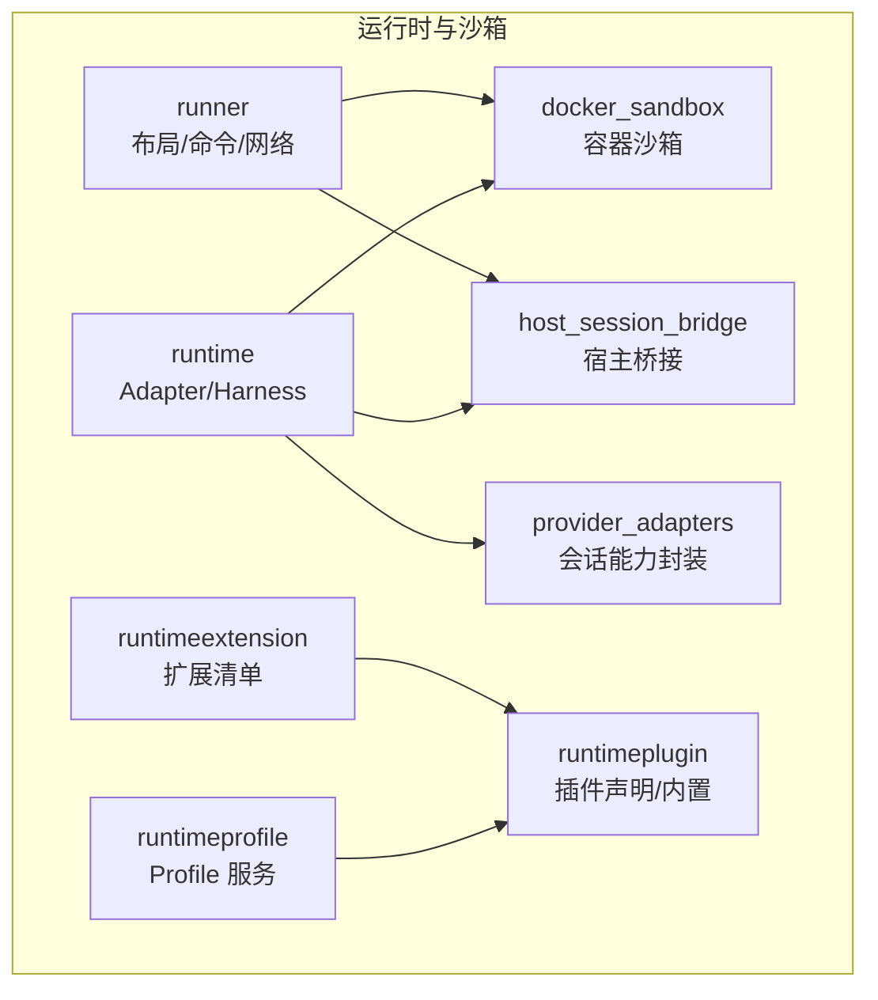
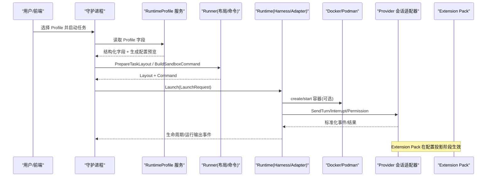
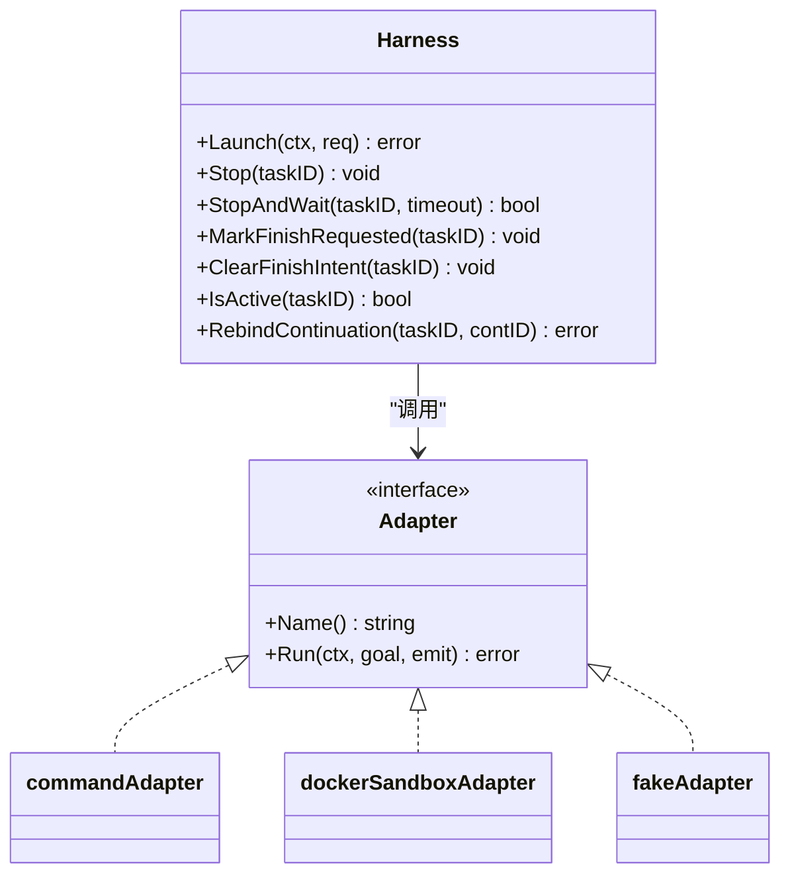
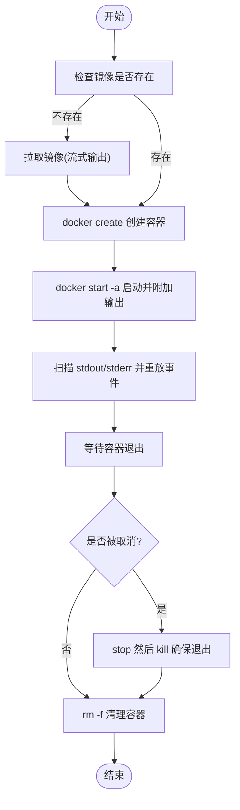
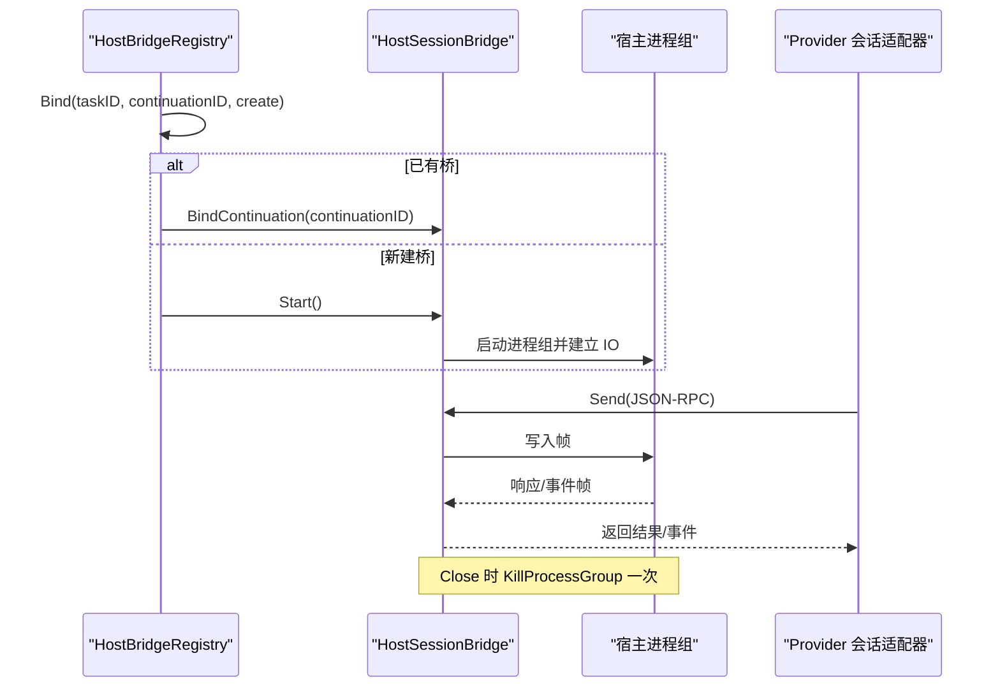
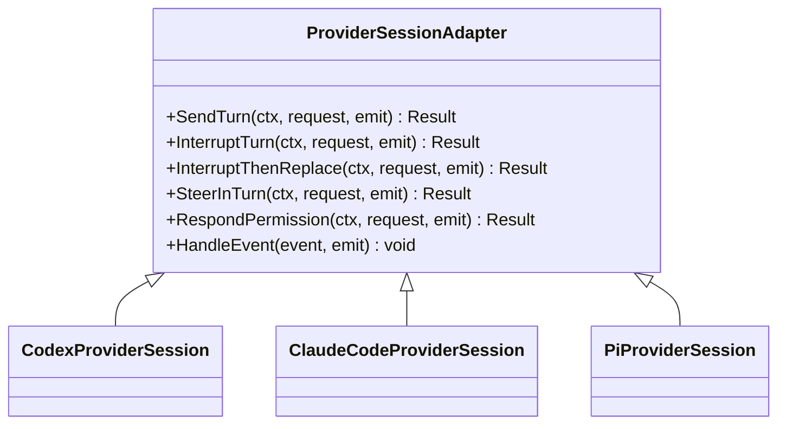
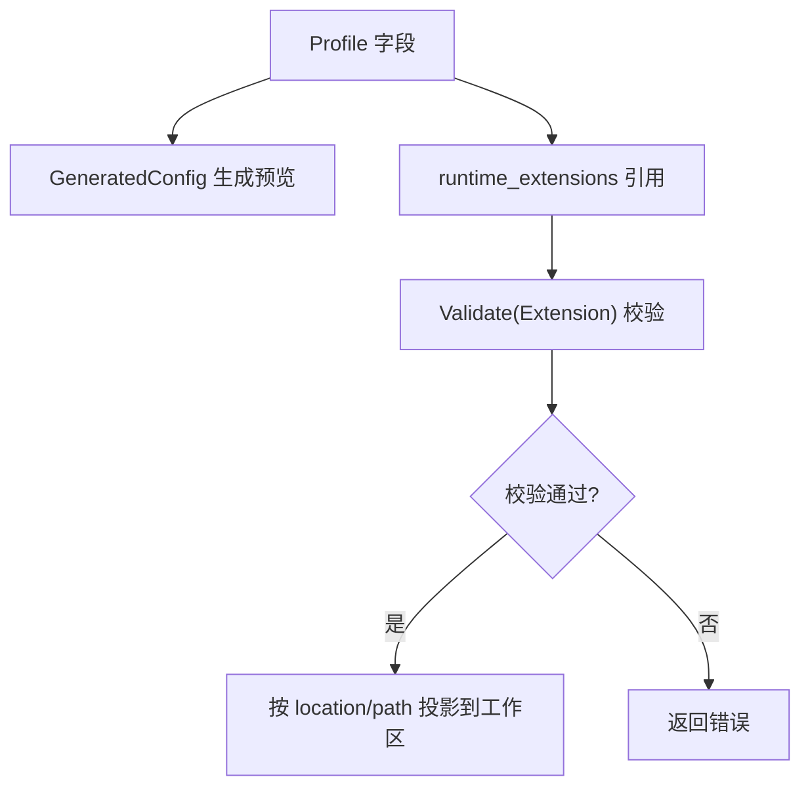
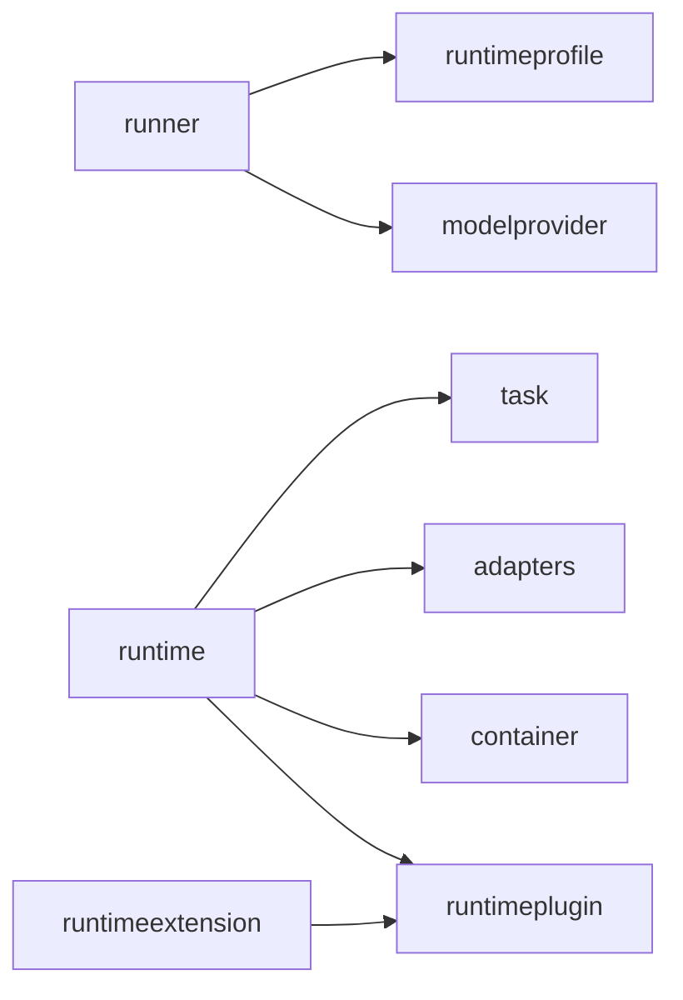

# 运行时与沙箱

<cite>
**本文引用的文件**   
- [internal/runtime/runtime.go](file://internal/runtime/runtime.go)
- [internal/runtime/container.go](file://internal/runtime/container.go)
- [internal/runtime/docker_sandbox.go](file://internal/runtime/docker_sandbox.go)
- [internal/runtime/provider_adapters.go](file://internal/runtime/provider_adapters.go)
- [internal/runtime/host_session_bridge.go](file://internal/runtime/host_session_bridge.go)
- [internal/runtime/pi_session_discovery.go](file://internal/runtime/pi_session_discovery.go)
- [internal/runner/runner.go](file://internal/runner/runner.go)
- [internal/runtimeplugin/plugin.go](file://internal/runtimeplugin/plugin.go)
- [internal/runtimeplugin/loader.go](file://internal/runtimeplugin/loader.go)
- [internal/runtimeplugin/builtin.go](file://internal/runtimeplugin/builtin.go)
- [internal/runtimeprofile/runtimeprofile.go](file://internal/runtimeprofile/runtimeprofile.go)
- [internal/runtimeextension/extension.go](file://internal/runtimeextension/extension.go)
</cite>

## 目录
1. [简介](#简介)
2. [项目结构](#项目结构)
3. [核心组件](#核心组件)
4. [架构总览](#架构总览)
5. [详细组件分析](#详细组件分析)
6. [依赖关系分析](#依赖关系分析)
7. [性能与安全考量](#性能与安全考量)
8. [故障排查指南](#故障排查指南)
9. [结论](#结论)
10. [附录：自定义运行时插件开发指南](#附录自定义运行时插件开发指南)

## 简介
本文件聚焦于 CyberPenda 的“运行时与沙箱”子系统，系统性阐述以下主题：
- Runtime 抽象层设计与任务生命周期管理
- Docker/Podman 容器隔离机制与网络约束
- Host Runner 的安全边界与进程组清理
- Runtime Plugin 声明式适配器架构（支持 Codex、Claude Code、Pi）
- Profile 解析、Extension Pack 加载、资源隔离与权限控制
- 自定义运行时插件开发与最佳实践

## 项目结构
运行时与沙箱相关代码主要分布在如下包中：
- internal/runtime：运行时适配层、容器沙箱、宿主桥接、会话能力封装
- internal/runner：执行边界准备、布局生成、命令构建、网络模式选择
- internal/runtimeplugin：运行时插件声明式模型、校验与内置插件
- internal/runtimeprofile：全局运行时 Profile 领域模型与服务
- internal/runtimeextension：运行时扩展清单与兼容性校验

图表来源
- [internal/runtime/runtime.go:1-120](file://internal/runtime/runtime.go#L1-L120)
- [internal/runtime/docker_sandbox.go:1-120](file://internal/runtime/docker_sandbox.go#L1-L120)
- [internal/runtime/host_session_bridge.go:1-120](file://internal/runtime/host_session_bridge.go#L1-L120)
- [internal/runtime/provider_adapters.go:1-120](file://internal/runtime/provider_adapters.go#L1-L120)
- [internal/runner/runner.go:1-120](file://internal/runner/runner.go#L1-L120)
- [internal/runtimeplugin/plugin.go:1-120](file://internal/runtimeplugin/plugin.go#L1-L120)
- [internal/runtimeplugin/builtin.go:1-120](file://internal/runtimeplugin/builtin.go#L1-L120)
- [internal/runtimeprofile/runtimeprofile.go:1-120](file://internal/runtimeprofile/runtimeprofile.go#L1-L120)
- [internal/runtimeextension/extension.go:1-120](file://internal/runtimeextension/extension.go#L1-L120)

章节来源
- [internal/runtime/runtime.go:1-120](file://internal/runtime/runtime.go#L1-L120)
- [internal/runner/runner.go:1-120](file://internal/runner/runner.go#L1-L120)
- [internal/runtimeplugin/plugin.go:1-120](file://internal/runtimeplugin/plugin.go#L1-L120)
- [internal/runtimeprofile/runtimeprofile.go:1-120](file://internal/runtimeprofile/runtimeprofile.go#L1-L120)
- [internal/runtimeextension/extension.go:1-120](file://internal/runtimeextension/extension.go#L1-L120)

## 核心组件
- Adapter 抽象与 Harness 编排
  - Adapter 接口定义 Provider 特定的运行边界；Harness 负责任务级生命周期、事件记录、停止与重绑定。
- 容器沙箱适配器
  - 基于 docker create/start 流程，自动拉取镜像、创建并启动容器、输出重定向与清理。
- 宿主会话桥接
  - 为 Host Runner 提供 JSON-RPC 双向通道，按进程组管理生命周期，支持意外退出检测。
- Provider 会话能力封装
  - 统一 SendTurn/InterruptTurn/InterruptThenReplace/PermissionResponse 等能力，屏蔽不同 Provider 协议差异。
- 运行时插件与 Profile
  - 通过声明式插件描述二进制、能力、配置投影、启动模板与转录解析；Profile 作为可复用配置源。
- 执行边界与资源隔离
  - runner 负责任务目录布局、只读挂载、环境变量注入、Docker 网络模式选择与入口点装配。

章节来源
- [internal/runtime/runtime.go:19-179](file://internal/runtime/runtime.go#L19-L179)
- [internal/runtime/docker_sandbox.go:111-231](file://internal/runtime/docker_sandbox.go#L111-L231)
- [internal/runtime/host_session_bridge.go:161-231](file://internal/runtime/host_session_bridge.go#L161-L231)
- [internal/runtime/provider_adapters.go:126-220](file://internal/runtime/provider_adapters.go#L126-L220)
- [internal/runtimeplugin/plugin.go:19-96](file://internal/runtimeplugin/plugin.go#L19-L96)
- [internal/runtimeprofile/runtimeprofile.go:75-116](file://internal/runtimeprofile/runtimeprofile.go#L75-L116)
- [internal/runner/runner.go:106-217](file://internal/runner/runner.go#L106-L217)

## 架构总览
下图展示从 Profile 到具体运行环境的端到端路径：Profile 经 runner 生成命令与布局，再由 runtime 的适配器在容器或宿主上执行，并通过 provider 会话适配器与 AI 提供商交互。

图表来源
- [internal/runtimeprofile/runtimeprofile.go:348-433](file://internal/runtimeprofile/runtimeprofile.go#L348-L433)
- [internal/runner/runner.go:139-217](file://internal/runner/runner.go#L139-L217)
- [internal/runtime/runtime.go:75-179](file://internal/runtime/runtime.go#L75-L179)
- [internal/runtime/docker_sandbox.go:111-231](file://internal/runtime/docker_sandbox.go#L111-L231)
- [internal/runtime/provider_adapters.go:126-220](file://internal/runtime/provider_adapters.go#L126-L220)

## 详细组件分析

### Runtime 抽象层与任务编排
- Adapter 接口：Name/Run，要求不泄露密钥，仅暴露标准化事件。
- Harness：维护 active runs、上下文取消、Finish 意图标记、StopAndWait、RebindContinuation。
- 事件与状态：Lifecycle-started/completed/stopped/failed，结合 Task 服务持久化。
- 元数据记录：支持将容器 ID、原生会话 ID/路径回写至 Continuation。

图表来源
- [internal/runtime/runtime.go:46-179](file://internal/runtime/runtime.go#L46-L179)
- [internal/runtime/runtime.go:351-481](file://internal/runtime/runtime.go#L351-L481)
- [internal/runtime/docker_sandbox.go:52-110](file://internal/runtime/docker_sandbox.go#L52-L110)
- [internal/runtime/runtime.go:314-331](file://internal/runtime/runtime.go#L314-L331)

章节来源
- [internal/runtime/runtime.go:46-179](file://internal/runtime/runtime.go#L46-L179)
- [internal/runtime/runtime.go:351-481](file://internal/runtime/runtime.go#L351-L481)

### Docker/Podman 容器沙箱
- 镜像拉取：inspect 失败且报告缺失时 pull，流式进度事件。
- 容器生命周期：create → start -a → 等待 → stop/kill → rm。
- 网络要求：按需创建内部 bridge 网络并校验 driver/internal 属性。
- 停止确认：cidfile 轮询 inspect，超时返回错误。

图表来源
- [internal/runtime/docker_sandbox.go:111-231](file://internal/runtime/docker_sandbox.go#L111-L231)
- [internal/runtime/docker_sandbox.go:233-354](file://internal/runtime/docker_sandbox.go#L233-L354)
- [internal/runtime/docker_sandbox.go:365-428](file://internal/runtime/docker_sandbox.go#L365-L428)
- [internal/runtime/container.go:26-88](file://internal/runtime/container.go#L26-L88)

章节来源
- [internal/runtime/docker_sandbox.go:111-231](file://internal/runtime/docker_sandbox.go#L111-L231)
- [internal/runtime/container.go:26-88](file://internal/runtime/container.go#L26-L88)

### Host Runner 安全边界
- 进程组隔离：每个 Task 拥有独立进程组，Close 时 KillProcessGroup 保证回收。
- 协议通道：JSON-RPC 帧，请求去重与冲突检测，完成缓存，异常终止信号。
- 任务绑定：HostSessionBridgeRegistry 每 Task 单例，BindContinuation 仅重绑请求级别上下文。
- 安全要点：禁止自动从 Sandbox 回退到 Host；Host 需显式激活。

图表来源
- [internal/runtime/host_session_bridge.go:83-159](file://internal/runtime/host_session_bridge.go#L83-L159)
- [internal/runtime/host_session_bridge.go:186-231](file://internal/runtime/host_session_bridge.go#L186-L231)
- [internal/runtime/host_session_bridge.go:252-315](file://internal/runtime/host_session_bridge.go#L252-L315)
- [internal/runner/runner.go:271-283](file://internal/runner/runner.go#L271-L283)

章节来源
- [internal/runtime/host_session_bridge.go:83-159](file://internal/runtime/host_session_bridge.go#L83-L159)
- [internal/runtime/host_session_bridge.go:186-231](file://internal/runtime/host_session_bridge.go#L186-L231)
- [internal/runner/runner.go:271-283](file://internal/runner/runner.go#L271-L283)

### Provider 会话适配器（Codex/Claude Code/Pi）
- 能力集：SendTurn、InterruptTurn、InterruptThenReplace、InTurnSteer、PermissionResponse、ResumeSession。
- 语义一致性：对中断/替换进行结算等待，确保 turn 终态一致。
- 事件归一化：将各 Provider 的原始事件映射为标准 lifecycle/steering/output 事件。
- 参数映射：根据 Provider 特性构造 wire params（如 model、effort、permission）。

图表来源
- [internal/runtime/provider_adapters.go:126-220](file://internal/runtime/provider_adapters.go#L126-L220)
- [internal/runtime/provider_adapters.go:727-785](file://internal/runtime/provider_adapters.go#L727-L785)

章节来源
- [internal/runtime/provider_adapters.go:126-220](file://internal/runtime/provider_adapters.go#L126-L220)
- [internal/runtime/provider_adapters.go:727-785](file://internal/runtime/provider_adapters.go#L727-L785)

### Profile 解析与 Extension Pack 加载
- Profile 字段：binary_path、model、endpoint、custom_args、env、api_keys、credential_refs、runtime_extensions、mcp_servers、default_runner、sandbox_image。
- 生成配置：GeneratedConfig 仅用于预览，不包含敏感值；API keys 脱敏显示。
- 扩展清单：Extension 声明兼容的 runtime plugin、source 类型与投影位置，拒绝包含疑似密钥的路径/配置。

图表来源
- [internal/runtimeprofile/runtimeprofile.go:348-433](file://internal/runtimeprofile/runtimeprofile.go#L348-L433)
- [internal/runtimeextension/extension.go:51-96](file://internal/runtimeextension/extension.go#L51-L96)

章节来源
- [internal/runtimeprofile/runtimeprofile.go:348-433](file://internal/runtimeprofile/runtimeprofile.go#L348-L433)
- [internal/runtimeextension/extension.go:51-96](file://internal/runtimeextension/extension.go#L51-L96)

### 资源隔离与权限控制
- 文件系统隔离：task_root/workdir、runtime-home/provider、skills、artifacts、logs 严格分区。
- 只读挂载：ReadOnlyTaskFiles/Dirs 以只读 bind mount 进入容器，防止越权修改。
- 网络隔离：默认 bridge；可选 host_proxy_only 网络，仅暴露主机代理目标。
- 进程组隔离：Host Runner 使用进程组，避免影响守护进程。
- 凭据注入：通过 -e 传入环境变量，SecretValues 用于输出脱敏，不直接透传明文到日志。

章节来源
- [internal/runner/runner.go:106-217](file://internal/runner/runner.go#L106-L217)
- [internal/runner/runner.go:219-243](file://internal/runner/runner.go#L219-L243)
- [internal/runtime/runtime.go:425-481](file://internal/runtime/runtime.go#L425-L481)

## 依赖关系分析
- 包间依赖
  - runtime 依赖 task/adapters 事件与脱敏；docker_sandbox 依赖 container 工具函数。
  - runner 依赖 runtimeprofile 与 modelprovider 快照；构建容器命令时注入 Provider 专属环境变量。
  - runtimeplugin 提供声明式模型与内置插件；runtimeextension 提供扩展清单校验。
  - runtimeprofile 提供 Profile 领域服务与生成配置。

图表来源
- [internal/runner/runner.go:1-120](file://internal/runner/runner.go#L1-L120)
- [internal/runtime/runtime.go:1-120](file://internal/runtime/runtime.go#L1-L120)
- [internal/runtimeplugin/plugin.go:1-120](file://internal/runtimeplugin/plugin.go#L1-L120)
- [internal/runtimeextension/extension.go:1-120](file://internal/runtimeextension/extension.go#L1-L120)

章节来源
- [internal/runner/runner.go:1-120](file://internal/runner/runner.go#L1-L120)
- [internal/runtime/runtime.go:1-120](file://internal/runtime/runtime.go#L1-L120)
- [internal/runtimeplugin/plugin.go:1-120](file://internal/runtimeplugin/plugin.go#L1-L120)
- [internal/runtimeextension/extension.go:1-120](file://internal/runtimeextension/extension.go#L1-L120)

## 性能与安全考量
- 性能
  - 容器镜像预检与增量拉取减少冷启动时间；stdout/stderr 并行扫描降低 I/O 阻塞。
  - Provider 会话适配器缓存已完成的请求结果，避免重复网络往返。
- 安全
  - 输出脱敏：基于 EnvSecretValues 精确匹配敏感值，避免泄漏。
  - 网络最小化：host_proxy_only 网络限制出站访问面。
  - 只读挂载：防止运行时篡改任务输入。
  - Host Runner 显式激活：杜绝自动降级到宿主的危险行为。

[本节为通用指导，无需列出源码引用]

## 故障排查指南
- 容器未退出
  - 使用 StopConfirmation 轮询 inspect，检查 cidfile 是否存在与容器状态。
- 镜像拉取失败
  - 关注 image_pull_progress/image_pull_failed 事件，核对镜像名与网络连通性。
- Host 桥接异常
  - 检查 Terminated/Closed 通道，确认进程组是否被正确回收；查看诊断输出是否包含敏感信息。
- Provider 会话不一致
  - 观察 interrupted/settled/completed 事件序列，确认结算等待是否超时。

章节来源
- [internal/runtime/container.go:26-88](file://internal/runtime/container.go#L26-L88)
- [internal/runtime/docker_sandbox.go:233-354](file://internal/runtime/docker_sandbox.go#L233-L354)
- [internal/runtime/host_session_bridge.go:317-352](file://internal/runtime/host_session_bridge.go#L317-L352)
- [internal/runtime/provider_adapters.go:425-445](file://internal/runtime/provider_adapters.go#L425-L445)

## 结论
CyberPenda 的运行时与沙箱系统通过清晰的抽象层、声明式插件与严格的资源隔离，实现了对多种 AI 提供商的统一编排与可控执行。Profile 与 Extension Pack 的组合提供了灵活的配置与扩展能力，同时保持安全边界清晰。

[本节为总结，无需列出源码引用]

## 附录：自定义运行时插件开发指南
- 插件清单字段
  - schema_version、id、name、binary.default、capabilities、model_provider、profile_schema、config_projection、launch.args、transcript.parser、native_resume（可选）、process_env、credential_env。
- 必填项与校验
  - id 符合小写字母开头规则；binary.default 非空；launch.args 至少一项；transcript.parser 为受支持的解析器之一；profile_schema.fields 类型合法且不重复。
- 内置插件参考
  - fake/codex/claude_code/pi 展示了常见能力组合、配置投影与启动模板。
- 加载方式
  - 通过 LoadDirectory 从可信目录加载 .json 清单，逐个解码并 Validate。
- 最佳实践
  - 明确 capabilities 与 model_provider 需求，避免过度声明。
  - 使用 credential_env 声明凭据变量名，不在清单中硬编码密钥。
  - 合理设置 transcript.parser 以支持回放与审计。
  - 若支持 native_resume，需提供 session_source 与 resume args。

章节来源
- [internal/runtimeplugin/plugin.go:19-96](file://internal/runtimeplugin/plugin.go#L19-L96)
- [internal/runtimeplugin/plugin.go:136-214](file://internal/runtimeplugin/plugin.go#L136-L214)
- [internal/runtimeplugin/loader.go:11-48](file://internal/runtimeplugin/loader.go#L11-L48)
- [internal/runtimeplugin/builtin.go:18-213](file://internal/runtimeplugin/builtin.go#L18-L213)