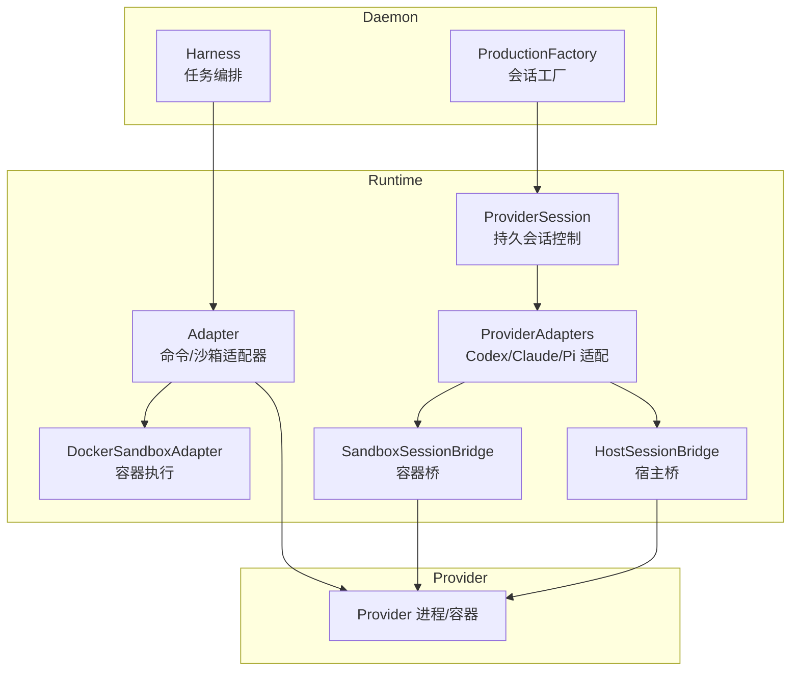
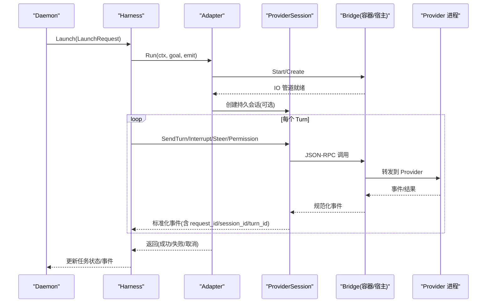
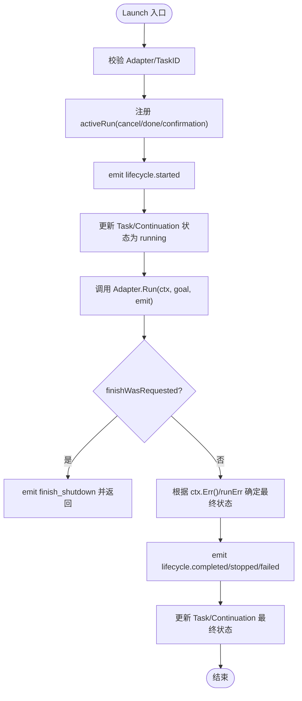
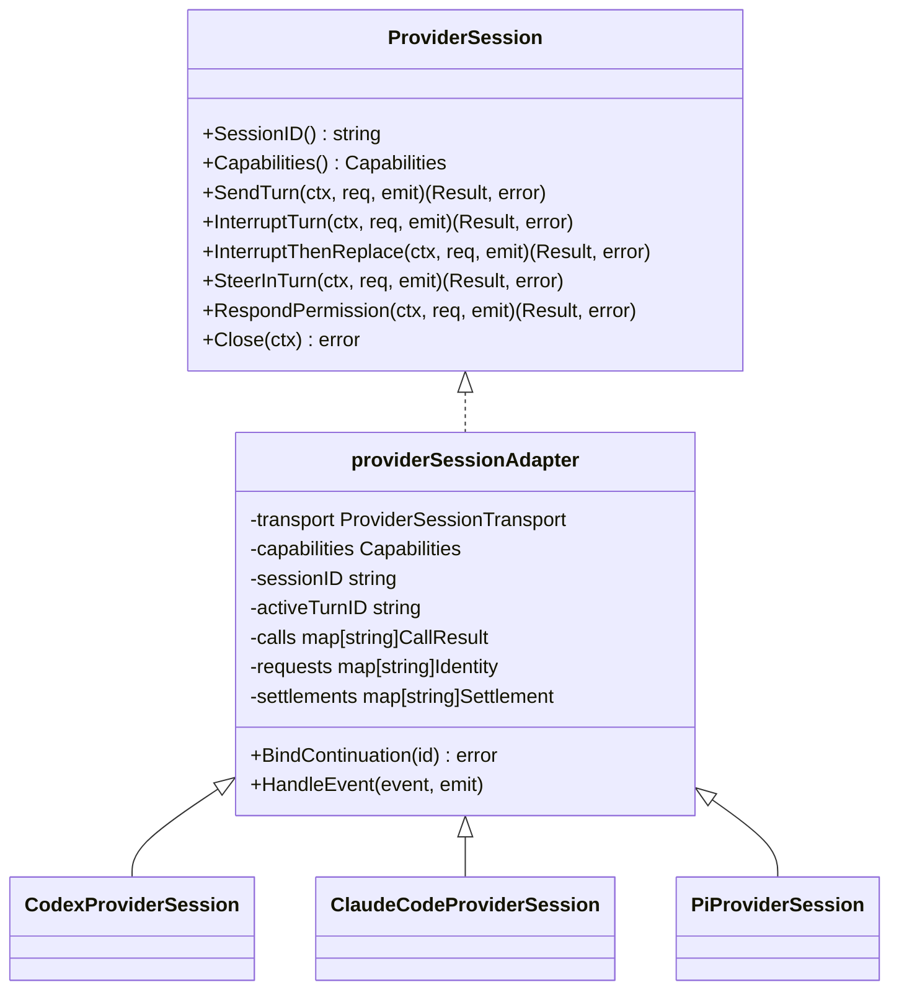
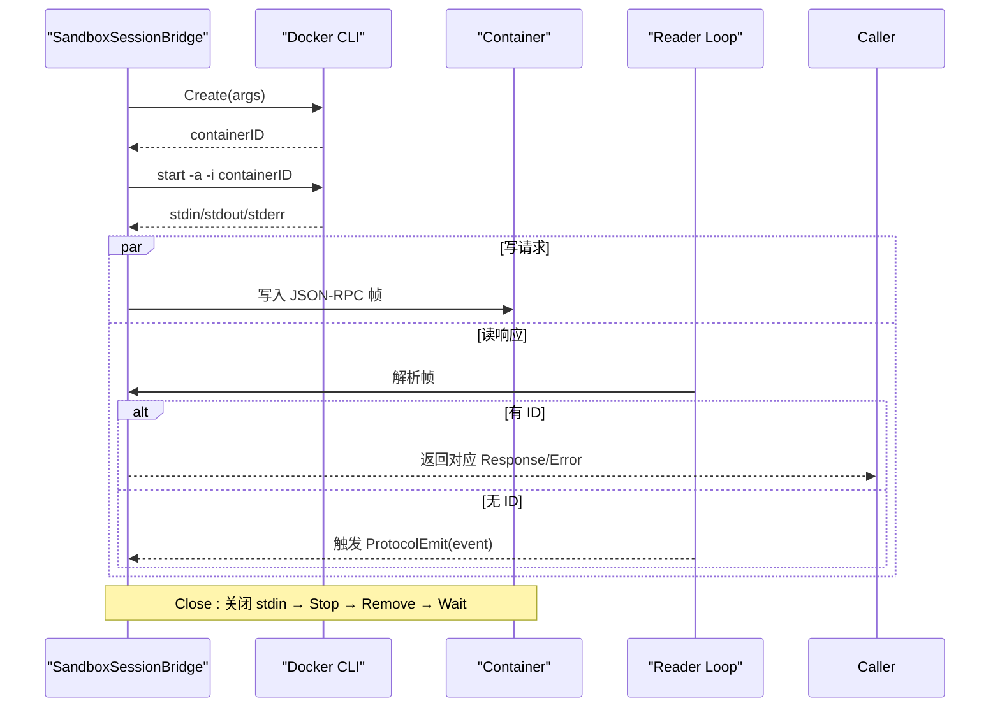
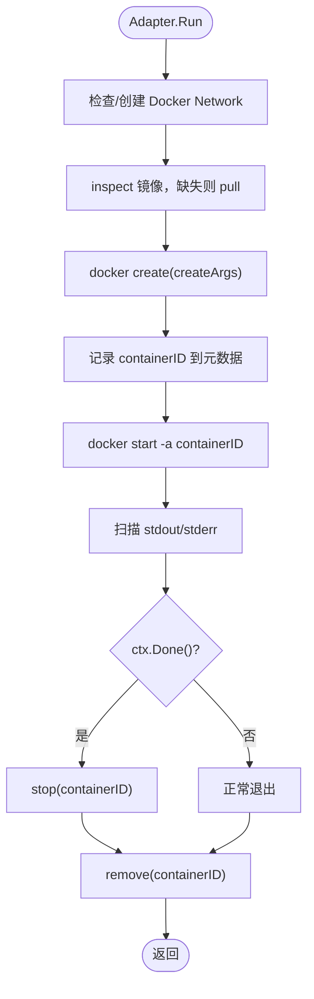
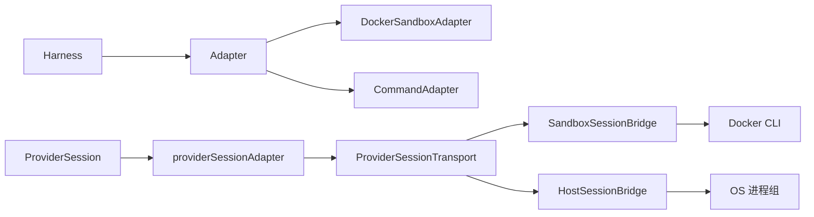

# 运行时抽象层

<cite>
**本文引用的文件**   
- [runtime.go](file://internal/runtime/runtime.go)
- [provider_session.go](file://internal/runtime/provider_session.go)
- [provider_adapters.go](file://internal/runtime/provider_adapters.go)
- [session_bridge.go](file://internal/runtime/session_bridge.go)
- [host_session_bridge.go](file://internal/runtime/host_session_bridge.go)
- [docker_sandbox.go](file://internal/runtime/docker_sandbox.go)
- [container.go](file://internal/runtime/container.go)
- [production_provider_session_factory.go](file://internal/daemon/production_provider_session_factory.go)
- [task_handlers.go](file://internal/daemon/task_handlers.go)
- [api.ts](file://web/src/lib/api.ts)
- [runtime-native-steer.md](file://docs/specs/runtime-native-steer.md)
</cite>

## 目录
1. [引言](#引言)
2. [项目结构](#项目结构)
3. [核心组件](#核心组件)
4. [架构总览](#架构总览)
5. [详细组件分析](#详细组件分析)
6. [依赖关系分析](#依赖关系分析)
7. [性能与超时控制](#性能与超时控制)
8. [故障排查指南](#故障排查指南)
9. [结论](#结论)
10. [附录：扩展新 AI 提供商的实现指南](#附录扩展新-ai-提供商的实现指南)

## 引言
本文件聚焦于运行时抽象层，系统性阐述 Runtime 接口设计、Provider Session 生命周期管理、容器化执行抽象与会话状态机、资源清理机制、错误处理与超时控制。同时提供自定义运行时实现指南与最佳实践，帮助扩展支持新的 AI 提供商（如 Codex、Claude Code、Pi 等）。

## 项目结构
运行时抽象层位于 internal/runtime 包，围绕“适配器 + 会话桥 + 容器/进程”三层解耦：
- Adapter 层：面向 Provider 的轻量适配（命令式或沙箱式），屏蔽具体二进制差异。
- ProviderSession 层：长生命周期的 Provider 控制边界，封装 turn、中断、替换、权限响应等能力。
- Bridge 层：Task 拥有的双向 JSON-RPC 通道，承载在 Docker 容器或宿主进程内运行的 Provider 子进程。
- Harness 层：任务级编排器，负责事件记录、状态更新、停止与完成语义。

图表来源
- [runtime.go:1-481](file://internal/runtime/runtime.go#L1-L481)
- [provider_session.go:1-505](file://internal/runtime/provider_session.go#L1-L505)
- [provider_adapters.go:1-892](file://internal/runtime/provider_adapters.go#L1-L892)
- [session_bridge.go:1-574](file://internal/runtime/session_bridge.go#L1-L574)
- [host_session_bridge.go:1-473](file://internal/runtime/host_session_bridge.go#L1-L473)
- [docker_sandbox.go:1-505](file://internal/runtime/docker_sandbox.go#L1-L505)

章节来源
- [runtime.go:1-481](file://internal/runtime/runtime.go#L1-L481)
- [provider_session.go:1-505](file://internal/runtime/provider_session.go#L1-L505)
- [provider_adapters.go:1-892](file://internal/runtime/provider_adapters.go#L1-L892)
- [session_bridge.go:1-574](file://internal/runtime/session_bridge.go#L1-L574)
- [host_session_bridge.go:1-473](file://internal/runtime/host_session_bridge.go#L1-L473)
- [docker_sandbox.go:1-505](file://internal/runtime/docker_sandbox.go#L1-L505)

## 核心组件
- Adapter 接口：定义 Name() 与 Run(ctx, goal, emit)，用于一次性执行一个 Continuation，输出标准化事件。
- Harness：任务级运行编排，注册活动运行、记录事件、设置最终状态、支持 Stop/StopAndWait 与 FinishIntent。
- ProviderSession：长生命周期控制边界，暴露 SendTurn、InterruptTurn、InterruptThenReplace、SteerInTurn、RespondPermission、Close 等方法。
- ProviderAdapters：基于 ProviderSessionTransport 的通用实现，封装 idempotency、settlement、event sink 与能力协商。
- SandboxSessionBridge/HostSessionBridge：Task 拥有的 JSON-RPC 通道，分别通过 Docker attach 或本地进程组启动 Provider 子进程。
- DockerSandboxAdapter：以 docker create/start 方式运行沙箱容器，自动拉取镜像、网络校验、日志重定向与资源回收。
- Container 辅助：读取 cidfile、确认容器退出、优雅停止与强制删除。

章节来源
- [runtime.go:1-481](file://internal/runtime/runtime.go#L1-L481)
- [provider_session.go:1-505](file://internal/runtime/provider_session.go#L1-L505)
- [provider_adapters.go:1-892](file://internal/runtime/provider_adapters.go#L1-L892)
- [session_bridge.go:1-574](file://internal/runtime/session_bridge.go#L1-L574)
- [host_session_bridge.go:1-473](file://internal/runtime/host_session_bridge.go#L1-L473)
- [docker_sandbox.go:1-505](file://internal/runtime/docker_sandbox.go#L1-L505)
- [container.go:1-89](file://internal/runtime/container.go#L1-L89)

## 架构总览
运行时抽象层将“任务执行”和“Provider 交互”分层解耦：
- 上层 Daemon 通过 Harness 启动 Adapter；Adapter 选择 Host 或 Docker 路径。
- 中间层 ProviderSession 统一 turn/steer/permission 等能力，屏蔽不同 Provider 协议差异。
- 底层 Bridge 提供 Task 隔离的 JSON-RPC 通道，确保 stdin/stdout 非 PTY、安全且可观测。

图表来源
- [runtime.go:75-179](file://internal/runtime/runtime.go#L75-L179)
- [provider_session.go:140-152](file://internal/runtime/provider_session.go#L140-L152)
- [provider_adapters.go:126-200](file://internal/runtime/provider_adapters.go#L126-L200)
- [session_bridge.go:379-442](file://internal/runtime/session_bridge.go#L379-L442)
- [host_session_bridge.go:252-315](file://internal/runtime/host_session_bridge.go#L252-L315)
- [docker_sandbox.go:111-231](file://internal/runtime/docker_sandbox.go#L111-L231)

## 详细组件分析

### Adapter 与 Harness：任务级执行编排
- Adapter 仅负责一次 Continuation 的执行与事件发射，不持有长期状态。
- Harness 维护 activeRun，绑定 cancel/done/stopConfirmation，并负责：
  - 标记任务为 running，记录 lifecycle-started/completed/stopped/failed 事件。
  - 支持 MarkFinishRequested/ClearFinishIntent 协调 Finish 语义，避免竞态。
  - Stop/StopAndWait 支持超时与二次确认（例如等待容器退出）。
  - RebindContinuation 在不重启 Task 的情况下切换 Continuation 绑定。

图表来源
- [runtime.go:75-179](file://internal/runtime/runtime.go#L75-L179)
- [runtime.go:183-269](file://internal/runtime/runtime.go#L183-L269)

章节来源
- [runtime.go:75-179](file://internal/runtime/runtime.go#L75-L179)
- [runtime.go:183-269](file://internal/runtime/runtime.go#L183-L269)

### ProviderSession 与 Adapters：长生命周期控制与能力协商
- ProviderSession 抽象了持久会话的多种操作模式：send_turn、interrupt_turn、interrupt_then_replace、in_turn_steer、permission_response、resume_session。
- providerSessionAdapter 统一实现：
  - 请求幂等性（request_id）与冲突检测（不同 mode/fingerprint 冲突）。
  - 能力检查（Capabilities）与不支持时的明确错误类型。
  - settlement 等待机制：对 interrupt/replace 等待 provider 侧 settle 信号。
  - 事件 sink：将未携带 ID 的通知映射为标准化事件（lifecycle/steering/runtime_output）。
- 具体 Provider 适配器（Codex/Claude/Pi）通过 providerWireMethods 配置 wire 方法名、参数构造、turnID/sessionID 提取以及可选 prepareSend（如 Pi 的 set_model → set_thinking_level → prompt）。

图表来源
- [provider_session.go:140-152](file://internal/runtime/provider_session.go#L140-L152)
- [provider_adapters.go:58-92](file://internal/runtime/provider_adapters.go#L58-L92)
- [provider_adapters.go:727-892](file://internal/runtime/provider_adapters.go#L727-L892)

章节来源
- [provider_session.go:1-505](file://internal/runtime/provider_session.go#L1-L505)
- [provider_adapters.go:1-892](file://internal/runtime/provider_adapters.go#L1-L892)

### Bridge：容器与宿主的 JSON-RPC 通道
- SandboxSessionBridge：
  - 使用 Docker CLI create/start -a -i 启动容器，stdin/stdout 作为协议通道，stderr 作为诊断流。
  - 维护 pending/completed/requests 表，保证请求幂等与并发安全。
  - readLoop 解析帧，有 ID 的请求走 response 匹配，无 ID 的事件走 ProtocolEmit。
  - Close 顺序：关闭 stdin → Stop → Remove → Wait → 关闭 closed channel。
- HostSessionBridge：
  - 以独立进程组启动宿主进程，支持 KillProcessGroup 清理后代进程。
  - 与 SandboxSessionBridge 相同的 JSON-RPC 帧格式与幂等策略。
  - 提供 ProcessGroupID 与 FormatHostProcessGroupID/ParseHostProcessGroupID 用于元数据持久化与重启恢复。

图表来源
- [session_bridge.go:278-352](file://internal/runtime/session_bridge.go#L278-L352)
- [session_bridge.go:379-442](file://internal/runtime/session_bridge.go#L379-L442)
- [session_bridge.go:446-489](file://internal/runtime/session_bridge.go#L446-L489)
- [session_bridge.go:517-540](file://internal/runtime/session_bridge.go#L517-L540)
- [host_session_bridge.go:186-231](file://internal/runtime/host_session_bridge.go#L186-L231)
- [host_session_bridge.go:252-315](file://internal/runtime/host_session_bridge.go#L252-L315)
- [host_session_bridge.go:395-416](file://internal/runtime/host_session_bridge.go#L395-L416)

章节来源
- [session_bridge.go:1-574](file://internal/runtime/session_bridge.go#L1-L574)
- [host_session_bridge.go:1-473](file://internal/runtime/host_session_bridge.go#L1-L473)

### Docker 沙箱执行抽象
- DockerSandboxAdapter：
  - 校验网络要求（driver/internal），不存在则创建并验证。
  - 镜像缺失时自动 pull，并输出进度事件。
  - 启动容器后，stdout/stderr 扫描并记录 NativeSessionMetadata（如 containerID/host-pgid）。
  - 上下文取消时优雅 stop 并强制 remove，确保资源释放。
- Container 工具：
  - ReadContainerIDFile/DockerContainerStopConfirmation/ConfirmDockerContainerExited 用于确认容器退出。
  - StopDockerContainer/RemoveDockerContainer 封装 docker stop/kill/rm 行为。

图表来源
- [docker_sandbox.go:111-231](file://internal/runtime/docker_sandbox.go#L111-L231)
- [docker_sandbox.go:233-354](file://internal/runtime/docker_sandbox.go#L233-L354)
- [docker_sandbox.go:365-428](file://internal/runtime/docker_sandbox.go#L365-L428)
- [container.go:18-89](file://internal/runtime/container.go#L18-L89)

章节来源
- [docker_sandbox.go:1-505](file://internal/runtime/docker_sandbox.go#L1-L505)
- [container.go:1-89](file://internal/runtime/container.go#L1-L89)

### 会话状态机与资源清理
- ProviderSession 状态：
  - idle → requested → acknowledged → settled/started/completed/failed（由事件驱动）。
  - InterruptThenReplace 需要两阶段：先 interrupt 等待 settle，再 send replacement。
- Harness 状态：
  - running → completed/stopped/failed（受 FinishIntent 影响，Finish 路径不直接写终态）。
- 资源清理：
  - Bridge.Close：关闭 stdin → Stop → Remove → Wait → 关闭 closed channel。
  - HostSessionBridge.Close：关闭 stdin → KillProcessGroup → Wait → failPending → close。
  - DockerSandboxAdapter：context 取消时 stop → remove；正常结束时 remove。

章节来源
- [provider_session.go:265-327](file://internal/runtime/provider_session.go#L265-L327)
- [provider_adapters.go:202-219](file://internal/runtime/provider_adapters.go#L202-L219)
- [session_bridge.go:517-540](file://internal/runtime/session_bridge.go#L517-L540)
- [host_session_bridge.go:395-416](file://internal/runtime/host_session_bridge.go#L395-L416)
- [docker_sandbox.go:157-190](file://internal/runtime/docker_sandbox.go#L157-L190)

## 依赖关系分析
- Adapter 依赖 task.Service 进行事件追加与状态更新。
- ProviderSession 依赖 runtimeplugin.Capabilities 声明能力集。
- Bridge 依赖 Docker CLI 或本地进程组 starter。
- ProductionFactory 负责按 Provider 选择合适桥接方式（容器/宿主）并复用同一 Task 的桥实例。

图表来源
- [runtime.go:1-481](file://internal/runtime/runtime.go#L1-L481)
- [provider_adapters.go:1-892](file://internal/runtime/provider_adapters.go#L1-L892)
- [session_bridge.go:1-574](file://internal/runtime/session_bridge.go#L1-L574)
- [host_session_bridge.go:1-473](file://internal/runtime/host_session_bridge.go#L1-L473)
- [docker_sandbox.go:1-505](file://internal/runtime/docker_sandbox.go#L1-L505)

章节来源
- [runtime.go:1-481](file://internal/runtime/runtime.go#L1-L481)
- [provider_adapters.go:1-892](file://internal/runtime/provider_adapters.go#L1-L892)
- [session_bridge.go:1-574](file://internal/runtime/session_bridge.go#L1-L574)
- [host_session_bridge.go:1-473](file://internal/runtime/host_session_bridge.go#L1-L473)
- [docker_sandbox.go:1-505](file://internal/runtime/docker_sandbox.go#L1-L505)

## 性能与超时控制
- 事件与 I/O：
  - 所有 stdout/stderr 行扫描均限制最大行长度，防止内存膨胀。
  - 敏感值通过 Redactor 精确匹配脱敏，避免泄露密钥。
- 超时与取消：
  - Harness.StopAndWait 支持超时与二次确认（StopConfirmation）。
  - ProviderSession 操作遵循 context 取消/超时报错，并在必要时重试幂等。
  - Docker 容器 stop 使用宽限期，失败则 kill；移除忽略“不存在”的错误。
- 并发与锁：
  - Bridge 使用读写分离与写互斥，pending/completed 表保护并发请求。
  - providerSessionAdapter 通过 begin/end 序列化控制操作，避免并发冲突。

章节来源
- [runtime.go:245-269](file://internal/runtime/runtime.go#L245-L269)
- [provider_adapters.go:282-337](file://internal/runtime/provider_adapters.go#L282-L337)
- [session_bridge.go:446-489](file://internal/runtime/session_bridge.go#L446-L489)
- [docker_sandbox.go:432-504](file://internal/runtime/docker_sandbox.go#L432-L504)

## 故障排查指南
- 常见错误类型：
  - ErrProviderSessionClosed：会话已关闭。
  - ErrProviderSessionControlConflict：控制操作冲突（并发或重复）。
  - UnsupportedProviderSessionCapabilityError：能力不支持。
  - SandboxBridgeRPCError：JSON-RPC 失败（隐藏敏感 payload）。
  - ErrSandboxBridgeInvalid/ErrSandboxBridgeTaskMismatch：无效请求或 Task 不匹配。
- 定位步骤：
  - 查看 lifecycle/steering/runtime_output 事件中的 request_id/session_id/turn_id。
  - 检查 Bridge 的 Terminated/Closed channel 以确定意外退出或显式关闭。
  - 核对 Provider 能力集与请求是否匹配。
  - 对于容器场景，确认 cidfile 存在与容器状态（running=false）。
- 恢复策略：
  - 使用 InterruptThenReplace 进行中断并替换 turn。
  - 通过 Resume 接口恢复持久会话（需 Provider 支持 resume_session）。
  - 守护进程重启后，利用持久化的 NativeSessionMetadata（containerID/host-pgid）重建桥。

章节来源
- [provider_session.go:40-51](file://internal/runtime/provider_session.go#L40-L51)
- [provider_adapters.go:447-459](file://internal/runtime/provider_adapters.go#L447-L459)
- [session_bridge.go:76-83](file://internal/runtime/session_bridge.go#L76-L83)
- [container.go:18-89](file://internal/runtime/container.go#L18-L89)
- [task_handlers.go:253-285](file://internal/daemon/task_handlers.go#L253-L285)

## 结论
运行时抽象层通过 Adapter/Harness/ProviderSession/Bridge/DockerSandbox 的分层设计，实现了 Provider 无关的任务执行与交互控制。其会话状态机清晰、资源清理可靠、错误与超时可控，并通过插件化能力为扩展新 Provider 提供了坚实基础。

## 附录：扩展新 AI 提供商的实现指南
- 新增 Provider 的步骤：
  1. 定义 ProviderSessionConfig 与 NewXxxProviderSession，实现 providerWireMethods：
     - send/interrupt/steer/permission 方法名。
     - params 构造（包含 session_id/turn_id/message 及模型选择字段）。
     - turnID/sessionID 提取函数。
     - 可选 prepareSend（如 Pi 的顺序 set_model → set_thinking_level → prompt）。
  2. 若需要新的传输方式，实现 ProviderSessionTransport（Send/Close）。
  3. 在 ProductionFactory 中注册该 Provider 的桥接策略（容器/宿主）。
  4. 通过 Capability 声明支持的交互能力（persistent_session/send_turn/interrupt_turn/in_turn_steer/permission_response/resume_session）。
  5. 编写测试覆盖：
     - 能力检查与不支持错误。
     - 请求幂等与冲突检测。
     - settlement 等待与超时。
     - 事件映射（lifecycle/steering/runtime_output）。
- 最佳实践：
  - 始终使用 request_id 做幂等键，避免重复写入。
  - 严格区分 lifecycle/steering/runtime_output 三类事件，保持 UI 投影一致性。
  - 对敏感信息使用 Redactor 脱敏，禁止将原始 wire payload 写入 Task 事件。
  - 对容器/进程生命周期采用“显式关闭优先”，避免僵尸资源。
  - 通过 NativeSessionMetadata 持久化关键标识（containerID/host-pgid/native-session-id），便于重启恢复。

章节来源
- [provider_adapters.go:727-892](file://internal/runtime/provider_adapters.go#L727-L892)
- [production_provider_session_factory.go:416-444](file://internal/daemon/production_provider_session_factory.go#L416-L444)
- [runtime-native-steer.md:74-111](file://docs/specs/runtime-native-steer.md#L74-L111)
- [api.ts:365-407](file://web/src/lib/api.ts#L365-L407)