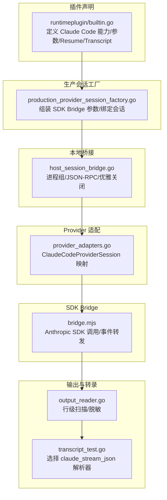
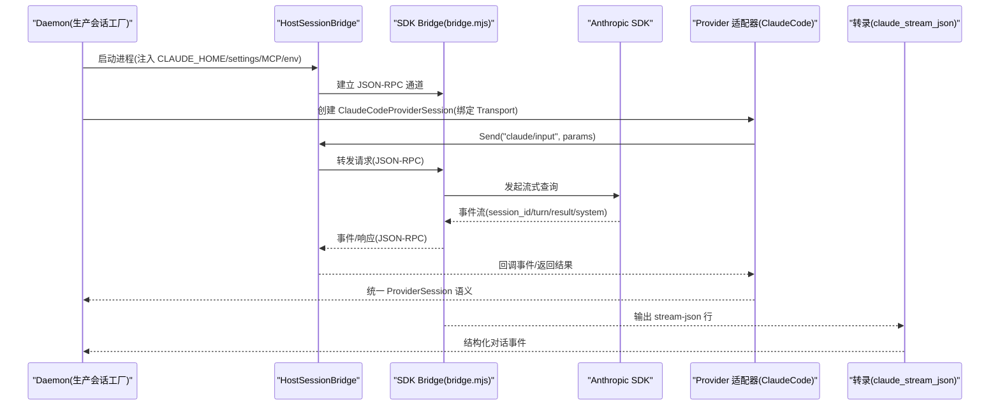
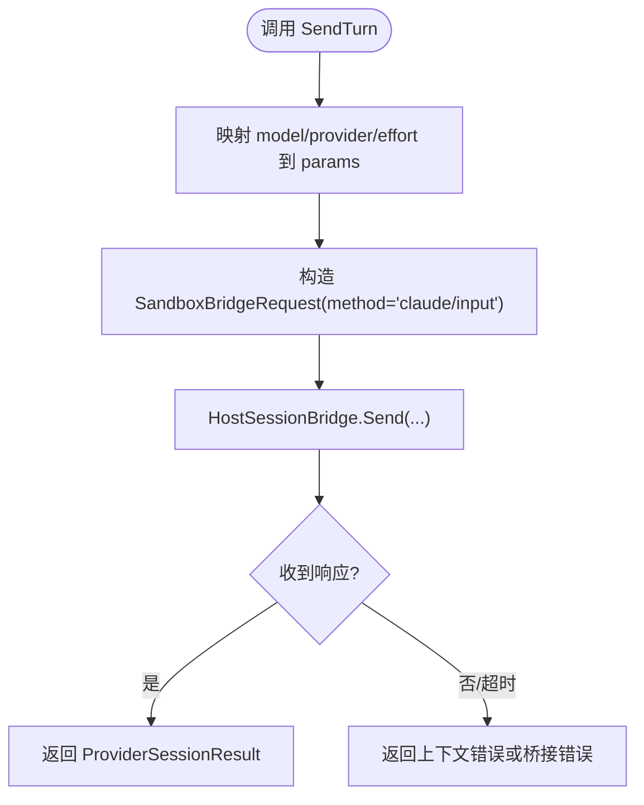
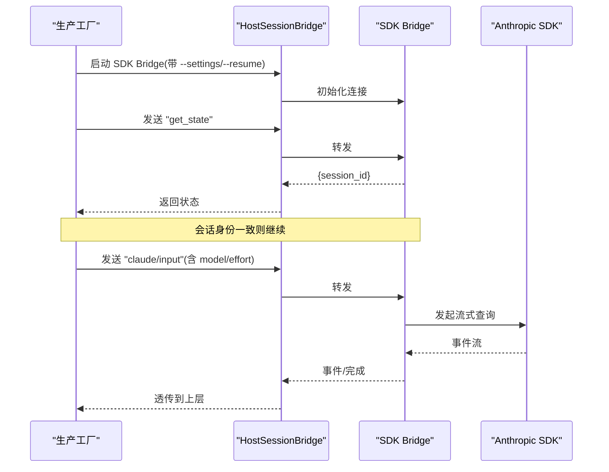
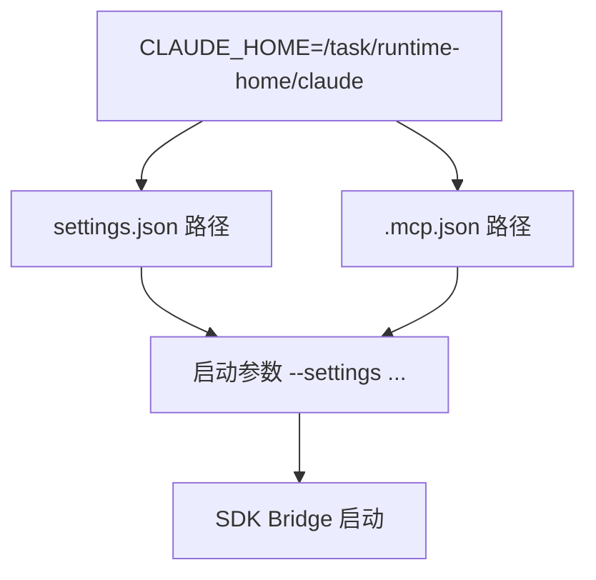
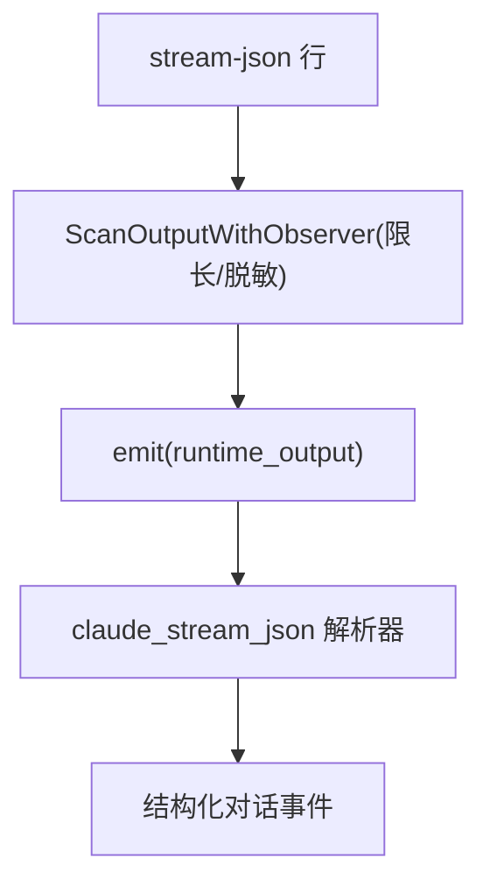
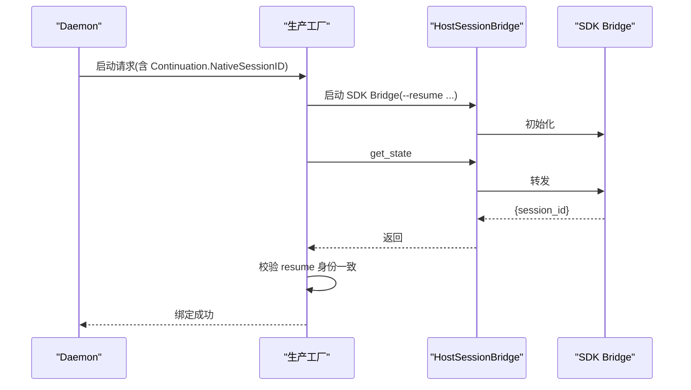
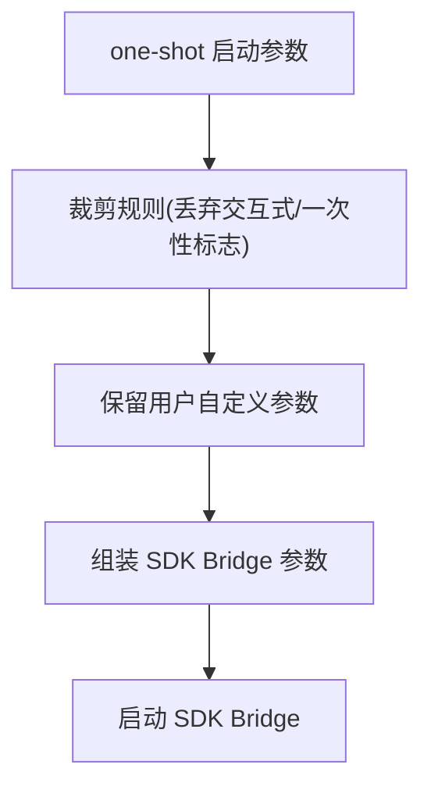
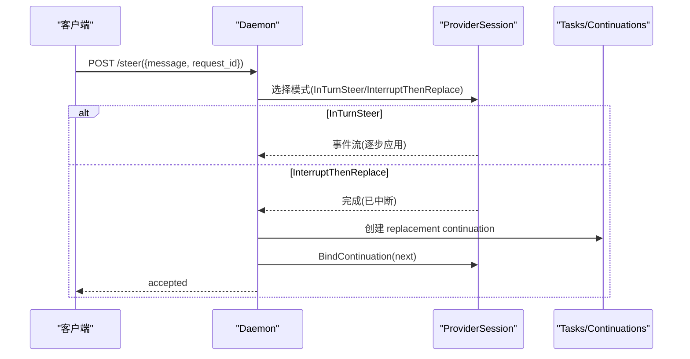
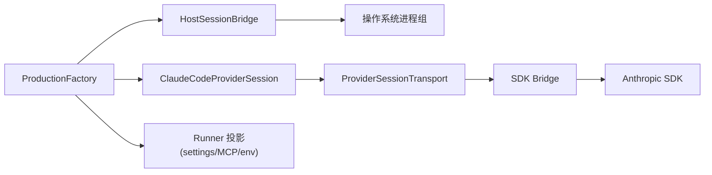

# Claude Code 提供商

<cite>
**本文引用的文件**   
- [internal/runtime/host_session_bridge.go](file://internal/runtime/host_session_bridge.go)
- [internal/runtime/provider_adapters.go](file://internal/runtime/provider_adapters.go)
- [internal/daemon/production_provider_session_factory.go](file://internal/daemon/production_provider_session_factory.go)
- [internal/runtimeplugin/builtin.go](file://internal/runtimeplugin/builtin.go)
- [cmd/pentest-claude-sdk-bridge/bridge.mjs](file://cmd/pentest-claude-sdk-bridge/bridge.mjs)
- [internal/runtime/output_reader.go](file://internal/runtime/output_reader.go)
- [internal/transcript/transcript_test.go](file://internal/transcript/transcript_test.go)
- [internal/adapters/adapters_test.go](file://internal/adapters/adapters_test.go)
- [internal/runner/projection_claude_test.go](file://internal/runner/projection_claude_test.go)
- [internal/daemon/task_handlers.go](file://internal/daemon/task_handlers.go)
</cite>

## 目录
1. [简介](#简介)
2. [项目结构](#项目结构)
3. [核心组件](#核心组件)
4. [架构总览](#架构总览)
5. [详细组件分析](#详细组件分析)
6. [依赖分析](#依赖分析)
7. [性能考虑](#性能考虑)
8. [故障排查指南](#故障排查指南)
9. [结论](#结论)
10. [附录](#附录)

## 简介
本文件系统性说明 Claude Code 提供商在本项目中的集成实现，覆盖以下关键主题：
- CLAUDE_HOME 配置与运行时环境投影
- 本地会话桥接（HostSessionBridge）的进程间通信、管道处理、错误传播与优雅关闭
- MCP 协议通信与实时交互（通过 SDK Bridge 与 stream-json 输出）
- Claude Code CLI 集成、会话发现、消息传递与状态同步
- Anthropic Messages 协议的适配实现（流式 JSON 解析与会话恢复）

## 项目结构
Claude Code 提供商涉及三层协作：
- 运行期插件声明：定义二进制、能力、MCP 配置路径、启动参数、Resume 源与 Transcript 解析器。
- 生产会话工厂：在宿主或沙箱中启动“SDK Bridge”进程，建立持久化 RPC 通道，并绑定 Provider Session。
- HostSessionBridge：管理本地进程组、读写 JSON-RPC 帧、请求去重与完成缓存、异常终止信号。
- Provider 适配器：将通用 ProviderSession 接口映射到 claude/input、claude/interrupt、claude/permission/respond 等 RPC 方法。
- 输出与转录：stream-json 行级扫描、转义与脱敏，最终由 transcript 层按“claude_stream_json”解析为结构化对话。



图表来源
- [internal/runtimeplugin/builtin.go:84-154](file://internal/runtimeplugin/builtin.go#L84-L154)
- [internal/daemon/production_provider_session_factory.go:640-670](file://internal/daemon/production_provider_session_factory.go#L640-L670)
- [internal/runtime/host_session_bridge.go:162-231](file://internal/runtime/host_session_bridge.go#L162-L231)
- [internal/runtime/provider_adapters.go:767-785](file://internal/runtime/provider_adapters.go#L767-L785)
- [cmd/pentest-claude-sdk-bridge/bridge.mjs:186-219](file://cmd/pentest-claude-sdk-bridge/bridge.mjs#L186-L219)
- [internal/runtime/output_reader.go:61-104](file://internal/runtime/output_reader.go#L61-L104)
- [internal/transcript/transcript_test.go:12-26](file://internal/transcript/transcript_test.go#L12-L26)

章节来源
- [internal/runtimeplugin/builtin.go:84-154](file://internal/runtimeplugin/builtin.go#L84-L154)
- [internal/daemon/production_provider_session_factory.go:640-670](file://internal/daemon/production_provider_session_factory.go#L640-L670)
- [internal/runtime/host_session_bridge.go:162-231](file://internal/runtime/host_session_bridge.go#L162-L231)
- [internal/runtime/provider_adapters.go:767-785](file://internal/runtime/provider_adapters.go#L767-L785)
- [cmd/pentest-claude-sdk-bridge/bridge.mjs:186-219](file://cmd/pentest-claude-sdk-bridge/bridge.mjs#L186-L219)
- [internal/runtime/output_reader.go:61-104](file://internal/runtime/output_reader.go#L61-L104)
- [internal/transcript/transcript_test.go:12-26](file://internal/transcript/transcript_test.go#L12-L26)

## 核心组件
- HostSessionBridge：负责启动宿主进程、维护 JSON-RPC 双向通道、请求去重与完成缓存、异常退出检测与优雅关闭。
- ProductionProviderSessionFactory：根据任务上下文构建 Claude Code SDK Bridge 的参数与环境，创建持久化会话并绑定 RunAdapter。
- ClaudeCodeProviderSession：将通用 ProviderSession 操作映射到 claude/input、claude/interrupt、claude/permission/respond 等方法。
- SDK Bridge（bridge.mjs）：封装 Anthropic SDK 调用，将流式事件转换为内部 RPC 事件，支持会话 ID 一致性校验与 turn 完成通知。
- 输出与转录：以行为单位读取 stream-json，脱敏后交由“claude_stream_json”解析器生成结构化对话。

章节来源
- [internal/runtime/host_session_bridge.go:61-81](file://internal/runtime/host_session_bridge.go#L61-L81)
- [internal/daemon/production_provider_session_factory.go:640-670](file://internal/daemon/production_provider_session_factory.go#L640-L670)
- [internal/runtime/provider_adapters.go:767-785](file://internal/runtime/provider_adapters.go#L767-L785)
- [cmd/pentest-claude-sdk-bridge/bridge.mjs:186-219](file://cmd/pentest-claude-sdk-bridge/bridge.mjs#L186-L219)
- [internal/runtime/output_reader.go:61-104](file://internal/runtime/output_reader.go#L61-L104)
- [internal/transcript/transcript_test.go:12-26](file://internal/transcript/transcript_test.go#L12-L26)

## 架构总览
下图展示从 Daemon 到 Claude Code SDK 的端到端流程：Daemon 通过工厂组装参数与环境，启动 SDK Bridge；Bridge 使用 Anthropic SDK 发起查询，并将结果以 JSON-RPC 事件回传；HostSessionBridge 负责可靠投递与异常处理；Provider 适配器将其转为统一的 ProviderSession 语义；输出经扫描与转录形成可观测的对话记录。



图表来源
- [internal/daemon/production_provider_session_factory.go:640-670](file://internal/daemon/production_provider_session_factory.go#L640-L670)
- [internal/runtime/host_session_bridge.go:252-315](file://internal/runtime/host_session_bridge.go#L252-L315)
- [internal/runtime/provider_adapters.go:767-785](file://internal/runtime/provider_adapters.go#L767-L785)
- [cmd/pentest-claude-sdk-bridge/bridge.mjs:186-219](file://cmd/pentest-claude-sdk-bridge/bridge.mjs#L186-L219)
- [internal/runtime/output_reader.go:61-104](file://internal/runtime/output_reader.go#L61-L104)
- [internal/transcript/transcript_test.go:12-26](file://internal/transcript/transcript_test.go#L12-L26)

## 详细组件分析

### HostSessionBridge：进程间通信、管道处理、错误传播与优雅关闭
- 进程生命周期
  - Start：以独立进程组启动目标程序，保存 stdin/stdout/wait/killGroup/pgid，进入 running 状态，启动 readLoop 与可选诊断循环。
  - Close：仅执行一次，关闭 stdin、触发进程组清理、等待退出、失败挂起请求、关闭 closed 通道。
- 请求-响应模型
  - Send：设置 JSONRPC=2.0、ID/TaskID 规范化、ContinuationID 默认值、指纹去重、已完成缓存命中、并发重复请求合并、写入帧、等待 pending.done。
  - readLoop：逐行解析 JSON-RPC；有 ID 视为响应，无 ID 视为事件；流结束时标记 unexpected 终止并 failPending。
- 资源与信号
  - Terminated：仅在非显式关闭情况下流结束才触发。
  - Closed：显式关闭后触发。
  - ProcessGroupID：用于持久化元数据，以便守护进程重启后可回收进程树。

```mermaid
classDiagram
class HostSessionBridge {
+Start(ctx) error
+Send(ctx, request) SandboxBridgeResponse
+Close(ctx) error
+BindContinuation(id) error
+ProcessGroupID() int
+Closed() <-chan struct{}
+Terminated() <-chan struct{}
-readLoop(reader)
-diagnosticLoop(reader)
-finish(id, response, err)
-failPending(err)
}
class HostSessionBridgeRegistry {
+Bind(ctx, taskID, continuationID, create) *HostSessionBridge
+Get(taskID) (*HostSessionBridge, bool)
+CloseAll(ctx) error
}
HostSessionBridgeRegistry --> HostSessionBridge : "管理/复用"
```

图表来源
- [internal/runtime/host_session_bridge.go:162-231](file://internal/runtime/host_session_bridge.go#L162-L231)
- [internal/runtime/host_session_bridge.go:252-315](file://internal/runtime/host_session_bridge.go#L252-L315)
- [internal/runtime/host_session_bridge.go:317-352](file://internal/runtime/host_session_bridge.go#L317-L352)
- [internal/runtime/host_session_bridge.go:395-416](file://internal/runtime/host_session_bridge.go#L395-L416)
- [internal/runtime/host_session_bridge.go:93-124](file://internal/runtime/host_session_bridge.go#L93-L124)
- [internal/runtime/host_session_bridge.go:144-159](file://internal/runtime/host_session_bridge.go#L144-L159)

章节来源
- [internal/runtime/host_session_bridge.go:162-231](file://internal/runtime/host_session_bridge.go#L162-L231)
- [internal/runtime/host_session_bridge.go:252-315](file://internal/runtime/host_session_bridge.go#L252-L315)
- [internal/runtime/host_session_bridge.go:317-352](file://internal/runtime/host_session_bridge.go#L317-L352)
- [internal/runtime/host_session_bridge.go:395-416](file://internal/runtime/host_session_bridge.go#L395-L416)
- [internal/runtime/host_session_bridge.go:93-124](file://internal/runtime/host_session_bridge.go#L93-L124)
- [internal/runtime/host_session_bridge.go:144-159](file://internal/runtime/host_session_bridge.go#L144-L159)

### Claude Code Provider 适配与消息传递
- 适配器构造
  - NewClaudeCodeProviderSession：注册 wire 方法 send=interrupt=permission=，以及 turnID/sessionID 提取策略。
- 参数映射
  - claudeCodeParams：将 Runtime Turn Selection（model_provider_id/model/requested_reasoning_effort）映射到 claude/input 的 params。
- 发送流程
  - 通过 ProviderSessionTransport.Send 发出 JSON-RPC 请求，HostSessionBridge 保证幂等与完成缓存。



图表来源
- [internal/runtime/provider_adapters.go:767-785](file://internal/runtime/provider_adapters.go#L767-L785)
- [internal/runtime/provider_adapters.go:787-803](file://internal/runtime/provider_adapters.go#L787-L803)
- [internal/runtime/host_session_bridge.go:252-315](file://internal/runtime/host_session_bridge.go#L252-L315)

章节来源
- [internal/runtime/provider_adapters.go:767-785](file://internal/runtime/provider_adapters.go#L767-L785)
- [internal/runtime/provider_adapters.go:787-803](file://internal/runtime/provider_adapters.go#L787-L803)
- [internal/runtime/host_session_bridge.go:252-315](file://internal/runtime/host_session_bridge.go#L252-L315)

### SDK Bridge 与 MCP 通信、实时交互
- 启动与参数
  - 生产工厂组装 --cwd/--model/--settings/--resume 等参数，确保只使用打包的 SDK Bridge 二进制，不泄露交互式 CLI 标志。
- 会话发现与一致性
  - 通过 get_state 获取 session_id，若 resume 指定且不一致则拒绝。
- 事件流
  - 监听 Anthropic SDK 事件，校验 session_id 一致性，转发 runtime_output、turn/completed、system/session_state_changed 等事件。
- MCP 配置
  - 插件声明提供 MCPConfigPath，生产环境通过 settings.json 与 .mcp.json 注入，避免在命令行暴露敏感信息。



图表来源
- [internal/daemon/production_provider_session_factory.go:640-670](file://internal/daemon/production_provider_session_factory.go#L640-L670)
- [internal/daemon/production_provider_session_factory.go:740-818](file://internal/daemon/production_provider_session_factory.go#L740-L818)
- [cmd/pentest-claude-sdk-bridge/bridge.mjs:186-219](file://cmd/pentest-claude-sdk-bridge/bridge.mjs#L186-L219)
- [internal/runtimeplugin/builtin.go:110-114](file://internal/runtimeplugin/builtin.go#L110-L114)

章节来源
- [internal/daemon/production_provider_session_factory.go:640-670](file://internal/daemon/production_provider_session_factory.go#L640-L670)
- [internal/daemon/production_provider_session_factory.go:740-818](file://internal/daemon/production_provider_session_factory.go#L740-L818)
- [cmd/pentest-claude-sdk-bridge/bridge.mjs:186-219](file://cmd/pentest-claude-sdk-bridge/bridge.mjs#L186-L219)
- [internal/runtimeplugin/builtin.go:110-114](file://internal/runtimeplugin/builtin.go#L110-L114)

### CLAUDE_HOME 配置与环境投影
- 环境变量
  - 插件声明将 CLAUDE_HOME 设置为 "{{runtime_home}}/claude"，凭证变量包含 ANTHROPIC_AUTH_TOKEN/ANTHROPIC_API_KEY。
- 配置文件路径
  - settings.json 位于 runtime-home/claude/settings.json；MCP 配置位于 workdir/.mcp.json。
- 沙箱路径转换
  - 测试验证在沙箱内 settings.json 路径被投影为容器路径。



图表来源
- [internal/runtimeplugin/builtin.go:150-153](file://internal/runtimeplugin/builtin.go#L150-L153)
- [internal/runtimeplugin/builtin.go:110-114](file://internal/runtimeplugin/builtin.go#L110-L114)
- [internal/runner/projection_claude_test.go:179-192](file://internal/runner/projection_claude_test.go#L179-L192)

章节来源
- [internal/runtimeplugin/builtin.go:150-153](file://internal/runtimeplugin/builtin.go#L150-L153)
- [internal/runtimeplugin/builtin.go:110-114](file://internal/runtimeplugin/builtin.go#L110-L114)
- [internal/runner/projection_claude_test.go:179-192](file://internal/runner/projection_claude_test.go#L179-L192)

### Anthropic Messages 协议适配与流式 JSON 解析
- 传输协议
  - 上层通过 ProviderSession 抽象与 claude/input 等 RPC 方法交互，屏蔽底层 Anthropic SDK 细节。
- 流式输出
  - SDK Bridge 将 SDK 事件转换为 stream-json 行；输出扫描器以最大行长度安全读取，脱敏后作为 runtime_output 事件。
- 转录解析
  - 针对 Claude Code 使用“claude_stream_json”解析器，将 assistant/user/tool_use/tool_result 等记录归一化为结构化对话。



图表来源
- [cmd/pentest-claude-sdk-bridge/bridge.mjs:186-219](file://cmd/pentest-claude-sdk-bridge/bridge.mjs#L186-L219)
- [internal/runtime/output_reader.go:61-104](file://internal/runtime/output_reader.go#L61-L104)
- [internal/transcript/transcript_test.go:12-26](file://internal/transcript/transcript_test.go#L12-L26)

章节来源
- [cmd/pentest-claude-sdk-bridge/bridge.mjs:186-219](file://cmd/pentest-claude-sdk-bridge/bridge.mjs#L186-L219)
- [internal/runtime/output_reader.go:61-104](file://internal/runtime/output_reader.go#L61-L104)
- [internal/transcript/transcript_test.go:12-26](file://internal/transcript/transcript_test.go#L12-L26)

### 会话恢复逻辑
- 原生恢复
  - 插件声明 NativeResume.SessionSource="claude_stream_json"，Resume 命令携带 --resume <native_session> 与必要模型/设置。
- 生产恢复
  - 工厂在 host/sandbox 场景均支持 --resume，并在 get_state 后校验 session_id 一致性，防止身份漂移。
- 测试断言
  - 测试验证 resume 后的命令行包含 --settings、--strict-mcp-config、--mcp-config 等关键字段。



图表来源
- [internal/runtimeplugin/builtin.go:134-150](file://internal/runtimeplugin/builtin.go#L134-L150)
- [internal/daemon/production_provider_session_factory.go:640-670](file://internal/daemon/production_provider_session_factory.go#L640-L670)
- [internal/daemon/task_test.go:1853-1887](file://internal/daemon/task_test.go#L1853-L1887)

章节来源
- [internal/runtimeplugin/builtin.go:134-150](file://internal/runtimeplugin/builtin.go#L134-L150)
- [internal/daemon/production_provider_session_factory.go:640-670](file://internal/daemon/production_provider_session_factory.go#L640-L670)
- [internal/daemon/task_test.go:1853-1887](file://internal/daemon/task_test.go#L1853-L1887)

### Claude Code CLI 集成与参数裁剪
- 启动模板
  - 插件声明定义了 --model/--settings/-p/--output-format/--verbose 等参数，以及自定义参数占位符。
- 生产裁剪
  - 工厂对 one-shot 启动参数进行裁剪，剔除交互式/一次性辅助标志，保留用户自定义参数，避免泄露敏感选项。
- 测试验证
  - 断言生成的命令行包含必要的 stream-json 与 verbose 标志，且不泄露交互式帮助参数。



图表来源
- [internal/runtimeplugin/builtin.go:115-133](file://internal/runtimeplugin/builtin.go#L115-L133)
- [internal/daemon/production_provider_session_factory.go:740-818](file://internal/daemon/production_provider_session_factory.go#L740-L818)
- [internal/adapters/adapters_test.go:254-278](file://internal/adapters/adapters_test.go#L254-L278)

章节来源
- [internal/runtimeplugin/builtin.go:115-133](file://internal/runtimeplugin/builtin.go#L115-L133)
- [internal/daemon/production_provider_session_factory.go:740-818](file://internal/daemon/production_provider_session_factory.go#L740-L818)
- [internal/adapters/adapters_test.go:254-278](file://internal/adapters/adapters_test.go#L254-L278)

### 状态同步与中断/替换
- 原生转向
  - Daemon 提供 steer API，根据 ProviderSession 能力选择 InTurnSteer 或 InterruptThenReplace。
- 中断替换
  - 当模式为 InterruptThenReplace 时，完成后创建 replacement continuation，更新旧 continuation 状态为新 continuation 的绑定。



图表来源
- [internal/daemon/task_handlers.go:2326-2510](file://internal/daemon/task_handlers.go#L2326-L2510)
- [internal/daemon/task_handlers.go:2737-2768](file://internal/daemon/task_handlers.go#L2737-L2768)

章节来源
- [internal/daemon/task_handlers.go:2326-2510](file://internal/daemon/task_handlers.go#L2326-L2510)
- [internal/daemon/task_handlers.go:2737-2768](file://internal/daemon/task_handlers.go#L2737-L2768)

## 依赖分析
- 组件耦合
  - ProductionProviderSessionFactory 依赖 HostSessionBridge 与 ProviderSession 适配器。
  - HostSessionBridge 依赖平台特定的进程组管理（LocalHostProcessStarter）。
  - Provider 适配器依赖 Transport 接口，屏蔽底层差异。
  - SDK Bridge 依赖 Anthropic SDK，并通过 stdout 输出 stream-json。
- 外部依赖
  - Anthropic SDK（通过 bridge.mjs 调用）。
  - MCP 配置（settings.json/.mcp.json），由 Runner 投影到运行时路径。



图表来源
- [internal/daemon/production_provider_session_factory.go:640-670](file://internal/daemon/production_provider_session_factory.go#L640-L670)
- [internal/runtime/host_session_bridge.go:469-473](file://internal/runtime/host_session_bridge.go#L469-L473)
- [internal/runtime/provider_adapters.go:767-785](file://internal/runtime/provider_adapters.go#L767-L785)
- [cmd/pentest-claude-sdk-bridge/bridge.mjs:186-219](file://cmd/pentest-claude-sdk-bridge/bridge.mjs#L186-L219)
- [internal/runtimeplugin/builtin.go:110-114](file://internal/runtimeplugin/builtin.go#L110-L114)

章节来源
- [internal/daemon/production_provider_session_factory.go:640-670](file://internal/daemon/production_provider_session_factory.go#L640-L670)
- [internal/runtime/host_session_bridge.go:469-473](file://internal/runtime/host_session_bridge.go#L469-L473)
- [internal/runtime/provider_adapters.go:767-785](file://internal/runtime/provider_adapters.go#L767-L785)
- [cmd/pentest-claude-sdk-bridge/bridge.mjs:186-219](file://cmd/pentest-claude-sdk-bridge/bridge.mjs#L186-L219)
- [internal/runtimeplugin/builtin.go:110-114](file://internal/runtimeplugin/builtin.go#L110-L114)

## 性能考虑
- 大行保护：输出扫描器限制单行最大字节数，避免超大行导致缓冲区溢出或阻塞。
- 并发安全：HostSessionBridge 使用写锁隔离写入，读循环与请求分发互斥，避免竞争。
- 幂等与缓存：请求指纹去重与完成缓存减少重复网络开销与竞态。
- 优雅关闭：Close 仅执行一次，确保进程组清理与待处理请求快速失败，避免僵尸进程。

[本节为通用指导，无需源码引用]

## 故障排查指南
- 常见错误
  - 无效请求/任务不匹配：检查 TaskID 与 ContinuationID 是否规范，确认 HostSessionBridge 状态为 running。
  - 冲突请求：同一 ID 不同内容会被拒绝，需确保上游幂等键稳定。
  - 意外终止：readLoop 检测到流结束且状态为 running 时，会标记 terminated 并 failPending。
- 诊断建议
  - 启用诊断循环，观察桥接日志（已做脱敏）。
  - 核对 CLAUDE_HOME/settings.json/.mcp.json 路径是否正确投影。
  - 检查 Resume 的 session_id 是否与 get_state 返回一致。

章节来源
- [internal/runtime/host_session_bridge.go:252-315](file://internal/runtime/host_session_bridge.go#L252-L315)
- [internal/runtime/host_session_bridge.go:317-352](file://internal/runtime/host_session_bridge.go#L317-L352)
- [internal/runtime/host_session_bridge.go:395-416](file://internal/runtime/host_session_bridge.go#L395-L416)
- [internal/daemon/production_provider_session_factory.go:640-670](file://internal/daemon/production_provider_session_factory.go#L640-L670)

## 结论
本项目通过“插件声明 + 生产工厂 + HostSessionBridge + Provider 适配器 + SDK Bridge”的分层设计，实现了 Claude Code 提供商的本地优先集成。其特点包括：
- 明确的进程边界与资源清理（进程组、优雅关闭、terminated/closed 区分）
- 可靠的 JSON-RPC 传输（幂等、去重、完成缓存）
- 安全的配置与环境投影（CLAUDE_HOME/settings/MCP/env）
- 稳定的会话恢复与状态同步（resume 身份校验、中断替换）
- 可扩展的转录体系（claude_stream_json 解析器）

[本节为总结性内容，无需源码引用]

## 附录
- 相关测试用例参考
  - 启动参数与 stream-json 标志断言
  - 沙箱路径投影与 MCP 配置注入
  - 原生恢复命令行片段断言

章节来源
- [internal/adapters/adapters_test.go:254-278](file://internal/adapters/adapters_test.go#L254-L278)
- [internal/runner/projection_claude_test.go:179-192](file://internal/runner/projection_claude_test.go#L179-L192)
- [internal/daemon/task_test.go:1853-1887](file://internal/daemon/task_test.go#L1853-L1887)