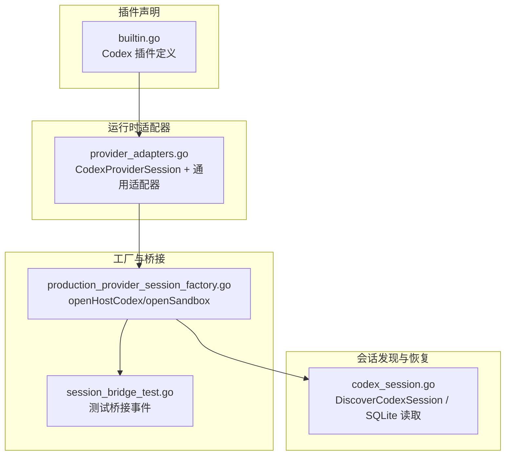
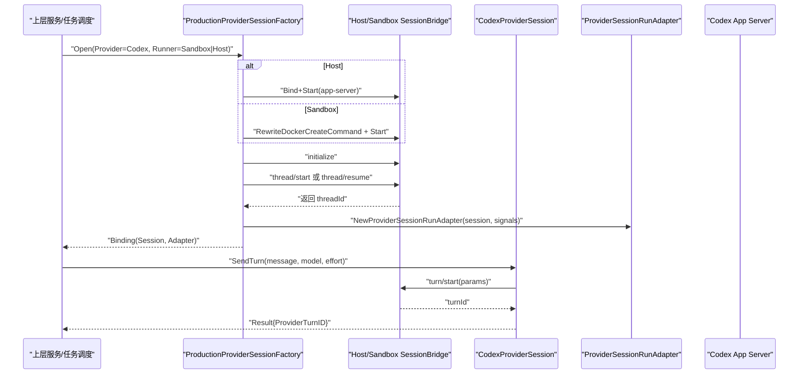
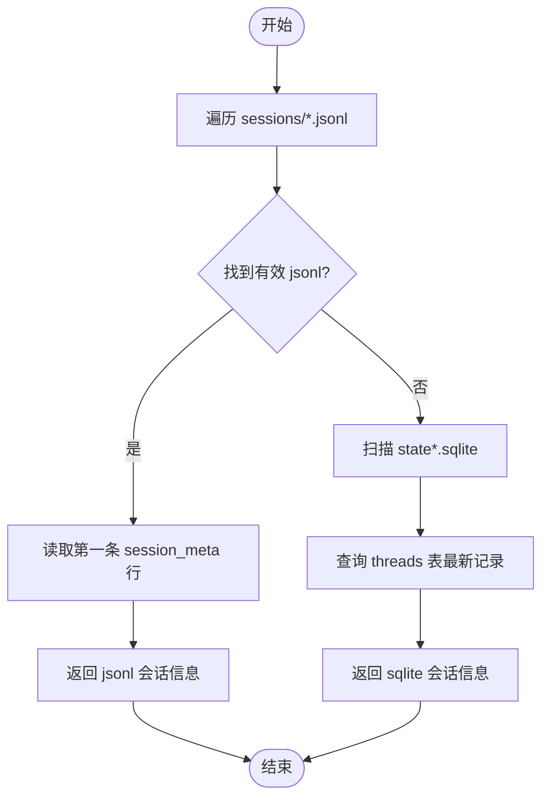
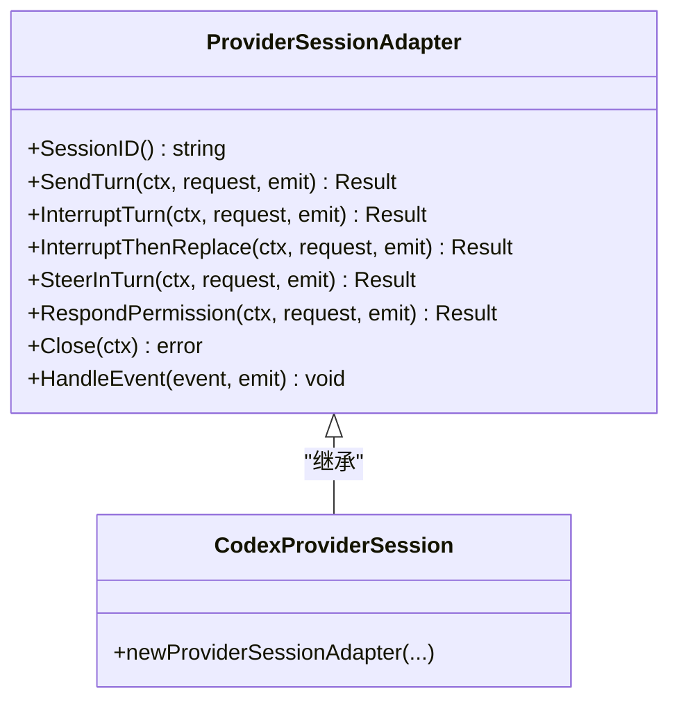
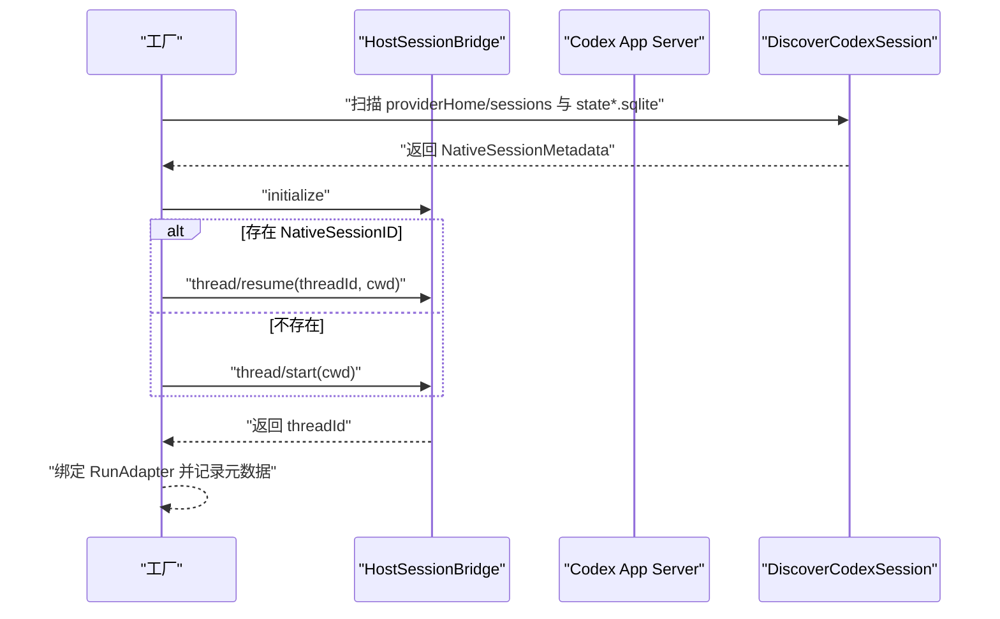
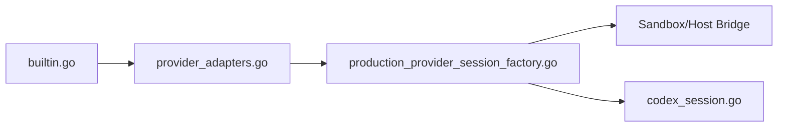

# Codex 提供商

<cite>
**本文引用的文件**   
- [internal/runtime/codex_session.go](file://internal/runtime/codex_session.go)
- [internal/runtime/provider_adapters.go](file://internal/runtime/provider_adapters.go)
- [internal/daemon/production_provider_session_factory.go](file://internal/daemon/production_provider_session_factory.go)
- [internal/runtimeplugin/builtin.go](file://internal/runtimeplugin/builtin.go)
- [internal/runner/runner_test.go](file://internal/runner/runner_test.go)
- [internal/daemon/task_test.go](file://internal/daemon/task_test.go)
- [internal/daemon/production_provider_session_factory_test.go](file://internal/daemon/production_provider_session_factory_test.go)
- [internal/runtime/session_bridge_test.go](file://internal/runtime/session_bridge_test.go)
</cite>

## 目录
1. [简介](#简介)
2. [项目结构](#项目结构)
3. [核心组件](#核心组件)
4. [架构总览](#架构总览)
5. [详细组件分析](#详细组件分析)
6. [依赖关系分析](#依赖关系分析)
7. [性能与并发](#性能与并发)
8. [故障排查指南](#故障排查指南)
9. [结论](#结论)
10. [附录](#附录)

## 简介
本文件系统性说明 CyberPenda 中 Codex 提供商的集成实现，覆盖以下关键主题：
- CODEX_HOME 环境配置与配置文件投影
- 会话持久化与恢复（JSONL 与 SQLite）
- API 密钥管理与环境变量注入
- 请求路由与桥接（Sandbox/Host）
- Codex CLI 工具调用、参数组装、输出解析与错误处理
- 会话恢复、并发控制与幂等性
- CodexSession 结构设计、消息协议、状态管理与异常处理
- OpenAI Responses 协议的适配（模型选择、流式传输、超时控制）

## 项目结构
Codex 提供商涉及四个层次：
- 插件声明层：定义 Codex 能力、启动模板、配置投影、凭证与环境变量。
- 运行时适配器层：封装 ProviderSessionTransport 与具体 wire 映射（turn/start、turn/interrupt 等）。
- 工厂与桥接层：在 Sandbox 或 Host 上启动并管理长生命周期进程（App Server），建立 JSON-RPC 通道。
- 会话发现与恢复层：扫描 providerHome 下的 sessions 与 state*.sqlite，定位最新会话用于恢复。

图示来源
- [internal/runtimeplugin/builtin.go:44-84](file://internal/runtimeplugin/builtin.go#L44-L84)
- [internal/runtime/provider_adapters.go:717-766](file://internal/runtime/provider_adapters.go#L717-L766)
- [internal/daemon/production_provider_session_factory.go:157-223](file://internal/daemon/production_provider_session_factory.go#L157-L223)
- [internal/runtime/codex_session.go:21-67](file://internal/runtime/codex_session.go#L21-L67)

章节来源
- [internal/runtimeplugin/builtin.go:44-84](file://internal/runtimeplugin/builtin.go#L44-L84)
- [internal/runtime/provider_adapters.go:717-766](file://internal/runtime/provider_adapters.go#L717-L766)
- [internal/daemon/production_provider_session_factory.go:157-223](file://internal/daemon/production_provider_session_factory.go#L157-L223)
- [internal/runtime/codex_session.go:21-67](file://internal/runtime/codex_session.go#L21-L67)

## 核心组件
- 插件声明（builtin.go）
  - 声明 Codex 支持 openai_responses 协议；提供 Launch 模板、NativeResume 模板、ProcessEnv（CODEX_HOME）、CredentialEnv（OPENAI_API_KEY、CODEX_API_KEY）、Transcript 解析器（codex_json）。
- 运行时适配器（provider_adapters.go）
  - 通用适配器负责幂等、冲突检测、结算等待、事件归一化；CodexProviderSession 将高层请求映射为 turn/start、turn/interrupt、item/permission/respond 等 wire 方法。
- 生产工厂（production_provider_session_factory.go）
  - 在 Host 或 Sandbox 上启动 App Server，完成 initialize → thread/start 或 thread/resume，绑定会话元数据，返回可运行的 ProviderSessionRunAdapter。
- 会话发现（codex_session.go）
  - 优先扫描 sessions/*.jsonl，若为空则回退到 state*.sqlite 查询 threads 表，返回最新会话标识与路径。

章节来源
- [internal/runtimeplugin/builtin.go:44-84](file://internal/runtimeplugin/builtin.go#L44-L84)
- [internal/runtime/provider_adapters.go:58-92](file://internal/runtime/provider_adapters.go#L58-92)
- [internal/runtime/provider_adapters.go:717-766](file://internal/runtime/provider_adapters.go#L717-L766)
- [internal/daemon/production_provider_session_factory.go:548-617](file://internal/daemon/production_provider_session_factory.go#L548-L617)
- [internal/runtime/codex_session.go:21-67](file://internal/runtime/codex_session.go#L21-L67)

## 架构总览
下图展示从任务发起、工厂创建、桥接建立到会话恢复与发送 Turn 的整体流程。

图示来源
- [internal/daemon/production_provider_session_factory.go:157-223](file://internal/daemon/production_provider_session_factory.go#L157-L223)
- [internal/daemon/production_provider_session_factory.go:548-617](file://internal/daemon/production_provider_session_factory.go#L548-L617)
- [internal/runtime/provider_adapters.go:717-766](file://internal/runtime/provider_adapters.go#L717-L766)

## 详细组件分析

### 插件声明与配置投影（builtin.go）
- 模型与协议
  - 要求 Model Provider，支持 openai_responses 协议，且首选该协议。
- 启动模板
  - 使用 {{binary}}、{{model}}、{{custom_args}}、{{goal}} 等占位符拼装 CLI 命令；同时支持 NativeResume 以“exec ... resume”方式恢复会话。
- 环境与凭证
  - 设置 CODEX_HOME 指向 runtime-home/codex；注入 OPENAI_API_KEY、CODEX_API_KEY。
- 输出解析
  - 指定 Transcript.Parser 为 codex_json，配合上游事件归一化。

章节来源
- [internal/runtimeplugin/builtin.go:44-84](file://internal/runtimeplugin/builtin.go#L44-L84)

### 配置投影与 CODEX_HOME（runner_test.go）
- 运行时会生成 provider-local config.toml（runtime-home/codex/config.toml），包含 model、base_url 等字段，供 Codex 读取。
- 验证了宿主侧 host config 不会被意外修改。

章节来源
- [internal/runner/runner_test.go:81-125](file://internal/runner/runner_test.go#L81-L125)

### 会话持久化与恢复（codex_session.go）
- 发现策略
  - 优先遍历 providerHome/sessions 下最新的 .jsonl 文件，解析首条 session_meta 行提取 session_id。
  - 若无 jsonl，则回退扫描 state*.sqlite，按 updated_at_ms/created_at_ms 等列取最新线程记录。
- 返回值
  - 返回 NativeSessionMetadata（ContainerID/NativeSessionID/NativeSessionPath），供后续 resume 使用。

图示来源
- [internal/runtime/codex_session.go:21-67](file://internal/runtime/codex_session.go#L21-L67)
- [internal/runtime/codex_session.go:97-145](file://internal/runtime/codex_session.go#L97-L145)

章节来源
- [internal/runtime/codex_session.go:21-67](file://internal/runtime/codex_session.go#L21-L67)
- [internal/runtime/codex_session.go:97-145](file://internal/runtime/codex_session.go#L97-L145)

### 工厂与桥接（production_provider_session_factory.go）
- Host 模式
  - 启动 app-server 子命令，合并非冲突 custom args，绑定 HostSessionBridge，完成 initialize 与 thread/start 或 thread/resume。
  - 记录容器/进程组身份（ContainerID/host-pgid）用于守护进程重启后的清理。
- Sandbox 模式
  - 通过 Docker 重写 create 命令，注入 bridge 与 provider binary，同样完成初始化与会话恢复。
- 绑定与关闭
  - 返回 ProviderSessionRunAdapter，监听 Closed/Terminated 信号，确保资源释放与状态一致性。

章节来源
- [internal/daemon/production_provider_session_factory.go:157-223](file://internal/daemon/production_provider_session_factory.go#L157-L223)
- [internal/daemon/production_provider_session_factory.go:428-534](file://internal/daemon/production_provider_session_factory.go#L428-L534)
- [internal/daemon/production_provider_session_factory.go:548-617](file://internal/daemon/production_provider_session_factory.go#L548-L617)

### 运行时适配器与消息协议（provider_adapters.go）
- 通用适配器职责
  - 幂等缓存、请求指纹、冲突检测、结算等待（settlement）、事件归一化、能力检查。
- Codex 协议映射
  - send: "turn/start"，interrupt: "turn/interrupt"，permission: "item/permission/respond"
  - params 中包含 threadId/turnId/input.model/effort/permission 相关字段。
  - 从响应中提取 turnId/threadId 更新活跃会话上下文。
- 事件处理
  - 将不同 provider 的事件统一映射为 lifecycle/steering/runtime_output 事件，便于 UI 与日志消费。

图示来源
- [internal/runtime/provider_adapters.go:58-92](file://internal/runtime/provider_adapters.go#L58-92)
- [internal/runtime/provider_adapters.go:717-766](file://internal/runtime/provider_adapters.go#L717-L766)

章节来源
- [internal/runtime/provider_adapters.go:58-92](file://internal/runtime/provider_adapters.go#L58-92)
- [internal/runtime/provider_adapters.go:717-766](file://internal/runtime/provider_adapters.go#L717-L766)

### 会话恢复序列（Host 示例）

图示来源
- [internal/daemon/production_provider_session_factory.go:548-617](file://internal/daemon/production_provider_session_factory.go#L548-L617)
- [internal/runtime/codex_session.go:21-67](file://internal/runtime/codex_session.go#L21-L67)

章节来源
- [internal/daemon/production_provider_session_factory.go:548-617](file://internal/daemon/production_provider_session_factory.go#L548-L617)
- [internal/runtime/codex_session.go:21-67](file://internal/runtime/codex_session.go#L21-L67)

### 输出解析与事件归一化
- 插件声明使用 codex_json 解析器，结合通用适配器的 HandleEvent，将 provider 通知转换为标准事件（lifecycle/steering/runtime_output）。
- 测试用例验证了生命周期事件 adapter=codex 以及 stdout/stderr 事件的存在。

章节来源
- [internal/runtimeplugin/builtin.go:73-84](file://internal/runtimeplugin/builtin.go#L73-L84)
- [internal/daemon/task_test.go:655-688](file://internal/daemon/task_test.go#L655-L688)
- [internal/runtime/runtime_test.go:191-222](file://internal/runtime/runtime_test.go#L191-L222)

### OpenAI Responses 协议适配
- 插件声明支持 openai_responses 协议，并在 Host/Sandbox 启动时传递 model 与 effort 等参数。
- 模型选择
  - 通过 Launch 模板中的 {{model}} 与请求中的 RequestedReasoningEffort 传入 turn/start 的 input.model 与 effort。
- 流式传输
  - 插件声明 StreamingTranscript=true，事件经 HandleEvent 归一化为 runtime_output 事件，UI 可实时渲染。
- 超时控制
  - 上层通过 context.WithTimeout 控制中断/替换等操作；适配器将底层错误包装为 ProviderSessionOperationError，便于区分超时与业务失败。

章节来源
- [internal/runtimeplugin/builtin.go:63-84](file://internal/runtimeplugin/builtin.go#L63-L84)
- [internal/runtime/provider_adapters.go:717-766](file://internal/runtime/provider_adapters.go#L717-L766)
- [internal/runtime/provider_adapters_test.go:686-711](file://internal/runtime/provider_adapters_test.go#L686-L711)

## 依赖关系分析
- 插件声明依赖 runnerprofile 字段与 launch 模板，驱动 CLI 参数装配。
- 适配器依赖 ProviderSessionTransport（Sandbox/Host Bridge），屏蔽底层差异。
- 工厂依赖 Docker/Host 进程管理，负责桥接生命周期与会话恢复。
- 会话发现依赖文件系统与 SQLite（modernc.org/sqlite），仅读扫描。

图示来源
- [internal/runtimeplugin/builtin.go:44-84](file://internal/runtimeplugin/builtin.go#L44-L84)
- [internal/runtime/provider_adapters.go:717-766](file://internal/runtime/provider_adapters.go#L717-L766)
- [internal/daemon/production_provider_session_factory.go:157-223](file://internal/daemon/production_provider_session_factory.go#L157-L223)
- [internal/runtime/codex_session.go:21-67](file://internal/runtime/codex_session.go#L21-L67)

章节来源
- [internal/runtimeplugin/builtin.go:44-84](file://internal/runtimeplugin/builtin.go#L44-L84)
- [internal/runtime/provider_adapters.go:717-766](file://internal/runtime/provider_adapters.go#L717-L766)
- [internal/daemon/production_provider_session_factory.go:157-223](file://internal/daemon/production_provider_session_factory.go#L157-L223)
- [internal/runtime/codex_session.go:21-67](file://internal/runtime/codex_session.go#L21-L67)

## 性能与并发
- 幂等与去重
  - 基于 requestID 与 fingerprint 的缓存，避免重复下发同一请求。
- 并发控制
  - begin/end 互斥保证同一时刻只有一个控制操作在进行；ControlBusy/SessionClosed/SessionOffline 暴露健康状态。
- 结算等待
  - 针对中断/替换场景，等待 provider 端 turn 终态（aborted/completed/failed 等）后再返回，避免竞态。
- 资源回收
  - 监听 Closed/Terminated 信号，确保桥接与进程及时清理。

章节来源
- [internal/runtime/provider_adapters.go:282-337](file://internal/runtime/provider_adapters.go#L282-L337)
- [internal/runtime/provider_adapters.go:425-445](file://internal/runtime/provider_adapters.go#L425-L445)
- [internal/runtime/provider_adapters.go:221-280](file://internal/runtime/provider_adapters.go#L221-L280)

## 故障排查指南
- 常见错误类型
  - ProviderSessionOperationError：底层 RPC 错误或上下文超时。
  - UnsupportedProviderSessionCapabilityError：能力未启用。
  - ProviderSessionRequestConflictError：相同 requestID 但指纹不一致。
- 诊断要点
  - 检查 Host/Sandbox 桥接是否成功 initialize 与 thread/start/resume。
  - 确认 CODEX_HOME 与 config.toml 是否存在且包含 model/base_url。
  - 核对 OPENAI_API_KEY/CODEX_API_KEY 是否注入。
  - 查看事件流中是否有 adapter=codex 的生命周期事件与 runtime_output。
- 参考测试
  - Host 启动与参数校验、会话恢复、事件输出断言。

章节来源
- [internal/daemon/production_provider_session_factory_test.go:331-399](file://internal/daemon/production_provider_session_factory_test.go#L331-L399)
- [internal/daemon/task_test.go:655-688](file://internal/daemon/task_test.go#L655-L688)
- [internal/runtime/session_bridge_test.go:185-203](file://internal/runtime/session_bridge_test.go#L185-L203)

## 结论
Codex 提供商在 CyberPenda 中以“插件声明 + 运行时适配器 + 工厂桥接 + 会话发现”的分层设计实现，具备：
- 明确的配置与环境隔离（CODEX_HOME、config.toml、API Key 注入）
- 健壮的会话持久化与恢复（JSONL/SQLite）
- 统一的请求路由与事件归一化（Sandbox/Host 一致体验）
- 完善的并发控制、幂等与结算机制
- 对 OpenAI Responses 协议的适配（模型选择、流式输出、超时控制）

## 附录
- 术语
  - Provider：外部 AI 提供商（如 Codex）
  - Bridge：Sandbox/Host 与 Provider 之间的 JSON-RPC 通道
  - Turn：一次对话轮次
  - Settlement：中断/替换后等待 provider 端终态
- 相关文件索引
  - 插件声明：[internal/runtimeplugin/builtin.go](file://internal/runtimeplugin/builtin.go)
  - 适配器与协议映射：[internal/runtime/provider_adapters.go](file://internal/runtime/provider_adapters.go)
  - 工厂与桥接：[internal/daemon/production_provider_session_factory.go](file://internal/daemon/production_provider_session_factory.go)
  - 会话发现与恢复：[internal/runtime/codex_session.go](file://internal/runtime/codex_session.go)
  - 配置投影验证：[internal/runner/runner_test.go](file://internal/runner/runner_test.go)
  - 事件与输出验证：[internal/daemon/task_test.go](file://internal/daemon/task_test.go)
  - 桥接事件测试：[internal/runtime/session_bridge_test.go](file://internal/runtime/session_bridge_test.go)