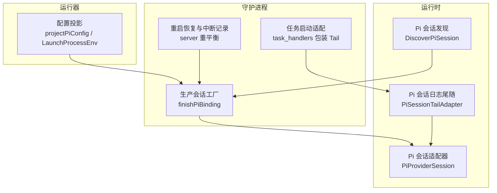
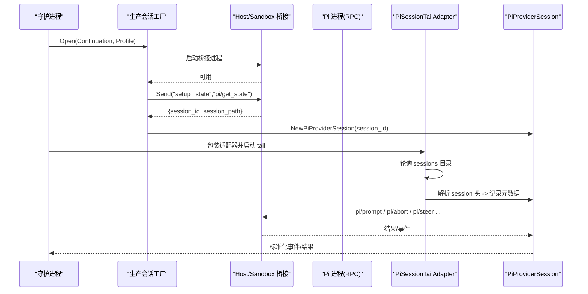
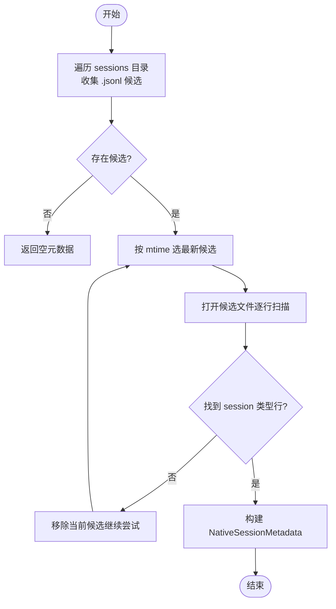
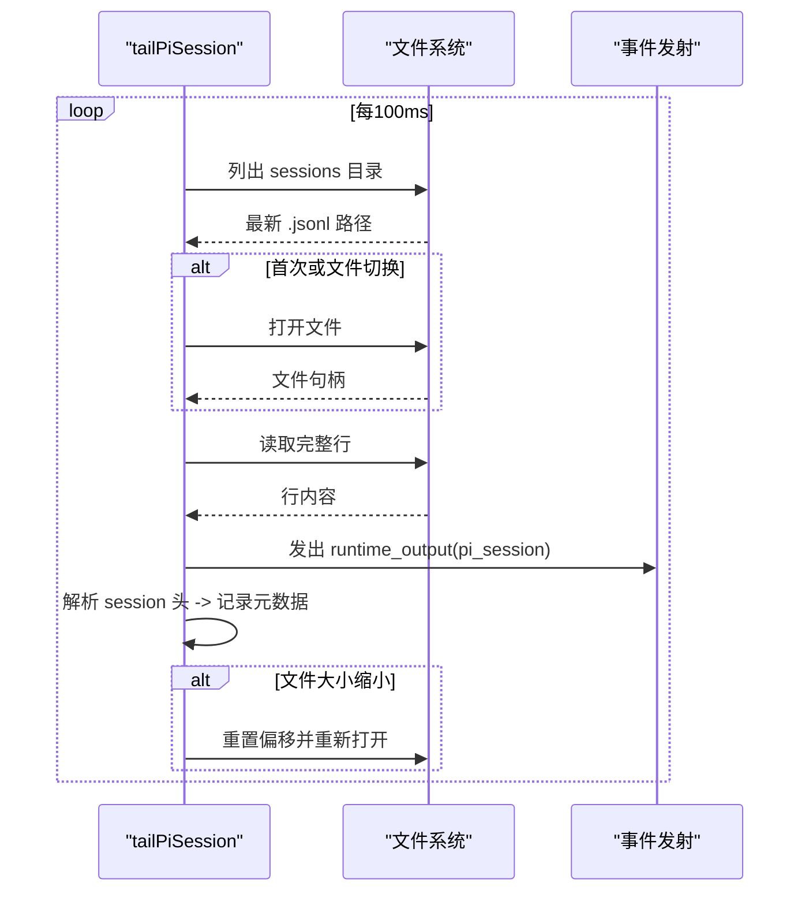
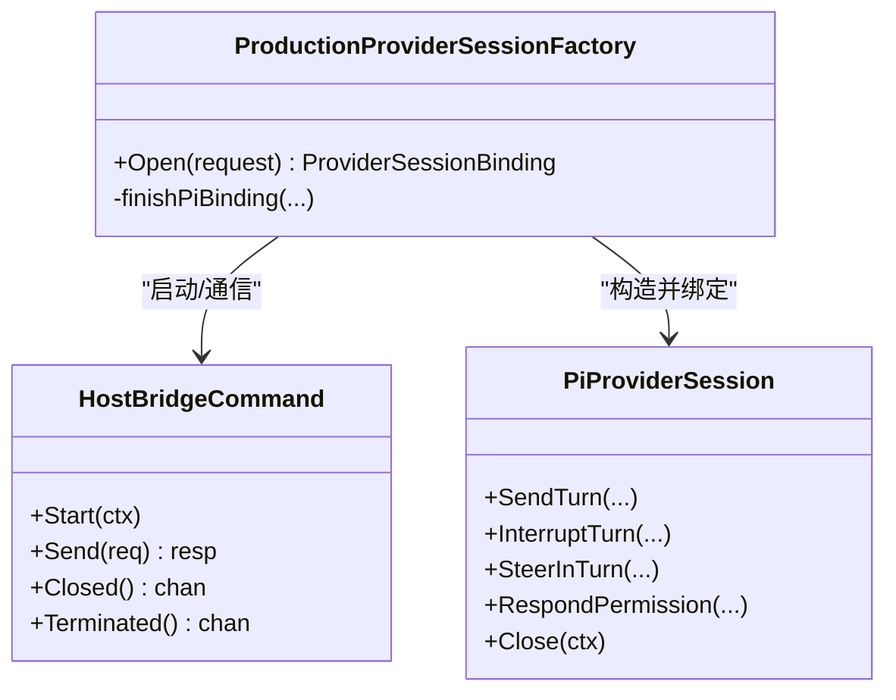
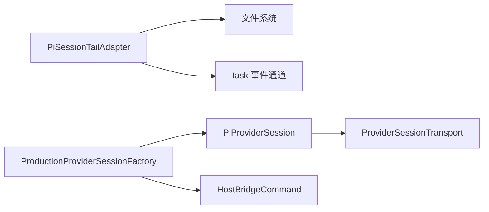

# Pi 提供商

<cite>
**本文引用的文件**
- [pi_session_discovery.go](file://internal/runtime/pi_session_discovery.go)
- [pi_session_tail.go](file://internal/runtime/pi_session_tail.go)
- [provider_adapters.go](file://internal/runtime/provider_adapters.go)
- [production_provider_session_factory.go](file://internal/daemon/production_provider_session_factory.go)
- [task_handlers.go](file://internal/daemon/task_handlers.go)
- [server.go](file://internal/daemon/server.go)
- [projection.go](file://internal/runner/projection.go)
- [pi_sandbox_test.go](file://internal/runner/pi_sandbox_test.go)
- [runtime_test.go](file://internal/runtime/runtime_test.go)
- [pi_session_tail_test.go](file://internal/runtime/pi_session_tail_test.go)
- [2026-06-19-runtime-transcript-design.md](file://docs/superpowers/specs/2026-06-19-runtime-transcript-design.md)
</cite>

## 目录
1. [简介](#简介)
2. [项目结构](#项目结构)
3. [核心组件](#核心组件)
4. [架构总览](#架构总览)
5. [详细组件分析](#详细组件分析)
6. [依赖关系分析](#依赖关系分析)
7. [性能与可靠性](#性能与可靠性)
8. [故障排查指南](#故障排查指南)
9. [结论](#结论)

## 简介
本文件系统性说明 Pi 提供商在系统中的集成实现，重点覆盖：
- PI_CODING_AGENT_DIR 配置及其对会话发现、日志尾随的影响
- Pi 代理进程管理与会话生命周期
- 事件监听与通知机制（含状态监控）
- 会话发现算法、连接建立与错误恢复
- PiSessionDiscovery 的进程扫描、状态检测、连接建立
- PiSessionTail 的日志流处理、事件解析与错误恢复
- 多协议支持（OpenAI Chat Completions、OpenAI Responses、Anthropic Messages）的实现细节

## 项目结构
Pi 提供商相关代码主要分布在 runtime 与 daemon 层：
- internal/runtime：提供适配器、会话发现、日志尾随等运行时能力
- internal/daemon：负责生产环境下的会话工厂、桥接启动、RPC 绑定与清理
- internal/runner：负责任务布局、环境变量与配置投影（包含 PI_* 变量注入）

图表来源
- [production_provider_session_factory.go:672-729](file://internal/daemon/production_provider_session_factory.go#L672-L729)
- [task_handlers.go:896-933](file://internal/daemon/task_handlers.go#L896-L933)
- [pi_session_discovery.go:11-65](file://internal/runtime/pi_session_discovery.go#L11-L65)
- [pi_session_tail.go:17-71](file://internal/runtime/pi_session_tail.go#L17-L71)
- [provider_adapters.go:813-827](file://internal/runtime/provider_adapters.go#L813-L827)
- [projection.go:540-637](file://internal/runner/projection.go#L540-L637)

章节来源
- [production_provider_session_factory.go:672-729](file://internal/daemon/production_provider_session_factory.go#L672-L729)
- [task_handlers.go:896-933](file://internal/daemon/task_handlers.go#L896-L933)
- [pi_session_discovery.go:11-65](file://internal/runtime/pi_session_discovery.go#L11-L65)
- [pi_session_tail.go:17-71](file://internal/runtime/pi_session_tail.go#L17-L71)
- [provider_adapters.go:813-827](file://internal/runtime/provider_adapters.go#L813-L827)
- [projection.go:540-637](file://internal/runner/projection.go#L540-L637)

## 核心组件
- 会话发现：DiscoverPiSession 扫描 providerHome/agent/sessions 下最新 .jsonl 并解析首个 session 行以获取 NativeSessionID 与路径。
- 会话日志尾随：PiSessionTailAdapter 并行于主进程运行，轮询 sessions 目录，打开最新 jsonl，逐行读取并作为 runtime_output 事件发出；同时解析 session 头写入元数据。
- Pi 会话适配器：PiProviderSession 通过 ProviderSessionTransport 发送 pi/prompt、pi/abort、pi/steer、pi/permission/respond 等 RPC，并在 SendTurn 前按顺序下发 set_model 与 set_thinking_level。
- 生产会话工厂：finishPiBinding 通过 bridge 调用 pi/get_state 获取持久化 session_id 与 session_path，校验续传一致性，构造 PiProviderSession 并注册到任务级绑定表。
- 配置与环境：projectPiConfig 与 LaunchProcessEnv 将 PI_CODING_AGENT_DIR、PI_CODING_AGENT_SESSION_DIR 等变量注入到宿主或沙箱进程环境中。

章节来源
- [pi_session_discovery.go:11-65](file://internal/runtime/pi_session_discovery.go#L11-L65)
- [pi_session_tail.go:17-71](file://internal/runtime/pi_session_tail.go#L17-L71)
- [provider_adapters.go:813-827](file://internal/runtime/provider_adapters.go#L813-L827)
- [production_provider_session_factory.go:672-729](file://internal/daemon/production_provider_session_factory.go#L672-L729)
- [projection.go:540-637](file://internal/runner/projection.go#L540-L637)
- [pi_sandbox_test.go:54-71](file://internal/runner/pi_sandbox_test.go#L54-L71)

## 架构总览
Pi 提供商采用“长驻 RPC 会话 + 文件式实时日志”的模式：
- 控制面：Daemon 通过 HostBridgeCommand 启动 pentest-provider-bridge，再桥接到 pi --mode rpc。
- 会话面：pi 进程维护一个持久化会话，返回 session_id 与 session_path；后续所有交互基于该会话。
- 观测面：Pi 将活动写入 agent/sessions 下的 jsonl 文件，PiSessionTailAdapter 实时 tail 并转换为标准事件。

图表来源
- [production_provider_session_factory.go:672-729](file://internal/daemon/production_provider_session_factory.go#L672-L729)
- [task_handlers.go:896-933](file://internal/daemon/task_handlers.go#L896-L933)
- [pi_session_tail.go:73-148](file://internal/runtime/pi_session_tail.go#L73-L148)
- [provider_adapters.go:813-827](file://internal/runtime/provider_adapters.go#L813-L827)

## 详细组件分析

### PI_CODING_AGENT_DIR 配置与会话根目录
- 作用：为 Pi 指定工作根目录，其子目录 agent/sessions 存放会话 jsonl 文件。
- 注入位置：
  - 宿主模式：LaunchProcessEnv 设置 PI_CODING_AGENT_DIR、PI_CODING_AGENT_SESSION_DIR，并确保 HOME 指向隔离路径。
  - 沙箱模式：BuildSandboxCommand 同样注入上述变量，保证容器内路径一致。
- 影响范围：
  - DiscoverPiSession 默认从 providerHome/agent/sessions 扫描。
  - PiSessionTailAdapter 使用相同根目录定位最新 jsonl。
  - projectPiConfig 会创建 agent 目录并写入 settings/auth 等配置文件。

章节来源
- [pi_sandbox_test.go:54-71](file://internal/runner/pi_sandbox_test.go#L54-L71)
- [pi_sandbox_test.go:149-175](file://internal/runner/pi_sandbox_test.go#L149-L175)
- [projection.go:540-637](file://internal/runner/projection.go#L540-L637)
- [pi_session_discovery.go:11-20](file://internal/runtime/pi_session_discovery.go#L11-L20)
- [pi_session_tail.go:32-36](file://internal/runtime/pi_session_tail.go#L32-L36)

### 会话自动发现算法（DiscoverPiSession）
- 扫描策略：递归遍历 providerHome/agent/sessions，收集所有 .jsonl 候选项。
- 选择策略：按文件修改时间戳选择最新候选；若为空则返回零值（best-effort）。
- 解析策略：逐行读取候选文件，解析首个包含 session 类型的行，提取 id 与 cwd 等字段，返回 NativeSessionMetadata。
- 复杂度：O(N log N) 排序近似（实际为线性扫描取最大），I/O 开销与文件数量成正比。

图表来源
- [pi_session_discovery.go:11-65](file://internal/runtime/pi_session_discovery.go#L11-L65)

章节来源
- [pi_session_discovery.go:11-65](file://internal/runtime/pi_session_discovery.go#L11-L65)
- [runtime_test.go:958-988](file://internal/runtime/runtime_test.go#L958-L988)

### 日志尾随与会话元数据捕获（PiSessionTailAdapter）
- 并发模型：Run 内部启动 tail 协程，与 inner.Run 并行执行；当上下文取消时，tail 退出。
- 文件选择：每 100ms 轮询 sessions 目录，选择最新 .jsonl；若当前文件被替换或截断，自动重新打开并从末尾恢复。
- 事件输出：每行非空文本作为 runtime_output 事件发出，stream 标记为 "pi_session"；同时解析 session 头写入元数据。
- 容错：忽略存储噪声行；文件不存在或打开失败时跳过；上下文取消时安全关闭句柄。

图表来源
- [pi_session_tail.go:73-148](file://internal/runtime/pi_session_tail.go#L73-L148)

章节来源
- [pi_session_tail.go:17-71](file://internal/runtime/pi_session_tail.go#L17-L71)
- [pi_session_tail.go:73-148](file://internal/runtime/pi_session_tail.go#L73-L148)
- [pi_session_tail_test.go:63-140](file://internal/runtime/pi_session_tail_test.go#L63-L140)

### Pi 代理进程管理与会话生命周期
- 启动流程：
  - 宿主模式：通过 HostBridgeCommand 启动 pentest-provider-bridge，参数包含 --provider pi 与 --mode rpc，以及 --session-id 稳定标识。
  - 沙箱模式：DockerSandboxAdapter 启动镜像内的桥接进程，参数类似。
- 会话绑定：
  - finishPiBinding 调用 pi/get_state 获取 session_id 与 session_path。
  - 若请求携带续传 ID，需与返回的一致，否则拒绝以避免身份漂移。
  - 构造 PiProviderSession 并注册到任务级绑定表，关联 RunAdapter 用于事件转发。
- 清理策略：
  - 关闭时删除任务级绑定，关闭桥接，并清理 host 侧 Pi 工件（如 auth/settings 等）。

图表来源
- [production_provider_session_factory.go:672-729](file://internal/daemon/production_provider_session_factory.go#L672-L729)
- [provider_adapters.go:813-827](file://internal/runtime/provider_adapters.go#L813-L827)

章节来源
- [production_provider_session_factory.go:672-729](file://internal/daemon/production_provider_session_factory.go#L672-L729)
- [production_provider_session_factory.go:820-855](file://internal/daemon/production_provider_session_factory.go#L820-L855)

### 事件监听与通知机制
- 事件来源：
  - 来自桥接的未决通知（如 claude/runtime_output、pi/* 事件）由 HandleEvent 统一映射为标准生命周期/引导事件。
  - PiSessionTailAdapter 将 jsonl 行转为 runtime_output 事件，stream 标记为 "pi_session"。
- 事件语义：
  - 包括 requested/started/acknowledged/settled/failed 等阶段，以及 permission_requested 等权限提示。
  - 对于中断/替换场景，等待 settle 信号确保幂等与一致性。
- 传输层：
  - ProviderSessionTransport 抽象了底层 RPC 发送与关闭，屏蔽具体实现差异。

章节来源
- [provider_adapters.go:570-671](file://internal/runtime/provider_adapters.go#L570-L671)
- [pi_session_tail.go:17-71](file://internal/runtime/pi_session_tail.go#L17-L71)

### 多协议支持（OpenAI Chat Completions、OpenAI Responses、Anthropic Messages）
- 协议声明：Pi 运行时能力声明支持 openai_chat_completions、openai_responses、anthropic_messages。
- 端点推导：
  - OpenAI 系列（Chat Completions、Responses）直接使用共享提供者 base URL。
  - Anthropic Messages 会去掉最终路径段，以便客户端追加版本化 messages 操作路径。
- 严格匹配：
  - 若用户显式 pin 到某个协议但对应端点不可用，解析应失败而非静默降级。
- 配置投影：
  - projectPiConfig 根据 profile 与已投影的全局 Model Provider 生成 models.json、settings.json 等，并将 API Key 注入环境变量。

章节来源
- [TaskDetailPage.test.tsx:140-163](file://web/src/pages/TaskDetailPage.test.tsx#L140-L163)
- [modelprovider/resolver_test.go:362-380](file://internal/modelprovider/resolver_test.go#L362-L380)
- [modelprovider/modelprovider_test.go:223-245](file://internal/modelprovider/modelprovider_test.go#L223-L245)
- [projection_endpoint_test.go:64-98](file://internal/runner/projection_endpoint_test.go#L64-L98)
- [projection.go:540-637](file://internal/runner/projection.go#L540-L637)

## 依赖关系分析
- 组件耦合：
  - PiSessionTailAdapter 依赖 filesystem 与 task.EventKindRuntimeOutput 事件通道。
  - PiProviderSession 依赖 ProviderSessionTransport 与 runtimeplugin.Capabilities。
  - 生产会话工厂依赖 HostBridgeCommand 与 PiProviderSession。
- 外部依赖：
  - Docker/Podman 容器运行时（沙箱模式）。
  - 文件系统（sessions 目录读写）。
  - JSON/JSONL 格式解析。

图表来源
- [pi_session_tail.go:73-148](file://internal/runtime/pi_session_tail.go#L73-L148)
- [provider_adapters.go:813-827](file://internal/runtime/provider_adapters.go#L813-L827)
- [production_provider_session_factory.go:672-729](file://internal/daemon/production_provider_session_factory.go#L672-L729)

章节来源
- [pi_session_tail.go:73-148](file://internal/runtime/pi_session_tail.go#L73-L148)
- [provider_adapters.go:813-827](file://internal/runtime/provider_adapters.go#L813-L827)
- [production_provider_session_factory.go:672-729](file://internal/daemon/production_provider_session_factory.go#L672-L729)

## 性能与可靠性
- 轮询频率：PiSessionTailAdapter 每 100ms 轮询一次，兼顾低延迟与 I/O 压力。
- 文件旋转与截断：检测到文件变小或路径变化时自动重开，避免丢失或重复。
- 事件去噪：忽略存储噪声行，减少无用事件。
- 幂等与一致性：中断/替换路径通过 settlement 机制确保只返回一次结果。
- 资源清理：关闭时释放文件句柄、删除任务绑定、清理 host 工件，防止泄漏。

[本节为通用指导，不直接分析具体文件]

## 故障排查指南
- 会话发现为空：
  - 检查 PI_CODING_AGENT_DIR 是否正确注入，确认 agent/sessions 目录下是否存在 .jsonl 文件。
  - 验证文件是否包含有效的 session 类型首行。
- 日志无输出：
  - 确认 PiSessionTailAdapter 已包装到适配器链中（沙箱模式下必须）。
  - 检查 sessions 目录权限与可写性。
- 会话续传失败：
  - 核对 Continuation.NativeSessionID 与 pi/get_state 返回的 session_id 是否一致。
- 守护进程重启后任务中断：
  - server 会在重平衡阶段记录 recovery 事件，并尝试 reconcile Terminal Continuations。

章节来源
- [pi_session_discovery.go:11-65](file://internal/runtime/pi_session_discovery.go#L11-L65)
- [task_handlers.go:896-933](file://internal/daemon/task_handlers.go#L896-L933)
- [production_provider_session_factory.go:672-729](file://internal/daemon/production_provider_session_factory.go#L672-L729)
- [server.go:275-304](file://internal/daemon/server.go#L275-L304)

## 结论
Pi 提供商通过“持久化 RPC 会话 + 文件式实时日志”的组合，实现了高可靠、可观测、可扩展的集成方案。PI_CODING_AGENT_DIR 作为关键配置锚点，贯穿会话发现、日志尾随与配置投影。PiSessionDiscovery 与 PiSessionTailAdapter 分别承担离线发现与在线观测职责，配合生产会话工厂完成健壮的连接建立与生命周期管理。多协议支持通过严格的端点推导与配置投影落地，满足 OpenAI 与 Anthropic 的不同协议需求。整体设计强调幂等、可恢复与最小侵入，便于在复杂部署环境下稳定运行。