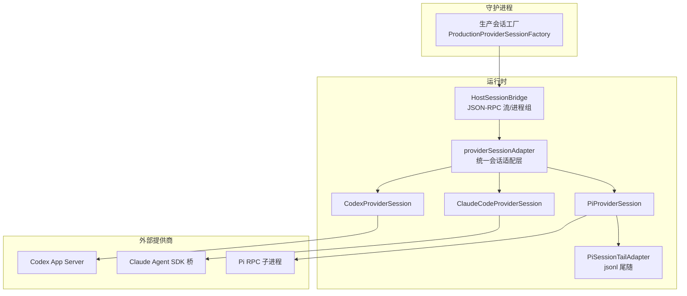
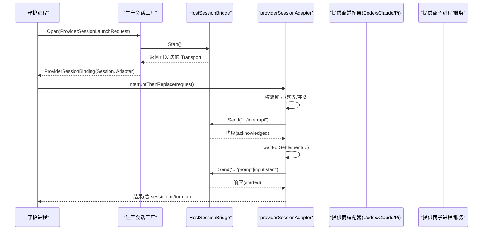
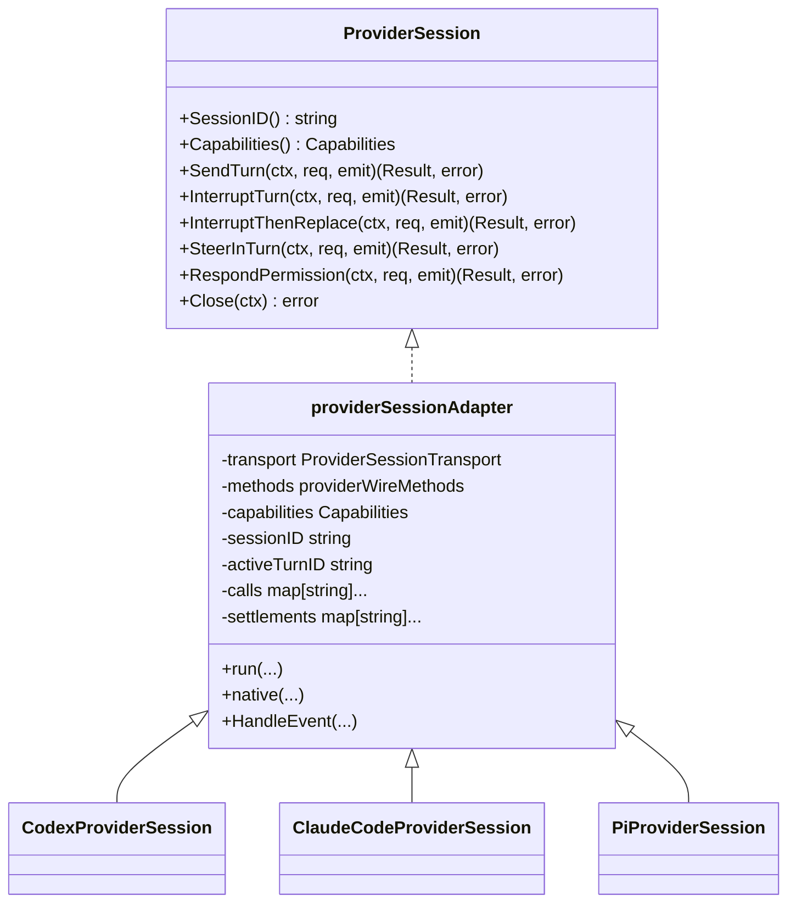
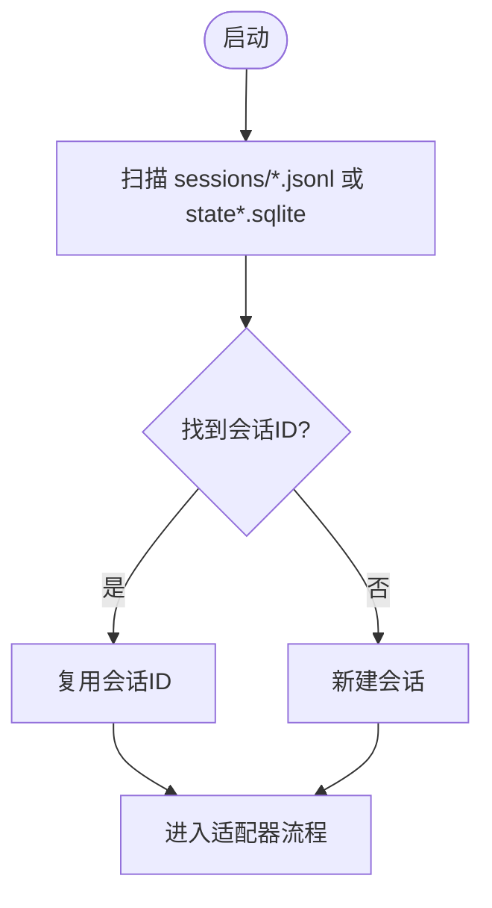
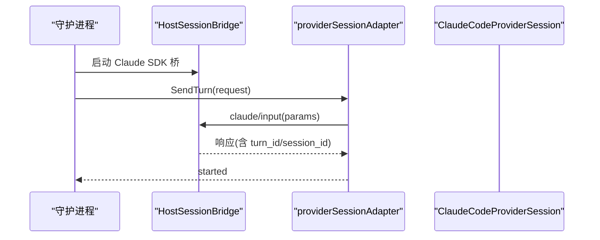
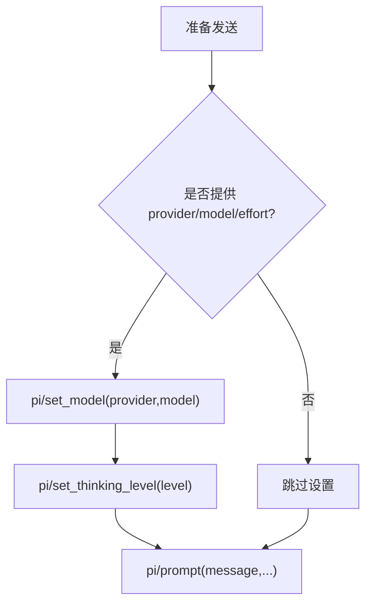
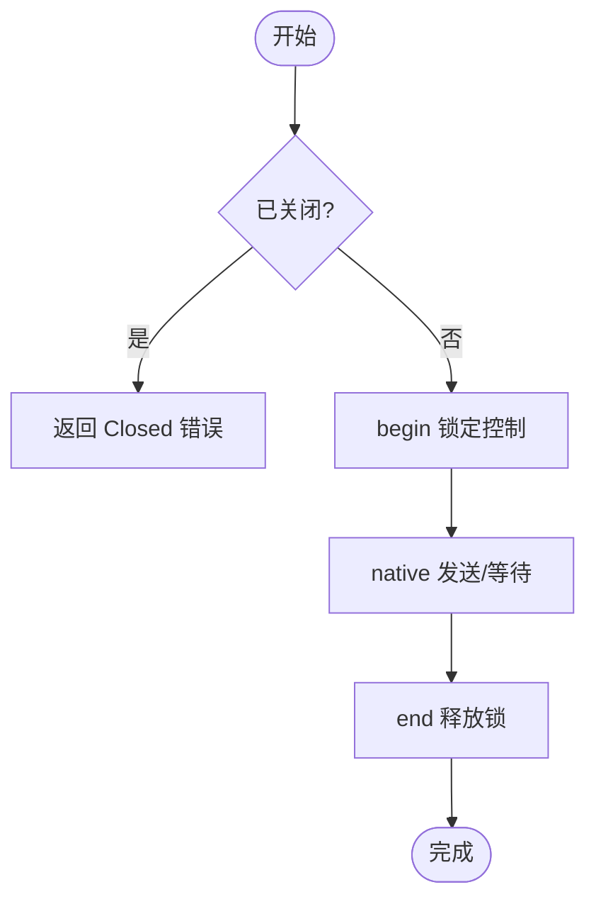
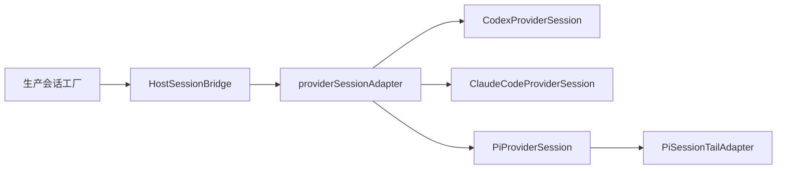

# 内置提供商实现

<cite>
**本文引用的文件**   
- [provider_adapters.go](file://internal/runtime/provider_adapters.go)
- [provider_session.go](file://internal/runtime/provider_session.go)
- [host_session_bridge.go](file://internal/runtime/host_session_bridge.go)
- [codex_session.go](file://internal/runtime/codex_session.go)
- [pi_session_discovery.go](file://internal/runtime/pi_session_discovery.go)
- [pi_session_tail.go](file://internal/runtime/pi_session_tail.go)
- [production_provider_session_factory.go](file://internal/daemon/production_provider_session_factory.go)
- [runtime_turn_selection_test.go](file://internal/daemon/runtime_turn_selection_test.go)
- [projection.go](file://internal/runner/projection.go)
- [runtime-native-steer.md](file://docs/specs/runtime-native-steer.md)
- [paseo-provider-native-steer-matrix.md](file://docs/research/paseo-provider-native-steer-matrix.md)
</cite>

## 目录
1. [简介](#简介)
2. [项目结构](#项目结构)
3. [核心组件](#核心组件)
4. [架构总览](#架构总览)
5. [详细组件分析](#详细组件分析)
6. [依赖关系分析](#依赖关系分析)
7. [性能与可靠性](#性能与可靠性)
8. [故障排查指南](#故障排查指南)
9. [结论](#结论)
10. [附录](#附录)

## 简介
本文件聚焦于内置 AI 提供商插件的实现细节，覆盖 Codex、Claude Code、Pi 三个提供商的特定配置、环境变量、认证机制与会话管理；阐述提供商特定的命令构建逻辑、参数映射与输出解析；说明差异处理、能力检测与降级策略；并深入解析 ProviderAdapter 接口设计与适配器模式在会话生命周期、错误处理、超时控制与资源清理方面的实现。

## 项目结构
围绕“运行时/会话桥/适配器”的关键代码分布如下：
- 运行时与适配器
  - internal/runtime/provider_adapters.go：ProviderSessionTransport、providerSessionAdapter、各提供商适配器（Codex/Claude/Pi）
  - internal/runtime/provider_session.go：ProviderSession 接口、能力枚举、事件回调
  - internal/runtime/host_session_bridge.go：HostSessionBridge（进程组、JSON-RPC 流、终止信号）
  - internal/runtime/codex_session.go：Codex 会话发现（JSONL/SQLite）
  - internal/runtime/pi_session_discovery.go：Pi 会话发现（JSONL）
  - internal/runtime/pi_session_tail.go：Pi 会话文件尾随输出转发
- 守护进程与工厂
  - internal/daemon/production_provider_session_factory.go：生产环境会话工厂（按 Task 绑定、持久化桥）
  - internal/daemon/runtime_turn_selection_test.go：原生引导行为与能力断言测试
- 运行期投影与预览
  - internal/runner/projection.go：Pi 模型投影、Codex 鉴权脱敏等
- 规范与研究
  - docs/specs/runtime-native-steer.md：原生引导能力契约与实现决策
  - docs/research/paseo-provider-native-steer-matrix.md：能力矩阵与差距确认

**图示来源** 
- [production_provider_session_factory.go](file://internal/daemon/production_provider_session_factory.go)
- [host_session_bridge.go](file://internal/runtime/host_session_bridge.go)
- [provider_adapters.go](file://internal/runtime/provider_adapters.go)
- [pi_session_tail.go](file://internal/runtime/pi_session_tail.go)

**章节来源**
- [provider_adapters.go:1-120](file://internal/runtime/provider_adapters.go#L1-L120)
- [provider_session.go:14-38](file://internal/runtime/provider_session.go#L14-L38)
- [host_session_bridge.go:15-82](file://internal/runtime/host_session_bridge.go#L15-L82)
- [pi_session_tail.go:17-36](file://internal/runtime/pi_session_tail.go#L17-L36)

## 核心组件
- ProviderSession 接口与能力集
  - 定义 send_turn、interrupt_turn、interrupt_then_replace、in_turn_steer、permission_response、resume_session 等能力与模式
  - 提供统一的 SendTurn/InterruptTurn/InterruptThenReplace/SteerInTurn/RespondPermission/Close 方法族
- providerSessionAdapter 通用适配层
  - 封装请求去重、幂等缓存、并发冲突保护、结算等待（settlement）、事件归一化、会话/轮次 ID 维护
  - 通过 providerWireMethods 注入各提供商的 wire 方法名、参数构造、turnID/sessionID 提取、可选 prepareSend 前置设置
- HostSessionBridge 进程桥
  - 以 JSON-RPC 行帧协议与宿主进程通信，支持任务级绑定、续接、关闭、异常终止信号
- 提供商适配器
  - CodexProviderSession：基于 turn/start、turn/interrupt、item/permission/respond
  - ClaudeCodeProviderSession：基于 claude/input、claude/interrupt、claude/permission/respond
  - PiProviderSession：基于 pi/prompt、pi/abort、pi/steer、pi/permission/respond，且支持 in_turn_steer
- Pi 会话尾随与发现
  - PiSessionTailAdapter 将 Pi jsonl 实时转为 runtime_output 事件
  - DiscoverPiSession/DiscoverCodexSession 从本地会话文件恢复最新会话标识

**章节来源**
- [provider_session.go:14-38](file://internal/runtime/provider_session.go#L14-L38)
- [provider_adapters.go:30-92](file://internal/runtime/provider_adapters.go#L30-L92)
- [host_session_bridge.go:59-82](file://internal/runtime/host_session_bridge.go#L59-L82)
- [provider_adapters.go:727-766](file://internal/runtime/provider_adapters.go#L727-L766)
- [provider_adapters.go:779-785](file://internal/runtime/provider_adapters.go#L779-L785)
- [provider_adapters.go:815-827](file://internal/runtime/provider_adapters.go#L815-L827)
- [pi_session_tail.go:17-36](file://internal/runtime/pi_session_tail.go#L17-L36)
- [pi_session_discovery.go:11-20](file://internal/runtime/pi_session_discovery.go#L11-L20)
- [codex_session.go:21-27](file://internal/runtime/codex_session.go#L21-L27)

## 架构总览
下图展示从守护进程到提供商的端到端调用链，包括中断替换与结算流程。

**图示来源** 
- [production_provider_session_factory.go:225-244](file://internal/daemon/production_provider_session_factory.go#L225-L244)
- [host_session_bridge.go:252-315](file://internal/runtime/host_session_bridge.go#L252-L315)
- [provider_adapters.go:134-192](file://internal/runtime/provider_adapters.go#L134-L192)

## 详细组件分析

### ProviderAdapter 接口与适配器模式
- 接口设计
  - ProviderSession 暴露统一控制面，屏蔽底层提供商差异
  - Capabilities 驱动功能开关，未声明的能力直接拒绝操作
- 适配器实现要点
  - run/native 路径统一处理：参数构造、prepareSend 前置、错误包装、事件发射、结果缓存
  - settlementTarget/waitForSettlement 保证中断后状态收敛再发起替换
  - HandleEvent 将不同提供商事件归一化为 lifecycle/steering/runtime_output 事件
- 类图（代码级）

**图示来源** 
- [provider_session.go:140-152](file://internal/runtime/provider_session.go#L140-L152)
- [provider_adapters.go:58-92](file://internal/runtime/provider_adapters.go#L58-L92)
- [provider_adapters.go:727-766](file://internal/runtime/provider_adapters.go#L727-L766)
- [provider_adapters.go:779-785](file://internal/runtime/provider_adapters.go#L779-L785)
- [provider_adapters.go:815-827](file://internal/runtime/provider_adapters.go#L815-L827)

**章节来源**
- [provider_session.go:14-38](file://internal/runtime/provider_session.go#L14-L38)
- [provider_adapters.go:282-337](file://internal/runtime/provider_adapters.go#L282-L337)
- [provider_adapters.go:339-393](file://internal/runtime/provider_adapters.go#L339-L393)
- [provider_adapters.go:570-671](file://internal/runtime/provider_adapters.go#L570-L671)

### Codex 提供商
- 会话发现
  - 优先扫描 sessions/*.jsonl 中的 session_meta 行获取 session_id
  - 回退至 state*.sqlite 中 threads 表最新记录
- 命令与参数映射
  - send: turn/start；interrupt: turn/interrupt；permission: item/permission/respond
  - params 包含 threadId/turnId/input[message]，可选 model/effort/permission 字段
  - turnID 从嵌套 turn.id/turnId/turn_id 或顶层 id 提取；sessionID 从 threadId/thread_id/sessionId/session_id 提取
- 认证与环境
  - 前端/预览生成 config.toml 指定 model_providers、base_url、wire_api、requires_openai_auth
  - runner 侧对 OPENAI_API_KEY 等敏感键进行脱敏显示
- 能力与降级
  - 默认具备 persistent/send/interrupt/interrupt_then_replace/permission/resume
  - 若不支持 in_turn_steer，则走 interrupt_then_replace 流程

**图示来源** 
- [codex_session.go:21-67](file://internal/runtime/codex_session.go#L21-L67)
- [codex_session.go:97-145](file://internal/runtime/codex_session.go#L97-L145)
- [provider_adapters.go:729-766](file://internal/runtime/provider_adapters.go#L729-L766)
- [projection.go:869-879](file://internal/runner/projection.go#L869-L879)

**章节来源**
- [codex_session.go:21-67](file://internal/runtime/codex_session.go#L21-L67)
- [codex_session.go:97-145](file://internal/runtime/codex_session.go#L97-L145)
- [provider_adapters.go:729-766](file://internal/runtime/provider_adapters.go#L729-L766)
- [projection.go:869-879](file://internal/runner/projection.go#L869-L879)

### Claude Code 提供商
- 会话与桥
  - 通过 HostSessionBridge 启动 Claude Agent SDK 桥（非 PTY JSONL），暴露 claude/input、claude/interrupt、claude/permission/respond
- 参数映射
  - params 继承 providerParams，并额外携带 model_provider_id/model/requested_reasoning_effort
  - turnID 从 turn_id/turnId/id 提取；sessionID 使用 identitySession
- 能力与降级
  - 原生 in_turn_steer 需显式桥支持；当前实现以 interrupt_then_replace 为主
  - 当模型/推理强度变化但 provider 不变时，可在同一会话内应用；否则需要重启 Runtime 并重建会话
- 测试与行为
  - 测试验证切换 provider 必须失败并提示 restart；不支持的 effort 应失败而不静默降级

**图示来源** 
- [provider_adapters.go:779-785](file://internal/runtime/provider_adapters.go#L779-L785)
- [provider_adapters.go:787-803](file://internal/runtime/provider_adapters.go#L787-L803)
- [runtime_turn_selection_test.go:936-945](file://internal/daemon/runtime_turn_selection_test.go#L936-L945)
- [runtime_turn_selection_test.go:1131-1145](file://internal/daemon/runtime_turn_selection_test.go#L1131-L1145)

**章节来源**
- [provider_adapters.go:779-785](file://internal/runtime/provider_adapters.go#L779-L785)
- [provider_adapters.go:787-803](file://internal/runtime/provider_adapters.go#L787-L803)
- [runtime_turn_selection_test.go:936-945](file://internal/daemon/runtime_turn_selection_test.go#L936-L945)
- [runtime_turn_selection_test.go:1131-1145](file://internal/daemon/runtime_turn_selection_test.go#L1131-L1145)

### Pi 提供商
- 会话发现与尾随
  - DiscoverPiSession 扫描 agent/sessions/*.jsonl，取最新且包含 NativeSessionID 的文件
  - PiSessionTailAdapter 并行 tail 该文件，将每行作为 runtime_output(stream="pi_session") 事件发出
- 命令与参数映射
  - send: pi/prompt；interrupt: pi/abort；steer: pi/steer；permission: pi/permission/respond
  - prepareSend 顺序执行 pi/set_model → pi/set_thinking_level → pi/prompt，确保 thinking level 不被 set_model 重置
  - params 使用 providerParams，透传 permission_request_id/decision
- 能力与特性
  - 明确支持 in_turn_steer（pi/steer），无需中断替换即可在当前 turn 内调整
  - 全局模型投影：每个 Pi 任务可访问所有 launch-ready 的全局 Model Provider 凭据，不受 Project/Task/Profile 边界限制
- 进程与桥
  - 生产工厂为 Pi 选择 host bridge 并以 --mode rpc 启动，避免泄露 one-shot json 模式

**图示来源** 
- [pi_session_discovery.go:11-65](file://internal/runtime/pi_session_discovery.go#L11-L65)
- [pi_session_tail.go:62-71](file://internal/runtime/pi_session_tail.go#L62-L71)
- [provider_adapters.go:815-827](file://internal/runtime/provider_adapters.go#L815-L827)
- [provider_adapters.go:829-885](file://internal/runtime/provider_adapters.go#L829-L885)
- [production_provider_session_factory_test.go:846-875](file://internal/daemon/production_provider_session_factory_test.go#L846-L875)

**章节来源**
- [pi_session_discovery.go:11-65](file://internal/runtime/pi_session_discovery.go#L11-L65)
- [pi_session_tail.go:62-71](file://internal/runtime/pi_session_tail.go#L62-L71)
- [provider_adapters.go:815-827](file://internal/runtime/provider_adapters.go#L815-L827)
- [provider_adapters.go:829-885](file://internal/runtime/provider_adapters.go#L829-L885)
- [production_provider_session_factory_test.go:846-875](file://internal/daemon/production_provider_session_factory_test.go#L846-L875)

### 会话生命周期、错误处理、超时与资源清理
- 生命周期
  - BindContinuation 将续接 ID 绑定到底层 Transport（如 HostSessionBridge）
  - Close 仅允许在无活跃控制操作时关闭；关闭后再次操作返回 ErrProviderSessionClosed
- 并发与冲突
  - begin/end 序列化控制操作；重复 request_id 但指纹不一致触发 ErrProviderSessionRequestConflict
- 超时与上下文
  - native/run 均遵循 ctx.Done()，返回对应上下文错误
- 资源清理
  - HostSessionBridge.Close 唯一一次终止进程组并等待退出；readLoop 结束时区分意外终止与显式关闭
- 离线检测
  - SessionOffline/SessionUnexpectedOffline 基于 transport.Terminated()/Closed() 通道判断

**图示来源** 
- [provider_adapters.go:100-116](file://internal/runtime/provider_adapters.go#L100-L116)
- [provider_adapters.go:202-219](file://internal/runtime/provider_adapters.go#L202-L219)
- [provider_adapters.go:461-500](file://internal/runtime/provider_adapters.go#L461-L500)
- [host_session_bridge.go:394-416](file://internal/runtime/host_session_bridge.go#L394-L416)
- [host_session_bridge.go:317-352](file://internal/runtime/host_session_bridge.go#L317-L352)

**章节来源**
- [provider_adapters.go:202-219](file://internal/runtime/provider_adapters.go#L202-L219)
- [provider_adapters.go:461-500](file://internal/runtime/provider_adapters.go#L461-L500)
- [host_session_bridge.go:394-416](file://internal/runtime/host_session_bridge.go#L394-L416)
- [host_session_bridge.go:317-352](file://internal/runtime/host_session_bridge.go#L317-L352)

### 提供商差异处理、能力检测与降级策略
- 能力契约
  - 通过 runtimeplugin.Capabilities 声明 persistent_session/send_turn/interrupt_turn/interrupt_then_replace/in_turn_steer/permission_response/resume_session
  - 若 methods.steer 为空，强制 InTurnSteer=false
- 差异处理
  - Pi 支持 in_turn_steer，可直接在当前 turn 内调整
  - Codex/Claude 在未实现稳定中断 API 前采用 interrupt_then_replace
- 降级策略
  - 不支持 in_turn_steer 时，先中断→等待结算→替换 prompt
  - 不支持能力时立即返回 UnsupportedProviderSessionCapabilityError，不静默降级
- 规范依据
  - 原生引导能力契约与实现决策见规范文档
  - 研究文档指出 Claude 原生中断需显式 SDK 桥，否则保持 typed unsupported

**章节来源**
- [provider_adapters.go:81-92](file://internal/runtime/provider_adapters.go#L81-L92)
- [provider_adapters.go:134-192](file://internal/runtime/provider_adapters.go#L134-L192)
- [runtime-native-steer.md:74-111](file://docs/specs/runtime-native-steer.md#L74-L111)
- [paseo-provider-native-steer-matrix.md:83-117](file://docs/research/paseo-provider-native-steer-matrix.md#L83-L117)

## 依赖关系分析
- 组件耦合
  - 适配器强依赖 Transport（HostSessionBridge/SandboxSessionBridge），弱依赖具体提供商（通过 providerWireMethods 注入）
  - 工厂负责创建/复用 HostSessionBridge 并按 Provider 类型装配对应适配器
- 外部依赖
  - Codex：App Server 非 PTY 协议；Claude：Agent SDK 桥；Pi：RPC 子进程
- 潜在循环
  - 无直接循环导入；适配器与桥单向依赖

**图示来源** 
- [production_provider_session_factory.go:225-244](file://internal/daemon/production_provider_session_factory.go#L225-L244)
- [host_session_bridge.go:59-82](file://internal/runtime/host_session_bridge.go#L59-L82)
- [provider_adapters.go:58-92](file://internal/runtime/provider_adapters.go#L58-L92)
- [pi_session_tail.go:17-36](file://internal/runtime/pi_session_tail.go#L17-L36)

**章节来源**
- [production_provider_session_factory.go:225-244](file://internal/daemon/production_provider_session_factory.go#L225-L244)
- [host_session_bridge.go:59-82](file://internal/runtime/host_session_bridge.go#L59-L82)
- [provider_adapters.go:58-92](file://internal/runtime/provider_adapters.go#L58-L92)
- [pi_session_tail.go:17-36](file://internal/runtime/pi_session_tail.go#L17-L36)

## 性能与可靠性
- 幂等与缓存
  - 相同 request_id+mode 的结果被缓存，重试直接返回，减少重复网络开销
- 结算等待
  - waitForSettlement 基于事件序列号与 channel 通知，避免忙轮询
- 并发安全
  - 关键状态变更加互斥锁，begin/end 保证控制操作串行
- 资源回收
  - HostSessionBridge 唯一一次关闭进程组，readLoop 结束区分异常终止与正常关闭
- 建议
  - 合理设置上下文超时，避免长时间阻塞
  - 对大输出场景关注 tail 缓冲与事件落盘成本

[本节为通用指导，不直接分析具体文件]

## 故障排查指南
- 常见错误
  - ErrProviderSessionClosed：会话已关闭
  - ErrProviderSessionControlConflict：控制操作冲突
  - ErrProviderSessionRequestConflict：request_id 内容不一致
  - SandboxBridgeRPCError：下游 RPC 报错
- 定位步骤
  - 检查 HostSessionBridge 状态与 Terminated/Closed 通道
  - 查看 HandleEvent 归一化事件，确认 turn/session 一致性
  - 核对 prepareSend 顺序（Pi）与能力声明（in_turn_steer）
- 日志与脱敏
  - 诊断输出经 redactedDockerString 处理，避免密钥泄漏
  - 对 OPENAI_API_KEY 等敏感键进行脱敏显示

**章节来源**
- [provider_session.go:40-51](file://internal/runtime/provider_session.go#L40-L51)
- [host_session_bridge.go:317-352](file://internal/runtime/host_session_bridge.go#L317-L352)
- [host_session_bridge.go:354-363](file://internal/runtime/host_session_bridge.go#L354-L363)
- [projection.go:869-879](file://internal/runner/projection.go#L869-L879)

## 结论
本项目通过 ProviderSession 抽象与 providerSessionAdapter 统一适配层，将 Codex、Claude Code、Pi 的差异收敛到 providerWireMethods 注入点，结合 HostSessionBridge 的进程/协议桥，实现了稳定的长连接会话、幂等控制、事件归一化与结算保障。Pi 原生 in_turn_steer 提供了更细粒度的运行时引导，而 Codex/Claude 在缺少稳定中断 API 时采用 interrupt_then_replace 的稳健降级路径。整体设计兼顾可扩展性与安全性，适合在生产环境中持续演进。

[本节为总结性内容，不直接分析具体文件]

## 附录
- 环境变量与认证
  - Codex：config.toml 指定 model_providers/base_url/wire_api/requires_openai_auth；OPENAI_API_KEY 由 Profile 注入
  - Claude：ANTHROPIC_AUTH_TOKEN 等凭据由 Profile 注入；Claude SDK 桥以 JSONL 非 PTY 方式工作
  - Pi：PI_PROVIDER_ID/PI_API 等由 Profile 注入；全局模型投影使 Pi 可访问所有 launch-ready 的全局凭据
- 参考规范
  - 原生引导能力契约与实现决策
  - 能力矩阵与差距确认

**章节来源**
- [paseo-provider-native-steer-matrix.md:83-117](file://docs/research/paseo-provider-native-steer-matrix.md#L83-L117)
- [runtime-native-steer.md:74-111](file://docs/specs/runtime-native-steer.md#L74-L111)