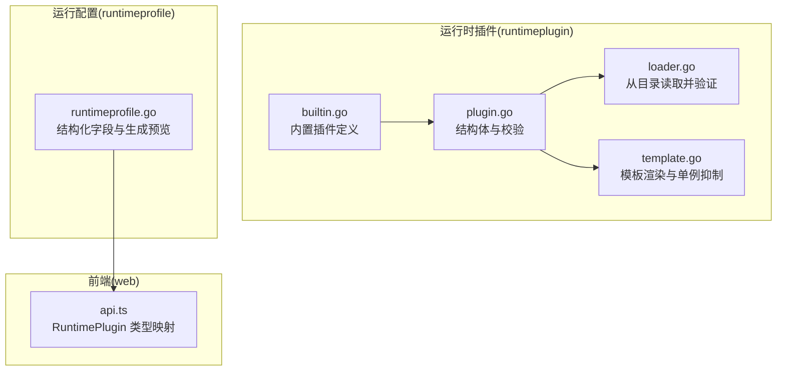
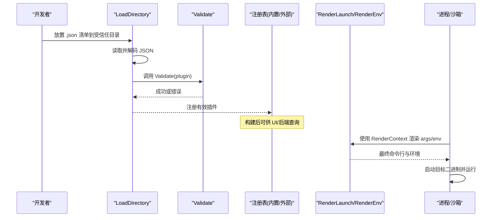
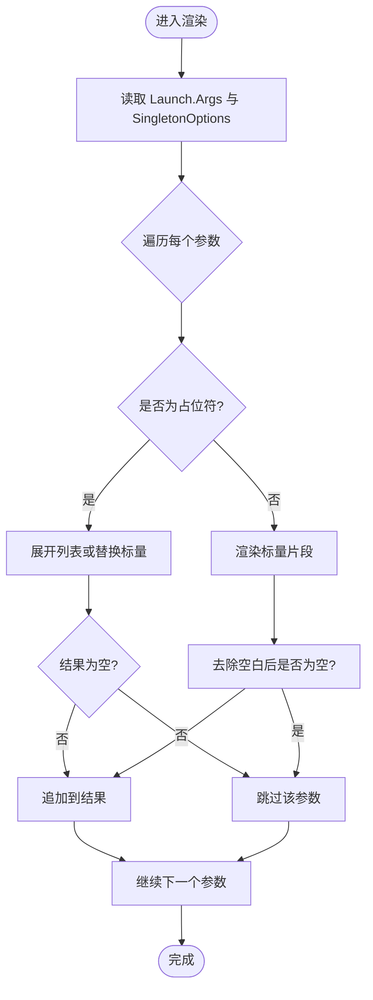
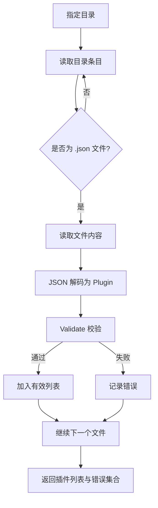
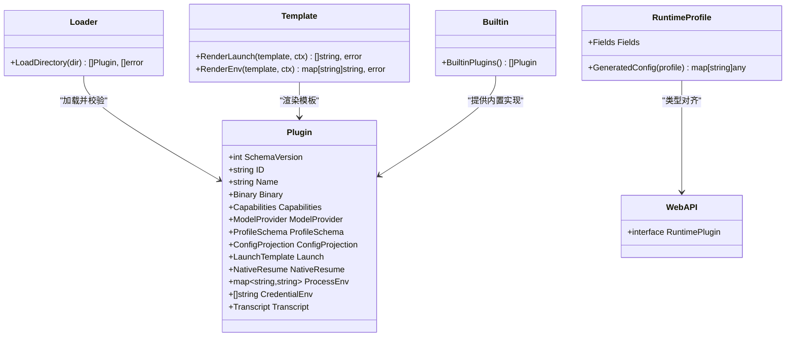

# 插件声明与配置

<cite>
**本文引用的文件**   
- [internal/runtimeplugin/plugin.go](file://internal/runtimeplugin/plugin.go)
- [internal/runtimeplugin/loader.go](file://internal/runtimeplugin/loader.go)
- [internal/runtimeplugin/template.go](file://internal/runtimeplugin/template.go)
- [internal/runtimeplugin/builtin.go](file://internal/runtimeplugin/builtin.go)
- [internal/runtimeprofile/runtimeprofile.go](file://internal/runtimeprofile/runtimeprofile.go)
- [web/src/lib/api.ts](file://web/src/lib/api.ts)
</cite>

## 目录
1. [简介](#简介)
2. [项目结构](#项目结构)
3. [核心组件](#核心组件)
4. [架构总览](#架构总览)
5. [详细组件分析](#详细组件分析)
6. [依赖关系分析](#依赖关系分析)
7. [性能考虑](#性能考虑)
8. [故障排查指南](#故障排查指南)
9. [结论](#结论)
10. [附录](#附录)

## 简介
本文件系统性说明运行时插件的声明语法与配置格式，覆盖以下主题：
- YAML/JSON 声明文件的结构与字段定义（以 JSON 为实际加载格式）
- 模板变量替换机制、单例选项抑制、条件逻辑与环境适配
- 插件元数据、能力声明、模型提供商要求与协议偏好
- 用户配置模式（ProfileSchema）、配置投影（ConfigProjection）、启动模板（Launch）
- 原生恢复（NativeResume）、环境变量（ProcessEnv/CredentialEnv）、转录解析器（Transcript）
- 插件校验规则、默认值处理与错误提示
- 内置插件示例与最佳实践

## 项目结构
运行时插件由 Go 包 runtimeplugin 提供声明式描述、加载与渲染能力；runtimeprofile 负责全局运行配置的结构化存储与生成预览；前端通过 API 类型与后端保持一致。

图表来源
- [internal/runtimeplugin/plugin.go:19-96](file://internal/runtimeplugin/plugin.go#L19-L96)
- [internal/runtimeplugin/loader.go:11-48](file://internal/runtimeplugin/loader.go#L11-L48)
- [internal/runtimeplugin/template.go:8-61](file://internal/runtimeplugin/template.go#L8-L61)
- [internal/runtimeplugin/builtin.go:3-214](file://internal/runtimeplugin/builtin.go#L3-L214)
- [internal/runtimeprofile/runtimeprofile.go:71-95](file://internal/runtimeprofile/runtimeprofile.go#L71-L95)
- [web/src/lib/api.ts:244-278](file://web/src/lib/api.ts#L244-L278)

章节来源
- [internal/runtimeplugin/plugin.go:19-96](file://internal/runtimeplugin/plugin.go#L19-L96)
- [internal/runtimeplugin/loader.go:11-48](file://internal/runtimeplugin/loader.go#L11-L48)
- [internal/runtimeplugin/template.go:8-61](file://internal/runtimeplugin/template.go#L8-L61)
- [internal/runtimeplugin/builtin.go:3-214](file://internal/runtimeplugin/builtin.go#L3-L214)
- [internal/runtimeprofile/runtimeprofile.go:71-95](file://internal/runtimeprofile/runtimeprofile.go#L71-L95)
- [web/src/lib/api.ts:244-278](file://web/src/lib/api.ts#L244-L278)

## 核心组件
- Plugin 结构体：插件声明的核心载体，包含版本、标识、二进制、能力、模型提供商、用户配置模式、配置投影、启动模板、原生恢复、环境变量、凭据环境变量与转录解析器等。
- 校验器 Validate：对插件声明进行强约束，确保 schema_version、ID 命名、必填项、枚举值、重复项、安全限制等正确。
- 模板引擎 Render*：支持在 Launch.Args 与 ProcessEnv 中使用 {{var}} 占位符，列表与标量替换、空值省略、单例选项抑制。
- 加载器 LoadDirectory：从受信任目录扫描 .json 清单，解码并调用 Validate，返回有效插件与错误集合。
- 内置插件 BuiltinPlugins：提供 codex、claude_code、pi、fake 等标准实现，展示完整字段用法。
- 运行配置 Profile Schema：Fields 作为“事实来源”，GeneratedConfig 用于生成可预览的配置（不含敏感值）。

章节来源
- [internal/runtimeplugin/plugin.go:19-96](file://internal/runtimeplugin/plugin.go#L19-L96)
- [internal/runtimeplugin/plugin.go:136-214](file://internal/runtimeplugin/plugin.go#L136-L214)
- [internal/runtimeplugin/template.go:13-61](file://internal/runtimeplugin/template.go#L13-L61)
- [internal/runtimeplugin/loader.go:11-48](file://internal/runtimeplugin/loader.go#L11-L48)
- [internal/runtimeplugin/builtin.go:3-214](file://internal/runtimeplugin/builtin.go#L3-L214)
- [internal/runtimeprofile/runtimeprofile.go:71-95](file://internal/runtimeprofile/runtimeprofile.go#L71-L95)

## 架构总览
下图展示了插件声明到运行时实例化的关键路径：声明文件被加载与校验，随后在任务启动时按模板渲染参数与环境变量，结合 Profile 的结构化字段完成最终执行。

图表来源
- [internal/runtimeplugin/loader.go:11-48](file://internal/runtimeplugin/loader.go#L11-L48)
- [internal/runtimeplugin/plugin.go:136-214](file://internal/runtimeplugin/plugin.go#L136-L214)
- [internal/runtimeplugin/template.go:13-61](file://internal/runtimeplugin/template.go#L13-L61)

## 详细组件分析

### Plugin 结构体字段详解与最佳实践
- SchemaVersion
  - 含义：当前声明的版本号，仅允许固定值。
  - 建议：保持与系统一致，避免升级导致不兼容。
- ID
  - 含义：插件唯一标识，需符合小写字母开头、仅含字母数字、下划线、点、连字符的正则。
  - 建议：采用短横线分隔的语义化命名，如 my-agent。
- Name/Description
  - 含义：人类可读的名称与可选描述。
  - 建议：Name 必填，描述应简洁明确。
- Binary
  - Default：二进制默认名称或路径。
  - ProfileField：若为空字符串，表示不从 Profile 字段覆盖；否则指向 Profile.Fields 中的某个字段名（例如 binary_path）。
  - 建议：优先使用 ProfileField 以便用户覆盖。
- Capabilities
  - 能力开关，包括 sandbox/host/mcp_config/streaming_transcript/resume/persistent_session/send_turn/interrupt_turn/interrupt_then_replace/in_turn_steer/permission_response/resume_session 等。
  - 建议：仅声明真实具备的能力，避免误导调度与安全策略。
- ModelProvider
  - Requirement：none/optional/required。
  - SupportedProtocols/ProtocolPreference：支持的协议与偏好顺序。
  - 建议：明确 required 时列出支持的协议，并在 Preference 中给出首选。
- ProfileSchema
  - Fields：用户配置模式，每个字段包含 name/type/label。
  - 支持类型：string/url/string_list/env_map/secret_env_map/mcp_servers/runtime_extensions/runner。
  - 建议：字段名唯一且非空，type 使用白名单值。
- ConfigProjection
  - Primitive：none/generic_config/codex_home/claude_settings/pi_agent。
  - ConfigPath/MCPConfigPath：生成的配置文件路径（相对 runtime/workdir）。
  - 建议：选择最贴近目标工具的原语，减少手工拼装。
- Launch
  - Args：启动参数模板，支持 {{var}} 占位符与列表展开。
  - SingletonOptions：单例选项组，当自定义参数覆盖了这些选项时，将抑制默认值。
  - 建议：将可变部分抽象为占位符，使用单例选项避免重复参数。
- NativeResume
  - Supported：是否支持原生恢复。
  - SessionSource：会话源（与 Transcript 解析器对应）。
  - Args：恢复时的启动参数模板。
  - 建议：仅在目标工具支持时启用，并确保 Args 完整。
- ProcessEnv
  - 键值对环境变量模板，支持 {{var}} 替换。
  - 建议：避免硬编码敏感信息，使用 CredentialEnv 注入。
- CredentialEnv
  - 凭据环境变量名列表，禁止包含等号或明显值片段。
  - 建议：仅填写变量名，由凭据绑定系统在运行时注入。
- Transcript
  - Parser：转录解析器，如 plain_runtime_output/codex_json/claude_stream_json/pi_json_session。
  - 建议：与目标工具输出格式严格匹配。

章节来源
- [internal/runtimeplugin/plugin.go:19-96](file://internal/runtimeplugin/plugin.go#L19-L96)
- [internal/runtimeplugin/plugin.go:98-134](file://internal/runtimeplugin/plugin.go#L98-L134)
- [internal/runtimeplugin/builtin.go:3-214](file://internal/runtimeplugin/builtin.go#L3-L214)

### 模板变量替换与条件逻辑
- 标量与列表
  - 标量：{{name}} 直接替换为字符串。
  - 列表：{{list_name}} 展开为非空元素序列。
- 空值省略
  - 若标量为空或列表为空，对应的参数将被整体省略。
  - 对于以“-”开头的可选参数，若其后的值也为空，整段将被跳过。
- 单例选项抑制
  - 当自定义参数包含某组选项时，将抑制模板中对应的默认选项（根据 Arity 跳过后续参数）。
- 环境模板
  - ProcessEnv 的值同样支持 {{var}} 替换，空值条目会被忽略。

图表来源
- [internal/runtimeplugin/template.go:13-44](file://internal/runtimeplugin/template.go#L13-L44)
- [internal/runtimeplugin/template.go:63-84](file://internal/runtimeplugin/template.go#L63-L84)
- [internal/runtimeplugin/template.go:130-145](file://internal/runtimeplugin/template.go#L130-L145)

章节来源
- [internal/runtimeplugin/template.go:13-44](file://internal/runtimeplugin/template.go#L13-L44)
- [internal/runtimeplugin/template.go:63-84](file://internal/runtimeplugin/template.go#L63-L84)
- [internal/runtimeplugin/template.go:130-145](file://internal/runtimeplugin/template.go#L130-L145)

### 插件声明文件格式与加载流程
- 文件格式：JSON（.json），位于受信任目录顶层，不递归子目录。
- 加载步骤：
  1) 读取目录条目，过滤非 .json 文件
  2) 读取并解码 JSON 为 Plugin
  3) 调用 Validate 校验
  4) 收集有效插件与错误列表
- 错误聚合：单个文件失败不会中断其他文件加载，便于批量部署与调试。

图表来源
- [internal/runtimeplugin/loader.go:11-48](file://internal/runtimeplugin/loader.go#L11-L48)
- [internal/runtimeplugin/plugin.go:136-214](file://internal/runtimeplugin/plugin.go#L136-L214)

章节来源
- [internal/runtimeplugin/loader.go:11-48](file://internal/runtimeplugin/loader.go#L11-L48)
- [internal/runtimeplugin/plugin.go:136-214](file://internal/runtimeplugin/plugin.go#L136-L214)

### 插件元数据、依赖关系与版本兼容性
- 元数据：id/name/description/binary/default/profile_field
- 依赖关系：
  - 模型提供商：ModelProvider.Requirement 与 SupportedProtocols/ProtocolPreference
  - 能力依赖：Capabilities 控制沙箱/主机、MCP、流式转录、恢复等
- 版本兼容性：
  - SchemaVersion 必须等于系统常量，否则拒绝加载
  - 新增字段向后兼容，但未知枚举值会触发校验错误

章节来源
- [internal/runtimeplugin/plugin.go:19-40](file://internal/runtimeplugin/plugin.go#L19-L40)
- [internal/runtimeplugin/plugin.go:136-157](file://internal/runtimeplugin/plugin.go#L136-L157)

### 用户配置模式（ProfileSchema）与默认值处理
- ProfileSchema.Fields 定义了用户可编辑的字段族，类型受白名单约束。
- 常见字段（内置插件通用）：binary_path/model/endpoint/custom_args/env/api_keys/credential_refs/runtime_extensions/mcp_servers/default_runner/sandbox_image。
- 默认值处理：
  - Binary.Default 提供默认二进制名
  - Binary.ProfileField 允许从 Profile.Fields 覆盖
  - ModelProvider.Requirement 默认为 none（若未设置）
  - ReasoningEffort 在 Profile 层有归一化与默认行为（不在插件声明中）

章节来源
- [internal/runtimeplugin/builtin.go:3-16](file://internal/runtimeplugin/builtin.go#L3-L16)
- [internal/runtimeplugin/plugin.go:152-157](file://internal/runtimeplugin/plugin.go#L152-L157)
- [internal/runtimeprofile/runtimeprofile.go:71-95](file://internal/runtimeprofile/runtimeprofile.go#L71-L95)

### 配置投影（ConfigProjection）
- Primitive 决定如何生成目标工具的配置文件：
  - none：不生成
  - generic_config：通用配置
  - codex_home/claude_settings/pi_agent：针对特定工具的路径与文件名
- ConfigPath/MCPConfigPath：相对于 runtime-home 或 workdir 的路径
- 用途：在启动前自动写入必要配置文件，避免手动维护

章节来源
- [internal/runtimeplugin/plugin.go:72-76](file://internal/runtimeplugin/plugin.go#L72-L76)
- [internal/runtimeplugin/builtin.go:69-114](file://internal/runtimeplugin/builtin.go#L69-L114)

### 启动模板（Launch）与单例选项
- Args 使用 {{var}} 占位符，支持列表展开与空值省略
- SingletonOptions 定义一组互斥或覆盖的选项，当自定义参数命中时，抑制默认值
- 典型场景：
  - 输出格式、打印模式、verbose 等可通过自定义参数覆盖
  - 目标命令的子命令与参数组合可按工具差异定制

章节来源
- [internal/runtimeplugin/template.go:13-44](file://internal/runtimeplugin/template.go#L13-L44)
- [internal/runtimeplugin/template.go:63-84](file://internal/runtimeplugin/template.go#L63-L84)
- [internal/runtimeplugin/builtin.go:115-133](file://internal/runtimeplugin/builtin.go#L115-L133)

### 原生恢复（NativeResume）
- 适用场景：目标工具支持从本地会话恢复，无需重新初始化
- 关键字段：Supported/SessionSource/Args
- 注意：
  - SessionSource 应与 Transcript.Parser 对应
  - 当 Supported=true 时，Args 必填

章节来源
- [internal/runtimeplugin/plugin.go:83-87](file://internal/runtimeplugin/plugin.go#L83-L87)
- [internal/runtimeplugin/builtin.go:76-84](file://internal/runtimeplugin/builtin.go#L76-L84)
- [internal/runtimeplugin/builtin.go:134-150](file://internal/runtimeplugin/builtin.go#L134-L150)
- [internal/runtimeplugin/builtin.go:193-205](file://internal/runtimeplugin/builtin.go#L193-L205)

### 环境变量与凭据注入（ProcessEnv/CredentialEnv）
- ProcessEnv：键值对模板，支持 {{var}} 替换，空值条目被忽略
- CredentialEnv：仅接受变量名，禁止包含等号或疑似值的片段
- 安全建议：
  - 不要将密钥硬编码到 ProcessEnv 或插件声明中
  - 使用凭据绑定系统在运行时注入

章节来源
- [internal/runtimeplugin/template.go:46-61](file://internal/runtimeplugin/template.go#L46-L61)
- [internal/runtimeplugin/plugin.go:198-205](file://internal/runtimeplugin/plugin.go#L198-L205)
- [internal/runtimeplugin/builtin.go:81-83](file://internal/runtimeplugin/builtin.go#L81-L83)
- [internal/runtimeplugin/builtin.go:151-153](file://internal/runtimeplugin/builtin.go#L151-L153)
- [internal/runtimeplugin/builtin.go:206-211](file://internal/runtimeplugin/builtin.go#L206-L211)

### 转录解析器（Transcript）
- Parser 决定如何解析目标工具的输出流
- 支持：plain_runtime_output/codex_json/claude_stream_json/pi_json_session
- 建议：与工具的实际输出格式严格匹配，避免解析失败

章节来源
- [internal/runtimeplugin/plugin.go:129-134](file://internal/runtimeplugin/plugin.go#L129-L134)
- [internal/runtimeplugin/builtin.go:83](file://internal/runtimeplugin/builtin.go#L83)
- [internal/runtimeplugin/builtin.go:153](file://internal/runtimeplugin/builtin.go#L153)
- [internal/runtimeplugin/builtin.go:211](file://internal/runtimeplugin/builtin.go#L211)

### 内置插件示例与最佳实践
- Codex：需要 openai_responses 协议，生成 codex_home 配置，支持流式转录与原生恢复
- Claude Code：需要 anthropic_messages 协议，生成 claude_settings 配置，支持 MCP 配置与原生恢复
- Pi：支持多协议，生成 pi_agent 配置，支持原生恢复与 in-turn steer
- Fake：测试用，无模型提供商要求，最小能力集

最佳实践要点：
- 明确声明 Capability，避免过度承诺
- 使用 ProfileField 暴露可覆盖项（如 binary_path）
- 使用 SingletonOptions 管理可覆盖的默认选项
- 使用 CredentialEnv 注入凭据，避免明文
- 使用 ConfigProjection 自动生成配置文件，减少手工维护

章节来源
- [internal/runtimeplugin/builtin.go:44-84](file://internal/runtimeplugin/builtin.go#L44-L84)
- [internal/runtimeplugin/builtin.go:85-154](file://internal/runtimeplugin/builtin.go#L85-L154)
- [internal/runtimeplugin/builtin.go:155-212](file://internal/runtimeplugin/builtin.go#L155-L212)

## 依赖关系分析
- 模块内依赖
  - loader.go 依赖 plugin.go 的 Validate
  - template.go 提供渲染能力，被上层启动流程使用
  - builtin.go 定义具体插件，遵循 plugin.go 的结构与校验
- 跨模块依赖
  - runtimeprofile 提供 Profile.Schema 与 GeneratedConfig，与插件 ProfileSchema 协同
  - web 前端 api.ts 定义 RuntimePlugin 类型，与后端结构对齐

图表来源
- [internal/runtimeplugin/plugin.go:19-96](file://internal/runtimeplugin/plugin.go#L19-L96)
- [internal/runtimeplugin/loader.go:11-48](file://internal/runtimeplugin/loader.go#L11-L48)
- [internal/runtimeplugin/template.go:13-61](file://internal/runtimeplugin/template.go#L13-L61)
- [internal/runtimeplugin/builtin.go:3-214](file://internal/runtimeplugin/builtin.go#L3-L214)
- [internal/runtimeprofile/runtimeprofile.go:71-95](file://internal/runtimeprofile/runtimeprofile.go#L71-L95)
- [web/src/lib/api.ts:244-278](file://web/src/lib/api.ts#L244-L278)

章节来源
- [internal/runtimeplugin/plugin.go:19-96](file://internal/runtimeplugin/plugin.go#L19-L96)
- [internal/runtimeplugin/loader.go:11-48](file://internal/runtimeplugin/loader.go#L11-L48)
- [internal/runtimeplugin/template.go:13-61](file://internal/runtimeplugin/template.go#L13-L61)
- [internal/runtimeplugin/builtin.go:3-214](file://internal/runtimeplugin/builtin.go#L3-L214)
- [internal/runtimeprofile/runtimeprofile.go:71-95](file://internal/runtimeprofile/runtimeprofile.go#L71-L95)
- [web/src/lib/api.ts:244-278](file://web/src/lib/api.ts#L244-L278)

## 性能考虑
- 模板渲染复杂度与参数数量线性相关，建议合理拆分占位符，避免过长字符串拼接
- 列表展开应避免过大数组，必要时在 Profile 层裁剪
- 单例选项抑制可减少冗余参数，降低目标工具解析开销
- 批量加载插件时，错误聚合避免中断，提升部署效率

[本节为通用指导，不直接分析具体文件]

## 故障排查指南
常见问题与定位方法：
- 校验失败
  - schema_version 不匹配：检查声明版本是否与系统一致
  - id 非法：确保以小写字母开头，仅包含字母数字、下划线、点、连字符
  - name 为空：补充名称
  - binary.default 为空：提供默认二进制名
  - config_projection.primitive 未知：使用白名单值
  - model_provider.requirement 未知：使用 none/optional/required
  - protocol 不支持或重复：检查 supported/preferred 列表
  - transcript.parser 未知：使用支持的解析器
  - launch.args 为空：至少提供一个参数
  - native_resume.supported=true 但 args 为空：补齐恢复参数
  - profile field 重复或类型未知：去重并使用白名单类型
  - credential_env 包含等号或疑似值：仅保留变量名
- 模板渲染问题
  - 未定义的占位符：检查 RenderContext 是否提供对应标量或列表
  - 空值导致参数缺失：确认是否需要默认值或条件分支
  - 单例选项冲突：检查自定义参数是否覆盖了默认选项
- 加载错误
  - JSON 解码失败：检查语法与字段拼写
  - 目录为空或路径无效：确认受信任目录配置

章节来源
- [internal/runtimeplugin/plugin.go:136-214](file://internal/runtimeplugin/plugin.go#L136-L214)
- [internal/runtimeplugin/loader.go:11-48](file://internal/runtimeplugin/loader.go#L11-L48)
- [internal/runtimeplugin/template.go:130-145](file://internal/runtimeplugin/template.go#L130-L145)

## 结论
运行时插件通过声明式 JSON 清单定义能力、依赖与行为，配合模板渲染与 Profile 结构化配置，实现了高度可插拔与安全的执行平面扩展。严格的校验与清晰的错误提示有助于快速定位问题，内置插件提供了最佳实践参考。建议在开发新插件时遵循白名单枚举、最小权限原则与凭据分离的最佳实践。

[本节为总结性内容，不直接分析具体文件]

## 附录
- 前端类型映射：web/src/lib/api.ts 中的 RuntimePlugin 接口与后端结构保持一致，便于 UI 渲染与校验
- 运行配置生成：internal/runtimeprofile/runtimeprofile.go 的 GeneratedConfig 提供只读预览，不包含敏感值

章节来源
- [web/src/lib/api.ts:244-278](file://web/src/lib/api.ts#L244-L278)
- [internal/runtimeprofile/runtimeprofile.go:348-433](file://internal/runtimeprofile/runtimeprofile.go#L348-L433)