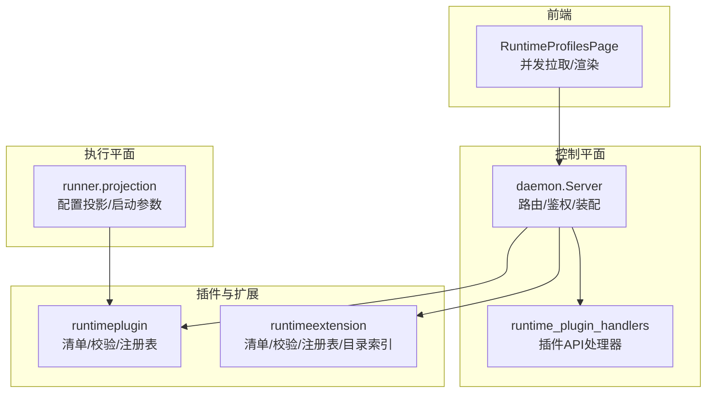
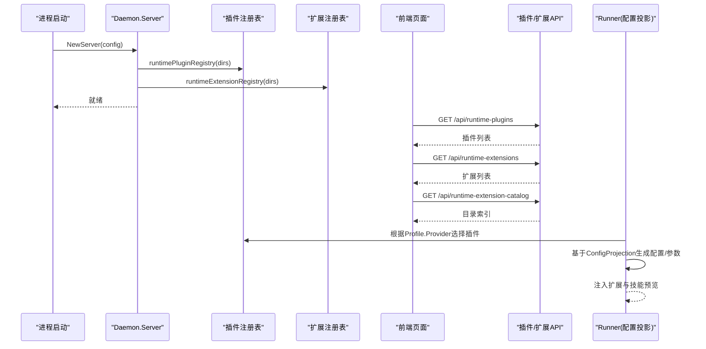
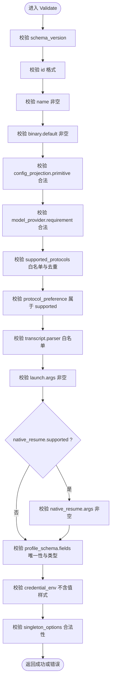
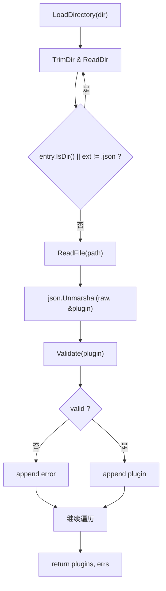
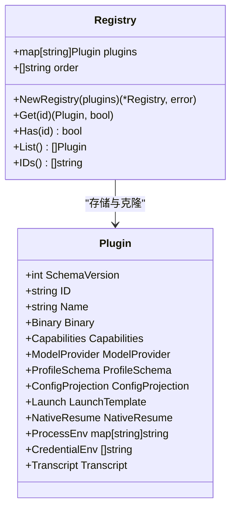
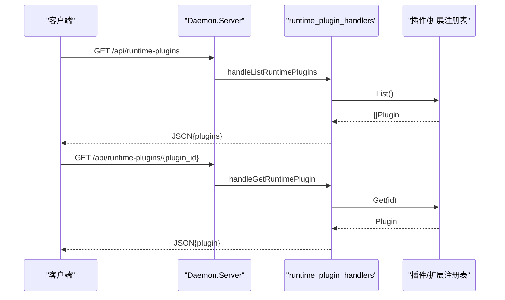
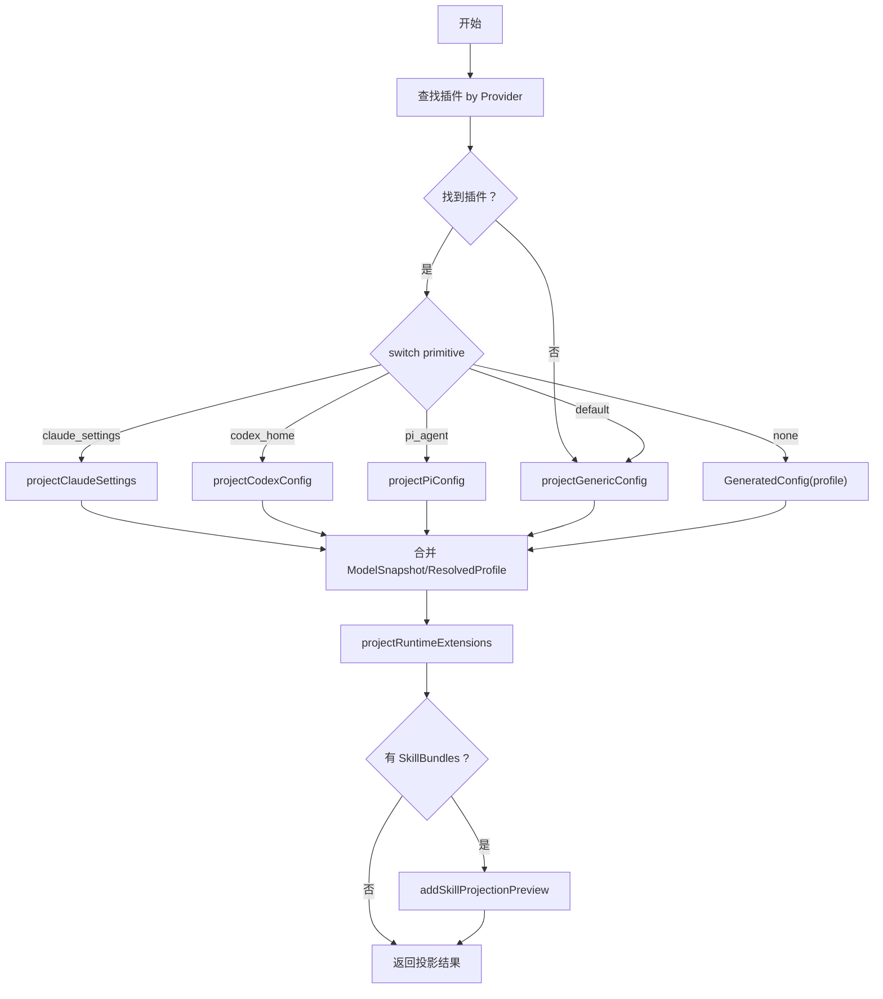
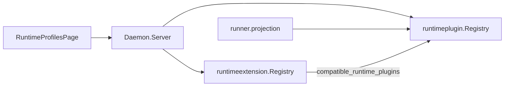

# 插件生命周期管理

<cite>
**本文引用的文件**   
- [internal/runtimeplugin/plugin.go](file://internal/runtimeplugin/plugin.go)
- [internal/runtimeplugin/loader.go](file://internal/runtimeplugin/loader.go)
- [internal/runtimeplugin/registry.go](file://internal/runtimeplugin/registry.go)
- [internal/runtimeplugin/builtin.go](file://internal/runtimeplugin/builtin.go)
- [internal/runtimeextension/extension.go](file://internal/runtimeextension/extension.go)
- [internal/runtimeextension/loader.go](file://internal/runtimeextension/loader.go)
- [internal/runtimeextension/registry.go](file://internal/runtimeextension/registry.go)
- [internal/runtimeextension/catalog.go](file://internal/runtimeextension/catalog.go)
- [internal/daemon/server.go](file://internal/daemon/server.go)
- [internal/daemon/runtime_plugin_handlers.go](file://internal/daemon/runtime_plugin_handlers.go)
- [internal/runner/projection.go](file://internal/runner/projection.go)
- [web/src/pages/RuntimeProfilesPage.tsx](file://web/src/pages/RuntimeProfilesPage.tsx)
</cite>

## 目录
1. [简介](#简介)
2. [项目结构](#项目结构)
3. [核心组件](#核心组件)
4. [架构总览](#架构总览)
5. [详细组件分析](#详细组件分析)
6. [依赖关系分析](#依赖关系分析)
7. [性能考量](#性能考量)
8. [故障排除指南](#故障排除指南)
9. [结论](#结论)
10. [附录](#附录)

## 简介
本文件围绕“插件生命周期管理”展开，聚焦运行时插件（Runtime Plugin）与运行时扩展（Runtime Extension）的发现、加载、注册表构建、版本与兼容性校验、配置投影、启动模板解析、模型提供者依赖验证、以及前端展示与后端 API 的交互。同时给出健康检查、错误恢复、日志记录与监控指标收集的建议实践，并提供调试与排障指引。

## 项目结构
与插件生命周期相关的代码主要分布在以下模块：
- internal/runtimeplugin：插件声明式清单定义、目录扫描、校验、内置插件、注册表
- internal/runtimeextension：扩展清单定义、目录扫描、校验、注册表、外部目录索引
- internal/daemon：HTTP 服务层，负责路由、鉴权、插件/扩展列表接口、启动时组装
- internal/runner：根据插件能力进行配置投影与运行参数生成
- web/src/pages/RuntimeProfilesPage.tsx：前端页面并发拉取插件、扩展、配置项并渲染

**图表来源** 
- [internal/daemon/server.go:346-372](file://internal/daemon/server.go#L346-L372)
- [internal/daemon/runtime_plugin_handlers.go:9-33](file://internal/daemon/runtime_plugin_handlers.go#L9-L33)
- [internal/runner/projection.go:82-131](file://internal/runner/projection.go#L82-L131)
- [web/src/pages/RuntimeProfilesPage.tsx:199-231](file://web/src/pages/RuntimeProfilesPage.tsx#L199-L231)

**章节来源**
- [internal/daemon/server.go:346-372](file://internal/daemon/server.go#L346-L372)
- [internal/daemon/server.go:587-643](file://internal/daemon/server.go#L587-L643)
- [internal/daemon/runtime_plugin_handlers.go:9-33](file://internal/daemon/runtime_plugin_handlers.go#L9-L33)
- [internal/runner/projection.go:82-131](file://internal/runner/projection.go#L82-L131)
- [web/src/pages/RuntimeProfilesPage.tsx:199-231](file://web/src/pages/RuntimeProfilesPage.tsx#L199-L231)

## 核心组件
- 插件清单与校验：定义插件元数据、能力、模型提供者要求、配置投影、启动模板、转录解析器、环境变量与凭据等，并进行严格校验（ID 格式、必填字段、协议白名单、重复检测等）。
- 插件目录扫描与加载：从受信任目录读取 .json 清单，解码并校验，收集错误与有效清单。
- 插件注册表：去重、排序、克隆保护、按 ID 查询与列表。
- 内置插件：提供常见运行时（如 Codex、Claude Code、Pi、Fake）的默认清单与能力集。
- 扩展清单与校验：描述扩展来源、投影位置、兼容的插件 ID 集合，防止路径泄露敏感信息。
- 扩展目录扫描与加载：同插件模式，读取 .json 清单并校验。
- 扩展目录索引：聚合多个外部源（如 Pi 包目录、Claude 官方仓库）为统一 Catalog。
- Daemon 装配与 API：启动时构建插件/扩展注册表，暴露 /api/runtime-plugins、/api/runtime-extensions、/api/runtime-extension-catalog 等接口。
- Runner 配置投影：根据插件的 ConfigProjection 原语生成目标配置与启动参数，注入扩展与技能预览。

**章节来源**
- [internal/runtimeplugin/plugin.go:19-215](file://internal/runtimeplugin/plugin.go#L19-L215)
- [internal/runtimeplugin/loader.go:13-48](file://internal/runtimeplugin/loader.go#L13-L48)
- [internal/runtimeplugin/registry.go:8-99](file://internal/runtimeplugin/registry.go#L8-L99)
- [internal/runtimeplugin/builtin.go:3-214](file://internal/runtimeplugin/builtin.go#L3-L214)
- [internal/runtimeextension/extension.go:19-96](file://internal/runtimeextension/extension.go#L19-L96)
- [internal/runtimeextension/loader.go:11-45](file://internal/runtimeextension/loader.go#L11-L45)
- [internal/runtimeextension/registry.go:8-62](file://internal/runtimeextension/registry.go#L8-L62)
- [internal/runtimeextension/catalog.go:37-57](file://internal/runtimeextension/catalog.go#L37-L57)
- [internal/daemon/server.go:346-372](file://internal/daemon/server.go#L346-L372)
- [internal/runner/projection.go:82-131](file://internal/runner/projection.go#L82-L131)

## 架构总览
插件生命周期贯穿“发现→加载→校验→注册→使用→卸载”全链路。Daemon 在启动阶段完成插件与扩展的注册表构建；Runner 在执行阶段依据插件清单进行配置投影与启动参数生成；前端通过 HTTP API 获取插件与扩展清单用于界面渲染与表单生成。

**图表来源** 
- [internal/daemon/server.go:120-248](file://internal/daemon/server.go#L120-L248)
- [internal/daemon/server.go:346-372](file://internal/daemon/server.go#L346-L372)
- [internal/daemon/server.go:587-643](file://internal/daemon/server.go#L587-L643)
- [internal/runner/projection.go:82-131](file://internal/runner/projection.go#L82-L131)
- [web/src/pages/RuntimeProfilesPage.tsx:199-231](file://web/src/pages/RuntimeProfilesPage.tsx#L199-L231)

## 详细组件分析

### 插件清单与校验（Schema 与规则）
- 关键字段：schema_version、id、name、binary、capabilities、model_provider、profile_schema、config_projection、launch、native_resume、process_env、credential_env、transcript。
- 校验要点：
  - schema_version 必须匹配常量
  - id 符合小写字母开头及字符集限制
  - name、binary.default、launch.args 必填
  - config_projection.primitive 必须在允许的原语集合内
  - model_provider.requirement 与 supported_protocols/protocol_preference 白名单校验与去重
  - transcript.parser 在白名单内
  - native_resume.supported 时必须有 args
  - profile_schema.fields 名称唯一且类型合法
  - credential_env 不能包含值样式的字符串（防泄露）
  - singleton_options 的 arity 非负且选项组非空

**图表来源** 
- [internal/runtimeplugin/plugin.go:136-215](file://internal/runtimeplugin/plugin.go#L136-L215)

**章节来源**
- [internal/runtimeplugin/plugin.go:19-215](file://internal/runtimeplugin/plugin.go#L19-L215)

### 插件目录扫描与加载
- 仅读取顶层 .json 文件，跳过目录
- 对每个文件进行读取、JSON 解码、Validate 校验
- 收集所有错误与有效清单，供后续注册表构建

**图表来源** 
- [internal/runtimeplugin/loader.go:13-48](file://internal/runtimeplugin/loader.go#L13-L48)

**章节来源**
- [internal/runtimeplugin/loader.go:13-48](file://internal/runtimeplugin/loader.go#L13-L48)

### 插件注册表与冲突检测
- 构建时对所有插件进行 Validate
- 以 id 为键存储，重复 id 直接报错
- 维护 order 切片并按字典序排序，保证稳定输出
- Get/List/IDs 均返回克隆副本，避免外部修改内部状态

**图表来源** 
- [internal/runtimeplugin/registry.go:8-99](file://internal/runtimeplugin/registry.go#L8-L99)
- [internal/runtimeplugin/plugin.go:19-96](file://internal/runtimeplugin/plugin.go#L19-L96)

**章节来源**
- [internal/runtimeplugin/registry.go:8-99](file://internal/runtimeplugin/registry.go#L8-L99)

### 内置插件与能力集
- 内置插件包括 fake、codex、claude_code、pi 等
- 每个插件声明了 capabilities（沙箱/主机、MCP 配置、流式转录、原生会话恢复、持久会话、发送 turn、中断 turn、权限响应、转内转向等）
- 定义了 model_provider.requirement 与支持的协议
- 定义了 profile_schema.fields（通用字段与特定字段）
- 定义了 config_projection 原语（none、generic_config、codex_home、claude_settings、pi_agent）
- 定义了 launch.args 模板与可选 singleton_options
- 定义了 native_resume 支持情况与参数模板
- 定义了 process_env 与 credential_env

**章节来源**
- [internal/runtimeplugin/builtin.go:3-214](file://internal/runtimeplugin/builtin.go#L3-L214)

### 扩展清单与校验
- 关键字段：schema_version、id、name、compatible_runtime_plugins、source.type/path、projection.location/path、config
- 校验要点：
  - compatible_runtime_plugins 非空且每个 id 合法、无重复
  - source.type 在白名单（local_dir/local_file），path 非空且不包含疑似密钥
  - projection.location 在白名单（provider_home/runtime_home/workdir），path 相对且不可逃逸根目录
  - config 中 key+value 拼接不得包含疑似密钥

**章节来源**
- [internal/runtimeextension/extension.go:19-96](file://internal/runtimeextension/extension.go#L19-L96)

### 扩展目录扫描与加载
- 与插件相同模式：读取 .json 清单、解码、Validate、收集错误与有效项

**章节来源**
- [internal/runtimeextension/loader.go:11-45](file://internal/runtimeextension/loader.go#L11-L45)

### 扩展注册表
- 构建时 Validate，按 id 去重，维护 order 并排序
- Get/List 返回克隆副本

**章节来源**
- [internal/runtimeextension/registry.go:8-62](file://internal/runtimeextension/registry.go#L8-L62)

### 扩展目录索引（Catalog）
- 聚合两个外部源：
  - Pi Package Catalog（HTML 解析）
  - Claude 官方插件仓库（GitHub API 目录枚举）
- 返回统一的 CatalogItem 列表与错误信息（网络/解析失败）

**章节来源**
- [internal/runtimeextension/catalog.go:37-57](file://internal/runtimeextension/catalog.go#L37-L57)
- [internal/runtimeextension/catalog.go:59-94](file://internal/runtimeextension/catalog.go#L59-L94)
- [internal/runtimeextension/catalog.go:96-141](file://internal/runtimeextension/catalog.go#L96-L141)

### Daemon 装配与 API
- 启动时调用 runtimePluginRegistry 与 runtimeExtensionRegistry 构建注册表
- 路由注册包含：
  - GET /api/runtime-plugins
  - GET /api/runtime-plugins/{plugin_id}
  - GET /api/runtime-extensions
  - GET /api/runtime-extension-catalog
  - GET /api/runtime-extensions/{extension_id}
- 处理器直接从注册表返回数据

**图表来源** 
- [internal/daemon/server.go:587-643](file://internal/daemon/server.go#L587-L643)
- [internal/daemon/runtime_plugin_handlers.go:9-33](file://internal/daemon/runtime_plugin_handlers.go#L9-L33)

**章节来源**
- [internal/daemon/server.go:346-372](file://internal/daemon/server.go#L346-L372)
- [internal/daemon/server.go:587-643](file://internal/daemon/server.go#L587-L643)
- [internal/daemon/runtime_plugin_handlers.go:9-33](file://internal/daemon/runtime_plugin_handlers.go#L9-L33)

### Runner 配置投影与启动参数生成
- 根据 profile.Provider 选择对应插件
- 若未找到插件则回退到通用配置投影
- 根据插件的 ConfigProjection.Primitive 选择具体投影策略（claude_settings、codex_home、pi_agent、none、generic_config）
- 将 ModelSnapshot 与 ResolvedProfile 注入投影结果
- 追加 RuntimeExtensions 投影与 SkillBundles 预览

**图表来源** 
- [internal/runner/projection.go:82-131](file://internal/runner/projection.go#L82-L131)

**章节来源**
- [internal/runner/projection.go:82-131](file://internal/runner/projection.go#L82-L131)

### 前端展示与并发拉取
- 页面初始化时并发请求：
  - /api/runtime-profiles
  - /api/runtime-plugins
  - /api/runtime-extensions
  - /api/model-providers（异步）
- 设置状态后触发扩展目录加载
- 提供 fallback 的环境变量与转录解析器映射

**章节来源**
- [web/src/pages/RuntimeProfilesPage.tsx:199-231](file://web/src/pages/RuntimeProfilesPage.tsx#L199-L231)
- [web/src/pages/RuntimeProfilesPage.tsx:635-660](file://web/src/pages/RuntimeProfilesPage.tsx#L635-L660)

## 依赖关系分析
- Daemon 依赖插件与扩展注册表，并在路由中暴露其能力
- Runner 依赖插件注册表以决定配置投影策略
- 前端依赖 HTTP API 获取插件/扩展清单
- 插件与扩展之间通过 compatible_runtime_plugins 建立兼容性约束

**图表来源** 
- [internal/daemon/server.go:346-372](file://internal/daemon/server.go#L346-L372)
- [internal/runner/projection.go:82-131](file://internal/runner/projection.go#L82-L131)
- [internal/runtimeextension/extension.go:98-105](file://internal/runtimeextension/extension.go#L98-L105)

**章节来源**
- [internal/daemon/server.go:346-372](file://internal/daemon/server.go#L346-L372)
- [internal/runner/projection.go:82-131](file://internal/runner/projection.go#L82-L131)
- [internal/runtimeextension/extension.go:98-105](file://internal/runtimeextension/extension.go#L98-L105)

## 性能考量
- 目录扫描与清单解码为 I/O 密集操作，建议在启动阶段批量处理并缓存结果
- 注册表构建时对 order 排序，确保稳定的列表输出，避免频繁排序开销
- 前端并发请求减少首屏等待时间，但需做好错误隔离与重试
- 配置投影与启动参数生成应避免重复计算，必要时可缓存中间结果

[本节为通用指导，不直接分析具体文件]

## 故障排除指南
- 清单校验失败
  - 检查 schema_version 是否匹配
  - 检查 id/name/binary.default/launch.args 是否缺失
  - 检查 config_projection.primitive 是否在白名单
  - 检查 model_provider 的 requirement 与 protocols 白名单与去重
  - 检查 transcript.parser 是否在白名单
  - 检查 native_resume.supported 时是否有 args
  - 检查 profile_schema.fields 名称唯一性与类型
  - 检查 credential_env 是否包含值样式字符串
  - 检查 singleton_options 的 arity 与选项组
- 插件冲突
  - 注册表构建时重复 id 会直接报错，确保全局唯一
- 扩展兼容性
  - 检查 compatible_runtime_plugins 是否为空且 id 合法
  - 检查 source.path 是否包含疑似密钥
  - 检查 projection.path 是否相对且不逃逸根目录
- API 访问问题
  - 确认路由已注册（/api/runtime-plugins、/api/runtime-extensions、/api/runtime-extension-catalog）
  - 确认鉴权与 Origin 校验未拦截请求
- 前端数据加载失败
  - 检查并发请求的错误处理与状态更新逻辑
  - 检查 fallback 映射是否正确

**章节来源**
- [internal/runtimeplugin/plugin.go:136-215](file://internal/runtimeplugin/plugin.go#L136-L215)
- [internal/runtimeplugin/registry.go:13-27](file://internal/runtimeplugin/registry.go#L13-L27)
- [internal/runtimeextension/extension.go:51-96](file://internal/runtimeextension/extension.go#L51-L96)
- [internal/daemon/server.go:587-643](file://internal/daemon/server.go#L587-L643)
- [web/src/pages/RuntimeProfilesPage.tsx:199-231](file://web/src/pages/RuntimeProfilesPage.tsx#L199-L231)

## 结论
本项目的插件生命周期管理通过声明式清单、严格的校验与注册表机制，实现了插件与扩展的可插拔、可扩展与可观测。Daemon 在启动阶段完成装配，Runner 在执行阶段依据插件能力进行配置投影与参数生成，前端通过 API 获取清单进行渲染。整体设计清晰、边界明确，便于扩展与维护。

[本节为总结性内容，不直接分析具体文件]

## 附录
- 健康检查与监控建议
  - 在 /health 中增加插件与扩展注册表统计（数量、错误计数）
  - 记录清单加载耗时与错误率
  - 暴露 Prometheus 指标：插件加载总数、校验失败数、目录扫描耗时
- 热重载与优雅卸载
  - 当前实现为启动时一次性加载，如需热重载可在守护进程中监听目录变更并重建注册表
  - 优雅卸载需确保正在运行的任务与容器清理，参考 daemon 的重启恢复逻辑
- 日志与调试
  - 在清单加载与校验阶段输出详细日志（文件路径、错误原因）
  - 提供 CLI 工具列出与校验本地插件/扩展清单
  - 前端增加错误提示与重试按钮

[本节为通用指导，不直接分析具体文件]