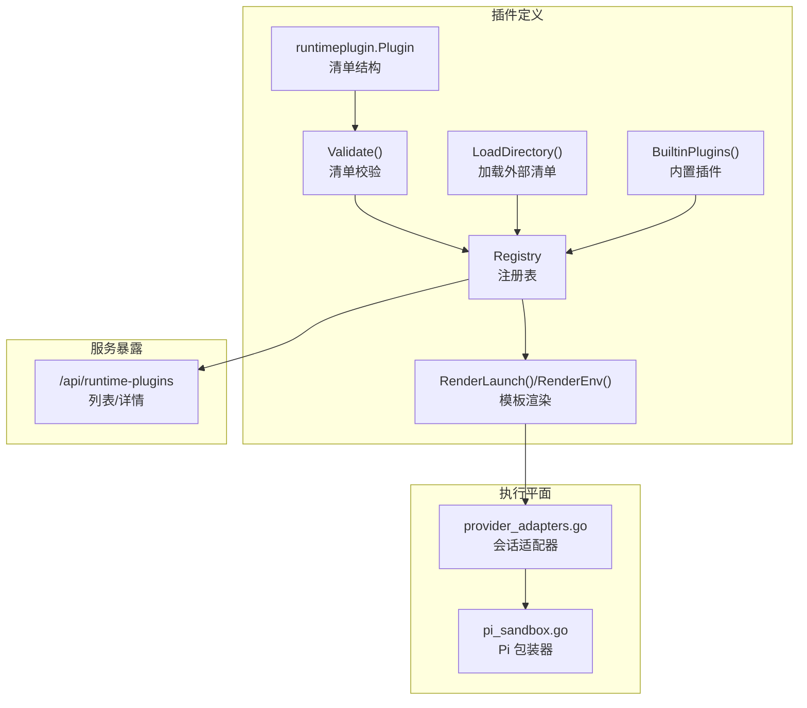
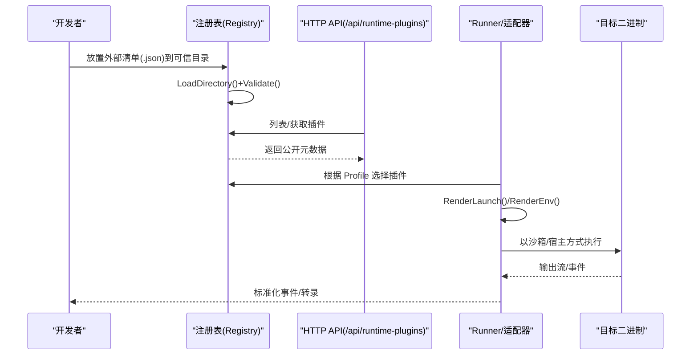
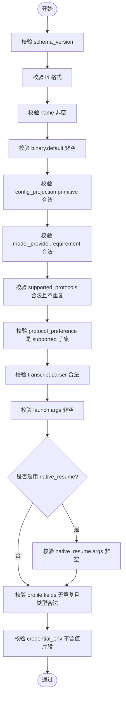
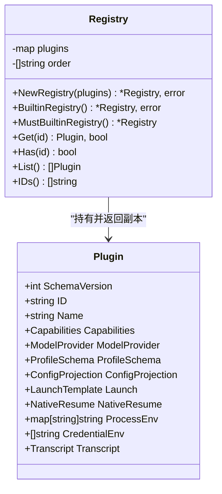
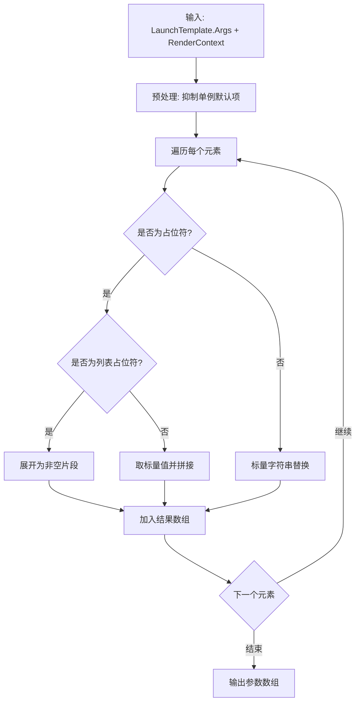
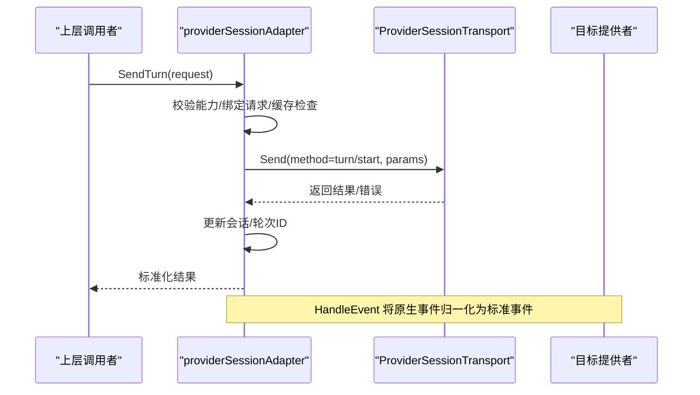
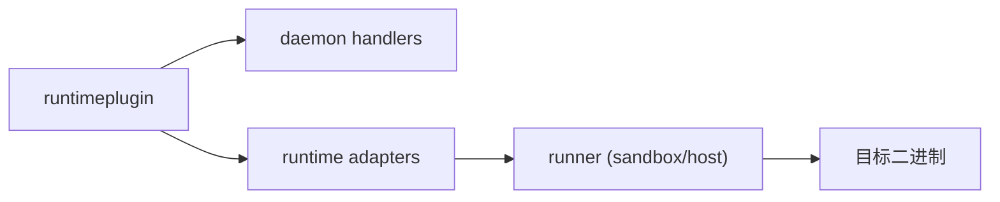

# 自定义插件开发

<cite>
**本文引用的文件**   
- [internal/runtimeplugin/plugin.go](file://internal/runtimeplugin/plugin.go)
- [internal/runtimeplugin/loader.go](file://internal/runtimeplugin/loader.go)
- [internal/runtimeplugin/registry.go](file://internal/runtimeplugin/registry.go)
- [internal/runtimeplugin/builtin.go](file://internal/runtimeplugin/builtin.go)
- [internal/runtimeplugin/template.go](file://internal/runtimeplugin/template.go)
- [internal/runtimeplugin/plugin_test.go](file://internal/runtimeplugin/plugin_test.go)
- [internal/runtimeplugin/template_test.go](file://internal/runtimeplugin/template_test.go)
- [internal/daemon/runtime_plugin_handlers.go](file://internal/daemon/runtime_plugin_handlers.go)
- [internal/runner/pi_sandbox.go](file://internal/runner/pi_sandbox.go)
- [internal/runtime/provider_adapters.go](file://internal/runtime/provider_adapters.go)
- [docs/superpowers/specs/2026-06-19-runtime-plugin-design.md](file://docs/superpowers/specs/2026-06-19-runtime-plugin-design.md)
</cite>

## 目录
1. [简介](#简介)
2. [项目结构](#项目结构)
3. [核心组件](#核心组件)
4. [架构总览](#架构总览)
5. [详细组件分析](#详细组件分析)
6. [依赖关系分析](#依赖关系分析)
7. [性能与可扩展性](#性能与可扩展性)
8. [故障排查指南](#故障排查指南)
9. [结论](#结论)
10. [附录：开发示例与最佳实践](#附录开发示例与最佳实践)

## 简介
本指南面向希望为系统扩展“运行时插件”的开发者。系统采用“声明式插件清单（JSON）+ 内置能力注册表 + 模板渲染”的方式，将运行时的二进制选择、参数构造、配置投影、凭据注入、转录解析等从硬编码逻辑中解耦出来，使新增或修改运行时提供者主要依靠清单变更完成。

本指南涵盖：
- 插件框架与接口规范
- 插件项目结构与依赖管理
- 测试策略与调试技巧
- 打包、分发、版本管理与兼容性保证
- 完整开发示例与常见问题解决方案
- 高级特性：签名验证、安全沙箱执行、权限控制与审计日志

## 项目结构
与自定义运行时插件直接相关的代码集中在 runtimeplugin 包，并通过 Daemon HTTP API 暴露给前端与管理面；Runner 层负责在沙箱或宿主机上实际执行由插件描述的目标二进制；Provider Adapters 负责将统一的会话协议映射到具体提供者的原生 RPC。

图示来源
- [internal/runtimeplugin/plugin.go:19-34](file://internal/runtimeplugin/plugin.go#L19-L34)
- [internal/runtimeplugin/loader.go:11-48](file://internal/runtimeplugin/loader.go#L11-L48)
- [internal/runtimeplugin/registry.go:8-27](file://internal/runtimeplugin/registry.go#L8-L27)
- [internal/runtimeplugin/builtin.go:3-213](file://internal/runtimeplugin/builtin.go#L3-L213)
- [internal/runtimeplugin/template.go:13-61](file://internal/runtimeplugin/template.go#L13-L61)
- [internal/daemon/runtime_plugin_handlers.go:9-33](file://internal/daemon/runtime_plugin_handlers.go#L9-L33)
- [internal/runtime/provider_adapters.go:58-92](file://internal/runtime/provider_adapters.go#L58-L92)
- [internal/runner/pi_sandbox.go:17-46](file://internal/runner/pi_sandbox.go#L17-L46)

章节来源
- [internal/runtimeplugin/plugin.go:19-34](file://internal/runtimeplugin/plugin.go#L19-L34)
- [internal/runtimeplugin/loader.go:11-48](file://internal/runtimeplugin/loader.go#L11-L48)
- [internal/runtimeplugin/registry.go:8-27](file://internal/runtimeplugin/registry.go#L8-L27)
- [internal/runtimeplugin/builtin.go:3-213](file://internal/runtimeplugin/builtin.go#L3-L213)
- [internal/runtimeplugin/template.go:13-61](file://internal/runtimeplugin/template.go#L13-L61)
- [internal/daemon/runtime_plugin_handlers.go:9-33](file://internal/daemon/runtime_plugin_handlers.go#L9-L33)
- [internal/runtime/provider_adapters.go:58-92](file://internal/runtime/provider_adapters.go#L58-L92)
- [internal/runner/pi_sandbox.go:17-46](file://internal/runner/pi_sandbox.go#L17-L46)

## 核心组件
- 清单模型与校验
  - Plugin 结构体定义了插件元数据、能力、Profile 字段、配置投影、启动模板、进程环境、凭据环境变量、转录解析器等。
  - Validate() 对 schema_version、id/name、binary.default、projection primitive、transcript parser、profile fields、credential_env 等进行严格校验。
- 注册表
  - Registry 维护插件集合，支持按 ID 查询、列出、去重检查、稳定排序。
  - BuiltinRegistry() 返回内置插件注册表；NewRegistry() 用于合并外部清单并构建注册表。
- 清单加载
  - LoadDirectory() 从可信目录读取顶层 .json 清单，逐个解码并校验，收集错误。
- 模板渲染
  - RenderLaunch() 将 LaunchTemplate.Args 中的占位符替换为标量或列表值，支持单例选项抑制与可选参数省略。
  - RenderEnv() 将进程环境变量模板中的标量占位符替换。
- 内置插件
  - builtin.go 提供 fake、codex、claude_code、pi 等内置插件，包含各自的能力、模型提供者要求、Profile 字段、配置投影路径、启动参数、原生恢复、进程环境与凭据变量名等。
- 会话适配器
  - provider_adapters.go 实现跨提供者的统一会话语义（发送轮次、中断、中断后替换、权限响应、事件归一化、结算等待等），通过 ProviderSessionTransport 与底层桥接通信。
- Pi 沙箱包装
  - pi_sandbox.go 在无预装 pi 的二进制时，自动安装 npm 包并 exec 调用，便于容器镜像最小化。

章节来源
- [internal/runtimeplugin/plugin.go:136-214](file://internal/runtimeplugin/plugin.go#L136-L214)
- [internal/runtimeplugin/registry.go:13-27](file://internal/runtimeplugin/registry.go#L13-L27)
- [internal/runtimeplugin/loader.go:11-48](file://internal/runtimeplugin/loader.go#L11-L48)
- [internal/runtimeplugin/template.go:13-61](file://internal/runtimeplugin/template.go#L13-L61)
- [internal/runtimeplugin/builtin.go:3-213](file://internal/runtimeplugin/builtin.go#L3-L213)
- [internal/runtime/provider_adapters.go:58-92](file://internal/runtime/provider_adapters.go#L58-L92)
- [internal/runner/pi_sandbox.go:17-46](file://internal/runner/pi_sandbox.go#L17-L46)

## 架构总览
下图展示了从“插件清单”到“HTTP 暴露”再到“执行平面”的整体流程。

图示来源
- [internal/runtimeplugin/loader.go:11-48](file://internal/runtimeplugin/loader.go#L11-L48)
- [internal/runtimeplugin/plugin.go:136-214](file://internal/runtimeplugin/plugin.go#L136-L214)
- [internal/daemon/runtime_plugin_handlers.go:9-33](file://internal/daemon/runtime_plugin_handlers.go#L9-L33)
- [internal/runtimeplugin/template.go:13-61](file://internal/runtimeplugin/template.go#L13-L61)
- [internal/runtime/provider_adapters.go:58-92](file://internal/runtime/provider_adapters.go#L58-L92)

## 详细组件分析

### 清单模型与校验（Plugin 与 Validate）
- 关键字段
  - id/name/description：唯一标识与展示信息
  - binary.default/profile_field：可执行文件默认名称或来自 Profile 的字段
  - capabilities：沙箱/宿主、MCP 配置、流式转录、恢复、持久会话、发送轮次、中断、中断后替换、轮内引导、权限响应、会话恢复等
  - model_provider.requirement/supported_protocols/protocol_preference：模型提供者需求与协议偏好
  - profile_schema.fields：Profile 字段类型包括 string/url/string_list/env_map/secret_env_map/mcp_servers/runtime_extensions/runner 等
  - config_projection.primitive/config_path/mcp_config_path：配置投影原语与路径
  - launch.args/singleton_options：启动参数模板与单例选项组
  - native_resume.supported/session_source/args：原生恢复能力与参数
  - process_env/credential_env：进程环境与凭据环境变量名
  - transcript.parser：转录解析器名称
- 校验规则要点
  - schema_version 必须匹配当前版本
  - id 符合小写字母开头且仅含字母数字、点、下划线、连字符
  - name 必填
  - binary.default 必填
  - projection primitive 必须在白名单
  - model_provider.requirement 在白名单，supported_protocols 不重复且合法，protocol_preference 必须是 supported 的子集
  - transcript.parser 在白名单
  - launch.args 非空；若启用 native_resume，则 args 必填
  - profile fields 无重复且 type 合法
  - credential_env 不能包含等号或明显值片段

图示来源
- [internal/runtimeplugin/plugin.go:136-214](file://internal/runtimeplugin/plugin.go#L136-L214)

章节来源
- [internal/runtimeplugin/plugin.go:19-34](file://internal/runtimeplugin/plugin.go#L19-L34)
- [internal/runtimeplugin/plugin.go:136-214](file://internal/runtimeplugin/plugin.go#L136-L214)

### 注册表与清单加载（Registry 与 LoadDirectory）
- 功能
  - NewRegistry：接收一组已校验的插件，去重并建立有序索引
  - BuiltinRegistry/MustBuiltinRegistry：快速构建内置注册表
  - Get/Has/List/IDs：查询与遍历
  - LoadDirectory：从可信目录扫描顶层 .json 清单，逐一解码并校验，收集错误
- 设计要点
  - 克隆返回：Get/List 返回副本，避免外部修改影响内部状态
  - 顺序稳定：IDs 按字典序排列，利于 UI 展示一致性
  - 错误聚合：LoadDirectory 返回所有错误，便于一次性修复

图示来源
- [internal/runtimeplugin/registry.go:8-27](file://internal/runtimeplugin/registry.go#L8-L27)
- [internal/runtimeplugin/registry.go:41-98](file://internal/runtimeplugin/registry.go#L41-L98)
- [internal/runtimeplugin/plugin.go:19-34](file://internal/runtimeplugin/plugin.go#L19-L34)

章节来源
- [internal/runtimeplugin/registry.go:8-27](file://internal/runtimeplugin/registry.go#L8-L27)
- [internal/runtimeplugin/registry.go:41-98](file://internal/runtimeplugin/registry.go#L41-L98)
- [internal/runtimeplugin/loader.go:11-48](file://internal/runtimeplugin/loader.go#L11-L48)

### 模板渲染（Launch 与 Env）
- 变量体系
  - 标量：{{binary}}/{{model}}/{{endpoint}}/{{config_path}}/{{mcp_config_path}}/{{mcp_args}}/{{runtime_home}}/{{workdir}} 等
  - 列表：{{custom_args}} 等，展开为多个参数片段
- 行为
  - 空值省略：未提供的标量或空列表不会出现在最终参数中
  - 单例选项抑制：当用户自定义参数覆盖了某组单例选项时，默认项会被抑制
  - 可选前缀处理：如“-p/--print”这类可选开关，在对应占位符为空时整体跳过
- 环境变量渲染
  - 仅进行标量替换，空结果将被忽略

图示来源
- [internal/runtimeplugin/template.go:13-84](file://internal/runtimeplugin/template.go#L13-L84)
- [internal/runtimeplugin/template.go:46-61](file://internal/runtimeplugin/template.go#L46-L61)

章节来源
- [internal/runtimeplugin/template.go:13-84](file://internal/runtimeplugin/template.go#L13-L84)
- [internal/runtimeplugin/template.go:46-61](file://internal/runtimeplugin/template.go#L46-L61)

### 内置插件与能力矩阵
- 内置插件
  - fake：测试用，能力全面，无需模型提供者
  - codex：OpenAI Codex CLI，需要 openai_responses 协议
  - claude_code：Anthropic Claude Code，需要 anthropic_messages 协议
  - pi：多协议支持，具备轮内引导能力
- 关键差异
  - 模型提供者需求与支持的协议不同
  - 配置投影原语与路径不同
  - 原生恢复能力与 session source 不同
  - 进程环境与凭据环境变量名不同

章节来源
- [internal/runtimeplugin/builtin.go:3-213](file://internal/runtimeplugin/builtin.go#L3-L213)

### HTTP API 暴露
- 端点
  - GET /api/runtime-plugins：返回所有插件的公开元数据
  - GET /api/runtime-plugins/{id}：返回指定插件的公开元数据
- 安全注意
  - 不返回敏感值，仅返回公开字段（如 credential_env 只返回变量名）

章节来源
- [internal/daemon/runtime_plugin_handlers.go:9-33](file://internal/daemon/runtime_plugin_handlers.go#L9-L33)

### 会话适配器与事件归一化
- 统一能力
  - SendTurn/InterruptTurn/InterruptThenReplace/SteerInTurn/RespondPermission
  - 会话生命周期、请求冲突检测、缓存与幂等
  - 事件归一化：将不同提供者的事件映射为标准化的 lifecycle/steering 事件
- 适配细节
  - 通过 providerWireMethods 映射到具体提供者的 RPC 方法
  - 支持 prepareSend 前置设置（例如 Pi 的模型/思考级别设置）
  - 结算机制：等待 turn 终态以确认中断/替换的最终一致性

图示来源
- [internal/runtime/provider_adapters.go:126-192](file://internal/runtime/provider_adapters.go#L126-L192)
- [internal/runtime/provider_adapters.go:570-671](file://internal/runtime/provider_adapters.go#L570-L671)

章节来源
- [internal/runtime/provider_adapters.go:58-92](file://internal/runtime/provider_adapters.go#L58-L92)
- [internal/runtime/provider_adapters.go:126-192](file://internal/runtime/provider_adapters.go#L126-L192)
- [internal/runtime/provider_adapters.go:570-671](file://internal/runtime/provider_adapters.go#L570-L671)

### Pi 沙箱包装器
- 作用
  - 在沙箱容器中首次使用时自动安装 npm 包，随后 exec 调用 pi 二进制
  - 允许自定义镜像预装 pi 以跳过安装步骤
- 关键点
  - 通过环境变量控制包名与版本
  - 使用 shell 脚本封装安装与执行，确保错误传播

章节来源
- [internal/runner/pi_sandbox.go:17-46](file://internal/runner/pi_sandbox.go#L17-L46)

## 依赖关系分析
- 模块耦合
  - runtimeplugin 包自包含清单模型、校验、注册表与模板渲染，低耦合、高内聚
  - daemon 层通过 HTTP 暴露插件元数据，供前端与管理面消费
  - runner 层在执行阶段使用模板渲染结果与插件能力决定执行边界（沙箱/宿主）
  - provider_adapters 基于插件能力与传输抽象，屏蔽不同提供者的差异
- 外部依赖
  - 清单加载依赖文件系统（可信目录）
  - 执行依赖目标二进制与运行时环境（Docker/Podman 或宿主机）

图示来源
- [internal/runtimeplugin/registry.go:8-27](file://internal/runtimeplugin/registry.go#L8-L27)
- [internal/daemon/runtime_plugin_handlers.go:9-33](file://internal/daemon/runtime_plugin_handlers.go#L9-L33)
- [internal/runtime/provider_adapters.go:58-92](file://internal/runtime/provider_adapters.go#L58-L92)
- [internal/runner/pi_sandbox.go:17-46](file://internal/runner/pi_sandbox.go#L17-L46)

章节来源
- [internal/runtimeplugin/registry.go:8-27](file://internal/runtimeplugin/registry.go#L8-L27)
- [internal/daemon/runtime_plugin_handlers.go:9-33](file://internal/daemon/runtime_plugin_handlers.go#L9-L33)
- [internal/runtime/provider_adapters.go:58-92](file://internal/runtime/provider_adapters.go#L58-L92)
- [internal/runner/pi_sandbox.go:17-46](file://internal/runner/pi_sandbox.go#L17-L46)

## 性能与可扩展性
- 清单加载与校验
  - 建议仅在启动时加载一次，后续通过注册表查询，避免重复 IO 与解析
- 模板渲染
  - 渲染开销较小，但应避免在高频路径中频繁创建大对象；复用 RenderContext 可减少分配
- 注册表访问
  - Get/List/IDs 均返回副本，注意在大量插件场景下的内存拷贝成本；必要时可考虑只读视图
- 会话适配器
  - 事件归一化与结算等待可能引入阻塞，需合理设置超时与上下文取消

[本节为通用指导，不涉及具体文件分析]

## 故障排查指南
- 清单校验失败
  - 常见原因：schema_version 不匹配、id 非法、name 为空、binary.default 缺失、未知 projection primitive/parser、duplicate profile fields、credential_env 包含值片段
  - 定位方法：查看 LoadDirectory 返回的错误列表，逐项修复
- 模板渲染异常
  - 常见原因：未闭合的占位符、缺少必要标量、列表为空导致可选参数被省略
  - 定位方法：使用 RenderLaunch/RenderEnv 的单元测试用例作为参考，逐步缩小范围
- 注册表冲突
  - 常见原因：外部清单与内置插件 ID 重复
  - 定位方法：检查 NewRegistry 的错误信息，调整外部清单 ID
- HTTP API 返回 404
  - 常见原因：请求的 plugin_id 不存在
  - 定位方法：先调用列表端点确认可用 ID
- 会话能力不支持
  - 常见原因：插件 capabilities 未声明相应能力
  - 定位方法：核对插件 capabilities 与适配器要求

章节来源
- [internal/runtimeplugin/plugin.go:136-214](file://internal/runtimeplugin/plugin.go#L136-L214)
- [internal/runtimeplugin/loader.go:11-48](file://internal/runtimeplugin/loader.go#L11-L48)
- [internal/runtimeplugin/template.go:13-61](file://internal/runtimeplugin/template.go#L13-L61)
- [internal/daemon/runtime_plugin_handlers.go:21-33](file://internal/daemon/runtime_plugin_handlers.go#L21-L33)
- [internal/runtime/provider_adapters.go:447-459](file://internal/runtime/provider_adapters.go#L447-L459)

## 结论
通过声明式插件清单与注册表机制，系统实现了运行时提供者的“配置即代码”，显著降低了新增或修改提供者的复杂度。结合模板渲染、能力声明与事件归一化，开发者可以专注于业务逻辑与用户体验，而无需深入底层适配细节。建议在 v0 阶段优先完善内置插件与外部清单的安全加载策略，再逐步引入更高级的特性（如签名验证与沙箱隔离增强）。

[本节为总结，不涉及具体文件分析]

## 附录：开发示例与最佳实践

### 插件项目结构
- 推荐目录
  - manifests/：存放外部插件清单 JSON 文件
  - scripts/：构建与打包脚本（生成清单、校验、签名）
  - tests/：清单与模板渲染的单元测试
- 清单命名
  - 使用小写英文与短横线，避免与内置插件冲突
  - 文件名与插件 id 保持一致，便于识别

章节来源
- [internal/runtimeplugin/loader.go:11-48](file://internal/runtimeplugin/loader.go#L11-L48)
- [internal/runtimeplugin/plugin_test.go:284-306](file://internal/runtimeplugin/plugin_test.go#L284-L306)

### 依赖管理
- 清单层面
  - 明确 binary.default 与 profile_field 的关系，避免歧义
  - 使用 process_env 注入运行时所需的环境变量
  - 使用 credential_env 声明凭据变量名，不在清单中写入值
- 执行层面
  - 在沙箱镜像中预装常用工具以减少冷启动时间
  - 对于 Pi 等可通过 npm 安装的组件，利用包装器按需安装

章节来源
- [internal/runtimeplugin/builtin.go:3-213](file://internal/runtimeplugin/builtin.go#L3-L213)
- [internal/runner/pi_sandbox.go:17-46](file://internal/runner/pi_sandbox.go#L17-L46)

### 测试策略
- 清单校验测试
  - 覆盖非法 id、未知 primitive/parser、重复字段、credential_env 值片段等
- 模板渲染测试
  - 覆盖列表展开、单例选项抑制、可选参数省略、环境变量替换
- 注册表测试
  - 覆盖重复 ID、外部清单与内置冲突、返回副本不变性
- HTTP API 测试
  - 验证列表与详情端点返回公开元数据，不包含敏感值

章节来源
- [internal/runtimeplugin/plugin_test.go:12-40](file://internal/runtimeplugin/plugin_test.go#L12-L40)
- [internal/runtimeplugin/template_test.go:10-54](file://internal/runtimeplugin/template_test.go#L10-L54)
- [internal/runtimeplugin/plugin_test.go:260-282](file://internal/runtimeplugin/plugin_test.go#L260-L282)
- [internal/daemon/runtime_plugin_test.go:15-52](file://internal/daemon/runtime_plugin_test.go#L15-L52)

### 调试技巧
- 启用详细日志
  - 在模板渲染与注册表加载路径增加日志，记录输入与中间结果
- 最小化复现
  - 使用 fake 插件与最小清单复现问题，逐步替换为真实插件
- 断点与单测
  - 针对 Validate/RenderLaunch/RenderEnv 编写针对性单测，快速定位问题

[本节为通用指导，不涉及具体文件分析]

### 打包、分发与版本管理
- 打包
  - 将清单 JSON 放入可信目录，确保文件权限最小化
  - 使用脚本批量校验清单，失败则阻断发布
- 分发
  - 通过受控渠道分发清单，禁止远程下载与执行
- 版本管理
  - 清单 schema_version 与运行时保持兼容；升级时需同步更新 Validate 规则
  - 对外部清单引入版本号与来源指纹，便于追踪与回滚

章节来源
- [internal/runtimeplugin/plugin.go:11-17](file://internal/runtimeplugin/plugin.go#L11-L17)
- [docs/superpowers/specs/2026-06-19-runtime-plugin-design.md:247-267](file://docs/superpowers/specs/2026-06-19-runtime-plugin-design.md#L247-L267)

### 兼容性保证
- 向后兼容
  - 新增字段使用 omitempty，避免破坏旧版客户端
  - 保留现有 provider 字段映射，确保历史 Profile 可继续使用
- 向前兼容
  - 未知 capability 字段应忽略而非报错
  - 未知 template 变量应视为空值而非失败

章节来源
- [docs/superpowers/specs/2026-06-19-runtime-plugin-design.md:135-146](file://docs/superpowers/specs/2026-06-19-runtime-plugin-design.md#L135-L146)

### 高级特性：签名验证、安全沙箱执行、权限控制与审计日志
- 签名验证
  - 在清单加载阶段校验数字签名与来源指纹，拒绝未签名或签名失效的清单
- 安全沙箱执行
  - 默认使用沙箱执行，限制网络与文件系统访问；宿主模式需显式授权
- 权限控制
  - 基于插件 capabilities 与 Profile 字段进行细粒度控制
  - 凭据通过引用与绑定注入，不在清单与 Profile 中明文存储
- 审计日志
  - 记录清单加载、校验、渲染、执行与事件归一化关键路径
  - 对敏感信息进行脱敏与红化处理

章节来源
- [docs/superpowers/specs/2026-06-19-runtime-plugin-design.md:259-267](file://docs/superpowers/specs/2026-06-19-runtime-plugin-design.md#L259-L267)
- [internal/runtime/provider_adapters.go:570-671](file://internal/runtime/provider_adapters.go#L570-L671)