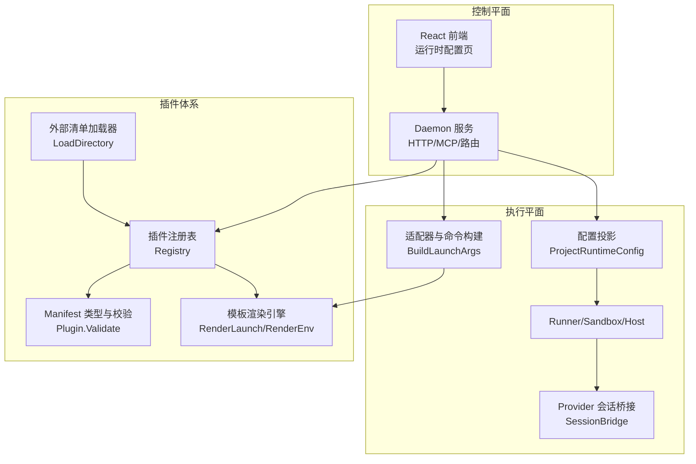
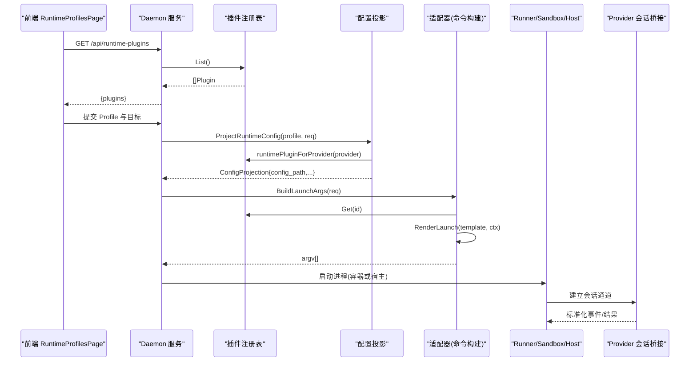
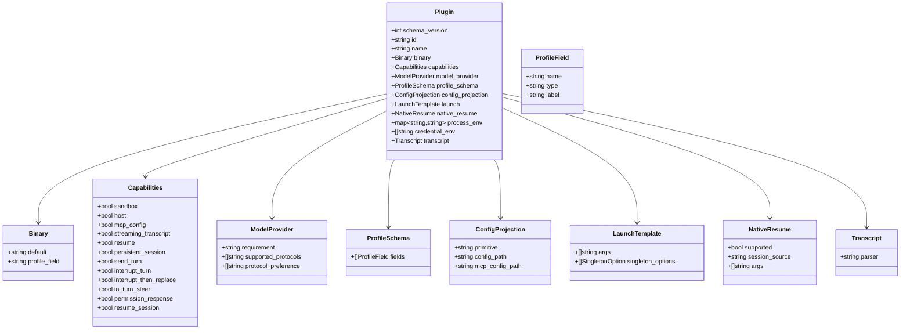
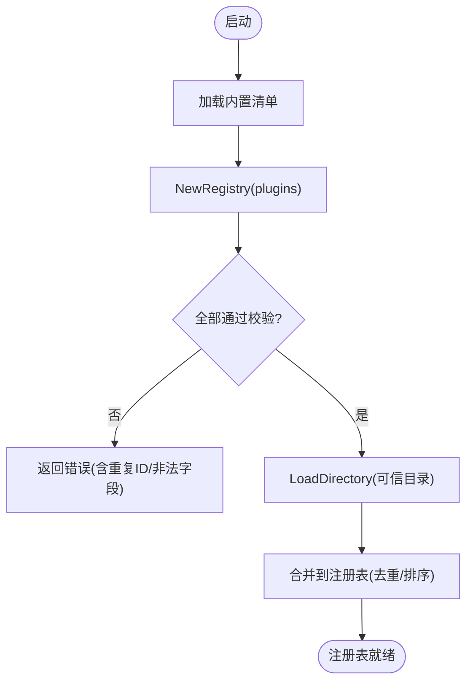
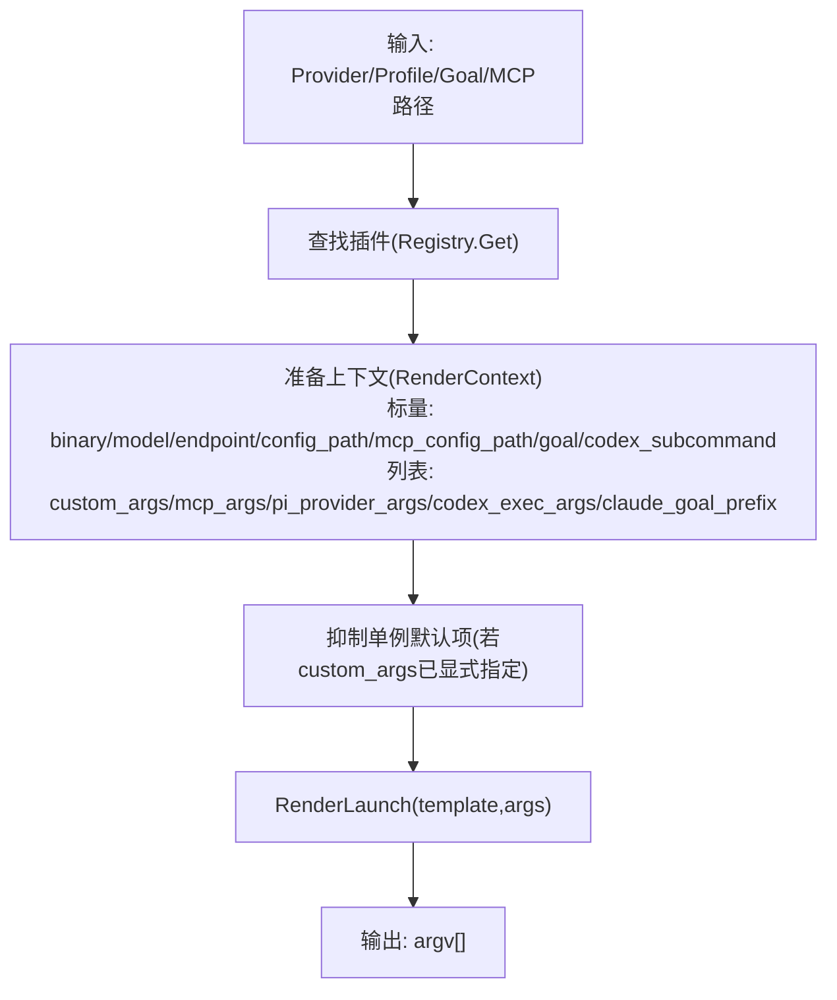
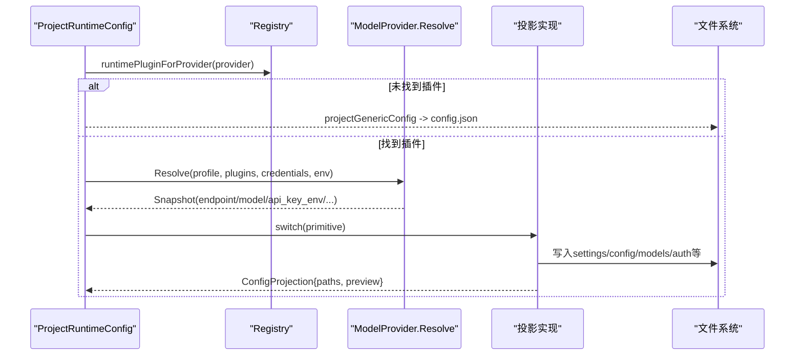
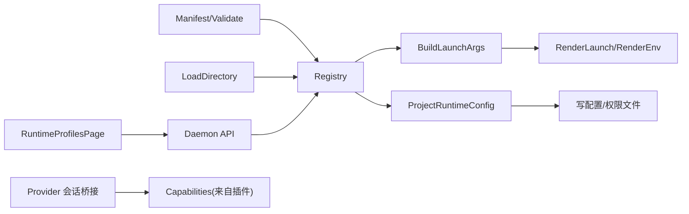

# 运行时插件架构

<cite>
**本文引用的文件**   
- [README.md](file://README.md)
- [CONTEXT.md](file://CONTEXT.md)
- [blackboard-runtime-protocol.md](file://docs/specs/blackboard-runtime-protocol.md)
- [2026-06-19-runtime-plugin-design.md](file://docs/superpowers/specs/2026-06-19-runtime-plugin-design.md)
- [2026-06-19-runtime-plugin-implementation.md](file://docs/superpowers/plans/2026-06-19-runtime-plugin-implementation.md)
- [plugin.go](file://internal/runtimeplugin/plugin.go)
- [registry.go](file://internal/runtimeplugin/registry.go)
- [builtin.go](file://internal/runtimeplugin/builtin.go)
- [template.go](file://internal/runtimeplugin/template.go)
- [loader.go](file://internal/runtimeplugin/loader.go)
- [adapters.go](file://internal/adapters/adapters.go)
- [projection.go](file://internal/runner/projection.go)
- [runtime_plugin_handlers.go](file://internal/daemon/runtime_plugin_handlers.go)
- [provider_adapters.go](file://internal/runtime/provider_adapters.go)
- [production_provider_session_factory.go](file://internal/daemon/production_provider_session_factory.go)
- [Dockerfile](file://docker/pentest-sandbox/Dockerfile)
- [smoke-runtime-tasks-live.py](file://scripts/smoke-runtime-tasks-live.py)
- [RuntimeProfilesPage.tsx](file://web/src/pages/RuntimeProfilesPage.tsx)
- [taskLaunchForm.ts](file://web/src/pages/taskLaunchForm.ts)
</cite>

## 目录
1. [简介](#简介)
2. [项目结构](#项目结构)
3. [核心组件](#核心组件)
4. [架构总览](#架构总览)
5. [详细组件分析](#详细组件分析)
6. [依赖关系分析](#依赖关系分析)
7. [性能与可扩展性](#性能与可扩展性)
8. [故障排查指南](#故障排查指南)
9. [结论](#结论)
10. [附录：自定义插件开发指南](#附录自定义插件开发指南)

## 简介
本文件系统性阐述 CyberPenda 的“运行时插件架构”，围绕声明式适配器设计模式、插件发现机制、模板系统和工作流定义展开，并深入解析内置插件（Codex、Claude Code、Pi）的实现细节，包括环境变量注入、配置文件生成、命令构建与参数解析。同时提供自定义插件的开发规范、测试方法与部署策略，帮助读者在保持安全边界的前提下扩展新的运行时提供者。

## 项目结构
CyberPenda 采用“控制平面 + 执行平面”的分层组织方式：
- 控制平面：Daemon HTTP API、MCP Server、任务生命周期管理、UI 页面
- 执行平面：Sandbox/Host Runner、Provider 会话桥接、Transcript 解析
- 插件体系：声明式 Manifest、Registry、Template、Projection、Adapter

图表来源
- [runtime_plugin_handlers.go:1-34](file://internal/daemon/runtime_plugin_handlers.go#L1-L34)
- [plugin.go:1-224](file://internal/runtimeplugin/plugin.go#L1-L224)
- [template.go:1-166](file://internal/runtimeplugin/template.go#L1-L166)
- [loader.go:1-48](file://internal/runtimeplugin/loader.go#L1-L48)
- [adapters.go:1-399](file://internal/adapters/adapters.go#L1-L399)
- [projection.go:1-800](file://internal/runner/projection.go#L1-L800)

章节来源
- [README.md:1-173](file://README.md#L1-L173)
- [CONTEXT.md:287-317](file://CONTEXT.md#L287-L317)

## 核心组件
- 声明式 Manifest 与校验：定义插件元数据、能力集、模型提供方要求、Profile Schema、配置投影原语、启动模板、原生恢复、进程环境、凭据环境变量、Transcript 解析器等；并提供严格校验逻辑。
- 插件注册表：集中管理内置与可信外部插件，保证 ID 唯一、列表稳定排序、返回副本避免共享可变状态。
- 模板系统：支持标量与列表占位符替换、单例选项抑制、可选参数省略、空值过滤等。
- 配置投影：根据插件声明的原语将 Profile 字段映射为运行时可消费的配置（如 Claude settings.json、Codex config.toml、Pi agent models.json），并写入受控路径。
- 适配器与命令构建：基于插件模板与 Profile 构造最终命令行参数，自动注入非交互与安全相关参数，屏蔽敏感信息泄露。
- 会话桥接与 Provider 适配：封装跨 Provider 的 RPC 语义（发送轮次、中断、权限响应、原地转向等），统一事件归一化与结算等待。

章节来源
- [plugin.go:1-224](file://internal/runtimeplugin/plugin.go#L1-L224)
- [registry.go:1-99](file://internal/runtimeplugin/registry.go#L1-L99)
- [template.go:1-166](file://internal/runtimeplugin/template.go#L1-L166)
- [projection.go:1-800](file://internal/runner/projection.go#L1-L800)
- [adapters.go:1-399](file://internal/adapters/adapters.go#L1-L399)
- [provider_adapters.go:1-800](file://internal/runtime/provider_adapters.go#L1-L800)

## 架构总览
运行时插件通过“声明式 Manifest + 注册表 + 模板渲染 + 配置投影 + 适配器”的组合，实现“以配置驱动行为”的运行时提供者抽象。Daemon 暴露插件元数据 API，前端据此动态渲染表单与预览；Runner 在任务启动前完成配置投影与凭证材料化；Adapters 负责最终命令构建与运行；Provider 会话桥接负责长连接协议适配与事件归一化。

图表来源
- [runtime_plugin_handlers.go:1-34](file://internal/daemon/runtime_plugin_handlers.go#L1-L34)
- [projection.go:1-800](file://internal/runner/projection.go#L1-L800)
- [adapters.go:1-399](file://internal/adapters/adapters.go#L1-L399)
- [provider_adapters.go:1-800](file://internal/runtime/provider_adapters.go#L1-L800)

## 详细组件分析

### 声明式适配器与 Manifest 校验
- 关键类型：Plugin、Binary、Capabilities、ModelProvider、ProfileSchema、ConfigProjection、LaunchTemplate、NativeResume、ProcessEnv、CredentialEnv、Transcript。
- 校验规则：schema_version、id/name 必填、binary.default 必填、profile field 类型白名单、去重、投影原语白名单、模型提供方协议白名单与偏好、transcript parser 白名单、singleton arity 合法、credential_env 不得包含值片段等。
- 作用：确保所有插件描述一致、安全且可被后续流程消费。

图表来源
- [plugin.go:1-224](file://internal/runtimeplugin/plugin.go#L1-L224)

章节来源
- [plugin.go:1-224](file://internal/runtimeplugin/plugin.go#L1-L224)

### 插件发现与注册表
- 内置插件：fake、codex、claude_code、pi，均具备完整能力集、模型提供方要求、Profile Schema、投影原语、启动模板、原生恢复与环境变量声明。
- 注册表：NewRegistry 校验并克隆插件，BuiltinRegistry 聚合内置清单，List/Get/Has/IDs 提供稳定访问；clonePlugin 深拷贝避免共享可变状态。
- 外部清单加载：LoadDirectory 仅读取顶层 .json，解码后 Validate，错误收集不中断加载。

图表来源
- [registry.go:1-99](file://internal/runtimeplugin/registry.go#L1-L99)
- [builtin.go:1-221](file://internal/runtimeplugin/builtin.go#L1-L221)
- [loader.go:1-48](file://internal/runtimeplugin/loader.go#L1-L48)

章节来源
- [registry.go:1-99](file://internal/runtimeplugin/registry.go#L1-L99)
- [builtin.go:1-221](file://internal/runtimeplugin/builtin.go#L1-L221)
- [loader.go:1-48](file://internal/runtimeplugin/loader.go#L1-L48)

### 模板系统与命令构建
- 模板渲染：RenderLaunch 支持标量与列表占位符、可选参数省略、单例选项抑制（当用户自定义覆盖时移除默认项）、空值过滤。
- 命令构建：BuildLaunchArgs 从注册表获取插件，结合 Profile 与任务目标，组装 RenderContext，调用模板渲染得到 argv；同时注入非交互与安全参数（如跳过权限确认）。
- 原生恢复：BuildNativeResumeArgs 使用插件声明的 NativeResume.Args 进行渲染，支持会话源与恢复消息。

图表来源
- [template.go:1-166](file://internal/runtimeplugin/template.go#L1-L166)
- [adapters.go:1-399](file://internal/adapters/adapters.go#L1-L399)

章节来源
- [template.go:1-166](file://internal/runtimeplugin/template.go#L1-L166)
- [adapters.go:1-399](file://internal/adapters/adapters.go#L1-L399)

### 配置投影与工作流定义
- 入口：ProjectRuntimeConfig 依据插件声明的 ConfigProjection.Primitive 选择具体投影实现（claude_settings、codex_home、pi_agent、none/generic）。
- 模型提供方快照：按需 Resolve 模型提供方，回填 endpoint/model 并注入各运行时所需的环境变量（如 ANTHROPIC_BASE_URL、CODEX_*、PI_*）。
- 技能与扩展：按需要复制 Skills 与 Runtime Extensions，生成预览元数据。
- 输出：返回 ConfigProjection，包含 config_path、mcp_config_path、鉴权文件路径、预览信息等。

图表来源
- [projection.go:1-800](file://internal/runner/projection.go#L1-L800)
- [plugin.go:1-224](file://internal/runtimeplugin/plugin.go#L1-L224)

章节来源
- [projection.go:1-800](file://internal/runner/projection.go#L1-L800)

### 内置插件实现细节

#### Codex
- 能力：沙箱/宿主、MCP 配置、流式转录、恢复、持久会话、发送轮次、中断、中断后替换、权限响应、会话恢复。
- 模型提供方：要求 openai_responses。
- 配置投影：codex_home，生成 runtime-home/codex/config.toml，必要时生成 auth.json。
- 启动模板：{{binary}} {{codex_subcommand}} --model {{model}} {{codex_exec_args}} {{custom_args}} {{codex_goal_prefix}} {{goal}}。
- 原生恢复：exec --model ... resume <session> <message>。
- 进程环境：CODEX_HOME 指向运行时家目录。
- 凭据环境变量：OPENAI_API_KEY、CODEX_API_KEY。
- 转录解析器：codex_json。

章节来源
- [builtin.go:44-84](file://internal/runtimeplugin/builtin.go#L44-L84)
- [projection.go:462-538](file://internal/runner/projection.go#L462-L538)
- [adapters.go:146-185](file://internal/adapters/adapters.go#L146-L185)

#### Claude Code
- 能力：沙箱/宿主、MCP 配置、流式转录、恢复、持久会话、发送轮次、中断、中断后替换、权限响应、会话恢复。
- 模型提供方：要求 anthropic_messages。
- 配置投影：claude_settings，生成 runtime-home/claude/settings.json 与 workdir/.mcp.json。
- 启动模板：claude --model {{model}} --settings {{config_path}} {{mcp_args}} -p --output-format stream-json --verbose {{custom_args}} {{claude_goal_prefix}} {{goal}}。
- 原生恢复：--resume <session> --model {{model}} --settings {{config_path}} {{mcp_args}} -p --output-format stream-json --verbose {{custom_args}} {{claude_goal_prefix}} <resumed_message>。
- 进程环境：CLAUDE_HOME 指向运行时家目录。
- 凭据环境变量：ANTHROPIC_AUTH_TOKEN、ANTHROPIC_API_KEY。
- 转录解析器：claude_stream_json。

章节来源
- [builtin.go:85-154](file://internal/runtimeplugin/builtin.go#L85-L154)
- [projection.go:390-460](file://internal/runner/projection.go#L390-L460)
- [adapters.go:146-185](file://internal/adapters/adapters.go#L146-L185)

#### Pi
- 能力：沙箱/宿主、MCP 配置、流式转录、恢复、持久会话、发送轮次、中断、中断后替换、权限响应、会话恢复。
- 模型提供方：支持 openai_chat_completions/openai_responses/anthropic_messages。
- 配置投影：pi_agent，生成 runtime-home/pi/agent/models.json 与 mcp.json，必要时 settings.json（packages）。
- 启动模板：{{binary}} {{pi_provider_args}} --model {{model}} --mode json {{custom_args}} {{goal}}。
- 原生恢复：{{binary}} {{pi_provider_args}} --model {{model}} --mode json --session <session> {{custom_args}} <resumed_message>。
- 进程环境：PI_CODING_AGENT_DIR、PI_CODING_AGENT_SESSION_DIR。
- 凭据环境变量：ANTHROPIC_API_KEY、OPENAI_API_KEY。
- 转录解析器：pi_json_session。

章节来源
- [builtin.go:155-212](file://internal/runtimeplugin/builtin.go#L155-L212)
- [projection.go:540-680](file://internal/runner/projection.go#L540-L680)
- [adapters.go:187-199](file://internal/adapters/adapters.go#L187-L199)

### 工作流与协议一致性
- Blackboard v2 运行时协议要求每个运行时插件在启动前输出指令文件与完整图快照，并通过 MCP 暴露受信任工具。不同插件对指令文件的命名与位置有差异，但语义一致。
- 该约束由文档规范明确，并在各插件的投影与启动流程中落实。

章节来源
- [blackboard-runtime-protocol.md:682-696](file://docs/specs/blackboard-runtime-protocol.md#L682-L696)

## 依赖关系分析
- 插件注册表依赖 Manifest 类型与校验；外部清单加载器依赖文件系统与 JSON 编解码。
- 适配器依赖注册表与模板渲染；配置投影依赖注册表与模型提供方解析。
- Daemon 暴露插件元数据 API；前端页面拉取插件列表并渲染表单。
- Provider 会话桥接依赖插件能力集，用于启用/禁用特定功能。

图表来源
- [plugin.go:1-224](file://internal/runtimeplugin/plugin.go#L1-L224)
- [registry.go:1-99](file://internal/runtimeplugin/registry.go#L1-L99)
- [loader.go:1-48](file://internal/runtimeplugin/loader.go#L1-L48)
- [adapters.go:1-399](file://internal/adapters/adapters.go#L1-L399)
- [projection.go:1-800](file://internal/runner/projection.go#L1-L800)
- [runtime_plugin_handlers.go:1-34](file://internal/daemon/runtime_plugin_handlers.go#L1-L34)
- [provider_adapters.go:1-800](file://internal/runtime/provider_adapters.go#L1-L800)

章节来源
- [runtime_plugin_handlers.go:1-34](file://internal/daemon/runtime_plugin_handlers.go#L1-L34)
- [RuntimeProfilesPage.tsx:199-231](file://web/src/pages/RuntimeProfilesPage.tsx#L199-L231)
- [taskLaunchForm.ts:1-31](file://web/src/pages/taskLaunchForm.ts#L1-L31)

## 性能与可扩展性
- 模板渲染为纯函数，无 I/O，时间复杂度与参数数量线性相关；列表占位符展开与空值过滤开销低。
- 注册表初始化一次，后续查询 O(1)，列表返回稳定顺序，适合高频 UI 展示。
- 配置投影仅在任务启动阶段执行，涉及少量文件写入与 JSON/TOML 编码，整体开销可控。
- 可扩展点：新增插件只需添加 Manifest 与必要投影实现；外部清单加载允许在不修改代码的情况下引入新提供者。

[本节为通用指导，无需源码引用]

## 故障排查指南
- 插件清单无效：检查 schema_version、id/name、binary.default、profile field 类型、投影原语、transcript parser、singleton arity、credential_env 是否包含值片段。
- 无法找到二进制：DetectBinary 会尝试 PATH 查找与绝对路径校验，失败时记录错误以便上层记录运行轨迹。
- 凭据缺失：MaterializeLaunchCredentials 会优先使用模型提供方 API Key 环境变量或内联/引用解析；缺失则报错。
- 模板渲染异常：未闭合占位符或未知键会导致错误；检查模板与 RenderContext 键名。
- 原生恢复不支持：若插件未声明 NativeResume.Supported，调用将返回错误。

章节来源
- [plugin.go:136-214](file://internal/runtimeplugin/plugin.go#L136-L214)
- [adapters.go:219-261](file://internal/adapters/adapters.go#L219-L261)
- [projection.go:756-800](file://internal/runner/projection.go#L756-L800)
- [template.go:130-145](file://internal/runtimeplugin/template.go#L130-L145)

## 结论
CyberPenda 的运行时插件架构通过“声明式 Manifest + 注册表 + 模板渲染 + 配置投影 + 适配器”实现了高内聚、低耦合的运行时提供者抽象。内置插件（Codex、Claude Code、Pi）覆盖了主流 AI 编程代理的运行需求，并在安全边界（凭据隔离、最小权限、受控文件写入）与用户体验（动态表单、预览、MCP 集成）之间取得平衡。借助外部清单加载与清晰的扩展点，系统具备良好的可演进性与可维护性。

[本节为总结，无需源码引用]

## 附录：自定义插件开发指南

### 插件结构规范
- 清单字段：参考 Plugin 及其子类型定义，确保必填字段齐全、类型在白名单内。
- 能力集：根据实际运行时特性设置 Capabilities，如沙箱/宿主、MCP 配置、流式转录、恢复等。
- 模型提供方：声明 requirement、supported_protocols 与 preference，便于上游解析与选择。
- Profile Schema：定义字段名称、类型与标签，供 UI 渲染与校验。
- 配置投影：选择支持的 primitive（none/generic_config/codex_home/claude_settings/pi_agent），并给出 config_path 与 mcp_config_path。
- 启动模板：使用 {{...}} 占位符，合理组织标量与列表；必要时声明 SingletonOptions 以避免冲突。
- 原生恢复：如需支持，声明 Supported、SessionSource 与 Args。
- 进程环境与凭据：声明 ProcessEnv 与 CredentialEnv，避免硬编码密钥。
- 转录解析器：选择内置 parser（plain_runtime_output/codex_json/claude_stream_json/pi_json_session）。

章节来源
- [plugin.go:1-224](file://internal/runtimeplugin/plugin.go#L1-L224)
- [builtin.go:1-221](file://internal/runtimeplugin/builtin.go#L1-L221)

### 模板与命令构建要点
- 使用 RenderLaunch 与 RenderEnv 进行渲染，注意空值与可选参数的处理。
- 利用 HasCLIOption 与 SingletonOptions 抑制默认项，避免与用户自定义冲突。
- 在适配器中补充 provider-specific 的非交互与安全参数（如跳过权限确认）。

章节来源
- [template.go:1-166](file://internal/runtimeplugin/template.go#L1-L166)
- [adapters.go:120-135](file://internal/adapters/adapters.go#L120-L135)

### 配置投影与凭证材料化
- 若需自定义投影原语，需在 Go 侧实现对应函数，并在插件清单中声明。
- 使用 MaterializeLaunchCredentials 与 resolveMaterializedCredentials 获取凭据，避免将敏感值写入预览。
- 对于多 Provider 场景（如 Pi），考虑全局模型提供方快照与投影合并。

章节来源
- [projection.go:1-800](file://internal/runner/projection.go#L1-L800)

### 测试方法
- 单元测试：验证 Manifest 校验、注册表构建、模板渲染、命令构建、二进制检测、凭据解析。
- 集成测试：使用 smoke 脚本创建 Profile 并触发真实运行（需 Docker 与凭据）。
- 前端测试：验证插件列表加载、表单渲染、预览生成与启动条件判断。

章节来源
- [plugin_test.go](file://internal/runtimeplugin/plugin_test.go)
- [template_test.go](file://internal/runtimeplugin/template_test.go)
- [adapters_test.go](file://internal/adapters/adapters_test.go)
- [smoke-runtime-tasks-live.py:367-408](file://scripts/smoke-runtime-tasks-live.py#L367-L408)
- [taskLaunchForm.test.ts:47-82](file://web/src/pages/taskLaunchForm.test.ts#L47-L82)

### 部署策略
- 内置插件：随代码编译分发，无需额外操作。
- 外部插件：放置于可信目录（由 daemon 配置启用），Daemon 启动时加载并校验；非法清单将被忽略并记录错误。
- 沙箱镜像：如需安装第三方依赖（如 Claude SDK bridge、Pi 优化包），在 Dockerfile 中固定版本并缓存依赖层。

章节来源
- [loader.go:1-48](file://internal/runtimeplugin/loader.go#L1-L48)
- [Dockerfile:29-49](file://docker/pentest-sandbox/Dockerfile#L29-L49)