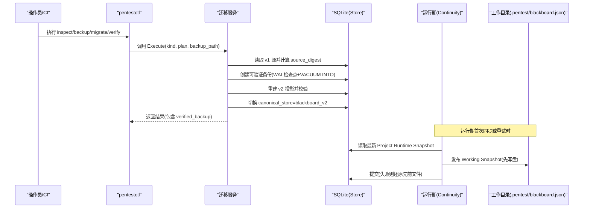
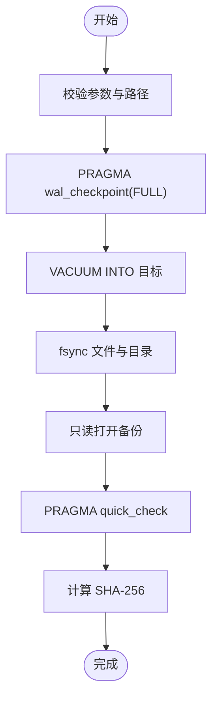
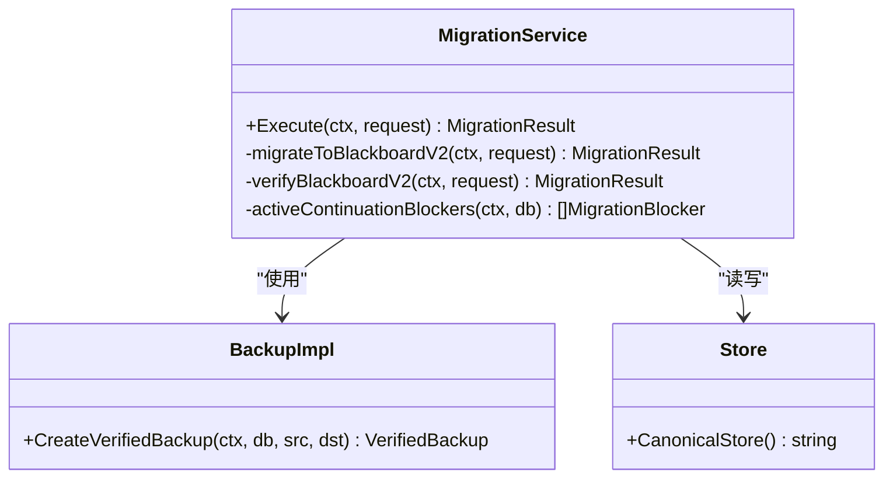
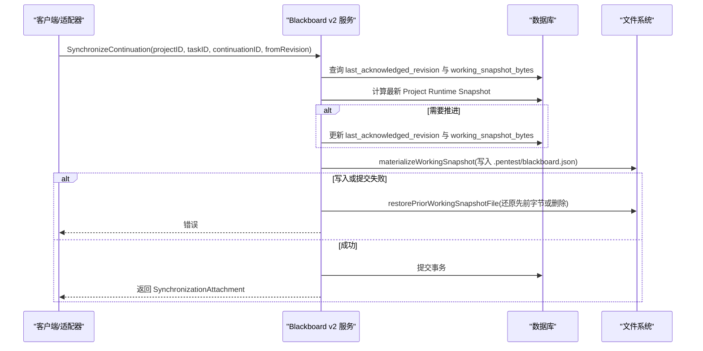
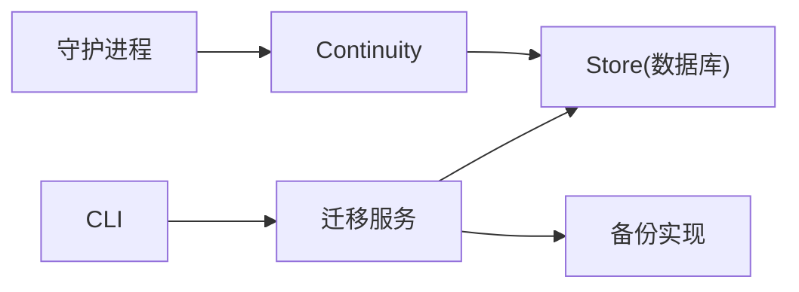

# 备份与恢复

<cite>
**本文引用的文件**   
- [backup.go](file://internal/blackboardmigration/backup.go)
- [migrate_v2.go](file://internal/blackboardmigration/migrate_v2.go)
- [service.go](file://internal/blackboardmigration/service.go)
- [continuity.go](file://internal/blackboardv2/continuity.go)
- [checkpoint.go](file://internal/blackboardv2/checkpoint.go)
- [server.go](file://internal/daemon/server.go)
- [task_handlers.go](file://internal/daemon/task_handlers.go)
- [blackboard_v2.go](file://internal/pentestctl/blackboard_v2.go)
- [store.go](file://internal/store/store.go)
- [0007-rebuild-blackboard-v2-atomically.md](file://docs/adr/0007-rebuild-blackboard-v2-atomically.md)
</cite>

## 目录
1. [简介](#简介)
2. [项目结构](#项目结构)
3. [核心组件](#核心组件)
4. [架构总览](#架构总览)
5. [详细组件分析](#详细组件分析)
6. [依赖关系分析](#依赖关系分析)
7. [性能考虑](#性能考虑)
8. [故障排查指南](#故障排查指南)
9. [结论](#结论)
10. [附录](#附录)

## 简介
本指南面向运维与平台工程师，系统化说明 CyberPenda 的备份与恢复能力，覆盖：
- 数据库快照机制（SQLite WAL 检查点、VACUUM INTO 物理备份、独立 quick_check 校验）
- 黑板状态备份与迁移（离线 v1→v2 原子切换、可验证备份、回滚保障）
- 增量备份策略（基于 Continuation 同步附件与 Working Snapshot 的“近实时”增量）
- 灾难恢复流程（进程崩溃、文件系统失败、跨节点容灾）
- 版本兼容性管理（Store Epoch、迁移历史、向后兼容边界）
- 自动化脚本建议（定时备份、异地复制、完整性校验）
- 数据迁移工具与回滚操作指导（CLI 命令、阻塞项诊断、失败注入测试）

## 项目结构
与备份与恢复直接相关的代码分布在以下模块：
- blackboardmigration：离线迁移服务与可验证备份实现
- blackboardv2：Continuation 同步、Working Snapshot 发布与恢复、Checkpoint 语义更新
- daemon：守护进程启动时的任务与 Continuation 恢复协调
- pentestctl：离线 CLI 入口（inspect/backup/migrate/verify）
- store：数据库表结构与迁移记录（含 Continuation Pin/State 表）

```mermaid
graph TB
subgraph "迁移与备份"
Migrate["迁移服务<br/>migrate_v2.go"]
Backup["可验证备份实现<br/>backup.go"]
Service["迁移编排入口<br/>service.go"]
end
subgraph "运行时连续性"
Continuity["Continuity 服务<br/>continuity.go"]
Checkpoint["尝试检查点<br/>checkpoint.go"]
end
subgraph "守护进程"
DaemonServer["守护进程服务器<br/>server.go"]
TaskHandlers["任务处理<br/>task_handlers.go"]
end
subgraph "CLI"
CLI["pentestctl 黑屏板 v2 命令<br/>blackboard_v2.go"]
end
subgraph "存储"
Store["数据库表定义<br/>store.go"]
end
CLI --> Service
Service --> Migrate
Service --> Backup
Migrate --> Store
Backup --> Store
Continuity --> Store
Checkpoint --> Continuity
DaemonServer --> Continuity
TaskHandlers --> Continuity
```

图表来源
- [migrate_v2.go:1-200](file://internal/blackboardmigration/migrate_v2.go#L1-L200)
- [backup.go:1-130](file://internal/blackboardmigration/backup.go#L1-L130)
- [service.go:160-187](file://internal/blackboardmigration/service.go#L160-L187)
- [continuity.go:647-751](file://internal/blackboardv2/continuity.go#L647-L751)
- [checkpoint.go:68-99](file://internal/blackboardv2/checkpoint.go#L68-L99)
- [server.go:275-304](file://internal/daemon/server.go#L275-L304)
- [task_handlers.go:2277-2324](file://internal/daemon/task_handlers.go#L2277-L2324)
- [blackboard_v2.go:253-342](file://internal/pentestctl/blackboard_v2.go#L253-L342)
- [store.go:1103-1118](file://internal/store/store.go#L1103-L1118)

章节来源
- [service.go:160-187](file://internal/blackboardmigration/service.go#L160-L187)
- [backup.go:1-130](file://internal/blackboardmigration/backup.go#L1-L130)
- [migrate_v2.go:1-200](file://internal/blackboardmigration/migrate_v2.go#L1-L200)
- [continuity.go:647-751](file://internal/blackboardv2/continuity.go#L647-L751)
- [checkpoint.go:68-99](file://internal/blackboardv2/checkpoint.go#L68-L99)
- [server.go:275-304](file://internal/daemon/server.go#L275-L304)
- [task_handlers.go:2277-2324](file://internal/daemon/task_handlers.go#L2277-L2324)
- [blackboard_v2.go:253-342](file://internal/pentestctl/blackboard_v2.go#L253-L342)
- [store.go:1103-1118](file://internal/store/store.go#L1103-L1118)

## 核心组件
- 可验证备份实现
  - 使用 SQLite PRAGMA wal_checkpoint(FULL) 确保一致性；VACUUM INTO 生成物理副本；独立以只读方式打开并执行 quick_check；计算 SHA-256 摘要；设置仅所有者权限并 fsync。
  - 提供逻辑备份路径（按 schema 重建目标库），用于离线迁移源备份。
- 迁移服务（v1→v2）
  - inspect：计算不可变 source_digest，列出项目与映射计划。
  - backup：在迁移前创建可验证备份，返回路径、摘要与 quick_check。
  - migrate：在单个事务中重建 v2 投影、应用范围限制、校验、审计、切换 epoch，失败自动回滚。
  - verify：对已切换的 v2 进行确定性快照校验与隔离性检查。
- Continuity 服务（运行时连续性）
  - SynchronizeContinuation/CaptureTrustedSynchronization：将最新 Project Runtime Snapshot 作为 Working Snapshot 持久化到磁盘，支持“先发布后提交”的幂等重放与崩溃恢复。
  - ClaimTrustedSynchronization：为带指纹的请求保留待处理通知，避免并发重复投递。
  - restorePriorWorkingSnapshotFile：在发布失败时精确还原先前文件或删除新增文件。
- 尝试检查点（Checkpoint）
  - 通过 ChangeBatch 原子更新 Attempt 摘要，纳入同一事务与 Working Snapshot 流水线。
- 守护进程恢复
  - 启动时中断孤儿任务、终端 Continuation 再平衡，保证系统重启后的状态一致。
- CLI 工具
  - 提供 offline 模式下的 change/read/history/evidence retain/attempt checkpoint/continuation finish 等命令，并与 Continuity 协作完成同步附件的捕获与重放。

章节来源
- [backup.go:34-130](file://internal/blackboardmigration/backup.go#L34-L130)
- [service.go:160-187](file://internal/blackboardmigration/service.go#L160-L187)
- [migrate_v2.go:26-200](file://internal/blackboardmigration/migrate_v2.go#L26-L200)
- [continuity.go:647-751](file://internal/blackboardv2/continuity.go#L647-L751)
- [continuity.go:753-762](file://internal/blackboardv2/continuity.go#L753-L762)
- [checkpoint.go:68-99](file://internal/blackboardv2/checkpoint.go#L68-L99)
- [server.go:275-304](file://internal/daemon/server.go#L275-L304)
- [blackboard_v2.go:253-342](file://internal/pentestctl/blackboard_v2.go#L253-L342)

## 架构总览
下图展示从 CLI 触发迁移到数据库切换、再到运行时连续性的整体流程。



图表来源
- [service.go:160-187](file://internal/blackboardmigration/service.go#L160-L187)
- [backup.go:34-130](file://internal/blackboardmigration/backup.go#L34-L130)
- [migrate_v2.go:26-200](file://internal/blackboardmigration/migrate_v2.go#L26-L200)
- [continuity.go:647-751](file://internal/blackboardv2/continuity.go#L647-L751)

## 详细组件分析

### 组件A：可验证备份（SQLite 物理与逻辑备份）
- 物理备份路径
  - 强制要求文件型数据库；WAL FULL 检查点；VACUUM INTO 生成副本；独立只读打开执行 quick_check；SHA-256 校验；fsync 目录与文件；权限收紧至仅所有者。
- 逻辑备份路径（用于离线迁移源）
  - 读取 sqlite_master 中的表/索引/触发器/视图 DDL，在新库中重建 schema，逐表拷贝数据，最后提交事务；失败时清理目标文件。
- 关键约束
  - 禁止源与目标相同；目标不存在且可写；quick_check 必须 ok；独立打开只读成功。



图表来源
- [backup.go:34-130](file://internal/blackboardmigration/backup.go#L34-L130)
- [backup.go:138-190](file://internal/blackboardmigration/backup.go#L138-L190)

章节来源
- [backup.go:34-130](file://internal/blackboardmigration/backup.go#L34-L130)
- [backup.go:138-190](file://internal/blackboardmigration/backup.go#L138-L190)

### 组件B：迁移服务（v1→v2 原子切换）
- 前置检查
  - 校验当前 epoch 是否为 v1；检查是否存在活动 Continuation（pending/running/paused）；校验 source_digest 与计划一致。
- 重建与校验
  - 重建每个项目的 v2 投影；应用 staged scope limits；对每个项目生成 runtime-blackboard/v2 快照并校验契约与确定性；验证证据文件完整性与跨项目隔离。
- 切换与回滚
  - 在单事务内完成 epoch 切换与审计记录；若任一阶段失败，事务回滚，保持 v1 权威；记录 migration 历史以确保后续正常打开。



图表来源
- [service.go:160-187](file://internal/blackboardmigration/service.go#L160-L187)
- [migrate_v2.go:26-200](file://internal/blackboardmigration/migrate_v2.go#L26-L200)
- [migrate_v2.go:403-440](file://internal/blackboardmigration/migrate_v2.go#L403-L440)

章节来源
- [service.go:160-187](file://internal/blackboardmigration/service.go#L160-L187)
- [migrate_v2.go:26-200](file://internal/blackboardmigration/migrate_v2.go#L26-L200)
- [migrate_v2.go:403-440](file://internal/blackboardmigration/migrate_v2.go#L403-L440)

### 组件C：Continuity 同步与 Working Snapshot 恢复
- 同步流程
  - 读取当前 Project Runtime Snapshot；若 revision 大于 last_acknowledged_revision，则更新 state.working_snapshot_bytes 并推进 acknowledged。
  - 先写入磁盘 Working Snapshot，再提交事务；若写入或提交失败，调用 restorePriorWorkingSnapshotFile 精确还原先前字节或移除新增文件。
- 幂等重放
  - 通过 ClaimTrustedSynchronization 为请求指纹保留 pending notice；CaptureTrustedSynchronization 在失败或丢失响应时可重放 exact attachment。
- 恢复场景
  - 进程崩溃后，下次同步会重新发布 committed working snapshot 字节，确保磁盘与数据库一致。



图表来源
- [continuity.go:647-751](file://internal/blackboardv2/continuity.go#L647-L751)
- [continuity.go:753-762](file://internal/blackboardv2/continuity.go#L753-L762)

章节来源
- [continuity.go:647-751](file://internal/blackboardv2/continuity.go#L647-L751)
- [continuity.go:753-762](file://internal/blackboardv2/continuity.go#L753-L762)

### 组件D：尝试检查点（Attempt Checkpoint）
- 通过 ChangeBatch 原子更新 Attempt 的 summary，与 Working Snapshot 在同一事务中生效，确保检查点与黑板状态一致。
- 适用于长任务分阶段保存进度，便于恢复与审计。

章节来源
- [checkpoint.go:68-99](file://internal/blackboardv2/checkpoint.go#L68-L99)

### 组件E：守护进程恢复与再平衡
- 启动时检测孤儿任务并标记中断；对终端 Continuation 执行再平衡，确保无悬挂状态。
- 与 Continuity 配合，保证重启后 Working Snapshot 与数据库一致。

章节来源
- [server.go:275-304](file://internal/daemon/server.go#L275-L304)
- [task_handlers.go:2277-2324](file://internal/daemon/task_handlers.go#L2277-L2324)

### 组件F：CLI 离线模式与同步附件
- 解析输入 JSON，选择 offline 或 API 模式；offline 模式下通过 capability token 绑定 Project/Task/Continuation。
- 在执行前后调用 CaptureTrustedSynchronization，确保丢失响应可重放 exact attachment。

章节来源
- [blackboard_v2.go:253-342](file://internal/pentestctl/blackboard_v2.go#L253-L342)

## 依赖关系分析
- 迁移服务依赖 Store 的 epoch 与表结构；备份实现依赖 SQLite 原生能力；Continuity 依赖 Store 的 Continuation Pin/State 表。
- CLI 作为编排入口，串联迁移与运行时连续性。



图表来源
- [service.go:160-187](file://internal/blackboardmigration/service.go#L160-L187)
- [backup.go:34-130](file://internal/blackboardmigration/backup.go#L34-L130)
- [continuity.go:647-751](file://internal/blackboardv2/continuity.go#L647-L751)
- [server.go:275-304](file://internal/daemon/server.go#L275-L304)

章节来源
- [service.go:160-187](file://internal/blackboardmigration/service.go#L160-L187)
- [backup.go:34-130](file://internal/blackboardmigration/backup.go#L34-L130)
- [continuity.go:647-751](file://internal/blackboardv2/continuity.go#L647-L751)
- [server.go:275-304](file://internal/daemon/server.go#L275-L304)

## 性能考虑
- 物理备份使用 VACUUM INTO，适合冷备；热备建议使用逻辑备份或结合 WAL 模式与定期 checkpoint。
- 同步附件与 Working Snapshot 的“先写盘后提交”策略减少锁持有时间，提升吞吐。
- 迁移过程在单事务内完成，避免长时间双写；校验阶段并行度有限，但可通过分批项目优化。

## 故障排查指南
- 常见阻塞项
  - 存在活动 Continuation（pending/running/paused）：需先终止或完成后再迁移。
  - source_digest 不匹配：确认 inspect 结果与 migrate 传入一致。
  - 备份路径冲突或不可写：确保目标不存在且可写。
- 恢复步骤
  - 若迁移失败，事务回滚，v1 仍权威；可使用之前创建的 verified backup 恢复。
  - 若 Working Snapshot 发布失败，系统会自动还原先前字节或移除新增文件，重试即可。
- 验证方法
  - 使用 verify 命令对 v2 进行快照确定性与隔离性检查。
  - 对 Evidence 文件进行 SHA-256 与大小比对。

章节来源
- [migrate_v2.go:403-440](file://internal/blackboardmigration/migrate_v2.go#L403-L440)
- [migrate_v2.go:203-283](file://internal/blackboardmigration/migrate_v2.go#L203-L283)
- [continuity.go:753-762](file://internal/blackboardv2/continuity.go#L753-L762)

## 结论
CyberPenda 的备份与恢复体系围绕“可验证备份 + 原子迁移 + 运行时连续性”构建：
- 备份具备强一致性与独立校验能力，满足合规与审计需求。
- 迁移采用离线、原子、可回滚的流程，确保 v1→v2 平滑过渡。
- Continuity 通过 Working Snapshot 与同步附件实现幂等重放与崩溃恢复，保障运行期一致性。
- CLI 提供端到端编排，便于自动化与 CI/CD 集成。

## 附录

### 自动化备份脚本建议
- 定时任务
  - 每日执行 inspect 与 backup，输出 plan.json 与 verified backup，记录 sha256 与 quick_check。
  - 每周执行一次 verify，确保 v2 健康。
- 异地容灾
  - 将 verified backup 复制到异地对象存储，保留多版本；校验 sha256 与 quick_check。
- 数据完整性验证
  - 对备份文件执行独立 quick_check；对 Evidence 文件执行 SHA-256 与大小比对。

### 灾难恢复流程
- 单节点故障
  - 使用最近 verified backup 恢复数据库；重启守护进程，Continuity 自动恢复 Working Snapshot。
- 跨节点迁移
  - 将 verified backup 复制到新节点；在新节点执行 verify；必要时执行 migrate（若尚未切换）。
- 回滚操作
  - 若迁移失败，直接使用 verified backup 恢复 v1；确保不再写入 v2。

### 版本兼容性管理
- Store Epoch
  - 切换后 canonical_store=blackboard_v2；旧二进制拒绝打开新 epoch。
- 迁移历史
  - 记录 migration 历史行，确保普通 Store 打开能识别已应用的迁移。
- 参考设计
  - 原子重建与切换的设计决策见 ADR。

章节来源
- [store.go:1103-1118](file://internal/store/store.go#L1103-L1118)
- [0007-rebuild-blackboard-v2-atomically.md:1-4](file://docs/adr/0007-rebuild-blackboard-v2-atomically.md#L1-L4)