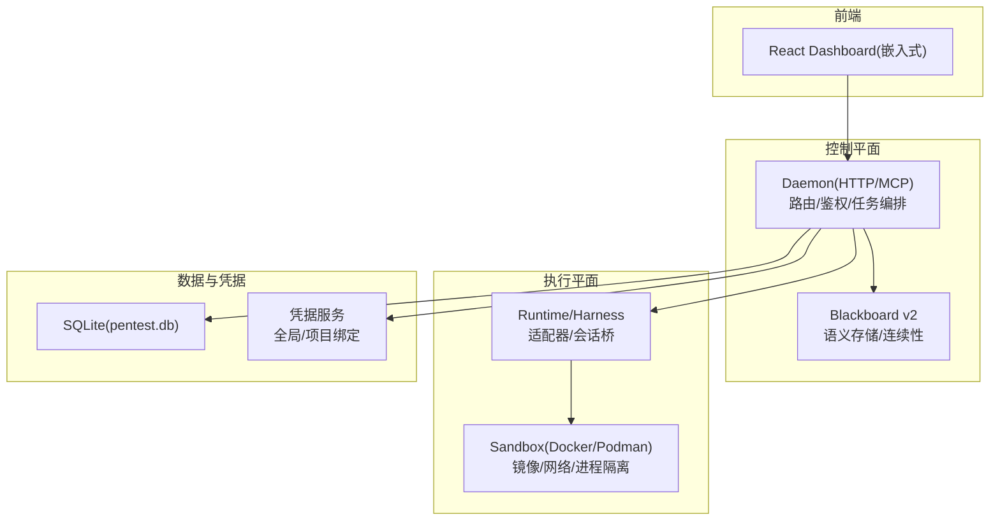
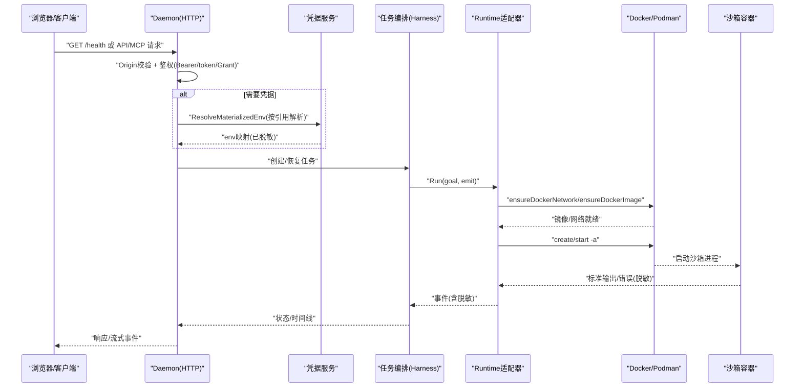
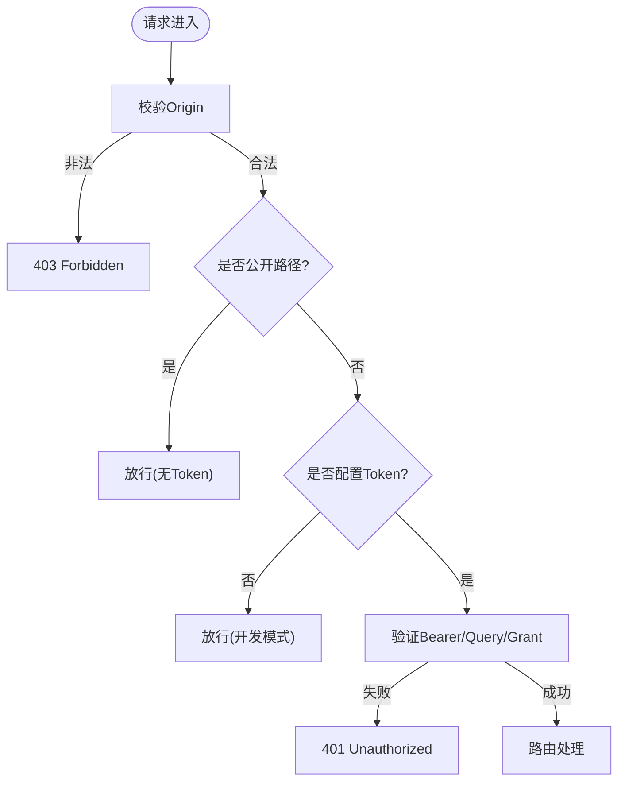
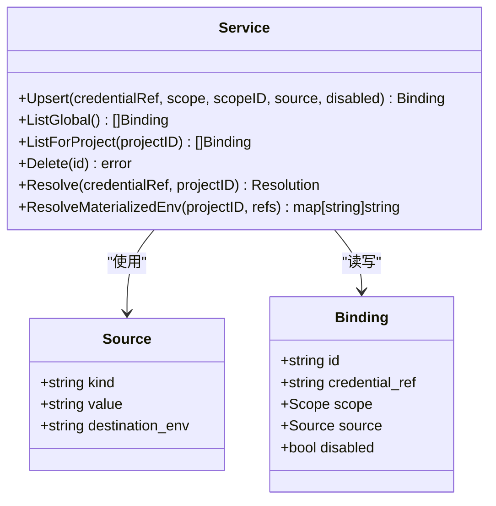
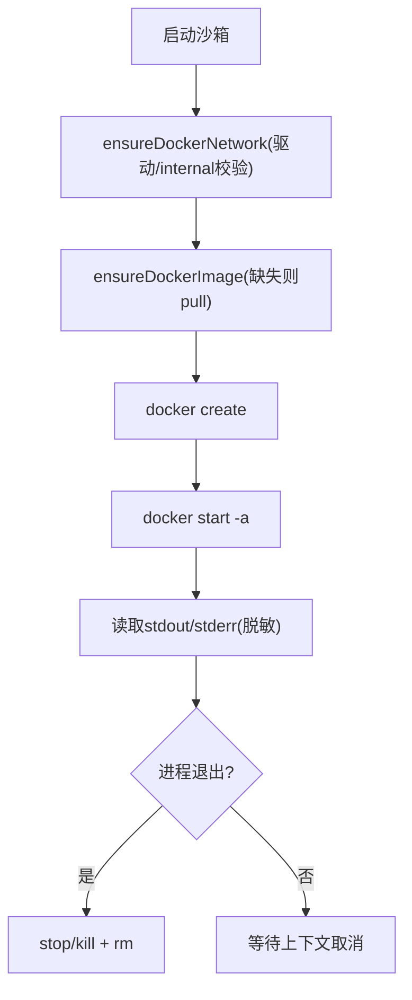
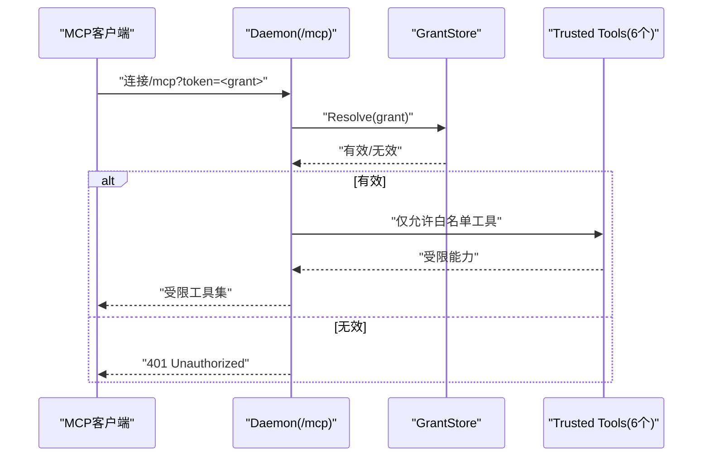
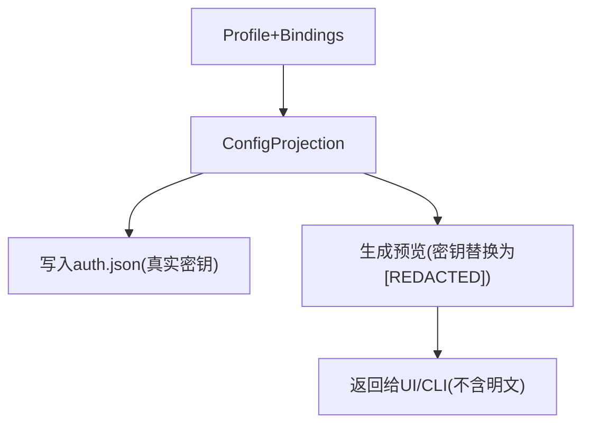
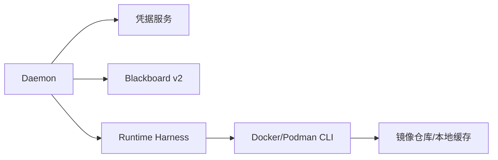

# 安全加固

<cite>
**本文引用的文件**
- [README.md](file://README.md)
- [server.go](file://internal/daemon/server.go)
- [auth_test.go](file://internal/daemon/auth_test.go)
- [credential.go](file://internal/credential/credential.go)
- [materialize.go](file://internal/credential/materialize.go)
- [docker_sandbox.go](file://internal/runtime/docker_sandbox.go)
- [container.go](file://internal/runtime/container.go)
- [Dockerfile (pentestd)](file://docker/pentestd/Dockerfile)
- [Dockerfile (sandbox)](file://docker/pentest-sandbox/Dockerfile)
- [blackboard_v2_claude_pi_conformance_test.go](file://internal/daemon/blackboard_v2_claude_pi_conformance_test.go)
- [trusted_mcp_smoke_test.go](file://internal/daemon/trusted_mcp_smoke_test.go)
- [blackboard_v2_projection_test.go](file://internal/runner/blackboard_v2_projection_test.go)
- [projection.go](file://internal/runner/projection.go)
</cite>

## 目录
1. [简介](#简介)
2. [项目结构](#项目结构)
3. [核心组件](#核心组件)
4. [架构总览](#架构总览)
5. [详细组件分析](#详细组件分析)
6. [依赖分析](#依赖分析)
7. [性能考虑](#性能考虑)
8. [故障排查指南](#故障排查指南)
9. [结论](#结论)
10. [附录](#附录)

## 简介
本指南面向本地优先的渗透测试代理（Go daemon + React 控制台 + 沙箱运行时），围绕认证授权、API 安全、凭据管理、权限控制、网络安全与容器安全，给出可落地的加固策略。文档同时覆盖安全扫描集成、漏洞管理与合规性检查，以及安全审计日志、入侵检测与应急响应流程。

## 项目结构
- 控制平面：Daemon HTTP/MCP 服务，负责路由、鉴权、任务编排、Blackboard v2 接口、MCP 工具白名单等。
- 执行平面：Runtime/Sandbox 适配器，基于 Docker/Podman 隔离运行，严格网络与资源边界。
- 记忆平面：Blackboard v2 语义系统，记录实体/关系/证据/发现，提供可信变更流水线。
- 配置与凭据：全局/项目级凭据绑定、解析与投影；运行时 Profile 与插件/扩展加载。
- 前端与制品：React Dashboard 嵌入 Daemon，构建产物随二进制分发。

**图表来源**
- [server.go:587-643](file://internal/daemon/server.go#L587-L643)
- [docker_sandbox.go:111-231](file://internal/runtime/docker_sandbox.go#L111-L231)
- [credential.go:125-183](file://internal/credential/credential.go#L125-L183)

**章节来源**
- [README.md:11-24](file://README.md#L11-L24)
- [README.md:110-126](file://README.md#L110-L126)

## 核心组件
- 认证与授权
  - 非回环监听强制要求 Token；支持 Authorization Bearer 与查询参数 token。
  - Origin 校验防御 DNS Rebinding；健康与静态资源路径公开。
  - Blackboard v2 与 MCP 支持“Continuation Interface Grant”细粒度令牌。
- 凭据管理
  - 全局/项目级绑定，支持 env/file/command/literal 四种来源。
  - 命令源默认禁用，需显式开启；输出与预览均做脱敏。
- 容器与网络安全
  - 沙箱镜像预置常用工具链；内部网络强制 internal 驱动校验。
  - 启动时自动拉取镜像，生命周期事件带脱敏。
- 可信工具与最小权限
  - MCP 仅暴露六个受信任工具；Claude/Pi 设置中仅允许必要项。
  - 运行时配置不携带网络凭据面，避免泄露。

**章节来源**
- [server.go:383-461](file://internal/daemon/server.go#L383-L461)
- [server.go:518-585](file://internal/daemon/server.go#L518-L585)
- [auth_test.go:27-58](file://internal/daemon/auth_test.go#L27-L58)
- [credential.go:125-183](file://internal/credential/credential.go#L125-L183)
- [materialize.go:14-26](file://internal/credential/materialize.go#L14-L26)
- [docker_sandbox.go:365-428](file://internal/runtime/docker_sandbox.go#L365-L428)
- [blackboard_v2_claude_pi_conformance_test.go:519-550](file://internal/daemon/blackboard_v2_claude_pi_conformance_test.go#L519-L550)
- [trusted_mcp_smoke_test.go:52-89](file://internal/daemon/trusted_mcp_smoke_test.go#L52-L89)
- [blackboard_v2_projection_test.go:142-164](file://internal/runner/blackboard_v2_projection_test.go#L142-L164)

## 架构总览
下图展示从浏览器到沙箱执行的端到端调用链，突出鉴权、凭据投影与最小权限原则。

**图表来源**
- [server.go:383-461](file://internal/daemon/server.go#L383-L461)
- [materialize.go:87-128](file://internal/credential/materialize.go#L87-L128)
- [docker_sandbox.go:111-231](file://internal/runtime/docker_sandbox.go#L111-L231)

## 详细组件分析

### 认证与授权（Daemon）
- 监听地址与 Token 强制
  - 非回环绑定必须设置 Token，否则拒绝启动。
  - 支持 Authorization: Bearer 与 ?token= 两种形式。
- Origin 防护
  - 拒绝非回环且非 host.docker.internal 的 Origin，防止 DNS Rebinding。
- 公开路径
  - /health、CORS preflight、SPA 静态资源 GET 免鉴权。
- 细粒度令牌
  - Blackboard v2 HTTP 与 MCP 接受 Continuation Interface Grant。

**图表来源**
- [server.go:383-461](file://internal/daemon/server.go#L383-L461)
- [server.go:518-585](file://internal/daemon/server.go#L518-L585)
- [auth_test.go:60-110](file://internal/daemon/auth_test.go#L60-L110)

**章节来源**
- [server.go:178-185](file://internal/daemon/server.go#L178-L185)
- [server.go:383-461](file://internal/daemon/server.go#L383-L461)
- [server.go:518-585](file://internal/daemon/server.go#L518-L585)
- [auth_test.go:27-58](file://internal/daemon/auth_test.go#L27-L58)

### 凭据管理（Credential Service）
- 绑定范围
  - 全局与项目级绑定；项目级可覆盖或显式禁用。
- 来源类型
  - env/file/command/literal；命令源默认禁用，需显式环境变量开启。
- 解析与投影
  - ResolveMaterializedEnv 将引用解析为 env 名→值对；destination_env 决定注入键名。
- 脱敏与校验
  - API 返回 SanitizeBinding；目标变量名禁止“看起来像密钥”的值。

**图表来源**
- [credential.go:125-183](file://internal/credential/credential.go#L125-L183)
- [credential.go:214-245](file://internal/credential/credential.go#L214-L245)
- [materialize.go:87-128](file://internal/credential/materialize.go#L87-L128)

**章节来源**
- [credential.go:125-183](file://internal/credential/credential.go#L125-L183)
- [credential.go:309-344](file://internal/credential/credential.go#L309-L344)
- [materialize.go:14-26](file://internal/credential/materialize.go#L14-L26)
- [materialize.go:87-128](file://internal/credential/materialize.go#L87-L128)

### 容器与网络安全（Runtime/Sandbox）
- 镜像与网络
  - 确保镜像存在，不存在则拉取；网络驱动与 internal 属性强制校验。
- 生命周期与清理
  - create/start 后记录容器 ID；退出后 stop/kill 并 rm。
- 输出脱敏
  - 通过 SecretValues 精确匹配替换，避免在事件/日志中泄露。

**图表来源**
- [docker_sandbox.go:111-231](file://internal/runtime/docker_sandbox.go#L111-L231)
- [docker_sandbox.go:365-428](file://internal/runtime/docker_sandbox.go#L365-L428)
- [container.go:26-72](file://internal/runtime/container.go#L26-L72)

**章节来源**
- [docker_sandbox.go:111-231](file://internal/runtime/docker_sandbox.go#L111-L231)
- [docker_sandbox.go:365-428](file://internal/runtime/docker_sandbox.go#L365-L428)
- [container.go:26-72](file://internal/runtime/container.go#L26-L72)

### 可信工具与最小权限（MCP/Blackboard v2）
- MCP 仅暴露六个受信任工具，并在 Claude/Pi 设置中严格 allowlist。
- MCP URL 使用 grant token，而非操作者主令牌；禁止泄露身份上下文。
- 运行时配置不包含网络凭据面，避免持久化敏感信息。

**图表来源**
- [blackboard_v2_claude_pi_conformance_test.go:519-550](file://internal/daemon/blackboard_v2_claude_pi_conformance_test.go#L519-L550)
- [trusted_mcp_smoke_test.go:52-89](file://internal/daemon/trusted_mcp_smoke_test.go#L52-L89)
- [blackboard_v2_projection_test.go:142-164](file://internal/runner/blackboard_v2_projection_test.go#L142-L164)

**章节来源**
- [blackboard_v2_claude_pi_conformance_test.go:519-550](file://internal/daemon/blackboard_v2_claude_pi_conformance_test.go#L519-L550)
- [trusted_mcp_smoke_test.go:52-89](file://internal/daemon/trusted_mcp_smoke_test.go#L52-L89)
- [blackboard_v2_projection_test.go:142-164](file://internal/runner/blackboard_v2_projection_test.go#L142-L164)

### 配置投影与凭据脱敏（Runner Projection）
- 生成运行时配置时，auth.json 写入真实密钥，但对外预览以 [REDACTED] 显示。
- 禁止在快照/预览中透传实际密钥字符串。

**图表来源**
- [projection.go:494-537](file://internal/runner/projection.go#L494-L537)
- [projection.go:610-637](file://internal/runner/projection.go#L610-L637)

**章节来源**
- [projection.go:494-537](file://internal/runner/projection.go#L494-L537)
- [projection.go:610-637](file://internal/runner/projection.go#L610-L637)

## 依赖分析
- 组件耦合
  - Daemon 依赖 Credential、Blackboard v2、Runtime Harness、Plugin/Extension 注册表。
  - Runtime 依赖 Docker/Podman CLI 与网络/镜像管理能力。
- 外部依赖
  - Docker/Podman、Node.js(构建)、Kali 基础镜像与安全工具包。
- 潜在风险点
  - 命令源启用条件、镜像拉取来源、网络驱动配置、MCP 白名单完整性。

**图表来源**
- [server.go:587-643](file://internal/daemon/server.go#L587-L643)
- [docker_sandbox.go:111-231](file://internal/runtime/docker_sandbox.go#L111-L231)

**章节来源**
- [server.go:587-643](file://internal/daemon/server.go#L587-L643)
- [docker_sandbox.go:111-231](file://internal/runtime/docker_sandbox.go#L111-L231)

## 性能考虑
- 镜像拉取与网络校验在启动阶段完成，避免运行时阻塞。
- 输出扫描采用行缓冲与长度限制，防止大行导致内存膨胀。
- 停止确认采用轮询与超时，避免长时间挂起。

## 故障排查指南
- 无法访问 API
  - 检查监听地址是否为非回环且是否配置 Token。
  - 确认请求携带 Authorization 或 ?token=。
- 403 Forbidden
  - 检查 Origin 是否来自回环或 host.docker.internal。
- 沙箱无法启动
  - 检查 Docker 网络是否存在且 internal=true；镜像是否可用。
- 凭据未生效
  - 确认绑定范围与 enabled 状态；命令源是否显式开启；destination_env 是否正确。
- MCP 不可用
  - 确认使用 grant token 而非操作者主令牌；白名单工具是否完整。

**章节来源**
- [auth_test.go:60-110](file://internal/daemon/auth_test.go#L60-L110)
- [docker_sandbox.go:365-428](file://internal/runtime/docker_sandbox.go#L365-L428)
- [materialize.go:14-26](file://internal/credential/materialize.go#L14-L26)
- [blackboard_v2_claude_pi_conformance_test.go:519-550](file://internal/daemon/blackboard_v2_claude_pi_conformance_test.go#L519-L550)

## 结论
通过强制鉴权、Origin 防护、最小权限 MCP、严格的凭据投影与脱敏、以及容器网络与镜像的安全基线，CyberPenda 在控制面、执行面与记忆面形成了纵深防御。建议在生产环境持续集成安全扫描与合规检查，完善审计日志与应急响应流程，确保整体安全态势可控。

## 附录

### 安全扫描与漏洞管理
- 镜像层扫描
  - 在 CI 中对 pentestd 与 sandbox 镜像进行 CVE 扫描，阻断高危漏洞合并。
- 代码与依赖扫描
  - Go 模块与 Node 依赖定期扫描，结合告警与修复 SLA。
- 运行时扫描
  - 沙箱内预置 Nuclei/Katana 等工具，用于目标侧快速探测；结果写入 Blackboard v2 作为事实/发现。

### 合规性检查
- 网络与镜像策略
  - 强制 internal 网络、固定镜像来源与签名校验。
- 凭据策略
  - 禁止明文入库；命令源默认关闭；审计所有绑定变更。
- 访问控制
  - 非回环绑定强制 Token；MCP 仅暴露白名单工具。

### 安全审计日志与入侵检测
- 审计日志
  - 记录鉴权失败、凭据解析异常、容器网络/镜像异常、任务生命周期事件。
- 入侵检测
  - 监控异常 Origin、频繁 401/403、异常容器创建/删除频率。
- 告警与联动
  - 与 SIEM 对接，触发封禁、限流或人工复核。

### 应急响应流程
- 立即措施
  - 暂停任务、回收容器、吊销相关 grant token、轮换受影响凭据。
- 根因分析
  - 回溯审计日志、事件时间线与 Blackboard v2 变更记录。
- 恢复与加固
  - 更新镜像/补丁、收紧网络策略、补充白名单与脱敏规则。

### 容器安全最佳实践
- 最小镜像
  - 仅安装必要工具，移除 shell 历史与调试信息。
- 只读文件系统
  - 除工作目录外，尽量只读挂载。
- 非 root 用户
  - 在镜像中创建非特权用户运行关键进程。
- 网络隔离
  - 使用 internal 网络，必要时通过反向代理暴露有限端口。

**章节来源**
- [Dockerfile (pentestd):1-37](file://docker/pentestd/Dockerfile#L1-L37)
- [Dockerfile (sandbox):1-145](file://docker/pentest-sandbox/Dockerfile#L1-L145)
- [README.md:110-126](file://README.md#L110-L126)