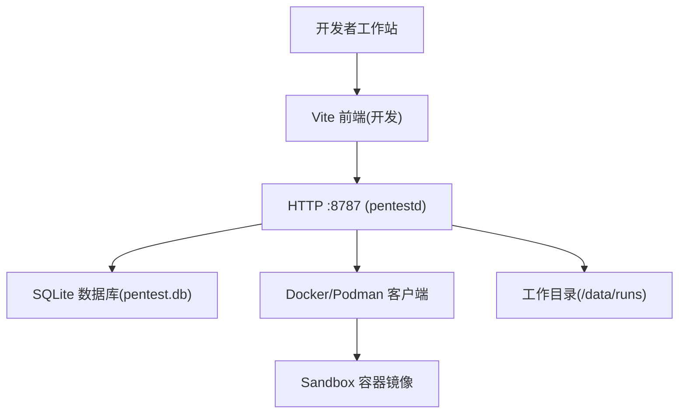
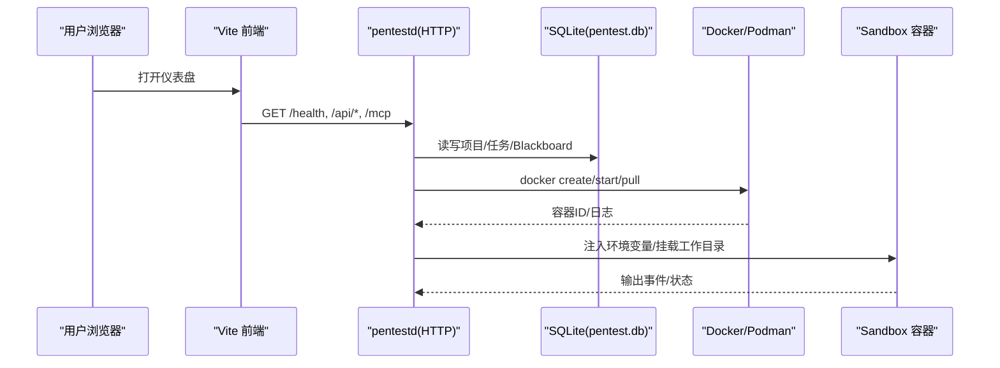
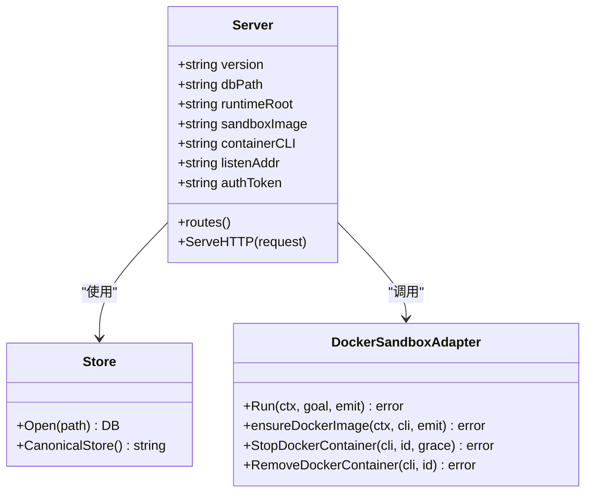

# 安装与配置

<cite>
**本文引用的文件**   
- [README.md](file://README.md)
- [docker-compose.yaml](file://docker-compose.yaml)
- [docker/pentestd/Dockerfile](file://docker/pentestd/Dockerfile)
- [docker/pentest-sandbox/Dockerfile](file://docker/pentest-sandbox/Dockerfile)
- [cmd/pentestd/main.go](file://cmd/pentestd/main.go)
- [internal/daemon/server.go](file://internal/daemon/server.go)
- [internal/runtime/docker_sandbox.go](file://internal/runtime/docker_sandbox.go)
- [scripts/build-release-binaries.sh](file://scripts/build-release-binaries.sh)
</cite>

## 目录
1. [简介](#简介)
2. [项目结构](#项目结构)
3. [核心组件](#核心组件)
4. [架构总览](#架构总览)
5. [详细组件分析](#详细组件分析)
6. [依赖关系分析](#依赖关系分析)
7. [性能考虑](#性能考虑)
8. [故障排除指南](#故障排除指南)
9. [结论](#结论)
10. [附录](#附录)

## 简介
本指南面向首次部署 CyberPenda 的工程师，覆盖本地开发环境搭建、Docker Compose 容器化部署以及二进制文件安装三种方式。文档重点说明环境变量配置、端口映射、数据卷挂载与安全设置，并提供系统要求、依赖检查与初始配置验证步骤，最后给出常见安装问题的解决方案与排障建议。

## 项目结构
CyberPenda 由 Go 守护进程（pentestd）、React 仪表盘、沙箱运行时（Docker/Podman）与 CLI（pentestctl）组成。默认数据落盘于 SQLite 与任务运行目录，UI 通过 Vite 在开发时代理到后端 API。

图表来源
- [docker-compose.yaml:12-23](file://docker-compose.yaml#L12-L23)
- [docker/pentestd/Dockerfile:26-33](file://docker/pentestd/Dockerfile#L26-L33)
- [cmd/pentestd/main.go:33-42](file://cmd/pentestd/main.go#L33-L42)

章节来源
- [README.md:26-80](file://README.md#L26-L80)
- [docker-compose.yaml:1-35](file://docker-compose.yaml#L1-L35)

## 核心组件
- pentestd：本地 HTTP 守护进程，提供 REST API、MCP 服务、嵌入式 UI、任务编排与 Blackboard v2 语义存储。
- React Dashboard：项目管理、任务启动、Blackboard 查看与报告生成。
- Sandbox Runner：基于 Docker/Podman 的任务隔离执行环境。
- pentestctl：命令行工具，支持离线 Store 模式或通过 API 访问 Blackboard v2。

章节来源
- [README.md:11-24](file://README.md#L11-L24)
- [cmd/pentestd/main.go:22-43](file://cmd/pentestd/main.go#L22-L43)
- [internal/daemon/server.go:38-81](file://internal/daemon/server.go#L38-L81)

## 架构总览
下图展示从浏览器到守护进程、再到容器运行时与数据持久化的整体交互。

图表来源
- [internal/daemon/server.go:587-643](file://internal/daemon/server.go#L587-L643)
- [internal/runtime/docker_sandbox.go:111-156](file://internal/runtime/docker_sandbox.go#L111-L156)
- [docker-compose.yaml:12-23](file://docker-compose.yaml#L12-L23)

## 详细组件分析

### 一、系统要求与环境准备
- 操作系统：Linux/macOS/Windows（二进制发布目标见脚本）。
- Go：用于构建（参见 go.mod）。
- Node.js：20+（用于 UI 构建与 make dev）。
- 容器运行时：Docker 或 Podman（沙箱运行器）。
- 网络：默认监听 127.0.0.1:8787；非回环绑定必须设置认证令牌。

章节来源
- [README.md:28-33](file://README.md#L28-L33)
- [scripts/build-release-binaries.sh:4-11](file://scripts/build-release-binaries.sh#L4-L11)

### 二、本地开发环境搭建
- 前置钩子：make install-git-hooks
- 一键开发：make dev（后端 :8787 + Vite 前端代理 /api）
- 构建自包含二进制：make build-ui && make build，然后直接运行 ./pentestd

章节来源
- [README.md:34-52](file://README.md#L34-L52)

### 三、Docker Compose 部署
- 环境变量：
  - PENTEST_AUTH_TOKEN：必填（非回环绑定强制），用于 Authorization: Bearer 或 ?token= 校验。
  - PENTEST_LISTEN_ADDR：容器内监听地址（示例 0.0.0.0:8787）。
  - PENTEST_DB：数据库路径（示例 /data/pentest.db）。
  - PENTEST_RUNTIME_ROOT：任务运行根目录（示例 /data/runs）。
  - PENTEST_SANDBOX_IMAGE：沙箱镜像（默认 ghcr.io/n1majne3/cyberpenda-sandbox:latest）。
  - PENTEST_CONTAINER_CLI：容器 CLI（docker 或 podman）。
- 端口映射：宿主机 ${CYBERPENDA_BIND:-127.0.0.1}:${CYBERPENDA_PORT:-8787} -> 容器 8787。
- 数据卷挂载：
  - cyberpenda-data:/data（持久化数据库与运行目录）。
  - /var/run/docker.sock:/var/run/docker.sock（允许容器内创建任务容器）。
- 安全选项：security_opt no-new-privileges:true。
- 健康检查：/health 端点探测。

章节来源
- [docker-compose.yaml:1-35](file://docker-compose.yaml#L1-L35)
- [docker/pentestd/Dockerfile:26-33](file://docker/pentestd/Dockerfile#L26-L33)

### 四、二进制文件安装与运行
- 多平台构建：使用 scripts/build-release-binaries.sh 生成跨平台压缩包（含 SHA256SUMS）。
- 运行参数（flags/env）：
  - -addr / PENTEST_LISTEN_ADDR：监听地址（默认 127.0.0.1:8787）。
  - -db / PENTEST_DB：SQLite 路径（默认 pentest.db）。
  - -runtime-root / PENTEST_RUNTIME_ROOT：任务运行根目录。
  - -sandbox-image / PENTEST_SANDBOX_IMAGE：沙箱镜像。
  - -container-cli / PENTEST_CONTAINER_CLI：容器 CLI。
  - -auth-token / PENTEST_AUTH_TOKEN：非回环绑定必需。
  - -runtime-plugin-dirs / PENTEST_RUNTIME_PLUGIN_DIRS：可信插件目录。
  - -runtime-extension-dirs / PENTEST_RUNTIME_EXTENSION_DIRS：可信扩展目录。
- 认证：Authorization: Bearer <token> 或 URL 查询 ?token=。

章节来源
- [cmd/pentestd/main.go:33-42](file://cmd/pentestd/main.go#L33-L42)
- [internal/daemon/server.go:51-55](file://internal/daemon/server.go#L51-L55)
- [scripts/build-release-binaries.sh:78-88](file://scripts/build-release-binaries.sh#L78-L88)

### 五、环境变量与配置详解
- 关键环境变量
  - PENTEST_LISTEN_ADDR：控制监听地址，默认 127.0.0.1:8787。
  - PENTEST_DB：数据库文件路径，默认 pentest.db。
  - PENTEST_RUNTIME_ROOT：任务运行目录，默认与 DB 同目录下的 runs。
  - PENTEST_ARTIFACT_ROOT：证据制品根目录，默认与 DB 同目录。
  - PENTEST_EVIDENCE_SOURCE_ROOTS：逗号分隔的可信证据源根目录。
  - PENTEST_SANDBOX_IMAGE：沙箱镜像，默认 ghcr.io/n1majne3/cyberpenda-sandbox:latest。
  - PENTEST_CONTAINER_CLI：容器 CLI，默认 docker。
  - PENTEST_RUNTIME_PLUGIN_DIRS：可信插件清单目录。
  - PENTEST_RUNTIME_EXTENSION_DIRS：可信扩展清单目录。
  - PENTEST_AUTH_TOKEN：API/MCP 认证令牌（非回环绑定强制）。
- 默认行为与安全策略
  - 非 loopback 绑定且未设置 PENTEST_AUTH_TOKEN 将拒绝启动。
  - Origin 校验：仅允许回环、host.docker.internal 或与监听地址同源请求。
  - 公开路径：/health、CORS preflight、静态资源（/assets/*、/index.html 等）无需鉴权。

章节来源
- [cmd/pentestd/main.go:33-42](file://cmd/pentestd/main.go#L33-L42)
- [internal/daemon/server.go:174-185](file://internal/daemon/server.go#L174-L185)
- [internal/daemon/server.go:518-534](file://internal/daemon/server.go#L518-L534)
- [internal/daemon/server.go:467-488](file://internal/daemon/server.go#L467-L488)

### 六、端口映射与数据卷挂载
- 端口映射
  - 容器暴露 8787；Compose 默认映射 127.0.0.1:8787。
  - 可通过 CYBERPENDA_BIND/CYBERPENDA_PORT 调整绑定与端口。
- 数据卷
  - /data：持久化 pentest.db 与 runs 目录。
  - /var/run/docker.sock：使应用容器可创建任务容器（注意安全风险）。
- 健康检查
  - 使用 wget 访问 http://127.0.0.1:8787/health 判定存活。

章节来源
- [docker-compose.yaml:12-31](file://docker-compose.yaml#L12-L31)
- [docker/pentestd/Dockerfile:32-36](file://docker/pentestd/Dockerfile#L32-L36)

### 七、安全设置与最佳实践
- 强制认证：非回环绑定必须设置 PENTEST_AUTH_TOKEN。
- 最小权限：容器启用 no-new-privileges:true。
- 网络隔离：沙箱网络需满足驱动与 internal 属性校验，避免越权外联。
- Origin 白名单：仅允许回环、host.docker.internal 与同源请求，防止 DNS Rebinding。
- 敏感信息脱敏：运行时输出按精确匹配对密钥进行脱敏。

章节来源
- [internal/daemon/server.go:174-185](file://internal/daemon/server.go#L174-L185)
- [internal/daemon/server.go:518-534](file://internal/daemon/server.go#L518-L534)
- [internal/runtime/docker_sandbox.go:111-156](file://internal/runtime/docker_sandbox.go#L111-L156)
- [docker-compose.yaml:24-26](file://docker-compose.yaml#L24-L26)

### 八、初始配置验证步骤
- 健康检查：curl http://127.0.0.1:8787/health
- 认证测试：携带 Authorization: Bearer <token> 或 ?token=<token> 访问受保护路由
- 沙箱能力：确保 docker/podman 可用，镜像拉取成功
- 数据持久化：确认 /data 下生成 pentest.db 与 runs 目录

章节来源
- [docker/pentestd/Dockerfile:34-36](file://docker/pentestd/Dockerfile#L34-L36)
- [internal/daemon/server.go:645-674](file://internal/daemon/server.go#L645-L674)

## 依赖关系分析
- 守护进程依赖：
  - store.DB：SQLite 持久化
  - runtime.Harness：任务编排与沙箱管理
  - blackboardv2.Service：语义记忆平面
  - modelprovider/skill/credential：模型提供商、技能、凭据管理
- 运行时依赖：
  - Docker/Podman CLI：容器生命周期管理
  - 沙箱镜像：预置渗透工具链与 Agent SDK

图表来源
- [internal/daemon/server.go:38-81](file://internal/daemon/server.go#L38-L81)
- [internal/runtime/docker_sandbox.go:20-57](file://internal/runtime/docker_sandbox.go#L20-L57)

章节来源
- [internal/daemon/server.go:38-81](file://internal/daemon/server.go#L38-L81)
- [internal/runtime/docker_sandbox.go:20-57](file://internal/runtime/docker_sandbox.go#L20-L57)

## 性能考虑
- 单进程守护进程 + SQLite：适合单机开发与中小规模使用。
- 沙箱镜像预热：提前拉取常用镜像以减少任务启动延迟。
- 输出流限制：运行时行缓冲与最大行长度限制，避免大输出阻塞。
- 优雅关闭：HTTP 服务器与容器清理具备超时控制，减少资源泄漏。

[本节为通用指导，不直接分析具体文件]

## 故障排除指南
- 无法启动（非回环绑定未设置令牌）
  - 现象：启动失败并提示需要 auth token。
  - 处理：设置 PENTEST_AUTH_TOKEN 或使用 127.0.0.1 监听。
- 健康检查失败
  - 现象：/health 不可达。
  - 处理：检查端口映射、防火墙、容器健康检查命令。
- 沙箱镜像拉取失败
  - 现象：pull 报错或超时。
  - 处理：检查网络、镜像仓库可达性、镜像名与标签。
- 容器网络不安全
  - 现象：网络驱动或 internal 属性不符合预期。
  - 处理：删除并重建符合要求的网络。
- 认证失败
  - 现象：401 Unauthorized。
  - 处理：确认 Authorization: Bearer 或 ?token= 与 PENTEST_AUTH_TOKEN 一致。
- 数据卷无写入
  - 现象：/data 下无 pentest.db 或 runs。
  - 处理：检查卷挂载权限与 SELinux/AppArmor 策略。

章节来源
- [internal/daemon/server.go:174-185](file://internal/daemon/server.go#L174-L185)
- [internal/runtime/docker_sandbox.go:233-283](file://internal/runtime/docker_sandbox.go#L233-L283)
- [internal/runtime/docker_sandbox.go:365-428](file://internal/runtime/docker_sandbox.go#L365-L428)
- [docker-compose.yaml:26-31](file://docker-compose.yaml#L26-L31)

## 结论
通过本文档，您可以完成 CyberPenda 的本地开发、容器化部署与二进制安装，掌握关键环境变量、端口映射、数据卷与安全配置，并能快速定位与解决常见问题。建议在生产环境中严格遵循最小权限、强制认证与网络隔离原则。

## 附录
- Make 目标速查：dev、build、build-ui、build-sandbox-image、test、smoke-* 等。
- CLI 用法：pentestctl 支持离线 Store 模式与通过 --api/--token 访问守护进程。

章节来源
- [README.md:94-108](file://README.md#L94-L108)
- [README.md:127-147](file://README.md#L127-L147)