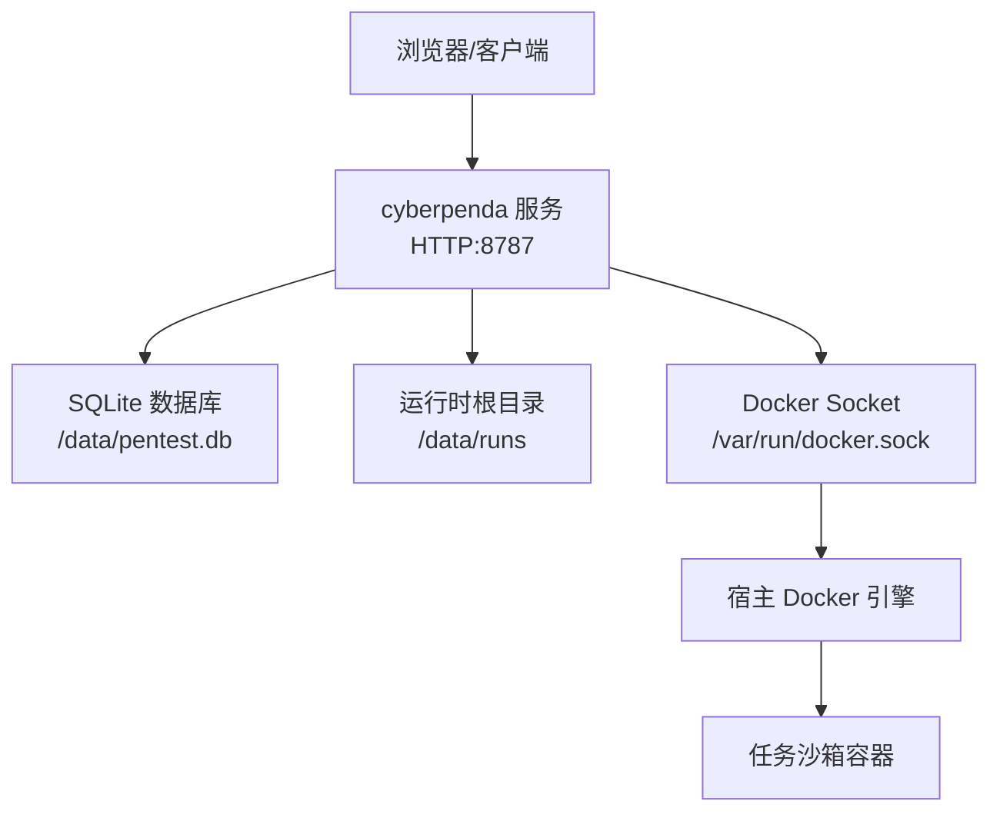
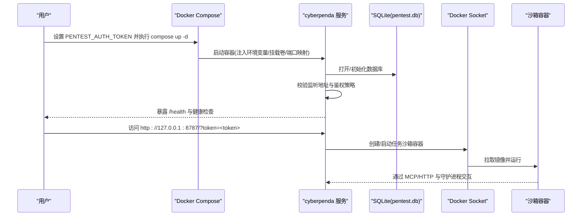
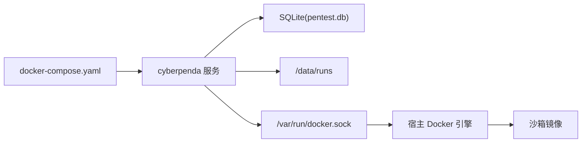

# Docker Compose 部署

<cite>
**本文引用的文件**
- [docker-compose.yaml](file://docker-compose.yaml)
- [Dockerfile（pentestd）](file://docker/pentestd/Dockerfile)
- [main.go（pentestd 入口）](file://cmd/pentestd/main.go)
- [server.go（守护进程 HTTP 与鉴权）](file://internal/daemon/server.go)
- [README.md](file://README.md)
</cite>

## 目录
1. [简介](#简介)
2. [项目结构](#项目结构)
3. [核心组件](#核心组件)
4. [架构总览](#架构总览)
5. [详细配置解析](#详细配置解析)
6. [依赖关系分析](#依赖关系分析)
7. [性能与资源限制建议](#性能与资源限制建议)
8. [故障排除指南](#故障排除指南)
9. [结论](#结论)

## 简介
本指南聚焦于使用 docker-compose.yaml 部署 CyberPenda 的完整流程，逐项解释服务定义、环境变量、端口映射、数据卷挂载与安全选项。重点说明 PENTEST_AUTH_TOKEN 认证机制、PENTEST_DB 数据库路径、PENTEST_RUNTIME_ROOT 运行时目录的作用与最佳实践，并提供启动命令示例与常见问题排查方法。同时给出网络配置与安全加固的建议，帮助在生产或半生产环境中安全运行。

## 项目结构
CyberPenda 采用“本地优先”的架构：Go 守护进程提供 HTTP API、MCP 服务与嵌入式前端；任务在沙箱容器内执行；SQLite 作为默认存储。Compose 仅编排一个服务 cyberpenda，负责暴露 Web UI 与 API，并通过挂载 Docker socket 调用宿主机 Docker 创建任务沙箱。

图表来源
- [docker-compose.yaml:1-35](file://docker-compose.yaml#L1-L35)
- [Dockerfile（pentestd）:25-36](file://docker/pentestd/Dockerfile#L25-L36)

章节来源
- [README.md:11-24](file://README.md#L11-L24)
- [docker-compose.yaml:1-35](file://docker-compose.yaml#L1-L35)

## 核心组件
- 守护进程 pentestd：提供 HTTP API、MCP、嵌入的 React Dashboard，管理任务生命周期与 Blackboard v2 语义状态。
- SQLite 持久化：默认 pentest.db，存放项目、任务、模型提供者、技能等元数据。
- 运行时根目录：默认 runs，存放每个任务的隔离工作区、日志、产物等。
- 沙箱容器：通过宿主 Docker/Podman 创建，承载实际渗透测试工具与代理会话。

章节来源
- [main.go:22-43](file://cmd/pentestd/main.go#L22-L43)
- [server.go:120-185](file://internal/daemon/server.go#L120-L185)
- [Dockerfile（pentestd）:25-36](file://docker/pentestd/Dockerfile#L25-L36)

## 架构总览
下图展示 Compose 中 cyberpenda 服务的启动、健康检查、端口绑定、数据持久化以及通过 Docker socket 调度沙箱容器的整体流程。

图表来源
- [docker-compose.yaml:1-35](file://docker-compose.yaml#L1-L35)
- [server.go:383-411](file://internal/daemon/server.go#L383-L411)
- [server.go:645-674](file://internal/daemon/server.go#L645-L674)

## 详细配置解析
以下逐项解读 docker-compose.yaml 的关键参数及其行为。

### 服务定义
- image：应用镜像，支持通过 CYBERPENDA_IMAGE_TAG 覆盖版本标签，默认 latest。
- container_name：固定容器名，便于定位与管理。
- restart：unless-stopped，确保非手动停止时自动重启。
- init：true，启用 tini 作为 PID 1，改善信号处理与僵尸进程清理。

章节来源
- [docker-compose.yaml:7-11](file://docker-compose.yaml#L7-L11)

### 端口映射
- ports：将宿主端口映射到容器 8787。默认绑定 127.0.0.1:8787，可通过 CYBERPENDA_BIND 与 CYBERPENDA_PORT 覆盖。
- 注意：当绑定非回环地址时，必须设置 PENTEST_AUTH_TOKEN，否则守护进程拒绝启动。

章节来源
- [docker-compose.yaml:12-13](file://docker-compose.yaml#L12-L13)
- [server.go:178-185](file://internal/daemon/server.go#L178-L185)

### 环境变量
- PENTEST_AUTH_TOKEN：API/MCP 鉴权令牌。若未设置且监听地址为非回环，启动即失败。
- PENTEST_LISTEN_ADDR：守护进程监听地址，默认 0.0.0.0:8787（容器内）。对外暴露由 ports 控制。
- PENTEST_DB：SQLite 数据库路径，默认 /data/pentest.db。
- PENTEST_RUNTIME_ROOT：任务运行时根目录，默认 /data/runs。
- PENTEST_SANDBOX_IMAGE：沙箱镜像，默认 ghcr.io/n1majne3/cyberpenda-sandbox:latest。
- PENTEST_CONTAINER_CLI：容器 CLI，默认 docker。

章节来源
- [docker-compose.yaml:14-20](file://docker-compose.yaml#L14-L20)
- [main.go:33-42](file://cmd/pentestd/main.go#L33-L42)
- [README.md:114-125](file://README.md#L114-L125)

### 数据卷挂载
- cyberpenda-data:/data：持久化数据库与运行时目录，避免容器重建丢失数据。
- /var/run/docker.sock:/var/run/docker.sock：允许容器调用宿主 Docker 引擎以创建任务沙箱。

章节来源
- [docker-compose.yaml:21-23](file://docker-compose.yaml#L21-L23)

### 安全选项
- security_opt: no-new-privileges:true：禁止容器进程提升新权限，降低逃逸风险。

章节来源
- [docker-compose.yaml:24-25](file://docker-compose.yaml#L24-L25)

### 健康检查
- healthcheck：每 30 秒探测一次 /health，超时 5 秒，重试 5 次，启动宽限期 15 秒。

章节来源
- [docker-compose.yaml:26-31](file://docker-compose.yaml#L26-L31)
- [server.go:645-674](file://internal/daemon/server.go#L645-L674)

## 依赖关系分析
- 守护进程对 Docker socket 的依赖：用于创建/管理任务沙箱容器。
- 守护进程对 SQLite 的依赖：所有项目、任务、模型提供者、技能等元数据的持久化。
- 对外部镜像的依赖：应用镜像与沙箱镜像，均可通过环境变量覆盖。

图表来源
- [docker-compose.yaml:1-35](file://docker-compose.yaml#L1-L35)
- [Dockerfile（pentestd）:25-36](file://docker/pentestd/Dockerfile#L25-L36)

章节来源
- [docker-compose.yaml:1-35](file://docker-compose.yaml#L1-L35)

## 性能与资源限制建议
- 资源限制：建议在 Compose 中为 cyberpenda 添加 CPU/内存上限，避免影响宿主与其他服务。
- 磁盘空间：runs 目录会随任务增长，建议定期清理或监控容量。
- 并发任务：沙箱容器数量受宿主资源与 Docker 引擎能力限制，需评估并发度与资源配额。
- 网络 I/O：沙箱镜像拉取与外部工具下载可能占用带宽，建议缓存镜像与包源。

[本节为通用建议，不直接分析具体文件]

## 故障排除指南
- 无法访问 Web UI
  - 确认端口绑定是否为 127.0.0.1，或通过 CYBERPENDA_BIND/CYBERPENDA_PORT 正确映射。
  - 若绑定非回环地址，必须设置 PENTEST_AUTH_TOKEN，否则守护进程拒绝启动。
- 健康检查失败
  - 查看容器日志，确认 /health 可正常返回。
  - 检查数据库文件是否可写、运行时根目录是否存在。
- 任务无法启动
  - 确认已挂载 /var/run/docker.sock，且当前用户对 Docker socket 有访问权限。
  - 检查 PENTEST_SANDBOX_IMAGE 是否可达，必要时替换为可用镜像。
- 权限问题
  - 确认 no-new-privileges 未被其他策略覆盖。
  - 如需更高权限，请谨慎评估安全风险后再调整。

章节来源
- [server.go:178-185](file://internal/daemon/server.go#L178-L185)
- [docker-compose.yaml:26-31](file://docker-compose.yaml#L26-L31)
- [docker-compose.yaml:21-25](file://docker-compose.yaml#L21-L25)

## 结论
通过 docker-compose.yaml，CyberPenda 以单服务形式快速部署，具备完善的鉴权、持久化与健康检查。结合合理的网络与安全加固策略，可在本地或受限生产环境中安全运行。建议在生产环境严格限定端口绑定范围、最小化特权、合理设置资源限制，并建立日志与指标采集体系以便运维排障。

[本节为总结性内容，不直接分析具体文件]