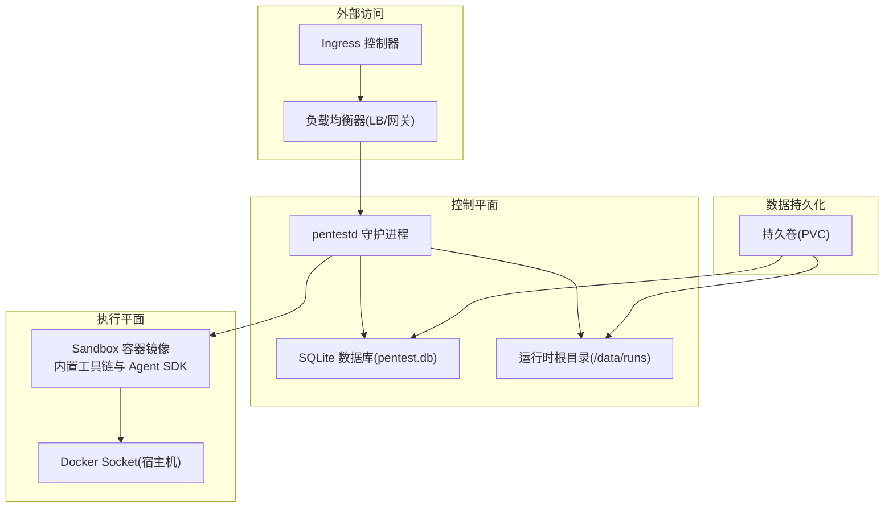
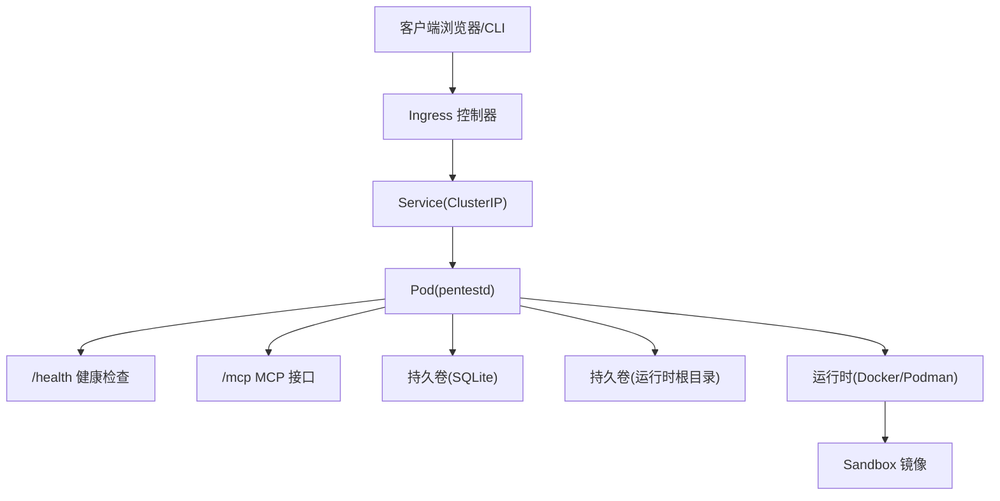
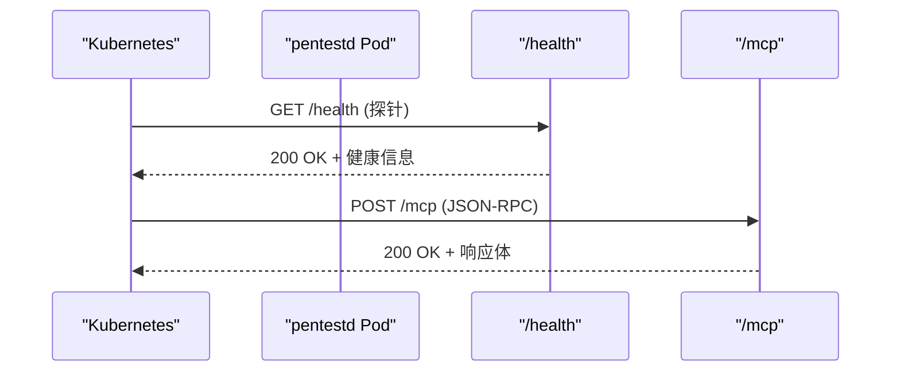
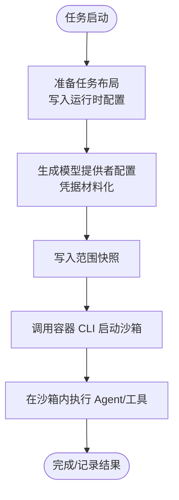
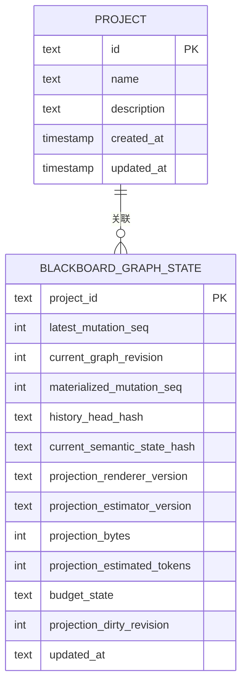
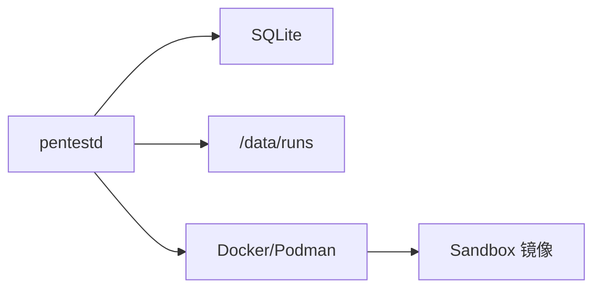

# Kubernetes 部署

<cite>
**本文引用的文件**
- [README.md](file://README.md)
- [docker-compose.yaml](file://docker-compose.yaml)
- [docker/pentestd/Dockerfile](file://docker/pentestd/Dockerfile)
- [docker/pentest-sandbox/Dockerfile](file://docker/pentest-sandbox/Dockerfile)
- [Makefile](file://Makefile)
- [internal/daemon/server.go](file://internal/daemon/server.go)
- [internal/daemon/mcp_test.go](file://internal/daemon/mcp_test.go)
- [internal/store/store.go](file://internal/store/store.go)
</cite>

## 目录
1. [简介](#简介)
2. [项目结构](#项目结构)
3. [核心组件](#核心组件)
4. [架构总览](#架构总览)
5. [详细组件分析](#详细组件分析)
6. [依赖关系分析](#依赖关系分析)
7. [性能与资源建议](#性能与资源建议)
8. [故障排查指南](#故障排查指南)
9. [结论](#结论)
10. [附录：Kubernetes 清单与 Helm 模板示例](#附录kubernetes-清单与-helm-模板示例)

## 简介
本指南面向在 Kubernetes 上部署 CyberPenda（本地优先的渗透测试代理）的运维与平台工程师。内容覆盖 Deployment、Service、ConfigMap、Secret、PersistentVolumeClaim、Ingress、TLS、负载均衡、滚动更新策略、RBAC、网络策略，以及监控、日志收集与故障排查方案。文档同时给出可直接落地的 Helm Chart 模板结构与 values 配置示例，帮助你在生产环境中安全、可观测地运行该应用。

## 项目结构
CyberPenda 由以下关键部分构成：
- pentestd：Go 守护进程，提供 HTTP API、MCP Server、嵌入的 Web UI、任务编排与运行时管理
- React Dashboard：前端控制台，用于项目管理、任务启动、Blackboard 视图等
- Sandbox Runner：默认执行平面，使用 Docker/Podman 容器隔离运行任务
- Host Runner：显式可选的主机模式，非自动回退
- Skills / Extensions：运行时无关的技能包与运行时特定的扩展包

图表来源
- [docker/pentestd/Dockerfile:1-37](file://docker/pentestd/Dockerfile#L1-L37)
- [docker/pentest-sandbox/Dockerfile:1-145](file://docker/pentest-sandbox/Dockerfile#L1-L145)
- [docker-compose.yaml:1-35](file://docker-compose.yaml#L1-L35)

章节来源
- [README.md:11-24](file://README.md#L11-L24)
- [README.md:149-161](file://README.md#L149-L161)

## 核心组件
- 守护进程（pentestd）
  - 监听地址与端口：默认 127.0.0.1:8787，可通过环境变量或参数调整
  - 认证：当绑定非回环地址时，必须设置认证令牌；API/MCP 支持 Bearer Token 或查询参数 token
  - 健康检查：/health 返回版本、数据库状态、MCP 路径、Runner 信息
  - 存储：默认 SQLite（pentest.db），可通过参数指定路径
  - 运行时根目录：/data/runs（默认），存放任务运行上下文与投影配置
  - 沙箱镜像与容器 CLI：通过环境变量注入
- 沙箱镜像（sandbox）
  - 预置大量安全测试工具与 Agent SDK，供任务在隔离环境中执行
  - 提供 host-proxy-only 入口脚本，便于仅暴露宿主访问并限制出站
- 前端（Dashboard）
  - 构建产物嵌入到守护进程中，统一对外提供服务

章节来源
- [README.md:110-125](file://README.md#L110-L125)
- [internal/daemon/server.go:38-81](file://internal/daemon/server.go#L38-L81)
- [internal/daemon/server.go:645-674](file://internal/daemon/server.go#L645-L674)
- [docker/pentestd/Dockerfile:25-36](file://docker/pentestd/Dockerfile#L25-L36)
- [docker/pentest-sandbox/Dockerfile:124-131](file://docker/pentest-sandbox/Dockerfile#L124-L131)

## 架构总览
下图展示 Kubernetes 环境下的整体部署形态与交互流程。

图表来源
- [internal/daemon/server.go:645-674](file://internal/daemon/server.go#L645-L674)
- [internal/daemon/mcp_test.go:11-31](file://internal/daemon/mcp_test.go#L11-L31)
- [docker/pentestd/Dockerfile:25-36](file://docker/pentestd/Dockerfile#L25-L36)

## 详细组件分析

### 守护进程与健康检查
- 健康端点 /health
  - 返回版本、数据库状态、MCP 路径、Runner 配置（运行时根目录、沙箱镜像、容器 CLI）
  - 适合用作 Liveness/Readiness Probe
- MCP 端点 /mcp
  - 接受 JSON-RPC 请求，支持事件流
  - 在测试中验证了来自 host.docker.internal 的请求可正常初始化

图表来源
- [internal/daemon/server.go:645-674](file://internal/daemon/server.go#L645-L674)
- [internal/daemon/mcp_test.go:11-31](file://internal/daemon/mcp_test.go#L11-L31)

章节来源
- [internal/daemon/server.go:645-674](file://internal/daemon/server.go#L645-L674)
- [internal/daemon/mcp_test.go:11-31](file://internal/daemon/mcp_test.go#L11-L31)

### 运行时与沙箱
- 运行时根目录（/data/runs）
  - 存放任务布局、运行时配置投影、凭据材料等
- 沙箱镜像
  - 包含 Kali 基础镜像、Agent SDK、常用安全工具
  - 提供 host-proxy-only 入口以限制出站流量
- 容器 CLI
  - 默认 docker，可通过环境变量切换为 podman

图表来源
- [docker/pentest-sandbox/Dockerfile:1-145](file://docker/pentest-sandbox/Dockerfile#L1-L145)
- [docker/pentestd/Dockerfile:25-36](file://docker/pentestd/Dockerfile#L25-L36)

章节来源
- [docker/pentest-sandbox/Dockerfile:124-131](file://docker/pentest-sandbox/Dockerfile#L124-L131)
- [docker/pentestd/Dockerfile:25-36](file://docker/pentestd/Dockerfile#L25-L36)

### 数据存储与迁移
- SQLite 数据库（pentest.db）
  - 默认位于守护进程工作目录，推荐挂载持久卷
  - 内部包含 Blackboard v2 图状态表等元数据
- 迁移与重建
  - 存在迁移与重建逻辑，确保数据结构演进与一致性

图表来源
- [internal/store/store.go:2579-2598](file://internal/store/store.go#L2579-L2598)

章节来源
- [internal/store/store.go:2579-2598](file://internal/store/store.go#L2579-L2598)

## 依赖关系分析
- 守护进程依赖
  - 数据库服务（SQLite）
  - 文件系统（运行时根目录、证据根目录）
  - 容器运行时（Docker/Podman）
  - 外部模型提供者（通过运行时配置与环境变量注入）
- 沙箱镜像依赖
  - 系统工具与语言运行时
  - Agent SDK 与第三方工具库
  - 可选的 host-proxy-only 入口

图表来源
- [docker/pentestd/Dockerfile:25-36](file://docker/pentestd/Dockerfile#L25-L36)
- [docker/pentest-sandbox/Dockerfile:1-145](file://docker/pentest-sandbox/Dockerfile#L1-L145)

章节来源
- [docker/pentestd/Dockerfile:25-36](file://docker/pentestd/Dockerfile#L25-L36)
- [docker/pentest-sandbox/Dockerfile:1-145](file://docker/pentest-sandbox/Dockerfile#L1-L145)

## 性能与资源建议
- CPU/内存
  - 建议为 pentestd 分配至少 0.5-1 CPU、512MB-1Gi 内存，具体取决于并发任务数量与模型调用频率
  - 沙箱任务按需弹性伸缩，避免常驻高资源占用
- 存储
  - SQLite 单文件数据库，I/O 延迟敏感，建议使用高性能块存储
  - 运行时根目录需足够空间以容纳任务上下文与证据
- 网络
  - 合理设置 Ingress 超时与缓冲，避免长连接中断
  - 对 /mcp 事件流进行适当的限流与重试策略

[本节为通用指导，不直接分析具体文件]

## 故障排查指南
- 健康检查失败
  - 确认 /health 可达且返回 200
  - 检查数据库是否可用、运行时根目录是否可写
- MCP 初始化失败
  - 检查请求头与协议版本
  - 确认 Ingress 透传 Host 头（如 host.docker.internal）
- 认证问题
  - 非回环绑定必须设置认证令牌
  - 客户端需在 Authorization 或查询参数中携带 token
- 沙箱无法启动
  - 检查容器 CLI 配置与权限
  - 确认宿主机 Docker Socket 已正确挂载（若使用 Docker）

章节来源
- [internal/daemon/server.go:645-674](file://internal/daemon/server.go#L645-L674)
- [internal/daemon/mcp_test.go:11-31](file://internal/daemon/mcp_test.go#L11-L31)
- [README.md:110-125](file://README.md#L110-L125)

## 结论
通过在 Kubernetes 上部署 pentestd 与配套资源，可实现安全的、可观测的、可扩展的渗透测试代理运行环境。结合 RBAC、网络策略、Ingress/TLS、持久化与滚动更新策略，可在生产环境中稳定运行。配合监控与日志采集，能够快速定位问题并保障业务连续性。

[本节为总结性内容，不直接分析具体文件]

## 附录：Kubernetes 清单与 Helm 模板示例

说明
- 以下为基于仓库现有配置与行为推导的示例清单与 Helm 模板结构，便于在生产环境落地。请根据实际集群与合规要求进行调整。

### 命名空间与 RBAC
- 命名空间
  - 创建独立命名空间，隔离资源与网络策略
- RBAC
  - 为 ServiceAccount 授予最小必要权限（读取 ConfigMap/Secret、读写 PVC、访问 Ingress 相关对象）
  - 如需访问节点资源（例如挂载 Docker Socket），应严格限制并评估风险

### 持久化存储
- PersistentVolumeClaim
  - 为 SQLite 数据库与运行时根目录分别创建 PVC，或使用单一 PVC 挂载两个子路径
- StorageClass
  - 选择高性能存储类，满足 I/O 需求

### 配置与密钥
- ConfigMap
  - 注入非敏感配置（如监听地址、沙箱镜像、容器 CLI、插件目录等）
- Secret
  - 注入认证令牌、模型提供者凭据、证书等敏感信息

### 部署与服务
- Deployment
  - 副本数：初始 1，按负载水平扩容
  - 资源限制：CPU/内存上限与请求值
  - 健康检查：使用 /health 作为 Liveness/Readiness Probe
  - 滚动更新：策略设置为 RollingUpdate，最大不可用与最大增量可控
- Service
  - ClusterIP 类型，暴露 8787 端口
- Ingress
  - 启用 TLS，配置域名与证书
  - 针对 /mcp 路径启用长连接与适当超时

### 网络策略与安全
- NetworkPolicy
  - 仅允许来自 Ingress 控制器的入站流量
  - 限制出站流量至必要的上游模型提供者与容器注册表
- 安全上下文
  - 以非 root 用户运行
  - 禁用特权提升（no-new-privileges）

### 监控与日志
- 指标
  - 暴露 Prometheus 指标（如有），或通过 sidecar 采集标准输出
- 日志
  - 将 stdout/stderr 输出到集中式日志系统（如 EFK/ELK/Loki）
- 告警
  - 基于健康检查失败、错误率、延迟阈值设置告警规则

### Helm Chart 模板结构
- 目录结构
  - templates/deployment.yaml
  - templates/service.yaml
  - templates/ingress.yaml
  - templates/configmap.yaml
  - templates/secret.yaml
  - templates/pvc.yaml
  - templates/networkpolicy.yaml
  - templates/hpa.yaml（可选）
  - templates/serviceaccount.yaml
  - templates/rbac.yaml
- values.yaml
  - 定义镜像、副本数、资源限制、持久化、Ingress、TLS、网络策略、监控等参数

### 环境变量与参数映射（参考）
- PENTEST_LISTEN_ADDR：监听地址
- PENTEST_DB：数据库路径
- PENTEST_RUNTIME_ROOT：运行时根目录
- PENTEST_SANDBOX_IMAGE：沙箱镜像
- PENTEST_CONTAINER_CLI：容器 CLI（docker/podman）
- PENTEST_AUTH_TOKEN：认证令牌（非回环绑定必需）
- PENTEST_RUNTIME_PLUGIN_DIRS：运行时插件目录
- PENTEST_RUNTIME_EXTENSION_DIRS：运行时扩展目录

章节来源
- [README.md:110-125](file://README.md#L110-L125)
- [docker-compose.yaml:1-35](file://docker-compose.yaml#L1-L35)
- [docker/pentestd/Dockerfile:25-36](file://docker/pentestd/Dockerfile#L25-L36)
- [Makefile:43-46](file://Makefile#L43-L46)