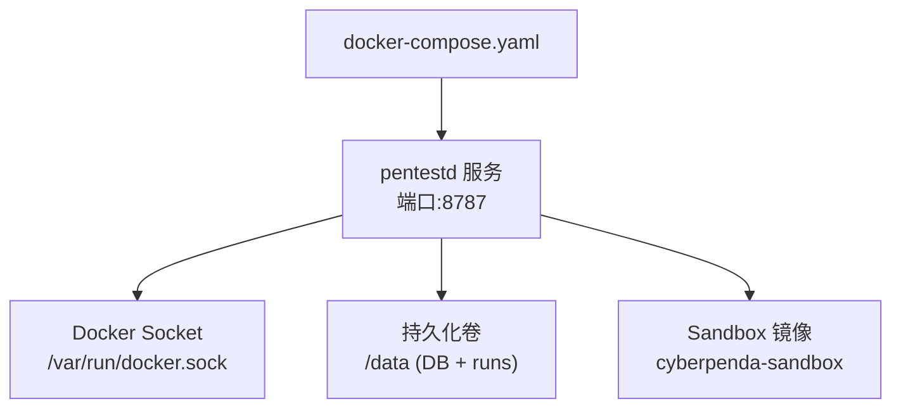
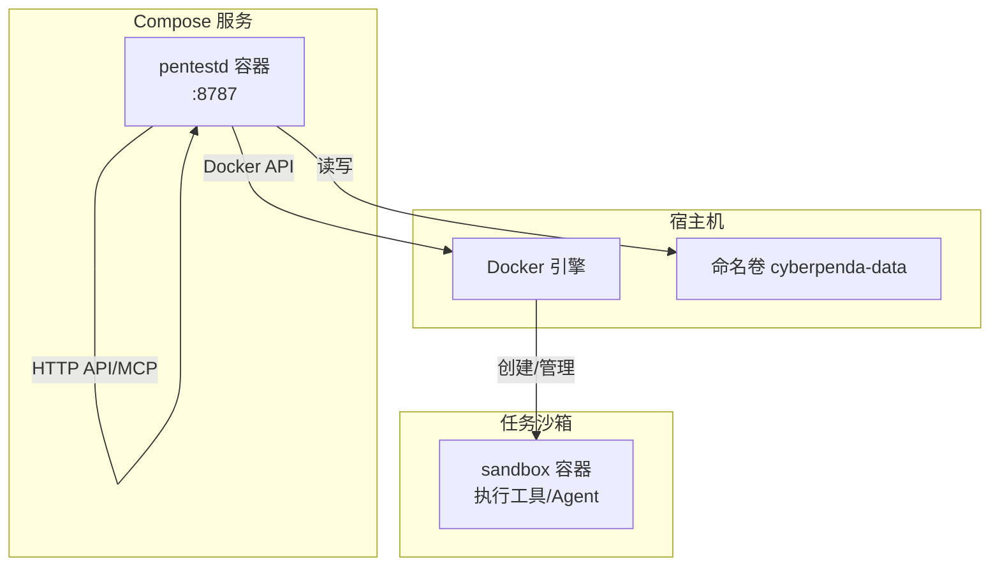
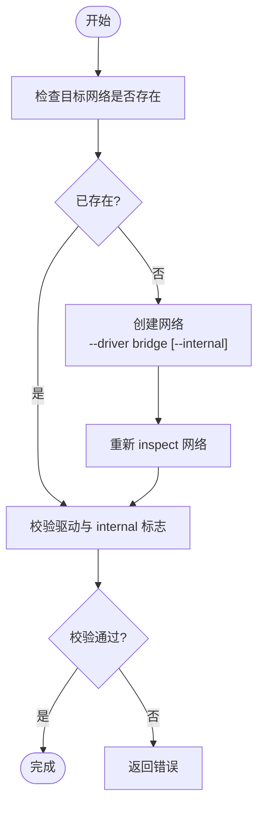
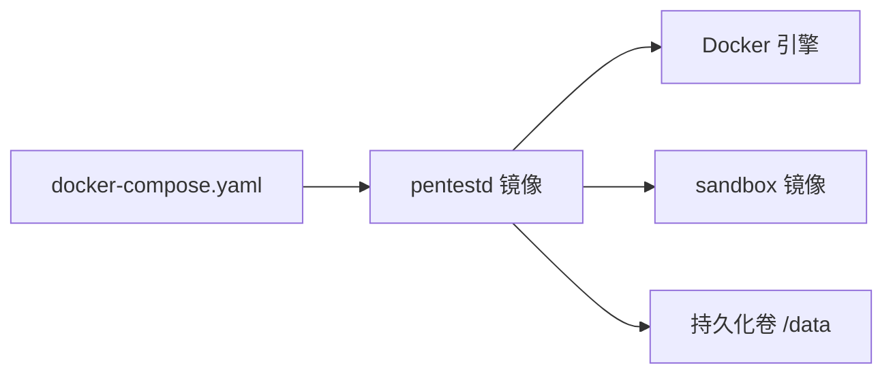

# 容器化部署

<cite>
**本文引用的文件**   
- [README.md](file://README.md)
- [docker-compose.yaml](file://docker-compose.yaml)
- [docker/pentestd/Dockerfile](file://docker/pentestd/Dockerfile)
- [docker/pentest-sandbox/Dockerfile](file://docker/pentest-sandbox/Dockerfile)
- [internal/runtime/docker_sandbox.go](file://internal/runtime/docker_sandbox.go)
- [internal/daemon/task_test.go](file://internal/daemon/task_test.go)
</cite>

## 目录
1. [简介](#简介)
2. [项目结构](#项目结构)
3. [核心组件](#核心组件)
4. [架构总览](#架构总览)
5. [详细组件分析](#详细组件分析)
6. [依赖关系分析](#依赖关系分析)
7. [性能与资源限制](#性能与资源限制)
8. [安全加固](#安全加固)
9. [健康检查与可观测性](#健康检查与可观测性)
10. [Kubernetes 部署清单](#kubernetes-部署清单)
11. [Helm Chart 配置](#helm-chart-配置)
12. [故障排查指南](#故障排查指南)
13. [结论](#结论)

## 简介
本指南面向将 CyberPenda 以容器化方式部署到本地或云原生环境的运维与平台工程师，覆盖 Docker Compose 编排、镜像构建与发布流程、沙箱隔离机制、网络策略、数据持久化、Kubernetes 部署清单与 Helm Chart 实践，以及安全加固、资源限制与健康检查等最佳实践。

## 项目结构
CyberPenda 的容器化相关资产集中在 docker 目录与根级编排文件中：
- 应用镜像构建：docker/pentestd/Dockerfile（多阶段构建，嵌入前端静态资源）
- 沙箱镜像构建：docker/pentest-sandbox/Dockerfile（预置 Kali 工具链与 Agent SDK 桥接）
- 本地编排：docker-compose.yaml（单服务编排，挂载 Docker Socket 与数据卷）



图表来源
- [docker-compose.yaml:1-35](file://docker-compose.yaml#L1-L35)
- [docker/pentestd/Dockerfile:1-37](file://docker/pentestd/Dockerfile#L1-L37)
- [docker/pentest-sandbox/Dockerfile:1-145](file://docker/pentest-sandbox/Dockerfile#L1-L145)

章节来源
- [README.md:56-80](file://README.md#L56-L80)
- [docker-compose.yaml:1-35](file://docker-compose.yaml#L1-L35)
- [docker/pentestd/Dockerfile:1-37](file://docker/pentestd/Dockerfile#L1-L37)
- [docker/pentest-sandbox/Dockerfile:1-145](file://docker/pentest-sandbox/Dockerfile#L1-L145)

## 核心组件
- pentestd 应用镜像
  - 多阶段构建：Node 20 构建 React UI，Go 1.25 编译二进制并嵌入前端资源
  - 运行态基于 Alpine，安装 ca-certificates 与 docker-cli，暴露 8787 端口
  - 默认环境变量：监听地址、数据库路径、运行时根目录
  - 内置健康检查端点 /health
- sandbox 镜像
  - 基于 Kali Linux，预装大量渗透测试工具与 Node/Python 环境
  - 安装 Codex/Claude Code/Pi 等 Agent CLI，并提供非 PTY 协议桥接
  - 提供 host-proxy-only 入口脚本，用于仅代理宿主机访问的网络模式
  - 预置 Nuclei 模板、agent-browser 及 Chromium 等浏览器能力
- 编排与服务
  - docker-compose 定义单服务 cyberpenda，绑定端口、注入认证令牌、挂载数据卷与 Docker Socket
  - 通过 security_opt 禁用新特权，启用健康检查

章节来源
- [docker/pentestd/Dockerfile:1-37](file://docker/pentestd/Dockerfile#L1-L37)
- [docker/pentest-sandbox/Dockerfile:1-145](file://docker/pentest-sandbox/Dockerfile#L1-L145)
- [docker-compose.yaml:1-35](file://docker-compose.yaml#L1-L35)
- [README.md:56-80](file://README.md#L56-L80)

## 架构总览
下图展示容器化部署下的关键交互：Compose 启动 pentestd 容器，该容器通过 Docker Socket 调用宿主 Docker 引擎创建任务沙箱容器；数据通过命名卷持久化。



图表来源
- [docker-compose.yaml:1-35](file://docker-compose.yaml#L1-L35)
- [docker/pentestd/Dockerfile:1-37](file://docker/pentestd/Dockerfile#L1-L37)
- [docker/pentest-sandbox/Dockerfile:1-145](file://docker/pentest-sandbox/Dockerfile#L1-L145)

## 详细组件分析

### Docker Compose 编排详解
- 服务名称与镜像
  - 服务名：cyberpenda
  - 镜像：ghcr.io/n1majne3/cyberpenda:${CYBERPENDA_IMAGE_TAG:-latest}
- 端口映射
  - 绑定地址与端口由环境变量控制，默认 127.0.0.1:8787
- 环境变量
  - PENTEST_AUTH_TOKEN：强制设置，非回环绑定需鉴权
  - PENTEST_LISTEN_ADDR：容器内监听地址
  - PENTEST_DB：SQLite 数据库路径
  - PENTEST_RUNTIME_ROOT：任务运行目录
  - PENTEST_SANDBOX_IMAGE：指定沙箱镜像
  - PENTEST_CONTAINER_CLI：容器客户端（docker）
- 卷挂载
  - cyberpenda-data:/data：持久化 DB 与 runs
  - /var/run/docker.sock:/var/run/docker.sock：允许容器内调用 Docker
- 安全选项
  - no-new-privileges:true：禁止提升权限
- 健康检查
  - 使用 wget 探测 /health

章节来源
- [docker-compose.yaml:1-35](file://docker-compose.yaml#L1-L35)
- [README.md:56-80](file://README.md#L56-L80)

### 镜像构建与发布流程
- 应用镜像（pentestd）
  - 第一阶段：Node 20 构建 React UI 产物
  - 第二阶段：Go 1.25 编译二进制，嵌入前端 dist，输出至 /out/pentestd
  - 运行镜像：Alpine + ca-certificates + docker-cli，EXPOSE 8787，HEALTHCHECK 指向 /health
- 沙箱镜像（pentest-sandbox）
  - 基础镜像：kalilinux/kali-rolling
  - 安装系统工具、Node/Python、CLI 工具集（nmap/sqlmap/nuclei/httpx 等）
  - 安装 Agent SDK 与桥接程序（Codex/Claude/Pi），提供非 PTY 通信
  - 预置 agent-browser 与 Chromium，支持浏览器自动化
  - 提供 host-proxy-only 入口脚本，用于受限出站网络模式
- 发布建议
  - 使用多阶段构建减少最终镜像体积
  - 固定基础镜像版本与第三方包版本，确保可重现
  - 在 CI 中签名与扫描镜像，推送至可信仓库

章节来源
- [docker/pentestd/Dockerfile:1-37](file://docker/pentestd/Dockerfile#L1-L37)
- [docker/pentest-sandbox/Dockerfile:1-145](file://docker/pentest-sandbox/Dockerfile#L1-L145)
- [README.md:71-80](file://README.md#L71-L80)

### 沙箱容器隔离机制
- 进程与文件系统隔离
  - 每个任务在独立容器中运行，拥有独立的 HOME、工作目录与环境变量
- 网络隔离
  - 默认使用 bridge 网络；支持 internal 网络实现无外网访问
  - 支持 host_proxy_only 模式：先创建专用 bridge 网络，再限制出站流量
- 网络创建与校验逻辑
  - 若所需网络不存在则创建，存在则校验驱动与 internal 标志是否匹配
  - 并发场景下存在竞态保护：创建失败后再次 inspect 并校验



图表来源
- [internal/runtime/docker_sandbox.go:378-402](file://internal/runtime/docker_sandbox.go#L378-L402)

章节来源
- [internal/runtime/docker_sandbox.go:378-402](file://internal/runtime/docker_sandbox.go#L378-L402)
- [internal/daemon/task_test.go:813-843](file://internal/daemon/task_test.go#L813-L843)

### 网络配置与出站控制
- 网络模式
  - default：bridge，允许出站
  - internal：完全隔离，禁止出站
  - host_proxy_only：为任务创建专用 bridge 网络，并在容器内部通过 iptables 限制出站，仅允许代理访问宿主机
- 典型流程
  - 任务启动前根据 run_controls.sandbox_network 选择网络策略
  - 若选择 host_proxy_only，先创建专用网络，再启动任务容器

章节来源
- [internal/daemon/task_test.go:813-843](file://internal/daemon/task_test.go#L813-L843)
- [docker/pentest-sandbox/Dockerfile:124-131](file://docker/pentest-sandbox/Dockerfile#L124-L131)

### 数据持久化策略
- 持久化位置
  - SQLite 数据库：/data/pentest.db
  - 任务运行目录：/data/runs
- 卷映射
  - docker-compose 将命名卷 cyberpenda-data 映射到 /data
- 备份建议
  - 定期快照 /data 目录或使用数据库导出工具
  - 对敏感数据进行加密存储与传输

章节来源
- [docker-compose.yaml:1-35](file://docker-compose.yaml#L1-L35)
- [docker/pentestd/Dockerfile:25-37](file://docker/pentestd/Dockerfile#L25-L37)

## 依赖关系分析
- 外部依赖
  - Docker 或 Podman：作为容器运行时
  - Docker Socket：供 pentestd 容器创建与管理任务沙箱
- 内部依赖
  - pentestd 依赖 sandbox 镜像作为任务执行环境
  - sandbox 镜像依赖宿主 Docker 引擎进行网络与进程隔离



图表来源
- [docker-compose.yaml:1-35](file://docker-compose.yaml#L1-L35)
- [docker/pentestd/Dockerfile:1-37](file://docker/pentestd/Dockerfile#L1-L37)
- [docker/pentest-sandbox/Dockerfile:1-145](file://docker/pentest-sandbox/Dockerfile#L1-L145)

章节来源
- [docker-compose.yaml:1-35](file://docker-compose.yaml#L1-L35)
- [docker/pentestd/Dockerfile:1-37](file://docker/pentestd/Dockerfile#L1-L37)
- [docker/pentest-sandbox/Dockerfile:1-145](file://docker/pentest-sandbox/Dockerfile#L1-L145)

## 性能与资源限制
- CPU/内存限制
  - 在 Compose 中使用 deploy.resources.limits 与 reservations 限制 pentestd 与 sandbox 容器的资源
  - 针对高负载任务，可为 sandbox 容器单独设置更高上限
- I/O 优化
  - 将 /data 映射到高性能磁盘或 SSD
  - 避免在任务执行期间频繁写入大日志
- 镜像层缓存
  - 将稳定依赖安装与变更频繁代码分层，提高构建缓存命中率
- 并发任务
  - 合理设置任务并发度，避免同时创建过多沙箱导致宿主机压力过大

[本节为通用指导，不直接分析具体文件]

## 安全加固
- 最小权限原则
  - 使用 no-new-privileges:true 防止容器内提权
  - 仅挂载必要卷与设备，避免挂载宿主敏感目录
- 网络最小暴露
  - 默认绑定 127.0.0.1，仅在必要时开放到局域网或公网
  - 使用 host_proxy_only 模式限制出站流量
- 镜像安全
  - 使用非 root 用户运行（如适用）
  - 定期更新基础镜像与依赖，进行漏洞扫描
- 认证与授权
  - 必须设置 PENTEST_AUTH_TOKEN，并通过 Authorization 头或 token 查询参数访问受保护路由
- 审计与日志
  - 集中收集容器日志与 Docker 事件，便于溯源

章节来源
- [docker-compose.yaml:1-35](file://docker-compose.yaml#L1-L35)
- [README.md:110-126](file://README.md#L110-L126)

## 健康检查与可观测性
- 健康检查
  - 应用镜像内置 HEALTHCHECK 指向 /health
  - Compose 也定义了健康检查，周期、超时与重试时间可调
- 指标与日志
  - 将容器标准输出重定向到宿主机或日志聚合系统
  - 结合 Prometheus/Grafana 采集系统指标（CPU、内存、I/O）

章节来源
- [docker/pentestd/Dockerfile:34-36](file://docker/pentestd/Dockerfile#L34-L36)
- [docker-compose.yaml:26-31](file://docker-compose.yaml#L26-L31)

## Kubernetes 部署清单
以下为最小可用的 Deployment + Service + PersistentVolumeClaim 示例，适用于生产环境的基础部署。可根据实际集群与存储类调整。

- 命名空间与常量
  - 命名空间：cyberpenda
  - 标签：app=cyberpenda
- 持久化存储
  - PVC：cyberpenda-data，按需选择 StorageClass
- 资源配置
  - requests/limits：为 CPU 与内存设定下限与上限
- 安全上下文
  - runAsNonRoot: true
  - readOnlyRootFilesystem: true（如需，配合空目录与卷挂载）
  - allowPrivilegeEscalation: false
  - capabilities.drop: ["ALL"]
- 健康检查
  - livenessProbe/readinessProbe：GET /health
- 环境变量
  - PENTEST_AUTH_TOKEN、PENTEST_LISTEN_ADDR、PENTEST_DB、PENTEST_RUNTIME_ROOT、PENTEST_SANDBOX_IMAGE、PENTEST_CONTAINER_CLI
- Ingress/Service
  - 对外暴露 8787 端口，建议使用 Ingress 与 TLS

```yaml
apiVersion: v1
kind: Namespace
metadata:
  name: cyberpenda
---
apiVersion: v1
kind: PersistentVolumeClaim
metadata:
  name: cyberpenda-data
  namespace: cyberpenda
spec:
  accessModes:
    - ReadWriteOnce
  storageClassName: ""
  resources:
    requests:
      storage: 20Gi
---
apiVersion: apps/v1
kind: Deployment
metadata:
  name: cyberpenda
  namespace: cyberpenda
  labels:
    app: cyberpenda
spec:
  replicas: 1
  selector:
    matchLabels:
      app: cyberpenda
  template:
    metadata:
      labels:
        app: cyberpenda
    spec:
      containers:
        - name: cyberpenda
          image: ghcr.io/n1majne3/cyberpenda:latest
          ports:
            - containerPort: 8787
          env:
            - name: PENTEST_AUTH_TOKEN
              valueFrom:
                secretKeyRef:
                  name: cyberpenda-secret
                  key: auth-token
            - name: PENTEST_LISTEN_ADDR
              value: "0.0.0.0:8787"
            - name: PENTEST_DB
              value: "/data/pentest.db"
            - name: PENTEST_RUNTIME_ROOT
              value: "/data/runs"
            - name: PENTEST_SANDBOX_IMAGE
              value: "ghcr.io/n1majne3/cyberpenda-sandbox:latest"
            - name: PENTEST_CONTAINER_CLI
              value: "docker"
          volumeMounts:
            - name: data
              mountPath: /data
          resources:
            requests:
              cpu: "500m"
              memory: "512Mi"
            limits:
              cpu: "1000m"
              memory: "1Gi"
          livenessProbe:
            httpGet:
              path: /health
              port: 8787
            initialDelaySeconds: 10
            periodSeconds: 30
            timeoutSeconds: 5
            failureThreshold: 3
          readinessProbe:
            httpGet:
              path: /health
              port: 8787
            initialDelaySeconds: 5
            periodSeconds: 10
            timeoutSeconds: 3
            failureThreshold: 3
          securityContext:
            runAsNonRoot: true
            readOnlyRootFilesystem: true
            allowPrivilegeEscalation: false
            capabilities:
              drop: ["ALL"]
      volumes:
        - name: data
          persistentVolumeClaim:
            claimName: cyberpenda-data
---
apiVersion: v1
kind: Service
metadata:
  name: cyberpenda
  namespace: cyberpenda
spec:
  type: ClusterIP
  ports:
    - port: 8787
      targetPort: 8787
  selector:
    app: cyberpenda
```

[本节为概念性清单，未直接映射到具体源码文件]

## Helm Chart 配置
以下给出一个最小化的 Helm Chart 结构，便于在集群中批量部署与版本化管理。

- Chart.yaml
  - apiVersion: v2
  - name: cyberpenda
  - version: 0.1.0
  - description: CyberPenda 容器化部署
- values.yaml
  - image.repository: ghcr.io/n1majne3/cyberpenda
  - image.tag: latest
  - service.port: 8787
  - persistence.size: 20Gi
  - resources.requests.cpu/memory
  - resources.limits.cpu/memory
  - env.authToken.secretName/key
  - env.sandboxImage
  - env.containerCli
- templates/deployment.yaml
  - 读取 values.yaml 渲染 Deployment、Service、PVC
  - 注入环境变量与安全上下文
  - 配置健康检查探针

[本节为概念性配置，未直接映射到具体源码文件]

## 故障排查指南
- 无法访问 /health
  - 检查容器内监听地址与端口映射是否正确
  - 确认健康检查命令与超时配置
- 任务无法创建沙箱
  - 检查 Docker Socket 挂载与权限
  - 查看 Docker 日志，确认网络创建与容器启动是否成功
- 网络异常
  - 验证 host_proxy_only 模式下专用网络是否被正确创建
  - 检查容器内 iptables 规则与出站限制
- 数据丢失
  - 确认持久化卷是否挂载成功
  - 检查 /data 目录权限与 SELinux/AppArmor 策略

章节来源
- [docker-compose.yaml:26-31](file://docker-compose.yaml#L26-L31)
- [internal/daemon/task_test.go:813-843](file://internal/daemon/task_test.go#L813-L843)
- [internal/runtime/docker_sandbox.go:378-402](file://internal/runtime/docker_sandbox.go#L378-L402)

## 结论
通过多阶段镜像构建、严格的网络与权限控制、持久化卷与健康的编排配置，CyberPenda 可在本地与云原生环境中安全、可靠地运行。建议在 CI/CD 中集成镜像扫描与签名，在生产环境采用最小权限与资源限制策略，并结合监控与日志系统进行持续可观测性保障。