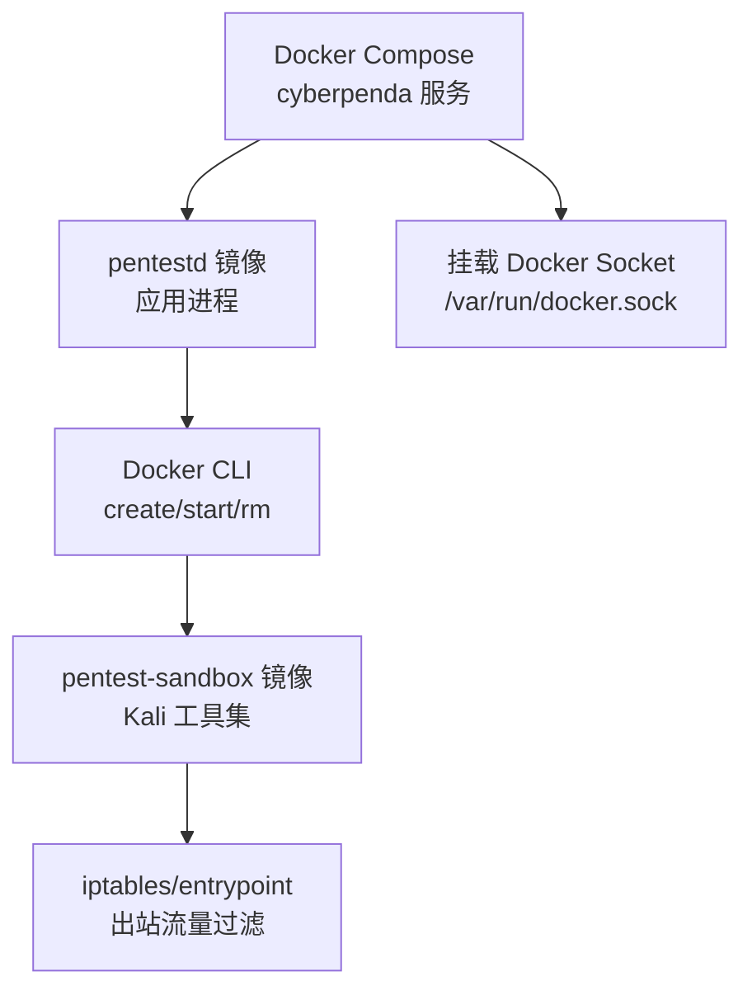
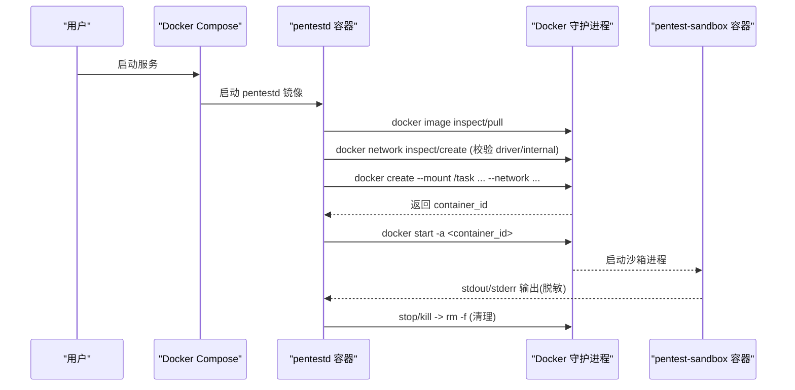
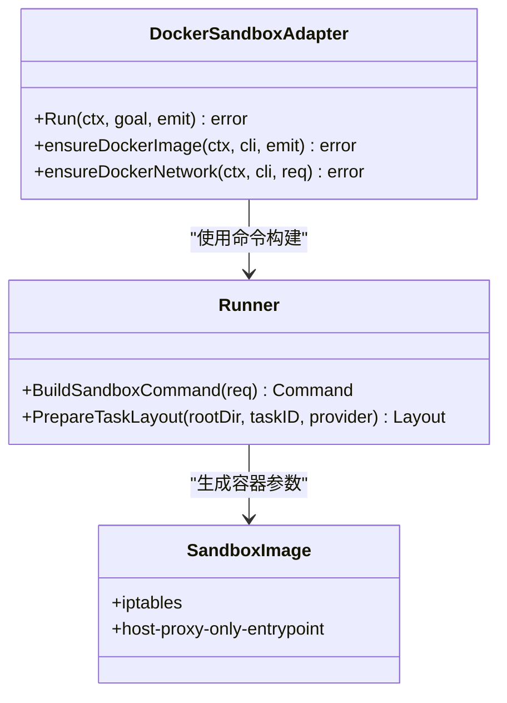

# 容器安全加固

<cite>
**本文引用的文件**   
- [docker-compose.yaml](file://docker-compose.yaml)
- [docker/pentestd/Dockerfile](file://docker/pentestd/Dockerfile)
- [docker/pentest-sandbox/Dockerfile](file://docker/pentest-sandbox/Dockerfile)
- [internal/runtime/docker_sandbox.go](file://internal/runtime/docker_sandbox.go)
- [internal/runner/runner.go](file://internal/runner/runner.go)
- [README.md](file://README.md)
</cite>

## 目录
1. [简介](#简介)
2. [项目结构](#项目结构)
3. [核心组件](#核心组件)
4. [架构总览](#架构总览)
5. [详细组件分析](#详细组件分析)
6. [依赖关系分析](#依赖关系分析)
7. [性能与资源限制](#性能与资源限制)
8. [故障排查指南](#故障排查指南)
9. [结论](#结论)
10. [附录：编排与安全基线清单](#附录编排与安全基线清单)

## 简介
本指南面向在本地或生产环境中运行 CyberPenda 的运维与平台团队，聚焦“容器安全加固”主题。文档基于仓库中的 Docker 镜像构建、Compose 编排以及运行时沙箱实现，给出最小化镜像、非 root 用户、漏洞扫描与签名验证、运行时隔离（seccomp/AppArmor/SELinux）、网络隔离与资源限制、Compose 安全选项、Kubernetes 策略（PodSecurityPolicy/NetworkPolicy/RBAC）以及监控审计与威胁检测的可落地方案。

## 项目结构
CyberPenda 提供两类关键容器镜像与编排配置：
- pentestd 应用镜像：Go 后端 + 嵌入式前端，默认监听本地端口，支持通过环境变量控制数据持久化路径与运行时根目录。
- pentest-sandbox 沙箱镜像：以 Kali 为基础，预置大量渗透测试工具与代理桥接程序，作为任务执行边界。

图示来源
- [docker-compose.yaml:1-35](file://docker-compose.yaml#L1-L35)
- [docker/pentestd/Dockerfile:1-37](file://docker/pentestd/Dockerfile#L1-L37)
- [docker/pentest-sandbox/Dockerfile:124-144](file://docker/pentest-sandbox/Dockerfile#L124-L144)

章节来源
- [README.md:1-173](file://README.md#L1-L173)
- [docker-compose.yaml:1-35](file://docker-compose.yaml#L1-L35)
- [docker/pentestd/Dockerfile:1-37](file://docker/pentestd/Dockerfile#L1-L37)
- [docker/pentest-sandbox/Dockerfile:1-145](file://docker/pentest-sandbox/Dockerfile#L1-L145)

## 核心组件
- 应用镜像（pentestd）
  - 多阶段构建：Node 构建前端，Go 编译二进制；最终镜像仅包含运行时依赖与二进制。
  - 暴露健康检查端点，便于编排层探测。
- 沙箱镜像（pentest-sandbox）
  - 基于 Kali，安装大量安全工具与 Node/Python 环境。
  - 内置 host-proxy-only entrypoint 与 iptables，用于出站访问控制。
- 运行时适配器（DockerSandboxAdapter）
  - 负责镜像拉取、容器创建、启动、日志采集、停止与清理。
  - 强制校验所需 Docker 网络的驱动与 internal 属性，拒绝不安全网络配置。
- 命令构建器（BuildSandboxCommand）
  - 生成 docker create 参数，绑定任务目录为只读输入，注入环境变量，选择网络模式。
  - 对 host_proxy_only 模式附加 NET_ADMIN 能力并指定专用入口。

章节来源
- [docker/pentestd/Dockerfile:1-37](file://docker/pentestd/Dockerfile#L1-L37)
- [docker/pentest-sandbox/Dockerfile:1-145](file://docker/pentest-sandbox/Dockerfile#L1-L145)
- [internal/runtime/docker_sandbox.go:1-505](file://internal/runtime/docker_sandbox.go#L1-L505)
- [internal/runner/runner.go:1-306](file://internal/runner/runner.go#L1-L306)

## 架构总览
下图展示从 Compose 到沙箱容器的完整调用链，包括网络与权限约束的关键节点。

图示来源
- [docker-compose.yaml:1-35](file://docker-compose.yaml#L1-L35)
- [internal/runtime/docker_sandbox.go:111-231](file://internal/runtime/docker_sandbox.go#L111-L231)
- [internal/runner/runner.go:139-217](file://internal/runner/runner.go#L139-L217)

## 详细组件分析

### 镜像安全最佳实践（最小化、非 root、漏洞扫描、签名验证）
- 最小化镜像
  - 使用多阶段构建，将构建产物复制到精简基础镜像中，避免携带源码与构建工具。
  - 参考路径：[docker/pentestd/Dockerfile:1-37](file://docker/pentestd/Dockerfile#L1-L37)
- 非 root 用户运行
  - 当前镜像未显式切换非 root 用户，建议在生产镜像中添加非 root 用户并在 ENTRYPOINT 前切换。
  - 参考位置：[docker/pentestd/Dockerfile:25-37](file://docker/pentestd/Dockerfile#L25-L37)
- 漏洞扫描
  - 建议在 CI 中对 pentestd 与 pentest-sandbox 镜像进行 CVE 扫描，阻断高危漏洞。
  - 可结合 Trivy/Grype 等工具，在构建后自动扫描并生成报告。
- 镜像签名与验证
  - 使用 Cosign/Notary 对镜像签名，在宿主机或编排层启用镜像签名校验，防止供应链篡改。
  - 在 Kubernetes 中可通过 ImagePolicyWebhook 或 OPA Gatekeeper 强制校验签名。

章节来源
- [docker/pentestd/Dockerfile:1-37](file://docker/pentestd/Dockerfile#L1-L37)
- [docker/pentest-sandbox/Dockerfile:1-145](file://docker/pentest-sandbox/Dockerfile#L1-L145)

### 容器运行时安全配置（seccomp、AppArmor/SELinux、网络隔离、资源限制）
- seccomp 策略
  - 在 Compose 或 K8s 中为容器启用默认或自定义 seccomp 配置文件，禁用不必要系统调用。
  - 注意：host_proxy_only 模式需要 NET_ADMIN 能力，需评估风险并限定范围。
- AppArmor/SELinux
  - 为 pentestd 与沙箱容器加载严格 profile，限制文件系统访问、网络与进程行为。
- 网络隔离
  - 运行时强制校验 Docker 网络的 driver 与 internal 属性，拒绝不安全配置。
  - 参考路径：[internal/runtime/docker_sandbox.go:365-428](file://internal/runtime/docker_sandbox.go#L365-L428)
- 资源限制
  - 在 Compose/K8s 中设置 CPU/内存上限与 I/O 限额，防止资源耗尽攻击。

章节来源
- [internal/runtime/docker_sandbox.go:365-428](file://internal/runtime/docker_sandbox.go#L365-L428)
- [internal/runner/runner.go:196-216](file://internal/runner/runner.go#L196-L216)

### Docker Compose 安全选项详解
- no-new-privileges
  - 已在 compose 中启用，阻止容器内进程获取新特权。
  - 参考路径：[docker-compose.yaml:24-25](file://docker-compose.yaml#L24-L25)
- read_only 根文件系统
  - 建议为 pentestd 容器启用 read_only，并将必要写路径映射为独立卷。
  - 参考位置：[docker-compose.yaml:21-23](file://docker-compose.yaml#L21-L23)
- 能力裁剪
  - 移除默认能力，按需添加最小集合；host_proxy_only 模式需 NET_ADMIN，应严格限定。
  - 参考位置：[internal/runner/runner.go:196-201](file://internal/runner/runner.go#L196-L201)
- 其他建议
  - 限制端口绑定至 127.0.0.1，或通过反向代理暴露。
  - 使用 healthcheck 确保服务可用性。
  - 参考位置：[docker-compose.yaml:12-13, 26-31:12-13](file://docker-compose.yaml#L12-L13) [docker-compose.yaml:26-31](file://docker-compose.yaml#L26-L31)

章节来源
- [docker-compose.yaml:1-35](file://docker-compose.yaml#L1-L35)
- [internal/runner/runner.go:196-201](file://internal/runner/runner.go#L196-L201)

### 容器编排平台安全配置（Kubernetes）
- PodSecurityPolicy（已废弃，建议使用 Pod Security Admission）
  - 禁止 privileged、hostPID/hostIPC、hostNetwork。
  - 限制 capabilities 与 volume 类型，仅允许必要卷。
- NetworkPolicy
  - 默认拒绝所有入站/出站，仅放行必要的 API 与服务发现。
  - 针对 host_proxy_only 场景，精确放行目标地址与端口。
- RBAC 策略
  - 最小权限原则：仅授予读取 Blackboard 与触发报告生成的必要权限。
  - 限制 ServiceAccount 的 token 挂载与作用域。

说明：本节为通用编排安全建议，不直接引用具体代码文件。

### 安全监控、审计日志与威胁检测
- 审计日志
  - 记录任务创建、运行时启动、沙箱投影、范围快照、批准决策、事实写入、发现写入、报告生成等高信号事件。
  - 参考路径：[docs/superpowers/specs/2026-06-17-pentest-agent-design.md:314-327](file://docs/superpowers/specs/2026-06-17-pentest-agent-design.md#L314-L327)
- 运行时输出脱敏
  - 运行时适配器对敏感值进行脱敏后再输出，避免泄露密钥。
  - 参考路径：[internal/runtime/docker_sandbox.go:111-118](file://internal/runtime/docker_sandbox.go#L111-L118)
- 威胁检测
  - 结合宿主机与容器侧指标（CPU/内存/网络），建立异常阈值告警。
  - 对沙箱出站流量进行白名单校验与异常连接告警。

章节来源
- [docs/superpowers/specs/2026-06-17-pentest-agent-design.md:314-327](file://docs/superpowers/specs/2026-06-17-pentest-agent-design.md#L314-L327)
- [internal/runtime/docker_sandbox.go:111-118](file://internal/runtime/docker_sandbox.go#L111-L118)

## 依赖关系分析
- 运行时适配器依赖 Docker CLI 与网络管理，强耦合于宿主 Docker 守护进程。
- 命令构建器负责组装 docker create 参数，决定网络模式、只读挂载与环境变量注入。
- 沙箱镜像依赖 iptables 与自定义入口实现出站过滤。

图示来源
- [internal/runtime/docker_sandbox.go:111-231](file://internal/runtime/docker_sandbox.go#L111-L231)
- [internal/runner/runner.go:139-217](file://internal/runner/runner.go#L139-L217)
- [docker/pentest-sandbox/Dockerfile:124-144](file://docker/pentest-sandbox/Dockerfile#L124-L144)

章节来源
- [internal/runtime/docker_sandbox.go:1-505](file://internal/runtime/docker_sandbox.go#L1-L505)
- [internal/runner/runner.go:1-306](file://internal/runner/runner.go#L1-L306)
- [docker/pentest-sandbox/Dockerfile:124-144](file://docker/pentest-sandbox/Dockerfile#L124-L144)

## 性能与资源限制
- 镜像拉取优化
  - 预拉取常用镜像，减少首次启动延迟。
  - 参考路径：[internal/runtime/docker_sandbox.go:233-283](file://internal/runtime/docker_sandbox.go#L233-L283)
- 资源配额
  - 在 Compose/K8s 中为容器设置 CPU/内存上限，避免沙箱工具占用过多资源。
- 日志与输出
  - 运行时输出行长度限制与脱敏，降低 I/O 压力与敏感信息泄露风险。
  - 参考路径：[internal/runtime/docker_sandbox.go:290-314](file://internal/runtime/docker_sandbox.go#L290-L314)

章节来源
- [internal/runtime/docker_sandbox.go:233-283](file://internal/runtime/docker_sandbox.go#L233-L283)
- [internal/runtime/docker_sandbox.go:290-314](file://internal/runtime/docker_sandbox.go#L290-L314)

## 故障排查指南
- 容器无法启动
  - 检查 Docker 网络是否满足 driver 与 internal 要求，错误会明确提示不安全配置。
  - 参考路径：[internal/runtime/docker_sandbox.go:416-428](file://internal/runtime/docker_sandbox.go#L416-L428)
- 镜像拉取失败
  - 查看生命周期事件与进度输出，定位网络或认证问题。
  - 参考路径：[internal/runtime/docker_sandbox.go:249-283](file://internal/runtime/docker_sandbox.go#L249-L283)
- 清理残留容器
  - 停止与删除逻辑对缺失容器视为成功，避免重复报错。
  - 参考路径：[internal/runtime/docker_sandbox.go:430-467](file://internal/runtime/docker_sandbox.go#L430-L467)

章节来源
- [internal/runtime/docker_sandbox.go:416-428](file://internal/runtime/docker_sandbox.go#L416-L428)
- [internal/runtime/docker_sandbox.go:249-283](file://internal/runtime/docker_sandbox.go#L249-L283)
- [internal/runtime/docker_sandbox.go:430-467](file://internal/runtime/docker_sandbox.go#L430-L467)

## 结论
通过对镜像构建、Compose 编排与运行时适配器的深入分析，CyberPenda 在容器安全方面具备良好基础：最小化镜像、严格的网络校验、脱敏输出与清晰的清理流程。进一步加固建议包括：启用非 root 用户、全面漏洞扫描与镜像签名、精细化 seccomp/AppArmor/SELinux 策略、严格的网络与资源限制，以及在编排层实施 RBAC 与 NetworkPolicy。配合审计日志与威胁检测，可显著提升整体安全水位。

## 附录：编排与安全基线清单
- 镜像
  - 多阶段构建、最小基础镜像、非 root 用户、CVE 扫描、镜像签名校验。
- Compose
  - no-new-privileges、read_only 根文件系统、能力裁剪、端口绑定限制、healthcheck。
- 运行时
  - 网络 driver/internal 校验、host_proxy_only 模式最小能力、只读任务挂载。
- 编排（K8s）
  - PSA/PSP 限制、NetworkPolicy 白名单、RBAC 最小权限、资源配额。
- 监控审计
  - 高信号事件审计、运行时输出脱敏、异常指标告警。