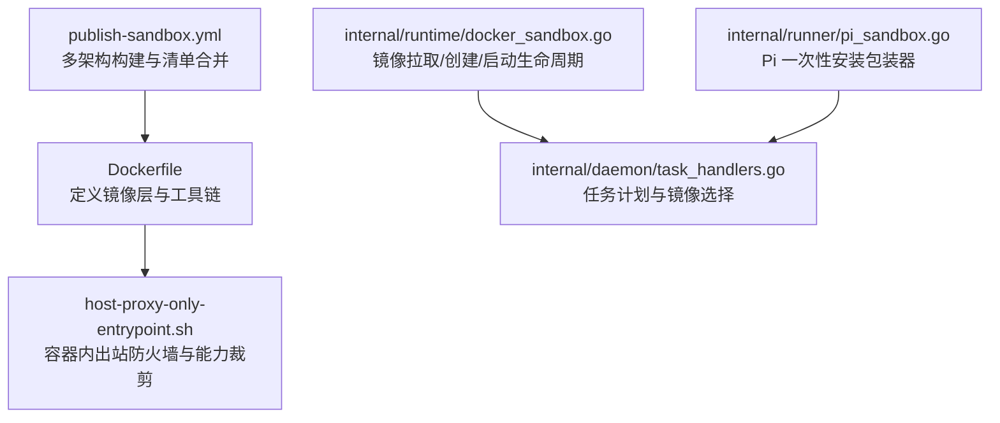
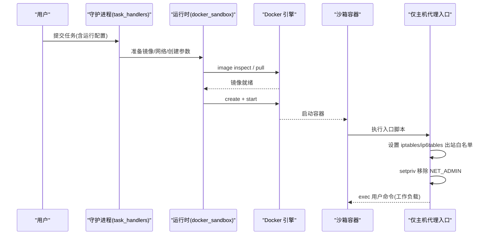
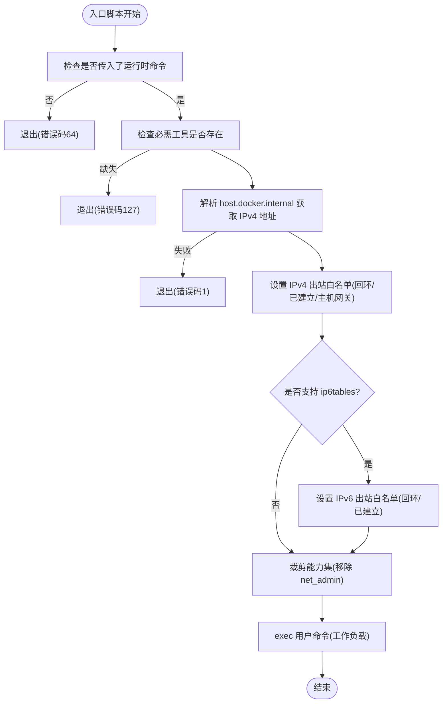
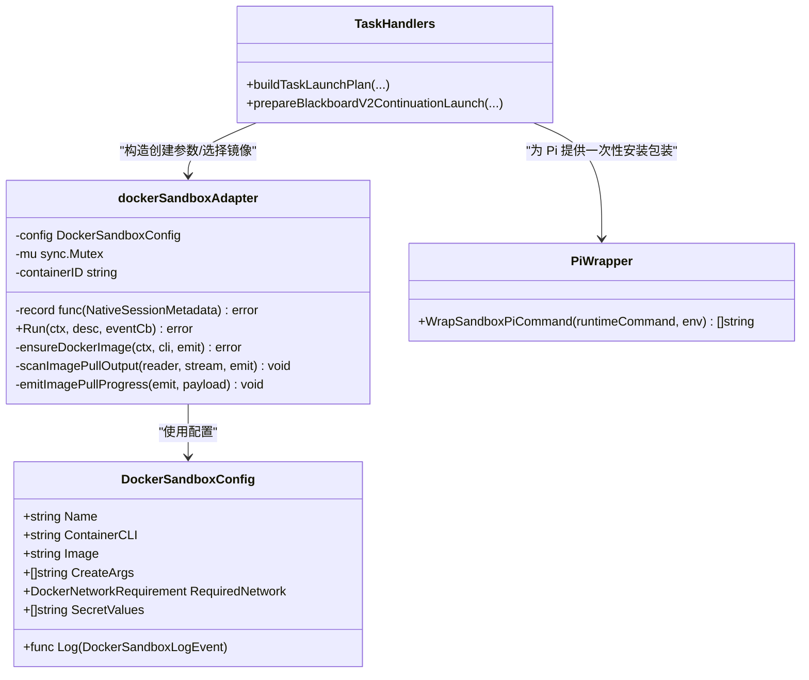
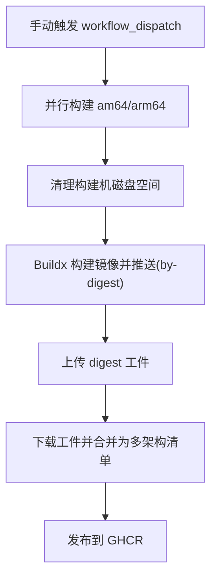
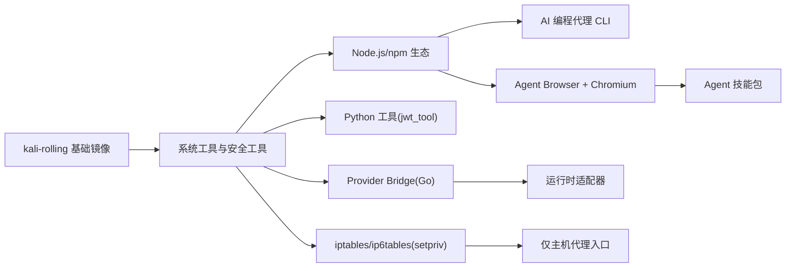

# 沙箱容器镜像

<cite>
**本文引用的文件**   
- [docker/pentest-sandbox/Dockerfile](file://docker/pentest-sandbox/Dockerfile)
- [docker/pentest-sandbox/host-proxy-only-entrypoint.sh](file://docker/pentest-sandbox/host-proxy-only-entrypoint.sh)
- [.github/workflows/publish-sandbox.yml](file://.github/workflows/publish-sandbox.yml)
- [internal/runner/pi_sandbox.go](file://internal/runner/pi_sandbox.go)
- [internal/runtime/docker_sandbox.go](file://internal/runtime/docker_sandbox.go)
- [internal/daemon/task_handlers.go](file://internal/daemon/task_handlers.go)
- [internal/runner/runner_test.go](file://internal/runner/runner_test.go)
</cite>

## 目录
1. [简介](#简介)
2. [项目结构](#项目结构)
3. [核心组件](#核心组件)
4. [架构总览](#架构总览)
5. [详细组件分析](#详细组件分析)
6. [依赖关系分析](#依赖关系分析)
7. [性能与优化](#性能与优化)
8. [故障排查指南](#故障排查指南)
9. [结论](#结论)
10. [附录：自定义镜像构建指南](#附录自定义镜像构建指南)

## 简介
本文件面向“沙箱容器镜像”的完整文档，聚焦以下目标：
- 解释 sandbox Dockerfile 的构建过程、基础镜像选择、依赖安装与安全加固措施。
- 深入说明 host-proxy-only-entrypoint.sh 入口脚本的功能：代理配置、权限控制与进程管理。
- 提供自定义沙箱镜像的构建指南：预装工具、网络配置与文件系统隔离策略。
- 给出镜像优化、安全扫描与版本管理的最佳实践。

## 项目结构
与沙箱镜像直接相关的代码位于 docker/pentest-sandbox 目录，包含镜像定义与仅主机代理入口脚本；CI 发布流程在 .github/workflows/publish-sandbox.yml；运行时与守护进程对镜像的使用逻辑分布在 internal 子包中。

图表来源
- [docker/pentest-sandbox/Dockerfile:1-145](file://docker/pentest-sandbox/Dockerfile#L1-L145)
- [docker/pentest-sandbox/host-proxy-only-entrypoint.sh:1-46](file://docker/pentest-sandbox/host-proxy-only-entrypoint.sh#L1-L46)
- [.github/workflows/publish-sandbox.yml:1-148](file://.github/workflows/publish-sandbox.yml#L1-L148)
- [internal/runtime/docker_sandbox.go:233-327](file://internal/runtime/docker_sandbox.go#L233-L327)
- [internal/daemon/task_handlers.go:799-833](file://internal/daemon/task_handlers.go#L799-L833)
- [internal/runner/pi_sandbox.go:1-55](file://internal/runner/pi_sandbox.go#L1-L55)

章节来源
- [docker/pentest-sandbox/Dockerfile:1-145](file://docker/pentest-sandbox/Dockerfile#L1-L145)
- [.github/workflows/publish-sandbox.yml:1-148](file://.github/workflows/publish-sandbox.yml#L1-L148)

## 核心组件
- 镜像定义（Dockerfile）：基于 Kali 滚动发行版，预置大量渗透测试工具、Node.js 生态 CLI、Python 工具链、浏览器与 Agent 技能集，并内置仅主机代理入口脚本。
- 仅主机代理入口脚本（host-proxy-only-entrypoint.sh）：在容器内通过 iptables/ip6tables 限制出站流量至本地回环、已建立连接与 Docker Desktop 主机网关，随后使用 setpriv 移除 NET_ADMIN 能力后 exec 用户命令。
- 运行时集成（docker_sandbox.go）：负责镜像存在性检查、按需拉取、容器创建与启动、输出重定向与事件上报。
- 任务编排（task_handlers.go）：根据运行配置选择镜像、网络模式与运行时命令，必要时为 Pi 提供一次性安装包装。
- CI 发布（publish-sandbox.yml）：按平台分别构建镜像，生成 digest 工件，最后合并为多架构清单。

章节来源
- [docker/pentest-sandbox/Dockerfile:1-145](file://docker/pentest-sandbox/Dockerfile#L1-L145)
- [docker/pentest-sandbox/host-proxy-only-entrypoint.sh:1-46](file://docker/pentest-sandbox/host-proxy-only-entrypoint.sh#L1-L46)
- [internal/runtime/docker_sandbox.go:233-327](file://internal/runtime/docker_sandbox.go#L233-L327)
- [internal/daemon/task_handlers.go:799-833](file://internal/daemon/task_handlers.go#L799-L833)
- [.github/workflows/publish-sandbox.yml:1-148](file://.github/workflows/publish-sandbox.yml#L1-L148)

## 架构总览
下图展示了从任务到容器的关键路径：守护进程解析任务与运行配置，构造镜像与网络参数，调用运行时适配器执行镜像拉取与容器创建，容器以仅主机代理入口启动，并在容器内设置出站白名单后再执行实际工作负载。

图表来源
- [internal/daemon/task_handlers.go:799-833](file://internal/daemon/task_handlers.go#L799-L833)
- [internal/runtime/docker_sandbox.go:233-327](file://internal/runtime/docker_sandbox.go#L233-L327)
- [docker/pentest-sandbox/host-proxy-only-entrypoint.sh:1-46](file://docker/pentest-sandbox/host-proxy-only-entrypoint.sh#L1-L46)

## 详细组件分析

### 镜像构建与依赖（Dockerfile）
- 基础镜像：采用 kali-rolling 作为基础，确保获得最新的安全工具与系统库。
- 系统工具与语言栈：安装 headless Kali、Node.js/npm、Go、Python3/pip、常用文本处理与压缩工具、网络探测与漏洞扫描工具等。
- Node.js 生态 CLI：全局安装多个 AI 编程代理 CLI，便于在沙箱内直接调用。
- Provider 桥接程序：
  - Go 编译一个轻量桥接二进制，用于非 PTY 协议交互。
  - 将 Claude SDK Bridge 依赖安装到稳定层，并将源码拷贝到较晚层，以便修复时不破坏缓存。
- 第三方工具链：
  - 通过 GitHub Releases API 动态解析最新版本并下载二进制，避免固定版本带来的维护成本。
  - 安装 httpx、nuclei 模板、jwt_tool、agent-browser 及 Chromium，并配置 agent-browser 使用系统 Chromium。
- 技能包捆绑：将 agent-browser 的 skill-data 复制到镜像内固定目录，供沙箱 Agent 发现与加载。
- 网络与权限：
  - 安装 iptables 与 util-linux，为仅主机代理入口提供内核级出站过滤能力。
  - 复制并赋予可执行权限给仅主机代理入口脚本。
- 环境变量与工作目录：
  - 设置若干环境变量以禁用非必要网络访问、标记沙箱环境、指定技能目录与浏览器可执行路径。
  - 默认工作目录设置为 /workspace，CMD 为 bash。

章节来源
- [docker/pentest-sandbox/Dockerfile:1-145](file://docker/pentest-sandbox/Dockerfile#L1-L145)

### 仅主机代理入口脚本（host-proxy-only-entrypoint.sh）
该脚本是“仅允许访问宿主机网关”的关键实现，职责包括：
- 前置校验：要求传入至少一个运行时命令，且必须存在 getent、iptables、setpriv 三个工具。
- 主机网关发现：通过 getent 解析 host.docker.internal 获取 IPv4 地址，若失败则退出。
- 出站白名单（IPv4）：清空 OUTPUT 链，放行本地回环、已建立/相关连接、以及主机网关地址，最终默认 DROP。
- 出站白名单（IPv6）：如可用，同样清空并放行回环与已建立/相关连接，默认 DROP，防止 IPv6 绕过。
- 权限裁剪：使用 setpriv 从 bounding/inh/ambient 能力集中移除 net_admin，再 exec 用户命令，确保工作进程无法修改防火墙规则。

图表来源
- [docker/pentest-sandbox/host-proxy-only-entrypoint.sh:1-46](file://docker/pentest-sandbox/host-proxy-only-entrypoint.sh#L1-L46)

章节来源
- [docker/pentest-sandbox/host-proxy-only-entrypoint.sh:1-46](file://docker/pentest-sandbox/host-proxy-only-entrypoint.sh#L1-L46)

### 运行时与任务编排（docker_sandbox.go 与 task_handlers.go）
- 镜像拉取与存在性检查：先尝试 image inspect，仅在缺失或报告不存在时才触发 pull，减少不必要的网络访问。
- 容器创建与启动：组装 create/start 参数，记录容器 ID，并通过回调上报生命周期事件。
- 输出观测：对 stdout/stderr 进行行级扫描与截断保护，同时向任务事件流输出进度信息。
- 任务侧镜像选择：当启用沙箱模式时，优先使用 profile 中的镜像，否则回退到守护进程默认镜像；对于 Pi 提供者，若非持久会话，则用 sh -c 包装一次安装逻辑。

图表来源
- [internal/runtime/docker_sandbox.go:212-327](file://internal/runtime/docker_sandbox.go#L212-L327)
- [internal/daemon/task_handlers.go:799-833](file://internal/daemon/task_handlers.go#L799-L833)
- [internal/runner/pi_sandbox.go:1-55](file://internal/runner/pi_sandbox.go#L1-L55)

章节来源
- [internal/runtime/docker_sandbox.go:212-327](file://internal/runtime/docker_sandbox.go#L212-L327)
- [internal/daemon/task_handlers.go:799-833](file://internal/daemon/task_handlers.go#L799-L833)
- [internal/runner/pi_sandbox.go:1-55](file://internal/runner/pi_sandbox.go#L1-L55)

### CI 发布流程（publish-sandbox.yml）
- 触发方式：手动触发 workflow_dispatch，输入镜像标签。
- 多架构构建：针对 linux/amd64 与 linux/arm64 分别在不同 runner 上构建，避免 QEMU 模拟。
- 磁盘清理：构建前释放空间，提升构建稳定性。
- 元数据与推送：使用 metadata-action 注入 OCI 标签，build-push-action 输出 by-digest 并推送。
- 清单合并：收集各平台 digest 工件，使用 imagetools create 合并为多架构清单。

图表来源
- [.github/workflows/publish-sandbox.yml:1-148](file://.github/workflows/publish-sandbox.yml#L1-L148)

章节来源
- [.github/workflows/publish-sandbox.yml:1-148](file://.github/workflows/publish-sandbox.yml#L1-L148)

## 依赖关系分析
- 镜像层依赖：
  - 系统包：Kali 滚动发行版 + 安全工具 + 开发工具链 + 浏览器依赖。
  - Node.js 包：AI 编程代理 CLI、Agent Browser 及其技能数据。
  - Python 包：jwt_tool 依赖。
  - Go 二进制：provider bridge。
- 运行时依赖：
  - Docker/Podman CLI（由宿主提供）。
  - 容器内 iptables/ip6tables 与 setpriv（由镜像提供）。
- 外部服务：
  - GitHub Releases API（动态解析最新版本）。
  - NPM/PyPI 源（安装依赖）。
  - Docker Registry（镜像拉取）。

图表来源
- [docker/pentest-sandbox/Dockerfile:1-145](file://docker/pentest-sandbox/Dockerfile#L1-L145)
- [docker/pentest-sandbox/host-proxy-only-entrypoint.sh:1-46](file://docker/pentest-sandbox/host-proxy-only-entrypoint.sh#L1-L46)

章节来源
- [docker/pentest-sandbox/Dockerfile:1-145](file://docker/pentest-sandbox/Dockerfile#L1-L145)

## 性能与优化
- 分层缓存优化：
  - 将频繁变更的桥接源码拷贝放在较晚层，避免破坏 Kali 包与浏览器工具的缓存层。
  - 使用 --no-install-recommends 与清理 apt 列表，减小镜像体积。
- 动态版本解析：
  - 通过 GitHub Releases API 获取最新版本，减少手工维护成本，但需注意网络抖动与速率限制。
- 镜像拉取优化：
  - 先 inspect 再 pull，避免重复拉取本地已有镜像。
- 构建流水线优化：
  - 分平台构建，避免 QEMU 开销；构建前清理磁盘空间，提高成功率。

[本节为通用指导，无需特定文件引用]

## 故障排查指南
- 入口脚本缺少必需工具：
  - 现象：启动即报错提示缺少 getent/iptables/setpriv。
  - 排查：确认镜像是否安装了 iptables 与 util-linux，并确保 PATH 正确。
- 无法解析 host.docker.internal：
  - 现象：入口脚本退出并提示无法解析主机地址。
  - 排查：确认 Docker Desktop 的网络命名与 host.docker.internal 可达性。
- 出站被阻断：
  - 现象：容器内无法访问除本机与主机网关外的任何地址。
  - 排查：这是预期行为；如需访问其他地址，请调整网络策略或使用代理。
- 镜像拉取失败：
  - 现象：inspect 失败后 pull 失败。
  - 排查：检查网络连通性与仓库鉴权；查看运行时输出的拉取日志。
- Pi 一次性安装问题：
  - 现象：首次运行 Pi 时报错找不到 pi 命令。
  - 排查：确认是否使用了 WrapSandboxPiCommand 包装，并检查 npm 安装日志。

章节来源
- [docker/pentest-sandbox/host-proxy-only-entrypoint.sh:1-46](file://docker/pentest-sandbox/host-proxy-only-entrypoint.sh#L1-L46)
- [internal/runtime/docker_sandbox.go:233-327](file://internal/runtime/docker_sandbox.go#L233-L327)
- [internal/runner/pi_sandbox.go:1-55](file://internal/runner/pi_sandbox.go#L1-L55)

## 结论
本沙箱镜像以 Kali 为基础，集成了丰富的渗透测试与 AI 编程工具，并通过仅主机代理入口在容器内实施严格的出站白名单与能力裁剪，从而在保证功能完备的同时强化安全边界。配合 CI 的多架构构建与清单合并，可实现高效、稳定的镜像分发。运行时适配器与任务编排共同保障镜像拉取、容器生命周期管理与事件上报的可靠性。

[本节为总结性内容，无需特定文件引用]

## 附录：自定义镜像构建指南

### 预装工具建议
- 按需精简：仅保留任务所需的工具，减少攻击面与镜像体积。
- 锁定版本：对关键工具（如 nuclei、dalfox、cloudfox）考虑固定版本，提升可复现性。
- 离线缓存：在镜像构建阶段预下载必要资源（如 nuclei-templates），避免运行时网络依赖。

章节来源
- [docker/pentest-sandbox/Dockerfile:52-97](file://docker/pentest-sandbox/Dockerfile#L52-L97)

### 网络配置
- 仅主机代理模式：
  - 使用 host-proxy-only-entrypoint.sh 作为 CMD 的前置入口，确保出站仅允许回环、已建立连接与主机网关。
  - 如需访问额外地址，可在入口脚本中扩展白名单，但需谨慎评估安全风险。
- 命名网络：
  - 结合守护进程的网络需求，在需要时创建专用 bridge 网络，并在容器创建参数中指定。

章节来源
- [docker/pentest-sandbox/host-proxy-only-entrypoint.sh:1-46](file://docker/pentest-sandbox/host-proxy-only-entrypoint.sh#L1-L46)
- [internal/runner/runner_test.go:267-295](file://internal/runner/runner_test.go#L267-L295)

### 文件系统隔离策略
- 只读挂载：
  - 将任务根目录下敏感文件或目录以只读方式绑定到容器，防止写入篡改。
- 最小化卷挂载：
  - 仅挂载必要的任务工作目录，避免暴露宿主机敏感路径。
- 临时目录：
  - 使用容器内临时目录存放中间产物，任务结束后自动清理。

章节来源
- [internal/daemon/task_handlers.go:826-833](file://internal/daemon/task_handlers.go#L826-L833)

### 镜像优化
- 分层与缓存：
  - 将大体积依赖安装步骤置于早期层，将易变源码拷贝置于晚期层。
- 清理缓存：
  - 在每个 RUN 层末尾清理 apt/yarn/npm 缓存与下载文件。
- 多阶段构建：
  - 将编译期依赖与运行期环境分离，进一步缩小最终镜像。

章节来源
- [docker/pentest-sandbox/Dockerfile:133-136](file://docker/pentest-sandbox/Dockerfile#L133-L136)

### 安全扫描
- 静态扫描：
  - 在 CI 中加入镜像扫描步骤（如 Trivy、Grype），阻断高危漏洞镜像入库。
- 运行时检测：
  - 结合守护进程的事件输出，监控异常网络访问与进程行为。

[本节为通用指导，无需特定文件引用]

### 版本管理
- 标签策略：
  - 使用语义化版本与日期标签组合，便于回溯与灰度发布。
- 清单与 Digest：
  - 利用 CI 生成的 digest 工件与多架构清单，确保跨平台一致性。
- 上游依赖更新：
  - 定期更新基础镜像与第三方工具版本，平衡安全性与兼容性。

章节来源
- [.github/workflows/publish-sandbox.yml:94-148](file://.github/workflows/publish-sandbox.yml#L94-L148)