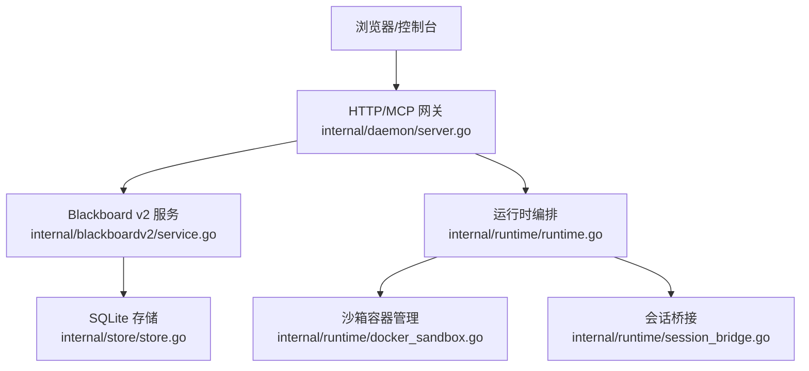
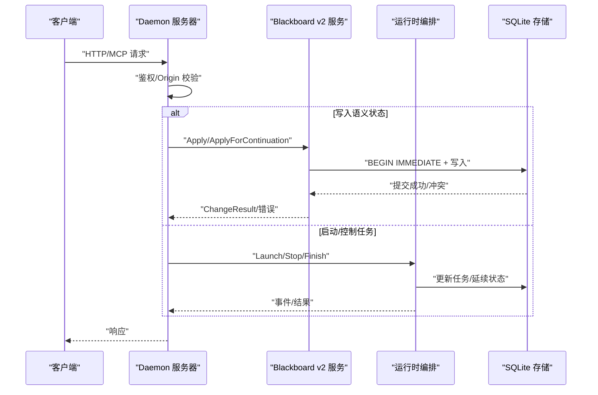
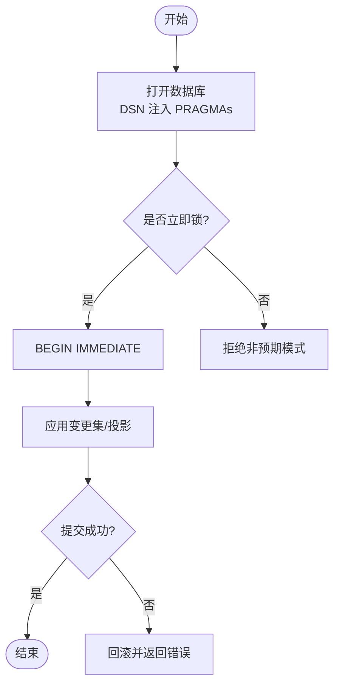
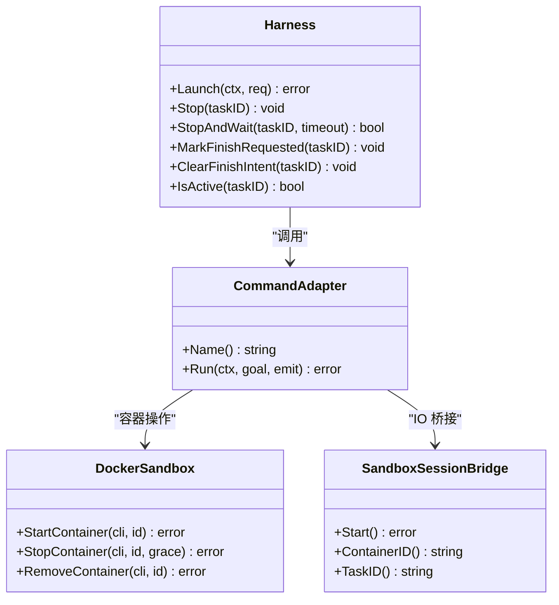
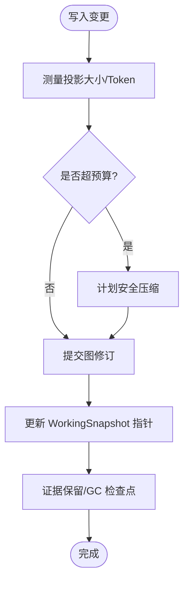
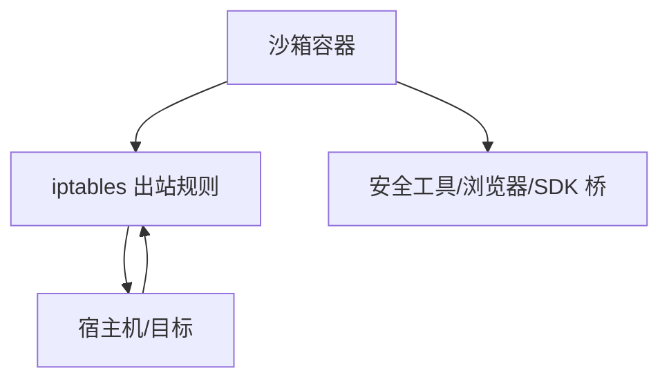
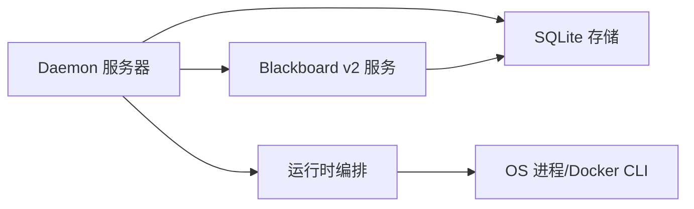

# 性能优化

<cite>
**本文引用的文件**   
- [README.md](file://README.md)
- [server.go](file://internal/daemon/server.go)
- [store.go](file://internal/store/store.go)
- [service.go](file://internal/blackboardv2/service.go)
- [runtime.go](file://internal/runtime/runtime.go)
- [docker_sandbox.go](file://internal/runtime/docker_sandbox.go)
- [session_bridge.go](file://internal/runtime/session_bridge.go)
- [blackboard-graph-storage.md](file://docs/specs/blackboard-graph-storage.md)
- [blackboard-tdd-acceptance-and-slices.md](file://docs/specs/blackboard-tdd-acceptance-and-slices.md)
- [Dockerfile](file://docker/pentest-sandbox/Dockerfile)
</cite>

## 目录
1. [简介](#简介)
2. [项目结构](#项目结构)
3. [核心组件](#核心组件)
4. [架构总览](#架构总览)
5. [详细组件分析](#详细组件分析)
6. [依赖关系分析](#依赖关系分析)
7. [性能考量](#性能考量)
8. [故障排查指南](#故障排查指南)
9. [结论](#结论)
10. [附录](#附录)

## 简介
本指南聚焦于 CyberPenda 的性能优化，围绕数据库查询优化、并发处理调优与内存使用优化展开，并结合沙箱资源限制、任务并行执行与缓存策略配置提供生产环境调优参数、监控指标阈值与扩展性建议。CyberPenda 采用本地优先的架构：Go 守护进程（pentestd）作为控制平面，React 仪表盘为交互面，Sandbox/Host 运行时负责隔离执行，Blackboard v2 作为持久化语义记忆层。

## 项目结构
- 控制平面：Daemon HTTP/MCP 路由、鉴权、任务编排、Provider Session 工厂、健康检查等
- 存储层：SQLite（WAL、PRAGMA、单写者、事务锁）
- 语义服务：Blackboard v2 变更批处理、投影、快照、证据保留与健康诊断
- 运行期：Runtime Harness + Adapter（命令式/容器式），Docker/Podman 沙箱桥接
- 前端：React/Vite 仪表盘（构建产物嵌入 daemon）

图表来源
- [server.go:587-643](file://internal/daemon/server.go#L587-L643)
- [service.go:644-680](file://internal/blackboardv2/service.go#L644-L680)
- [runtime.go:75-179](file://internal/runtime/runtime.go#L75-L179)
- [docker_sandbox.go:157-210](file://internal/runtime/docker_sandbox.go#L157-L210)
- [session_bridge.go:313-362](file://internal/runtime/session_bridge.go#L313-L362)
- [store.go:103-139](file://internal/store/store.go#L103-L139)

章节来源
- [README.md:11-24](file://README.md#L11-L24)
- [README.md:110-126](file://README.md#L110-L126)

## 核心组件
- Daemon 服务器：统一入口、鉴权、路由、健康探针、静态资源与 MCP 注册
- Blackboard v2 服务：变更批处理、幂等键、工作区快照、证据保留、健康度量
- Store（SQLite）：连接池限制、PRAGMA 设置、迁移校验、权限收紧
- Runtime Harness：生命周期管理、事件记录、停止/完成意图、元数据回写
- 沙箱与桥接：容器创建/启动/清理、标准 IO 流、诊断通道

章节来源
- [server.go:38-118](file://internal/daemon/server.go#L38-L118)
- [service.go:40-70](file://internal/blackboardv2/service.go#L40-L70)
- [store.go:103-139](file://internal/store/store.go#L103-L139)
- [runtime.go:46-179](file://internal/runtime/runtime.go#L46-L179)
- [docker_sandbox.go:157-210](file://internal/runtime/docker_sandbox.go#L157-L210)
- [session_bridge.go:313-362](file://internal/runtime/session_bridge.go#L313-L362)

## 架构总览
下图展示请求从 HTTP/MCP 进入，经 Daemon 路由到 Blackboard v2 或 Runtime，最终落盘至 SQLite 的端到端路径。

图表来源
- [server.go:383-411](file://internal/daemon/server.go#L383-L411)
- [service.go:644-680](file://internal/blackboardv2/service.go#L644-L680)
- [runtime.go:75-179](file://internal/runtime/runtime.go#L75-L179)
- [store.go:711-733](file://internal/store/store.go#L711-L733)

## 详细组件分析

### 数据库查询优化（SQLite 与 PRAGMA）
- 连接与事务
  - 单进程单写者：SetMaxOpenConns(1)、SetMaxIdleConns(1)，避免连接竞争
  - 事务锁：_txlock=immediate，确保 BEGIN IMMEDIATE 原子获取写锁
  - WAL 模式：journal_mode(WAL)，提升并发读能力
  - 一致性：foreign_keys(1)、synchronous(FULL)、busy_timeout(5000)
- 迁移与校验
  - 迁移历史校验、版本指纹、不可变只读检查
  - 权限收紧：数据库及 WAL/SHM 文件权限设为 0o600
- 性能要点
  - 批量写入：通过 ChangeBatch 合并多次变更，减少事务往返
  - 幂等键：idempotency_key 去重，避免重复计算与写入
  - 投影与快照：按需生成，避免全量重建；失败时标记 dirty/unknown 并延迟修复

图表来源
- [store.go:103-139](file://internal/store/store.go#L103-L139)
- [store.go:711-733](file://internal/store/store.go#L711-L733)
- [blackboard-graph-storage.md:105-124](file://docs/specs/blackboard-graph-storage.md#L105-L124)

章节来源
- [store.go:103-139](file://internal/store/store.go#L103-L139)
- [store.go:711-733](file://internal/store/store.go#L711-L733)
- [blackboard-graph-storage.md:105-124](file://docs/specs/blackboard-graph-storage.md#L105-L124)

### 并发处理调优（Daemon、Runtime、Bridge）
- Daemon 并发
  - 单 goroutine 主循环 + ServeMux 分发；鉴权与 Origin 校验前置，降低无效负载
  - 健康探针公开路径，避免鉴权开销
- Runtime Harness
  - 每个 Task 一个 activeRun，cancel 驱动中断；StopAndWait 带超时确认
  - Finish 意图与 Stop 互斥，避免竞态导致的状态不一致
- Provider Bridge 与沙箱
  - 多 goroutine 复制输入输出流；容器 start/stop/cleanup 在独立协程中等待
  - 诊断通道与日志分离，避免阻塞主 IO

图表来源
- [runtime.go:75-179](file://internal/runtime/runtime.go#L75-L179)
- [docker_sandbox.go:157-210](file://internal/runtime/docker_sandbox.go#L157-L210)
- [session_bridge.go:313-362](file://internal/runtime/session_bridge.go#L313-L362)

章节来源
- [server.go:383-411](file://internal/daemon/server.go#L383-L411)
- [runtime.go:75-179](file://internal/runtime/runtime.go#L75-L179)
- [docker_sandbox.go:157-210](file://internal/runtime/docker_sandbox.go#L157-L210)
- [session_bridge.go:313-362](file://internal/runtime/session_bridge.go#L313-L362)

### 内存使用优化（投影、快照、证据）
- 投影预算与压缩
  - 按 token/字节估算预算，超过阈值触发安全压缩；失败仍提交图修订，标记 dirty/unknown
  - 恢复保持单一快照 hold，避免并发破坏
- 工作区快照
  - WorkingSnapshot 指向 .pentest/blackboard.json，仅替换指针，避免大对象拷贝
- 证据保留
  - 受控根目录、幂等请求、GC 断点续传；失败后恢复同步不改变图状态

图表来源
- [service.go:644-680](file://internal/blackboardv2/service.go#L644-L680)
- [blackboard-tdd-acceptance-and-slices.md:425-453](file://docs/specs/blackboard-tdd-acceptance-and-slices.md#L425-L453)

章节来源
- [service.go:644-680](file://internal/blackboardv2/service.go#L644-L680)
- [blackboard-tdd-acceptance-and-slices.md:425-453](file://docs/specs/blackboard-tdd-acceptance-and-slices.md#L425-L453)

### 沙箱资源限制与网络边界
- 镜像与工具链
  - 安装必要系统工具（iptables/util-linux），启用 host-proxy-only 入口脚本
  - 环境变量控制非必需流量与沙箱标识
- 网络与 egress
  - 默认桥接允许访问宿主机，但通过容器内 iptables 强制出站边界
  - 宿主内部地址白名单（host.docker.internal）用于 MCP 通信

图表来源
- [Dockerfile:124-144](file://docker/pentest-sandbox/Dockerfile#L124-L144)

章节来源
- [Dockerfile:124-144](file://docker/pentest-sandbox/Dockerfile#L124-L144)

### 任务并行执行与调度
- 任务模型
  - 每个 Task 对应一次 Run，Harness 维护 active map，支持并发控制与取消
- 继续与切换
  - RebindContinuation 在不重启进程的情况下切换 provider turn
  - Finish 意图与 Stop 互斥，保证唯一终态拥有者
- 事件与转录
  - 标准化事件写入任务时间线，供 UI 与报告消费

章节来源
- [runtime.go:271-284](file://internal/runtime/runtime.go#L271-284)
- [runtime.go:191-232](file://internal/runtime/runtime.go#L191-L232)

### 缓存策略配置（工作区快照与投影）
- 工作区快照
  - 通过 WorkingSnapshot.Path 指向磁盘文件，避免内存拷贝
  - 投递后替换指针，后续读取走普通 detail 接口
- 投影缓存
  - 预算超限触发压缩；投影失败不阻断图提交，后续再测修复

章节来源
- [service.go:644-680](file://internal/blackboardv2/service.go#L644-L680)
- [blackboard-tdd-acceptance-and-slices.md:425-453](file://docs/specs/blackboard-tdd-acceptance-and-slices.md#L425-L453)

## 依赖关系分析
- Daemon 依赖 Blackboard v2、Store、Runtime、Skills、Model Providers、Extensions
- Blackboard v2 依赖 Store（SQLite）与文件系统（证据根）
- Runtime 依赖 OS exec 与 Docker/Podman CLI，并通过桥接进行 IO 转发

图表来源
- [server.go:38-118](file://internal/daemon/server.go#L38-L118)
- [service.go:40-70](file://internal/blackboardv2/service.go#L40-L70)
- [runtime.go:46-179](file://internal/runtime/runtime.go#L46-L179)

章节来源
- [server.go:38-118](file://internal/daemon/server.go#L38-L118)
- [service.go:40-70](file://internal/blackboardv2/service.go#L40-L70)
- [runtime.go:46-179](file://internal/runtime/runtime.go#L46-L179)

## 性能考量

### 数据库查询优化
- 使用 WAL 与 busy_timeout 提高吞吐与抗阻塞能力
- 所有写路径使用 BEGIN IMMEDIATE，避免乐观锁冲突导致的重试风暴
- 批量变更与幂等键减少重复写入与计算
- 投影失败不阻断提交，延迟修复避免热点阻塞

章节来源
- [store.go:711-733](file://internal/store/store.go#L711-L733)
- [blackboard-graph-storage.md:105-124](file://docs/specs/blackboard-graph-storage.md#L105-L124)
- [service.go:644-680](file://internal/blackboardv2/service.go#L644-L680)

### 并发处理调优
- 控制平面：最小化鉴权与 Origin 校验成本，公开健康路径
- 运行期：Harness 使用 cancel 快速中断，StopAndWait 带超时确认
- 桥接：IO 复制与诊断通道分离，避免阻塞主流程

章节来源
- [server.go:383-411](file://internal/daemon/server.go#L383-L411)
- [runtime.go:245-269](file://internal/runtime/runtime.go#L245-L269)
- [session_bridge.go:313-362](file://internal/runtime/session_bridge.go#L313-L362)

### 内存使用优化
- 投影预算与压缩：按 token/字节估算，超限安全压缩
- 工作区快照：指针替换，避免大对象拷贝
- 证据保留：幂等请求与 GC 检查点，失败可恢复

章节来源
- [service.go:644-680](file://internal/blackboardv2/service.go#L644-L680)
- [blackboard-tdd-acceptance-and-slices.md:425-453](file://docs/specs/blackboard-tdd-acceptance-and-slices.md#L425-L453)

### 沙箱资源限制
- 镜像精简：仅安装必要工具，禁用非必要流量
- 网络边界：iptables 限制出站，宿主白名单仅限 MCP 通信

章节来源
- [Dockerfile:124-144](file://docker/pentest-sandbox/Dockerfile#L124-L144)

### 任务并行执行
- 单 Task 单 Run，Harness 维护活跃集合，支持并发控制与取消
- Finish 意图与 Stop 互斥，避免竞态

章节来源
- [runtime.go:75-179](file://internal/runtime/runtime.go#L75-L179)
- [runtime.go:191-232](file://internal/runtime/runtime.go#L191-L232)

### 缓存策略配置
- 工作区快照：WorkingSnapshot.Path 指向磁盘文件
- 投影缓存：失败标记 dirty/unknown，后续再测修复

章节来源
- [service.go:644-680](file://internal/blackboardv2/service.go#L644-L680)
- [blackboard-tdd-acceptance-and-slices.md:425-453](file://docs/specs/blackboard-tdd-acceptance-and-slices.md#L425-L453)

### 基准测试与瓶颈分析
- 基准建议
  - 写入吞吐：以 ChangeBatch 为单位压测，观察提交耗时与冲突率
  - 投影重建：模拟超大知识体，验证压缩与再测路径
  - 并发任务：多 Task 并发 Launch/Stop，评估 Harness 与容器生命周期开销
- 瓶颈定位
  - SQLite：关注 WAL 写入、PRAGMA 生效、事务锁等待
  - Runtime：关注容器启动/停止耗时、IO 复制延迟
  - 投影：关注预算阈值、压缩成功率、快照替换频率

[本节为通用指导，无需源码引用]

### 容量规划指导
- 存储
  - 根据项目规模预估图节点/边数量，结合投影预算设定阈值
  - 定期 WAL 检查点与 VACUUM，控制文件大小
- 计算
  - 根据并发任务数与容器资源配额，规划 CPU/内存上限
  - 沙箱镜像体积与工具链影响启动时间，需权衡功能与性能

[本节为通用指导，无需源码引用]

### 生产环境调优参数
- Daemon
  - 监听地址与鉴权：非回环绑定必须设置 PENTEST_AUTH_TOKEN
  - 插件与扩展目录：限定可信目录，减少加载开销
- 运行时
  - 容器 CLI 与镜像：PENTEST_CONTAINER_CLI、PENTEST_SANDBOX_IMAGE
  - 运行时根与工件根：PENTEST_RUNTIME_ROOT、PENTEST_DB
- 存储
  - 文件权限：数据库与 WAL/SHM 自动收紧至 0o600

章节来源
- [README.md:110-126](file://README.md#L110-L126)
- [server.go:174-185](file://internal/daemon/server.go#L174-L185)
- [store.go:141-158](file://internal/store/store.go#L141-L158)

### 监控指标阈值
- 数据库
  - WAL 大小增长速率、VACUUM 间隔、事务锁等待时长
- 运行时
  - 容器启动/停止耗时、IO 复制延迟、诊断通道积压
- 投影与快照
  - 预算命中率、压缩成功率、快照替换失败次数

[本节为通用指导，无需源码引用]

### 扩展性建议
- 水平扩展
  - 当前设计为单写者，适合单机部署；如需多实例，需引入外部协调与分片
- 插件与扩展
  - 通过 runtime plugin 与 extension 机制扩展能力，避免修改核心路径
- 前端与后端解耦
  - 静态资源与 API 分离，便于 CDN 与反向代理优化

[本节为通用指导，无需源码引用]

## 故障排查指南
- 启动失败
  - 非回环绑定未设置鉴权：检查 PENTEST_AUTH_TOKEN
  - 旧版数据库：提示需离线迁移后再启动
- 运行时异常
  - 容器启动/停止失败：查看生命周期事件与错误码
  - 会话桥接 IO 缺失：确认 stdin/stdout 可用
- 黑屏/无输出
  - 检查 Origin 校验与鉴权头；确认 /health 可达

章节来源
- [server.go:174-185](file://internal/daemon/server.go#L174-L185)
- [docker_sandbox.go:157-210](file://internal/runtime/docker_sandbox.go#L157-L210)
- [session_bridge.go:313-362](file://internal/runtime/session_bridge.go#L313-L362)

## 结论
通过对 SQLite 事务与 PRAGMA 的严格约束、Harness 的并发控制与取消语义、投影与快照的内存优化，以及沙箱网络边界的强化，CyberPenda 在本地优先场景下实现了高可靠与高性能的执行环境。生产部署应结合容量规划与监控指标，持续优化投影预算、压缩策略与容器生命周期，以获得稳定可扩展的渗透测试体验。

## 附录
- 常用 Make 目标与命令行参数参考 README
- 文档索引与 ADR 参见 docs/ 目录

章节来源
- [README.md:94-108](file://README.md#L94-L108)
- [README.md:163-168](file://README.md#L163-L168)