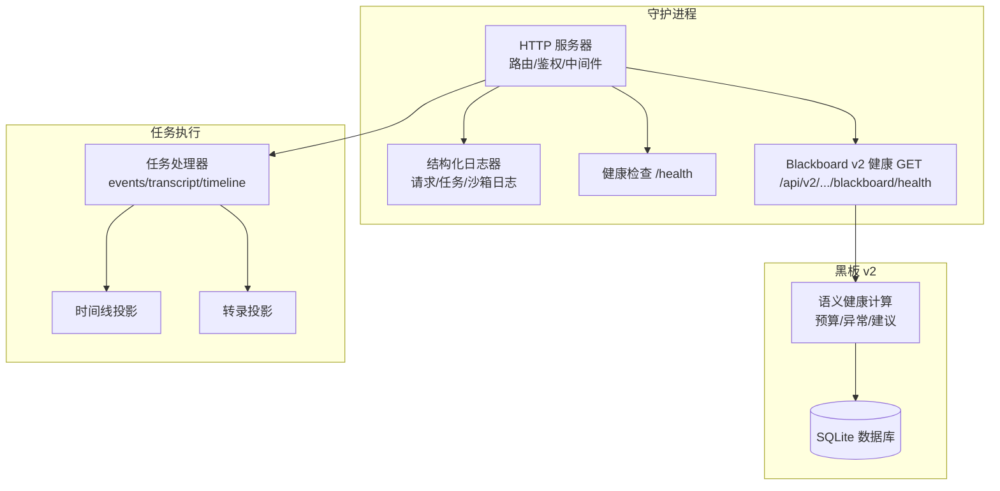
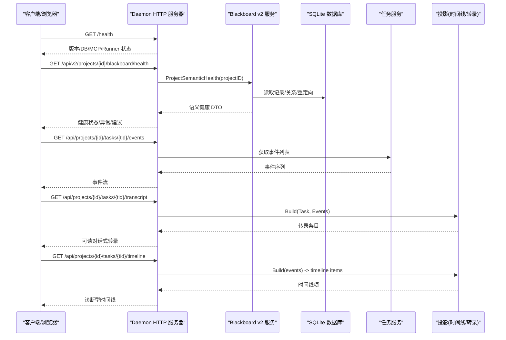
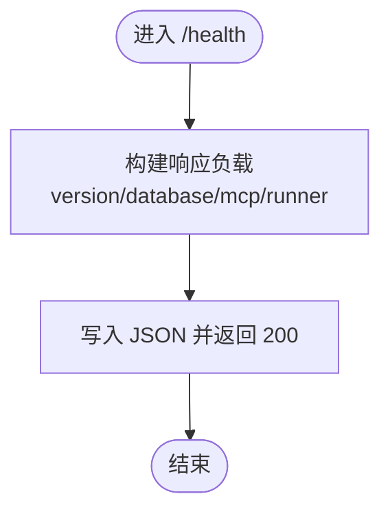
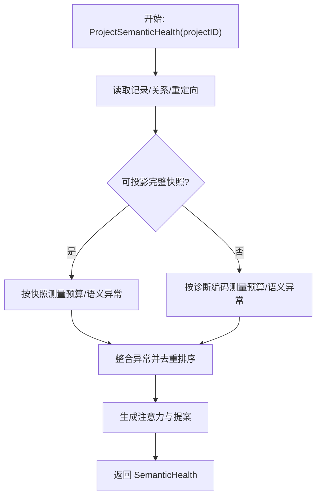
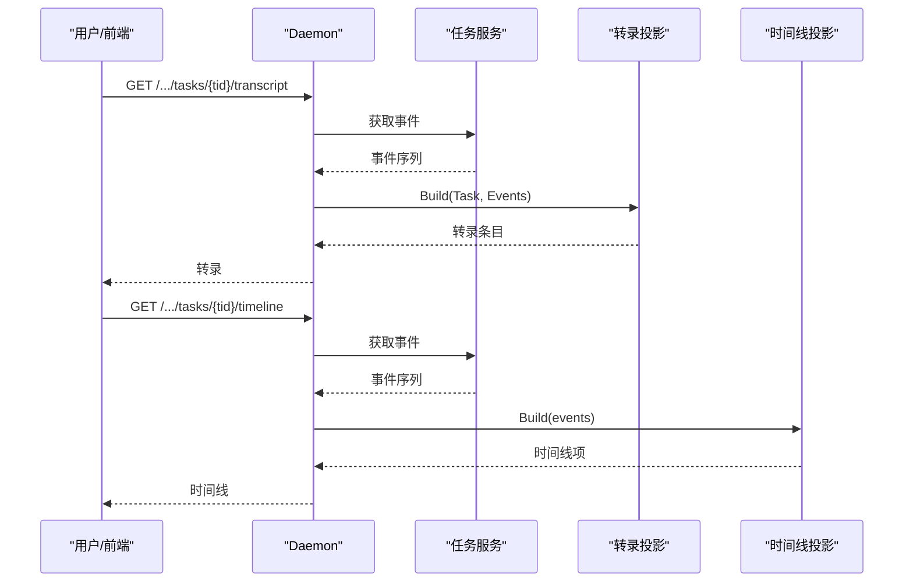
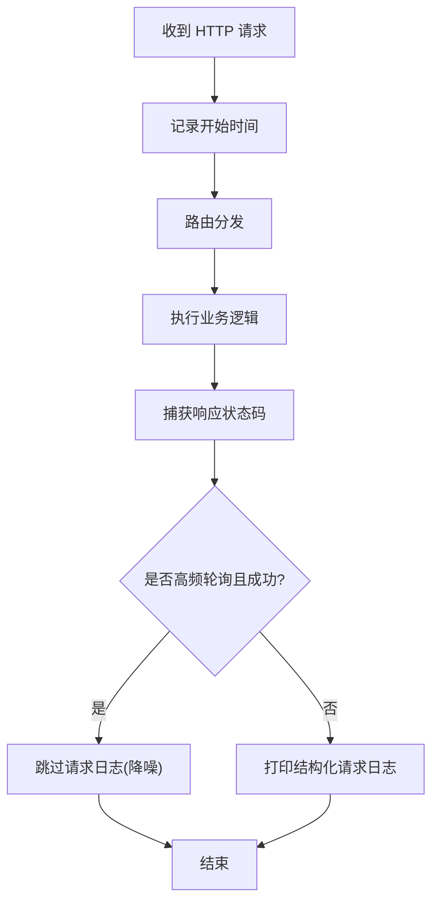
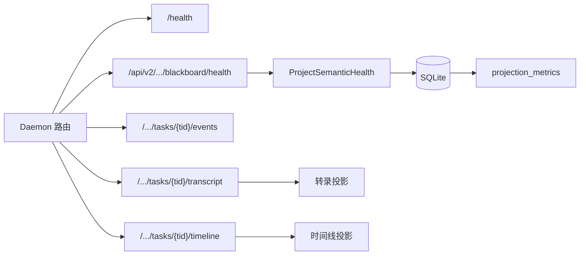

# 监控与日志

<cite>
**本文引用的文件**   
- [server.go](file://internal/daemon/server.go)
- [logging.go](file://internal/daemon/logging.go)
- [blackboard_v2_http.go](file://internal/daemon/blackboard_v2_http.go)
- [health.go](file://internal/blackboardv2/health.go)
- [timeline.go](file://internal/timeline/timeline.go)
- [transcript.go](file://internal/transcript/transcript.go)
- [task_handlers.go](file://internal/daemon/task_handlers.go)
- [store.go](file://internal/store/store.go)
</cite>

## 目录
1. [简介](#简介)
2. [项目结构](#项目结构)
3. [核心组件](#核心组件)
4. [架构总览](#架构总览)
5. [详细组件分析](#详细组件分析)
6. [依赖关系分析](#依赖关系分析)
7. [性能考量](#性能考量)
8. [故障诊断指南](#故障诊断指南)
9. [结论](#结论)
10. [附录](#附录)

## 简介
本指南聚焦于系统的监控与日志能力，覆盖以下主题：
- 内置健康检查端点与语义健康（Blackboard v2）
- 运行时活动监控（任务事件、时间线、转录）
- 结构化日志配置与降噪策略
- 时间线追踪与转录记录
- 性能指标收集与存储层度量
- Prometheus 集成建议、日志聚合方案与告警规则配置
- 故障诊断工具使用方法与性能分析技巧

## 项目结构
与监控和日志相关的核心代码分布在 Daemon HTTP 服务层、Blackboard v2 健康子系统、以及任务事件的时间线与转录投影模块。

图表来源
- [server.go:587-643](file://internal/daemon/server.go#L587-L643)
- [blackboard_v2_http.go:29-46](file://internal/daemon/blackboard_v2_http.go#L29-L46)
- [health.go:84-183](file://internal/blackboardv2/health.go#L84-L183)
- [task_handlers.go:617-651](file://internal/daemon/task_handlers.go#L617-L651)
- [timeline.go:1-76](file://internal/timeline/timeline.go#L1-L76)
- [transcript.go:1-82](file://internal/transcript/transcript.go#L1-L82)

章节来源
- [server.go:587-643](file://internal/daemon/server.go#L587-L643)
- [blackboard_v2_http.go:29-46](file://internal/daemon/blackboard_v2_http.go#L29-L46)

## 核心组件
- 健康检查
  - 进程级健康：GET /health，返回版本、数据库状态、MCP 路径、运行器信息。
  - 语义健康：GET /api/v2/projects/{id}/blackboard/health，返回预算、异常与建议。
- 运行时活动监控
  - 任务事件流：GET /api/projects/{id}/tasks/{task_id}/events
  - 可读转录：GET /api/projects/{id}/tasks/{task_id}/transcript
  - 诊断时间线：GET /api/projects/{id}/tasks/{task_id}/timeline
- 结构化日志
  - 请求日志（含耗时）、任务生命周期日志、沙箱事件日志、自定义参数冲突日志等，支持对高频轮询的 GET 进行降噪。

章节来源
- [server.go:645-674](file://internal/daemon/server.go#L645-L674)
- [blackboard_v2_http.go:144-159](file://internal/daemon/blackboard_v2_http.go#L144-L159)
- [server.go:587-643](file://internal/daemon/server.go#L587-L643)
- [logging.go:16-87](file://internal/daemon/logging.go#L16-L87)

## 架构总览
下图展示从客户端到后端各层的调用链路与数据流向，包括健康检查、语义健康、任务事件与转录/时间线投影。

图表来源
- [server.go:645-674](file://internal/daemon/server.go#L645-L674)
- [blackboard_v2_http.go:144-159](file://internal/daemon/blackboard_v2_http.go#L144-L159)
- [health.go:84-183](file://internal/blackboardv2/health.go#L84-L183)
- [server.go:587-643](file://internal/daemon/server.go#L587-L643)
- [timeline.go:29-76](file://internal/timeline/timeline.go#L29-L76)
- [transcript.go:49-82](file://internal/transcript/transcript.go#L49-L82)

## 详细组件分析

### 健康检查端点
- 进程级健康
  - 路径：GET /health
  - 功能：返回版本、数据库状态、MCP 路径、运行器根目录、沙箱镜像与容器 CLI 信息。
  - 鉴权：公开访问，无需令牌。
- 语义健康（Blackboard v2）
  - 路径：GET /api/v2/projects/{id}/blackboard/health
  - 功能：基于当前项目语义状态生成健康 DTO，包含预算测量、异常与建议；支持 ETag/If-None-Match 条件响应。
  - 鉴权：遵循 Blackboard v2 认证模型（操作者或受信任 Continuation）。

图表来源
- [server.go:645-674](file://internal/daemon/server.go#L645-L674)

章节来源
- [server.go:645-674](file://internal/daemon/server.go#L645-L674)
- [blackboard_v2_http.go:144-159](file://internal/daemon/blackboard_v2_http.go#L144-L159)

### 语义健康（Blackboard v2）
- 输入：projectID
- 处理：
  - 读取记录、关系与键重定向
  - 尝试投影 Runtime Snapshot；若不可用则回退为“健康安全”的诊断编码
  - 计算注意力预算（字节/估计 token/阈值状态）
  - 检测关系完整性、证据完整性、目标/尝试悬空、矛盾未解决等异常
  - 生成建议（如启动审批型 Reason Task 进行合并）
- 输出：schema/revision/status/attention/anomalies/proposals

图表来源
- [health.go:84-183](file://internal/blackboardv2/health.go#L84-L183)
- [health.go:335-391](file://internal/blackboardv2/health.go#L335-L391)
- [health.go:404-431](file://internal/blackboardv2/health.go#L404-L431)
- [health.go:433-621](file://internal/blackboardv2/health.go#L433-L621)
- [health.go:623-685](file://internal/blackboardv2/health.go#L623-L685)
- [health.go:713-791](file://internal/blackboardv2/health.go#L713-L791)

章节来源
- [health.go:84-183](file://internal/blackboardv2/health.go#L84-L183)
- [health.go:335-391](file://internal/blackboardv2/health.go#L335-L391)
- [health.go:404-431](file://internal/blackboardv2/health.go#L404-L431)
- [health.go:433-621](file://internal/blackboardv2/health.go#L433-L621)
- [health.go:623-685](file://internal/blackboardv2/health.go#L623-L685)
- [health.go:713-791](file://internal/blackboardv2/health.go#L713-L791)

### 运行时活动监控：事件、转录与时间线
- 任务事件
  - 路径：GET /api/projects/{id}/tasks/{task_id}/events
  - 用途：原始事件流，用于调试与回放。
- 转录（Conversation）
  - 路径：GET /api/projects/{id}/tasks/{task_id}/transcript
  - 行为：将任务目标、生命周期边界、导航指令与运行时输出投影为可读对话条目；未知输出以折叠形式保留。
- 时间线（Timeline）
  - 路径：GET /api/projects/{id}/tasks/{task_id}/timeline
  - 行为：将事件聚合成多通道时间线项（思考、工具调用/结果、文本、错误、生命周期、导航）。

图表来源
- [server.go:587-643](file://internal/daemon/server.go#L587-L643)
- [transcript.go:49-82](file://internal/transcript/transcript.go#L49-L82)
- [timeline.go:29-76](file://internal/timeline/timeline.go#L29-L76)

章节来源
- [server.go:587-643](file://internal/daemon/server.go#L587-L643)
- [transcript.go:49-82](file://internal/transcript/transcript.go#L49-L82)
- [timeline.go:29-76](file://internal/timeline/timeline.go#L29-L76)

### 结构化日志与降噪
- 请求日志
  - 记录方法、路径、状态码与耗时；对 UI 高频轮询的 GET 成功请求进行抑制，避免噪音淹没信号。
- 任务日志
  - 生命周期阶段、启动阶段、失败原因等，目标文本截断以避免回显敏感内容。
- 沙箱日志
  - 容器/主机进程事件，字段经脱敏后记录。
- 自定义参数冲突日志
  - 记录冲突的参数/字段与脱敏后的 custom_args，便于定位配置问题。

图表来源
- [logging.go:16-87](file://internal/daemon/logging.go#L16-L87)
- [logging.go:89-114](file://internal/daemon/logging.go#L89-L114)
- [logging.go:116-135](file://internal/daemon/logging.go#L116-L135)
- [logging.go:137-170](file://internal/daemon/logging.go#L137-L170)

章节来源
- [logging.go:16-87](file://internal/daemon/logging.go#L16-L87)
- [logging.go:89-114](file://internal/daemon/logging.go#L89-L114)
- [logging.go:116-135](file://internal/daemon/logging.go#L116-L135)
- [logging.go:137-170](file://internal/daemon/logging.go#L137-L170)

## 依赖关系分析
- 健康检查与语义健康
  - Daemon 暴露 /health 与 Blackboard v2 health 路由；后者调用 Service.ProjectSemanticHealth，读取数据库中的记录、关系与重定向表，计算异常与建议。
- 任务监控
  - 任务处理器提供 events/transcript/timeline 三个视图；转录与时间线分别基于事件序列进行不同粒度的投影。
- 存储层度量
  - 存储层维护投影度量表，包含节点/边计数、精确 UTF-8 字节、估计 token、投影哈希、预算状态与测量时间戳等。

图表来源
- [server.go:587-643](file://internal/daemon/server.go#L587-L643)
- [blackboard_v2_http.go:29-46](file://internal/daemon/blackboard_v2_http.go#L29-L46)
- [health.go:84-183](file://internal/blackboardv2/health.go#L84-L183)
- [store.go:2426-2453](file://internal/store/store.go#L2426-L2453)

章节来源
- [server.go:587-643](file://internal/daemon/server.go#L587-L643)
- [blackboard_v2_http.go:29-46](file://internal/daemon/blackboard_v2_http.go#L29-L46)
- [health.go:84-183](file://internal/blackboardv2/health.go#L84-L183)
- [store.go:2426-2453](file://internal/store/store.go#L2426-L2453)

## 性能考量
- 语义健康
  - 优先使用完整快照测量；当快照不可用时回退为健康安全的诊断编码，确保不阻断启动与健康查询。
- 转录与时间线
  - 转录对未知输出采用折叠保留，避免丢失历史上下文；时间线对纯工具行进行过滤以减少噪声。
- 存储层度量
  - 通过 projection_metrics 表缓存关键指标（字节、token、哈希、预算状态），降低重复计算开销。

章节来源
- [health.go:123-143](file://internal/blackboardv2/health.go#L123-L143)
- [timeline.go:61-76](file://internal/timeline/timeline.go#L61-L76)
- [store.go:2426-2453](file://internal/store/store.go#L2426-L2453)

## 故障诊断指南
- 快速自检
  - 调用 /health 确认进程、数据库、MCP 与运行器状态。
  - 调用语义健康接口查看 attention 预算与 anomalies，关注 critical/warning 级别异常。
- 任务级排查
  - 使用 events 查看原始事件，结合 transcript 获得可读对话，timeline 辅助定位工具调用与错误。
- 日志定位
  - 关注结构化请求日志（含耗时）、任务生命周期日志、沙箱事件日志与自定义参数冲突日志。
  - 利用降噪策略理解真实信号，避免被高频轮询日志干扰。
- 常见异常
  - 关系完整性异常（悬挂/无效/循环）
  - 证据完整性异常（缺失或校验失败）
  - 注意力预算超阈（警告/必需合并）
  - 存储繁忙（重试头提示）

章节来源
- [server.go:645-674](file://internal/daemon/server.go#L645-L674)
- [blackboard_v2_http.go:144-159](file://internal/daemon/blackboard_v2_http.go#L144-L159)
- [health.go:335-391](file://internal/blackboardv2/health.go#L335-L391)
- [health.go:404-431](file://internal/blackboardv2/health.go#L404-L431)
- [health.go:623-685](file://internal/blackboardv2/health.go#L623-L685)
- [logging.go:16-87](file://internal/daemon/logging.go#L16-L87)

## 结论
系统提供了完善的监控与日志能力：进程级健康、语义健康、任务事件与可读转录/时间线、结构化日志与降噪策略，以及存储层度量支撑。通过这些能力，运维与开发者可以快速定位问题、评估系统健康度并进行性能优化。

## 附录

### Prometheus 集成建议
- 指标来源
  - 存储层度量：可从 projection_metrics 表中导出关键指标（字节、估计 token、预算状态、测量时间戳等）。
  - 应用层指标：可在 Daemon 中新增自定义指标（例如请求延迟直方图、健康检查成功率、语义健康异常计数等），并通过标准 /metrics 端点暴露。
- 采集方式
  - 在宿主机部署 Prometheus，配置 job 抓取本地 /metrics。
  - 对于 SQLite 指标，可通过轻量 exporter 定期读取 projection_metrics 并转换为 Prometheus 格式。
- 注意事项
  - 仅暴露必要指标，避免泄露敏感信息。
  - 合理设置 scrape 间隔与指标基数，防止标签爆炸。

[本节为通用实践建议，不直接分析具体源码文件]

### 日志聚合方案
- 本地开发
  - 使用默认 logger，输出至控制台，便于 make dev 时观察。
- 生产环境
  - 将 stdout/stderr 接入集中式日志系统（如 Filebeat + Elasticsearch/Loki）。
  - 保持结构化字段一致，便于检索与告警。
  - 注意脱敏与降噪，避免泄露敏感信息与噪音淹没。

[本节为通用实践建议，不直接分析具体源码文件]

### 告警规则配置（示例思路）
- 健康检查
  - /health 连续失败 N 次触发严重告警。
- 语义健康
  - attention.state=required 持续超过阈值时间触发高优先级告警。
  - anomalies 中出现 critical 级别异常立即告警。
- 任务监控
  - 任务长时间无新事件（心跳超时）告警。
  - 转录/时间线出现 error 类型条目数量突增告警。
- 存储层
  - projection_metrics 中 estimated_tokens 超过阈值告警。
  - storage_busy 错误率升高告警。

[本节为通用实践建议，不直接分析具体源码文件]