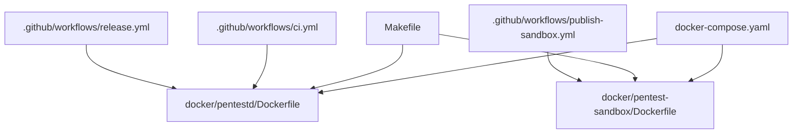
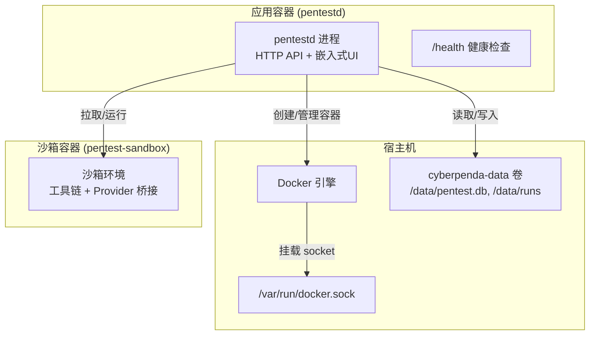
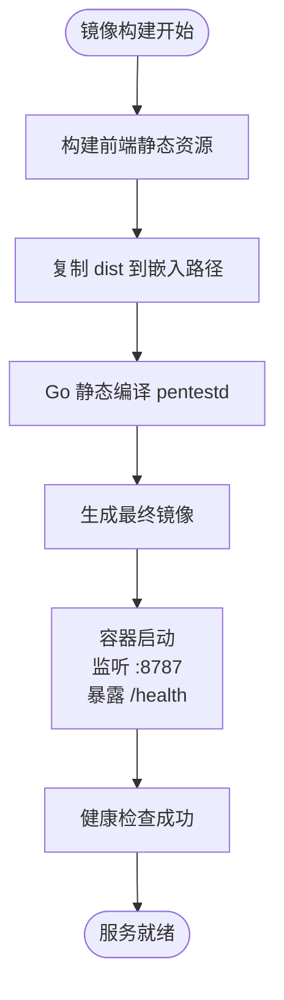
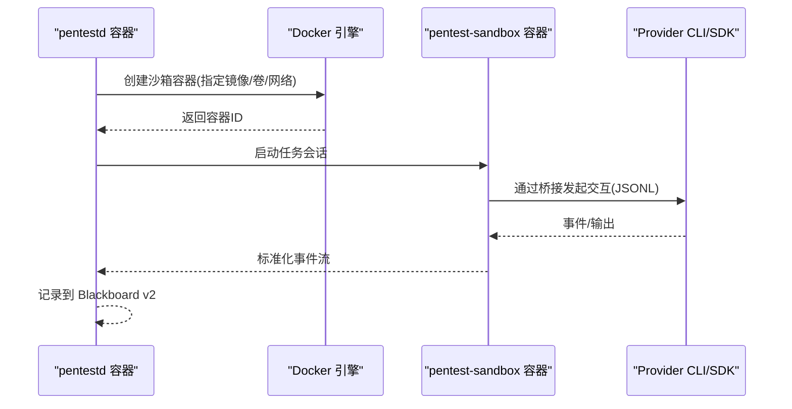
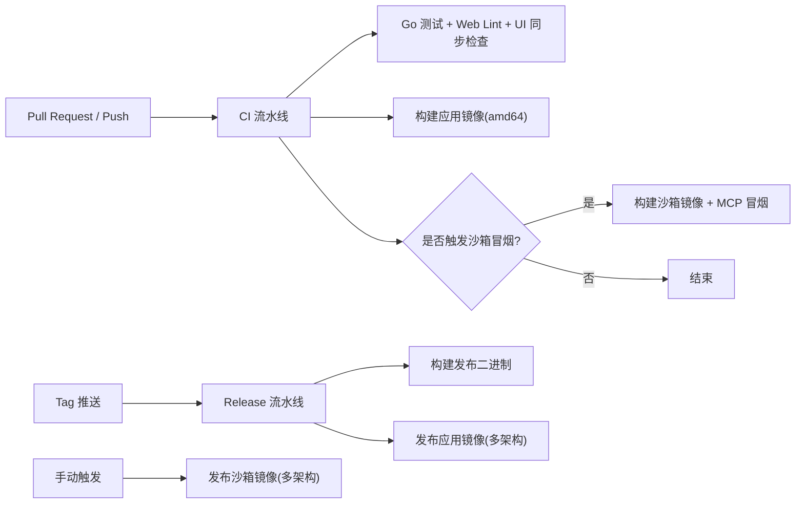
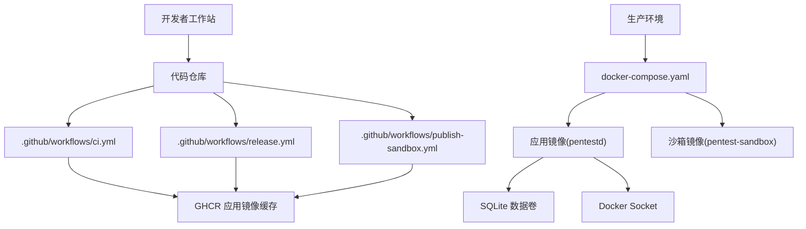

# 部署与运维

<cite>
**本文引用的文件**   
- [README.md](file://README.md)
- [docker-compose.yaml](file://docker-compose.yaml)
- [docker/pentestd/Dockerfile](file://docker/pentestd/Dockerfile)
- [docker/pentest-sandbox/Dockerfile](file://docker/pentest-sandbox/Dockerfile)
- [Makefile](file://Makefile)
- [.github/workflows/ci.yml](file://.github/workflows/ci.yml)
- [.github/workflows/release.yml](file://.github/workflows/release.yml)
- [.github/workflows/publish-sandbox.yml](file://.github/workflows/publish-sandbox.yml)
</cite>

## 目录
1. [简介](#简介)
2. [项目结构](#项目结构)
3. [核心组件](#核心组件)
4. [架构总览](#架构总览)
5. [详细组件分析](#详细组件分析)
6. [依赖关系分析](#依赖关系分析)
7. [性能考虑](#性能考虑)
8. [故障排查指南](#故障排查指南)
9. [结论](#结论)
10. [附录](#附录)

## 简介
本指南聚焦于生产环境部署与运维，覆盖以下主题：
- 生产环境部署方案（Docker Compose、镜像构建与发布）
- Docker 容器化配置（应用镜像与沙箱镜像）
- Kubernetes 编排建议（基于现有 Compose 与镜像的迁移思路）
- 监控指标、日志收集、备份恢复与故障排查
- 性能调优、安全加固与容量规划
- 自动化部署脚本、CI/CD 集成与运维最佳实践

本项目为本地优先的渗透测试代理，包含 Go 守护进程、React 仪表盘、沙箱运行时与语义记忆平面。默认数据落盘 SQLite，任务运行目录与制品根路径可持久化。

## 项目结构
与部署和运维直接相关的顶层结构与关键文件如下：
- docker-compose.yaml：单节点快速部署与数据卷挂载、健康检查、端口绑定
- docker/pentestd/Dockerfile：应用镜像构建（前端静态资源嵌入 + Go 二进制）
- docker/pentest-sandbox/Dockerfile：沙箱镜像（Kali 基础镜像 + 工具链 + Provider 桥接）
- Makefile：开发、构建、测试与冒烟脚本入口
- .github/workflows：CI、Release、Sandbox 镜像发布流水线

图示来源
- [docker-compose.yaml:1-35](file://docker-compose.yaml#L1-L35)
- [docker/pentestd/Dockerfile:1-37](file://docker/pentestd/Dockerfile#L1-L37)
- [docker/pentest-sandbox/Dockerfile:1-145](file://docker/pentest-sandbox/Dockerfile#L1-L145)
- [Makefile:1-98](file://Makefile#L1-L98)
- [.github/workflows/ci.yml:1-94](file://.github/workflows/ci.yml#L1-L94)
- [.github/workflows/release.yml:1-102](file://.github/workflows/release.yml#L1-L102)
- [.github/workflows/publish-sandbox.yml:1-148](file://.github/workflows/publish-sandbox.yml#L1-L148)

章节来源
- [README.md:1-173](file://README.md#L1-L173)
- [docker-compose.yaml:1-35](file://docker-compose.yaml#L1-L35)
- [docker/pentestd/Dockerfile:1-37](file://docker/pentestd/Dockerfile#L1-L37)
- [docker/pentest-sandbox/Dockerfile:1-145](file://docker/pentest-sandbox/Dockerfile#L1-L145)
- [Makefile:1-98](file://Makefile#L1-L98)
- [.github/workflows/ci.yml:1-94](file://.github/workflows/ci.yml#L1-L94)
- [.github/workflows/release.yml:1-102](file://.github/workflows/release.yml#L1-L102)
- [.github/workflows/publish-sandbox.yml:1-148](file://.github/workflows/publish-sandbox.yml#L1-L148)

## 核心组件
- 应用镜像（pentestd）
  - 多阶段构建：Node 20 构建 React 前端并嵌入到 Go 二进制；Go 编译产物为静态二进制
  - 暴露 8787 端口，提供 /health 健康检查
  - 默认监听 0.0.0.0:8787，数据目录 /data
- 沙箱镜像（pentest-sandbox）
  - 基于 Kali Linux，预装大量安全工具与 Node/Python 工具链
  - 安装 Codex/Claude Code/Pi 等 Provider CLI，并提供非 PTY 协议桥接
  - 内置 agent-browser 与 Chromium，支持浏览器类任务
  - 提供 host-proxy-only 入口脚本用于仅宿主代理模式
- 编排与发布
  - docker-compose.yaml 定义服务、环境变量、数据卷、Docker Socket 挂载与健康检查
  - CI 构建应用镜像并验证 UI 同步；Release 生成多架构应用镜像；Sandbox 发布工作流聚合多架构 digest 生成清单

章节来源
- [docker/pentestd/Dockerfile:1-37](file://docker/pentestd/Dockerfile#L1-L37)
- [docker/pentest-sandbox/Dockerfile:1-145](file://docker/pentest-sandbox/Dockerfile#L1-L145)
- [docker-compose.yaml:1-35](file://docker-compose.yaml#L1-L35)
- [.github/workflows/ci.yml:1-94](file://.github/workflows/ci.yml#L1-L94)
- [.github/workflows/release.yml:1-102](file://.github/workflows/release.yml#L1-L102)
- [.github/workflows/publish-sandbox.yml:1-148](file://.github/workflows/publish-sandbox.yml#L1-L148)

## 架构总览
下图展示生产环境中的主要组件与交互关系：Compose 启动应用容器，应用通过 Docker Socket 调用宿主机 Docker 引擎创建沙箱容器执行任务；数据与运行态持久化在宿主机卷中。

图示来源
- [docker-compose.yaml:1-35](file://docker-compose.yaml#L1-L35)
- [docker/pentestd/Dockerfile:1-37](file://docker/pentestd/Dockerfile#L1-L37)
- [docker/pentest-sandbox/Dockerfile:1-145](file://docker/pentest-sandbox/Dockerfile#L1-L145)

## 详细组件分析

### 应用镜像构建与运行（pentestd）
- 构建流程
  - 使用 Node 20 构建前端静态资源，复制到 Go 源码嵌入路径
  - Go 静态编译，注入版本信息，输出 pentestd 二进制
- 运行参数与环境变量
  - 监听地址、数据库路径、运行时根目录、沙箱镜像名、容器 CLI、认证令牌等
  - 健康检查端点 /health
- 安全与隔离
  - 无特权运行（no-new-privileges），最小权限原则
  - 需要显式授权访问 Docker Socket

图示来源
- [docker/pentestd/Dockerfile:1-37](file://docker/pentestd/Dockerfile#L1-L37)
- [docker-compose.yaml:1-35](file://docker-compose.yaml#L1-L35)

章节来源
- [docker/pentestd/Dockerfile:1-37](file://docker/pentestd/Dockerfile#L1-L37)
- [docker-compose.yaml:1-35](file://docker-compose.yaml#L1-L35)
- [README.md:110-126](file://README.md#L110-L126)

### 沙箱镜像构建与运行（pentest-sandbox）
- 基础镜像与工具链
  - Kali Linux 基础镜像，安装 headless 套件、网络扫描、漏洞检测、密码破解等工具
  - 安装 Node/Python 生态工具，以及 Codex/Claude Code/Pi 等 Provider CLI
- Provider 桥接
  - 提供非 PTY JSONL 协议的 provider bridge，屏蔽交互式差异
  - Claude SDK Bridge 固定版本，减少外部依赖变更影响
- 浏览器能力
  - 安装 Chromium 与 agent-browser，配置可执行路径
- 宿主代理模式
  - 提供 host-proxy-only 入口脚本，限制出站流量边界

图示来源
- [docker/pentest-sandbox/Dockerfile:1-145](file://docker/pentest-sandbox/Dockerfile#L1-L145)
- [docker-compose.yaml:1-35](file://docker-compose.yaml#L1-L35)

章节来源
- [docker/pentest-sandbox/Dockerfile:1-145](file://docker/pentest-sandbox/Dockerfile#L1-L145)
- [docker-compose.yaml:1-35](file://docker-compose.yaml#L1-L35)

### 编排与发布（Compose、CI/CD）
- Docker Compose
  - 端口映射、环境变量注入、数据卷持久化、Docker Socket 挂载、健康检查
  - 要求设置 PENTEST_AUTH_TOKEN，非回环绑定需鉴权
- CI
  - 单元测试、前端 Lint、UI 嵌入一致性校验、应用镜像构建验证
  - 条件触发沙箱冒烟测试（MCP 连通性）
- Release
  - 构建多平台应用镜像，推送 GHCR，附带 OCI 标签与注解
- Sandbox 发布
  - 并行构建 amd64/arm64，导出 digest，合并为多架构清单

图示来源
- [.github/workflows/ci.yml:1-94](file://.github/workflows/ci.yml#L1-L94)
- [.github/workflows/release.yml:1-102](file://.github/workflows/release.yml#L1-L102)
- [.github/workflows/publish-sandbox.yml:1-148](file://.github/workflows/publish-sandbox.yml#L1-L148)

章节来源
- [docker-compose.yaml:1-35](file://docker-compose.yaml#L1-L35)
- [.github/workflows/ci.yml:1-94](file://.github/workflows/ci.yml#L1-L94)
- [.github/workflows/release.yml:1-102](file://.github/workflows/release.yml#L1-L102)
- [.github/workflows/publish-sandbox.yml:1-148](file://.github/workflows/publish-sandbox.yml#L1-L148)

## 依赖关系分析
- 外部依赖
  - Docker 或 Podman（沙箱运行时）
  - Node.js 20+（前端构建）
  - Go（后端构建）
- 内部依赖
  - 应用镜像依赖沙箱镜像名称（可通过环境变量覆盖）
  - Compose 依赖宿主机 Docker Socket 以创建沙箱容器
- 发布依赖
  - GitHub Container Registry（GHCR）
  - QEMU 与 buildx（多架构构建）

图示来源
- [.github/workflows/ci.yml:1-94](file://.github/workflows/ci.yml#L1-L94)
- [.github/workflows/release.yml:1-102](file://.github/workflows/release.yml#L1-L102)
- [.github/workflows/publish-sandbox.yml:1-148](file://.github/workflows/publish-sandbox.yml#L1-L148)
- [docker-compose.yaml:1-35](file://docker-compose.yaml#L1-L35)

章节来源
- [README.md:26-81](file://README.md#L26-L81)
- [docker-compose.yaml:1-35](file://docker-compose.yaml#L1-L35)

## 性能考虑
- 镜像体积与层优化
  - 应用镜像采用多阶段构建，仅保留必要运行时依赖（alpine + ca-certificates + docker-cli）
  - 沙箱镜像体积较大，建议按需裁剪工具集或使用分层策略
- I/O 与存储
  - 将 SQLite 与运行目录挂载到高性能卷（SSD/NVMe）
  - 避免频繁重建沙箱镜像，利用镜像缓存与 digest 复用
- 并发与资源
  - 合理设置沙箱容器 CPU/内存上限，防止任务争用
  - 控制同时运行的任务数量，避免 Docker 引擎过载
- 网络
  - 沙箱出站流量应受控（iptables/网络策略），降低外联风险与带宽占用

[本节为通用指导，不直接分析具体文件]

## 故障排查指南
- 服务不可达
  - 检查 /health 端点是否可达（Compose 健康检查与容器 HEALTHCHECK 均使用该端点）
  - 确认端口映射与防火墙规则
- 认证失败
  - 非回环绑定必须设置 PENTEST_AUTH_TOKEN，API/MCP 路由支持 Authorization 头或 token 查询参数
- 沙箱无法创建
  - 确认容器已正确挂载 Docker Socket，且具备相应权限
  - 检查沙箱镜像是否存在并可拉取
- 数据丢失或不一致
  - 确认数据卷挂载路径与权限
  - 参考迁移与备份相关实现进行校验与恢复

章节来源
- [docker-compose.yaml:26-31](file://docker-compose.yaml#L26-L31)
- [docker/pentestd/Dockerfile:34-36](file://docker/pentestd/Dockerfile#L34-L36)
- [README.md:110-126](file://README.md#L110-L126)

## 结论
- 生产部署应以 Compose 为基线，结合镜像发布流水线确保可重复性与可追溯性
- 沙箱镜像体积大、更新频繁，建议建立独立发布节奏与灰度策略
- 安全方面严格遵循最小权限、非回环绑定强制鉴权、受限出站流量
- 运维侧关注健康检查、日志采集、备份恢复与容量规划，保障高可用与可观测性

[本节为总结性内容，不直接分析具体文件]

## 附录

### 生产环境部署方案（Docker Compose）
- 前置准备
  - 生成强随机令牌作为 PENTEST_AUTH_TOKEN
  - 准备持久化卷（SQLite 与运行目录）
- 启动步骤
  - 设置环境变量后执行 docker compose up -d
  - 通过带 token 的 URL 访问仪表盘
- 注意事项
  - 非回环绑定必须启用鉴权
  - 如需跨主机访问，请配合反向代理与 TLS 终止

章节来源
- [README.md:56-70](file://README.md#L56-L70)
- [docker-compose.yaml:1-35](file://docker-compose.yaml#L1-L35)

### Kubernetes 编排建议
- 基本要素
  - Deployment：副本数按负载与可用性需求设定
  - Service：ClusterIP 或 LoadBalancer，暴露 8787
  - Ingress：TLS 终止与域名绑定
  - PersistentVolumeClaim：挂载 SQLite 与运行目录
  - Secret：PENTEST_AUTH_TOKEN 等敏感信息
  - ConfigMap：非敏感配置项
- 安全与隔离
  - 禁止直接挂载 Docker Socket，改用远程 API 或专用编排器（如 K3s/K0s 的内置容器运行时）
  - 使用 NetworkPolicy 限制出站流量
  - 使用 PodSecurityPolicy/PSA 限制特权与 capabilities
- 可观测性
  - 标准输出日志接入集中式日志系统
  - 暴露 /health 供探针与告警使用
  - 可选 Prometheus 指标出口（若后续扩展）

[本节为概念性编排建议，不直接分析具体文件]

### 监控指标与日志收集
- 健康检查
  - 使用 /health 端点进行存活与就绪探测
- 日志
  - 容器标准输出便于集中采集
  - 任务运行日志位于运行时根目录下，可按项目/任务维度归档
- 指标
  - 当前未内建指标出口，可在守护进程层扩展 HTTP 指标端点并接入 Prometheus

章节来源
- [docker-compose.yaml:26-31](file://docker-compose.yaml#L26-L31)
- [docker/pentestd/Dockerfile:34-36](file://docker/pentestd/Dockerfile#L34-L36)

### 备份与恢复
- 备份对象
  - SQLite 数据库文件（pentest.db）
  - 任务运行目录（runs）
  - 制品根目录（如有）
- 备份策略
  - 定期快照卷，确保一致性
  - 对 SQLite 可使用 WAL 模式与独立 quick_check 校验完整性
- 恢复流程
  - 停止服务，替换数据卷，重启服务
  - 必要时执行迁移与一致性校验

章节来源
- [docker-compose.yaml:21-23](file://docker-compose.yaml#L21-L23)
- [docker/pentestd/Dockerfile:27-33](file://docker/pentestd/Dockerfile#L27-L33)

### 安全加固措施
- 网络与访问控制
  - 非回环绑定强制鉴权（Authorization 头或 token 查询参数）
  - 使用反向代理与 TLS 终止
  - 沙箱出站流量受控（iptables/NetworkPolicy）
- 容器安全
  - 最小权限运行（no-new-privileges）
  - 只读根文件系统（除必要写路径）
  - 限制 capabilities 与 seccomp/profile
- 密钥管理
  - 使用 Secret 管理令牌与凭据
  - 避免将密钥写入镜像或日志

章节来源
- [docker-compose.yaml:14-26](file://docker-compose.yaml#L14-L26)
- [README.md:110-126](file://README.md#L110-L126)

### 容量规划指导
- 计算资源
  - 根据并发任务数估算 CPU/内存峰值
  - 沙箱镜像体积大，需预留足够磁盘空间与镜像缓存
- 存储
  - SQLite 文件与运行目录建议使用高性能卷
  - 定期清理无用任务工件与旧镜像
- 网络
  - 评估外联带宽与延迟，尤其是大型工具模板下载

[本节为通用指导，不直接分析具体文件]

### 自动化部署脚本与 CI/CD 集成
- 本地与 CI
  - Makefile 提供 dev/build/test/smoke 等目标
  - CI 执行测试、Lint、UI 同步检查与应用镜像构建
- 发布
  - Release 流水线构建多架构应用镜像并推送 GHCR
  - Sandbox 发布工作流聚合多架构 digest 生成清单
- 推荐实践
  - 使用语义化版本与标签策略
  - 引入镜像签名与供应链安全扫描
  - 灰度发布与回滚策略

章节来源
- [Makefile:1-98](file://Makefile#L1-L98)
- [.github/workflows/ci.yml:1-94](file://.github/workflows/ci.yml#L1-L94)
- [.github/workflows/release.yml:1-102](file://.github/workflows/release.yml#L1-L102)
- [.github/workflows/publish-sandbox.yml:1-148](file://.github/workflows/publish-sandbox.yml#L1-L148)

### 运维最佳实践
- 版本治理
  - 锁定应用与沙箱镜像版本，避免自动升级导致的不兼容
- 变更管理
  - 变更前进行冒烟测试与回归测试
  - 变更窗口与回滚预案
- 可观测性
  - 统一日志格式与采集策略
  - 建立健康检查与告警阈值
- 安全合规
  - 定期审计权限与网络策略
  - 最小权限与零信任原则贯穿部署全链路

[本节为通用指导，不直接分析具体文件]