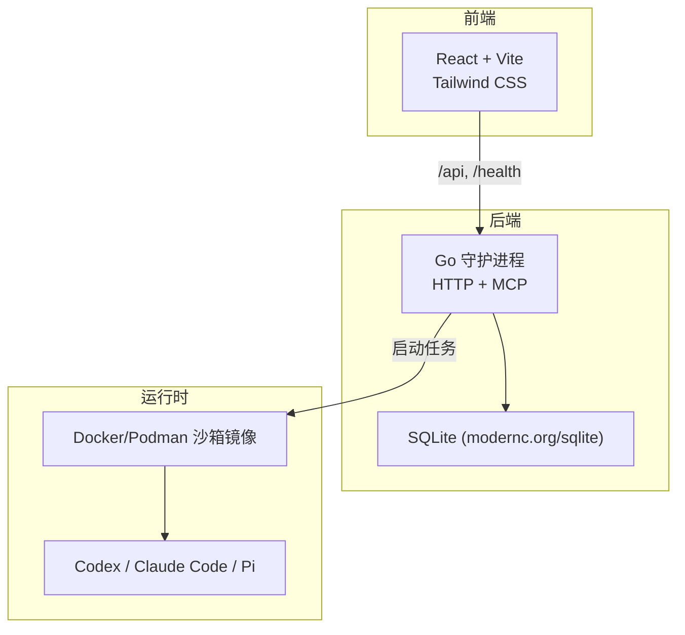
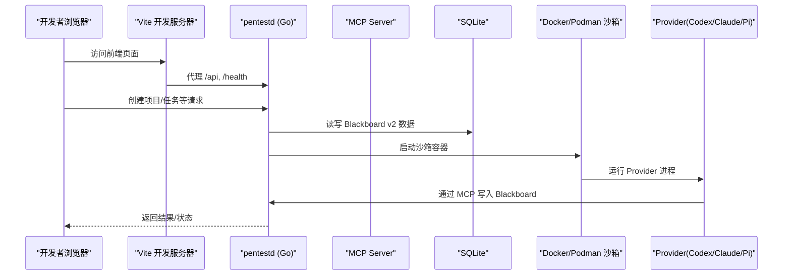
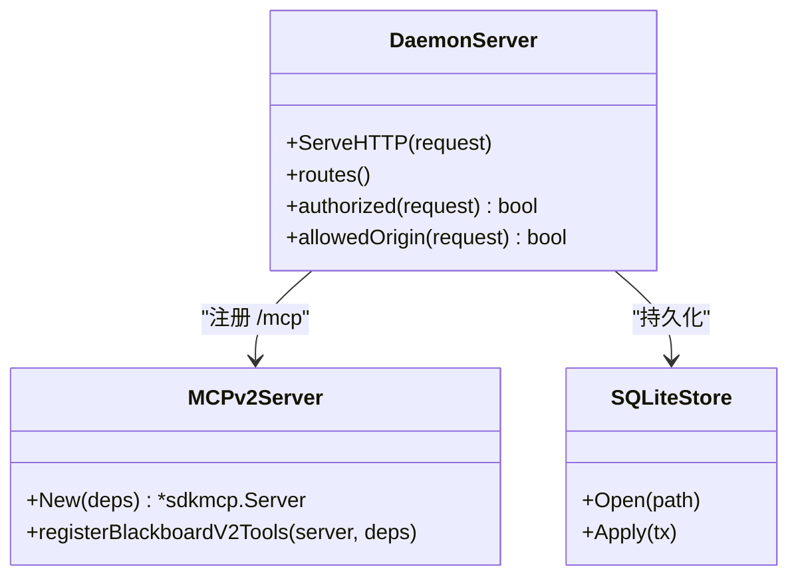
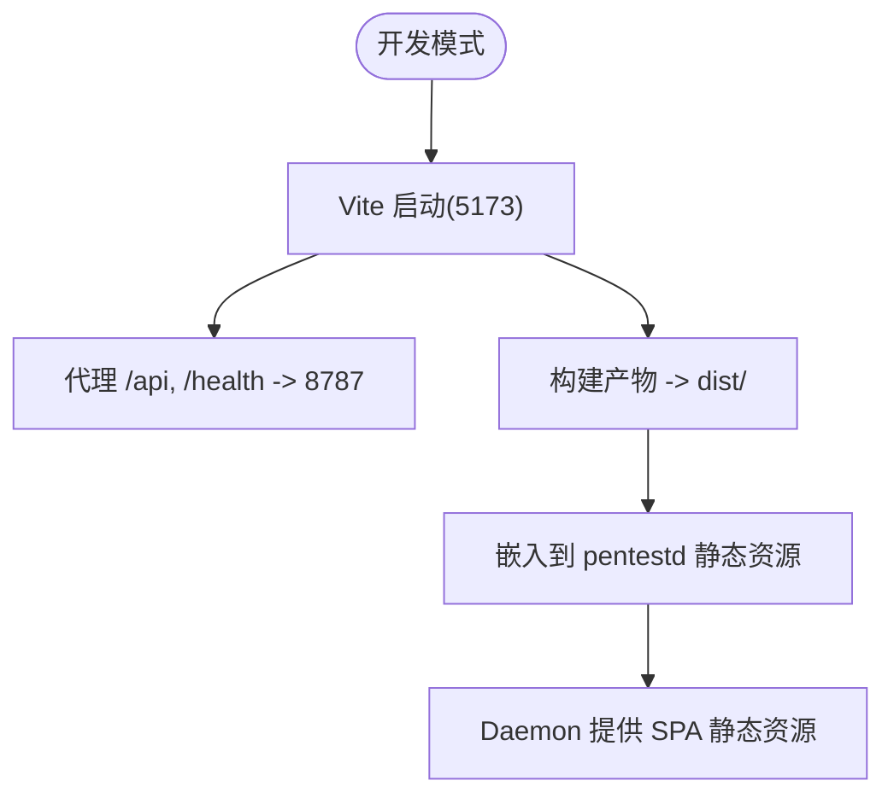
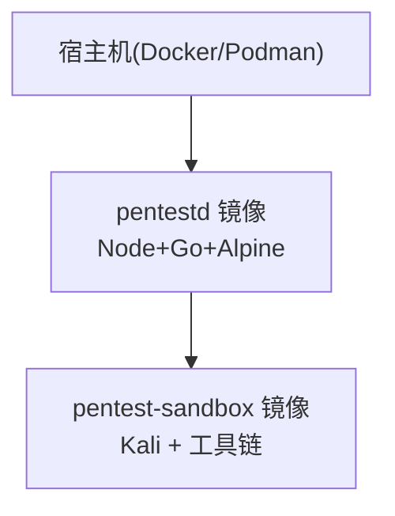
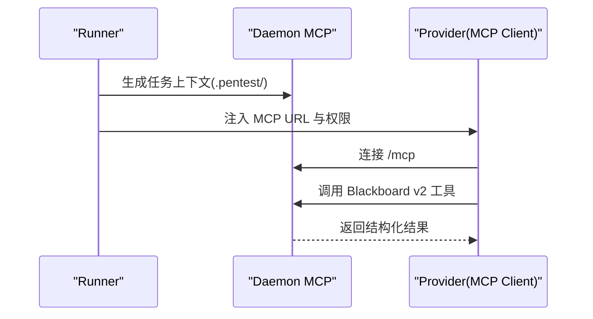
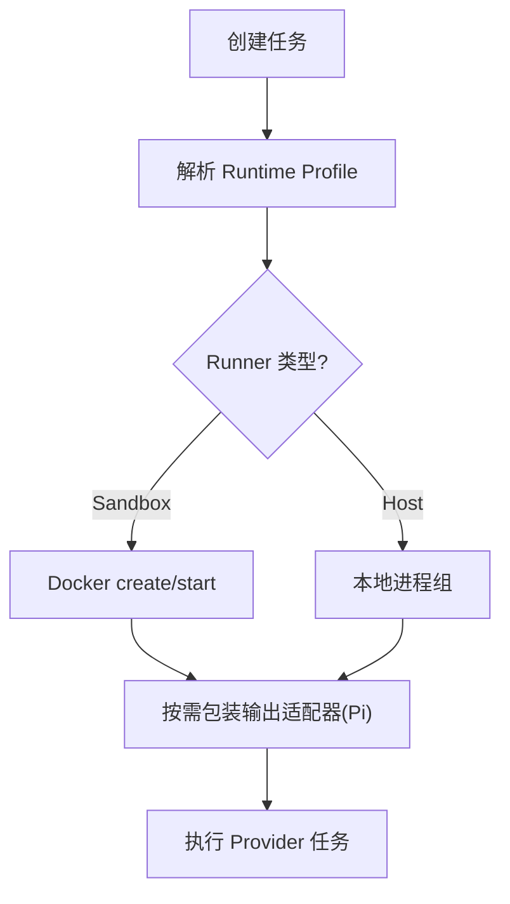
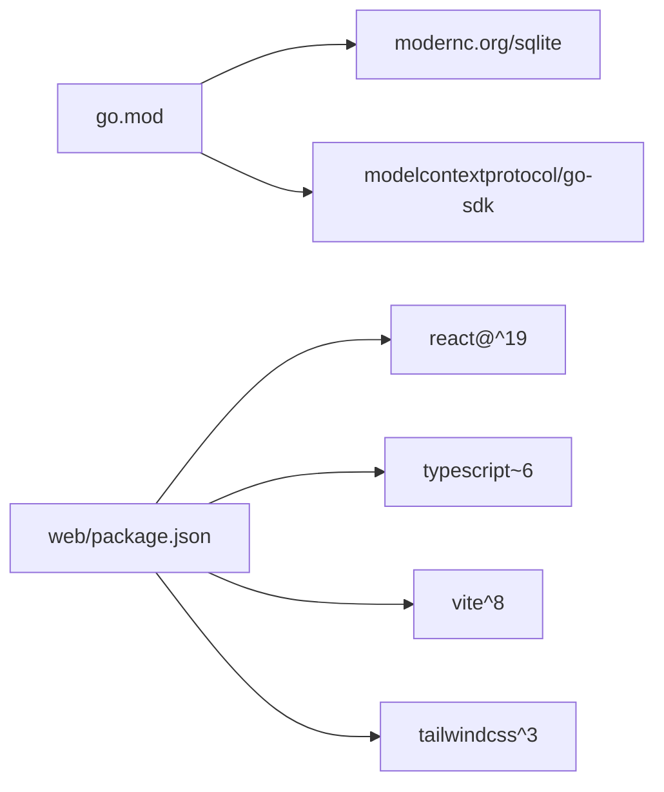

# 技术栈

<cite>
**本文引用的文件列表**
- [README.md](file://README.md)
- [go.mod](file://go.mod)
- [web/package.json](file://web/package.json)
- [web/vite.config.ts](file://web/vite.config.ts)
- [web/tailwind.config.js](file://web/tailwind.config.js)
- [docker/pentestd/Dockerfile](file://docker/pentestd/Dockerfile)
- [docker/pentest-sandbox/Dockerfile](file://docker/pentest-sandbox/Dockerfile)
- [internal/daemon/server.go](file://internal/daemon/server.go)
- [internal/mcpserver/v2.go](file://internal/mcpserver/v2.go)
- [internal/runtime/docker_sandbox.go](file://internal/runtime/docker_sandbox.go)
- [internal/daemon/task_handlers.go](file://internal/daemon/task_handlers.go)
- [internal/runtimeprofile/runtimeprofile.go](file://internal/runtimeprofile/runtimeprofile.go)
- [internal/runner/projection.go](file://internal/runner/projection.go)
- [Makefile](file://Makefile)
</cite>

## 目录
1. [简介](#简介)
2. [项目结构](#项目结构)
3. [核心组件](#核心组件)
4. [架构总览](#架构总览)
5. [详细组件分析](#详细组件分析)
6. [依赖关系分析](#依赖关系分析)
7. [性能与可维护性考量](#性能与可维护性考量)
8. [故障排查指南](#故障排查指南)
9. [结论](#结论)
10. [附录：版本兼容性与构建流程](#附录版本兼容性与构建流程)

## 简介
CyberPenda 是一个本地优先的渗透测试代理，由 Go 守护进程（pentestd）、React 仪表盘、沙箱化运行时（Codex/Claude Code/Pi）以及语义化的 Blackboard v2 记忆平面组成。后端通过标准库 HTTP 服务暴露 API 与 MCP Server，使用 modernc.org/sqlite 作为嵌入式数据库；前端基于 React 19 + TypeScript + Vite 8 + Tailwind CSS 构建，并通过 Docker/Podman 进行容器化部署与隔离执行。

## 项目结构
- 后端入口位于 cmd/pentestd，HTTP 路由与服务装配在 internal/daemon。
- 前端位于 web/，使用 Vite 开发服务器并代理 /api 到后端。
- 容器镜像分别用于应用（pentestd）与沙箱（pentest-sandbox）。
- Makefile 提供统一开发、构建与测试目标。

图表来源
- [internal/daemon/server.go:587-643](file://internal/daemon/server.go#L587-L643)
- [web/vite.config.ts:14-20](file://web/vite.config.ts#L14-L20)
- [docker/pentestd/Dockerfile:1-37](file://docker/pentestd/Dockerfile#L1-L37)
- [docker/pentest-sandbox/Dockerfile:1-145](file://docker/pentest-sandbox/Dockerfile#L1-L145)

章节来源
- [README.md:1-173](file://README.md#L1-L173)
- [Makefile:85-97](file://Makefile#L85-L97)

## 核心组件
- 后端技术栈
  - 语言与运行时：Go（见 go.mod）
  - Web 服务：标准库 net/http（ServeMux 路由）
  - 存储：modernc.org/sqlite（纯 Go SQLite，无 CGO）
  - MCP：github.com/modelcontextprotocol/go-sdk（MCP v2 服务端）
- 前端技术栈
  - React 19 + TypeScript + Vite 8 + Tailwind CSS
  - 开发时通过 Vite 代理 /api 到后端
- 容器化
  - 应用镜像：多阶段构建，Node 构建前端，Go 编译二进制，Alpine 运行
  - 沙箱镜像：Kali 基础镜像，预装常用安全工具与 Provider CLI
- 协议支持
  - Model Context Protocol（MCP）：Daemon 内置六类 Blackboard v2 工具，供受信任 Continuation 调用

章节来源
- [go.mod:1-27](file://go.mod#L1-L27)
- [internal/daemon/server.go:587-643](file://internal/daemon/server.go#L587-L643)
- [internal/mcpserver/v2.go:1-44](file://internal/mcpserver/v2.go#L1-L44)
- [web/package.json:1-48](file://web/package.json#L1-L48)
- [web/vite.config.ts:1-24](file://web/vite.config.ts#L1-L24)
- [web/tailwind.config.js:1-92](file://web/tailwind.config.js#L1-L92)
- [docker/pentestd/Dockerfile:1-37](file://docker/pentestd/Dockerfile#L1-L37)
- [docker/pentest-sandbox/Dockerfile:1-145](file://docker/pentest-sandbox/Dockerfile#L1-L145)

## 架构总览
系统分为三层：控制面（Daemon）、记忆面（Blackboard v2 + SQLite）、执行面（Runtime/Sandbox）。前端通过 HTTP 与 MCP 与控制面交互，执行面在容器内运行 Provider 并与 Daemon 通信。

图表来源
- [internal/daemon/server.go:587-643](file://internal/daemon/server.go#L587-L643)
- [internal/mcpserver/v2.go:1-44](file://internal/mcpserver/v2.go#L1-L44)
- [internal/runner/projection.go:396-428](file://internal/runner/projection.go#L396-L428)
- [web/vite.config.ts:14-20](file://web/vite.config.ts#L14-L20)

## 详细组件分析

### 后端技术栈：Go + 标准库 HTTP + modernc.org/sqlite
- HTTP 服务
  - 使用 http.ServeMux 注册 REST 路由与健康检查，包含项目、运行时配置、模型提供商、技能、凭据、任务、Blackboard v2 与 MCP 等。
  - 鉴权策略：非回环绑定强制要求 Bearer Token 或查询参数 token；同时支持 Continuation Interface Grant 对 Blackboard v2 与 MCP 的细粒度授权。
  - Origin 校验：拒绝 DNS Rebinding 与跨站请求，仅允许回环、host.docker.internal 或同源地址。
- 存储层
  - 使用 modernc.org/sqlite，纯 Go 实现，避免 CGO 依赖，便于静态链接与跨平台分发。
  - 事务与一致性：规范文档要求 WAL、外键开启、busy_timeout、synchronous=FULL、立即事务锁等，确保并发写串行化与强一致。
- MCP 集成
  - 基于 modelcontextprotocol/go-sdk 实现 MCP v2 服务端，注册六个 Blackboard v2 可信工具，输入 schema 来自冻结的 v2 契约定义。
  - 受信任 Continuation 通过 MCP 写入 Blackboard，限制为受控变更信封。

图表来源
- [internal/daemon/server.go:587-643](file://internal/daemon/server.go#L587-L643)
- [internal/daemon/server.go:431-461](file://internal/daemon/server.go#L431-L461)
- [internal/daemon/server.go:518-534](file://internal/daemon/server.go#L518-L534)
- [internal/mcpserver/v2.go:1-44](file://internal/mcpserver/v2.go#L1-L44)
- [docs/specs/blackboard-graph-storage.md:105-124](file://docs/specs/blackboard-graph-storage.md#L105-L124)

章节来源
- [internal/daemon/server.go:587-643](file://internal/daemon/server.go#L587-L643)
- [internal/daemon/server.go:431-461](file://internal/daemon/server.go#L431-L461)
- [internal/daemon/server.go:518-534](file://internal/daemon/server.go#L518-L534)
- [internal/mcpserver/v2.go:1-44](file://internal/mcpserver/v2.go#L1-L44)
- [go.mod:1-27](file://go.mod#L1-L27)
- [docs/specs/blackboard-graph-storage.md:105-124](file://docs/specs/blackboard-graph-storage.md#L105-L124)

### 前端技术栈：React 19 + TypeScript + Vite 8 + Tailwind CSS
- 构建与开发
  - Vite 开发服务器监听 5173，将 /api 与 /health 代理至后端 8787。
  - 生产构建输出 dist，被嵌入到 daemon 二进制中。
- 样式与设计系统
  - Tailwind CSS 通过 class-based dark mode 与 CSS 变量映射主题色板，扩展字体、阴影、圆角等设计令牌。
- 类型与测试
  - TypeScript 严格类型约束，Vitest 使用 jsdom 环境运行组件测试。

图表来源
- [web/vite.config.ts:14-20](file://web/vite.config.ts#L14-L20)
- [web/tailwind.config.js:1-92](file://web/tailwind.config.js#L1-L92)
- [docker/pentestd/Dockerfile:1-37](file://docker/pentestd/Dockerfile#L1-L37)

章节来源
- [web/package.json:1-48](file://web/package.json#L1-L48)
- [web/vite.config.ts:1-24](file://web/vite.config.ts#L1-L24)
- [web/tailwind.config.js:1-92](file://web/tailwind.config.js#L1-L92)

### 容器化技术：Docker/Podman
- 应用镜像（pentestd）
  - 多阶段构建：Node 构建前端，Go 编译二进制，Alpine 运行，暴露 8787，挂载 /data 持久化。
  - 健康检查：/health 探测可用性。
- 沙箱镜像（pentest-sandbox）
  - Kali 基础镜像，安装大量安全工具与 Node/Python 生态。
  - 预装 Provider CLI（Codex、Claude Code、Pi），并提供桥接程序以适配非 PTY 协议。
  - 可选 host-proxy-only 网络模式，限制出站流量。

图表来源
- [docker/pentestd/Dockerfile:1-37](file://docker/pentestd/Dockerfile#L1-L37)
- [docker/pentest-sandbox/Dockerfile:1-145](file://docker/pentest-sandbox/Dockerfile#L1-L145)

章节来源
- [docker/pentestd/Dockerfile:1-37](file://docker/pentestd/Dockerfile#L1-L37)
- [docker/pentest-sandbox/Dockerfile:1-145](file://docker/pentest-sandbox/Dockerfile#L1-L145)

### 协议支持：Model Context Protocol（MCP）
- 服务端注册
  - MCP v2 服务端在 /mcp 暴露，注册六个 Blackboard v2 工具，输入 schema 来自冻结契约。
- 客户端接入
  - 运行时在沙箱内通过 MCP URL 连接 Daemon，受信任 Continuation 受限地写入 Blackboard。
- 配置投影
  - 任务上下文生成 MCP URL 与权限白名单，写入运行时工作目录，供 Provider 读取。

图表来源
- [internal/mcpserver/v2.go:1-44](file://internal/mcpserver/v2.go#L1-L44)
- [internal/runner/projection.go:396-428](file://internal/runner/projection.go#L396-L428)
- [internal/runtimeprofile/runtimeprofile.go:47-69](file://internal/runtimeprofile/runtimeprofile.go#L47-L69)

章节来源
- [internal/mcpserver/v2.go:1-44](file://internal/mcpserver/v2.go#L1-L44)
- [internal/runner/projection.go:396-428](file://internal/runner/projection.go#L396-L428)
- [internal/runtimeprofile/runtimeprofile.go:47-69](file://internal/runtimeprofile/runtimeprofile.go#L47-L69)

### 运行时与沙箱：Docker/Podman 适配器
- 适配器抽象
  - DockerSandboxAdapter 封装容器生命周期（创建、启动、日志、停止、清理）。
  - 支持 host-proxy-only 网络模式，限制出站流量，增强边界隔离。
- 任务启动
  - 根据 Profile 选择 Provider，构造 CreateArgs，必要时包装 Pi 会话尾随适配器以实时输出。
- 宿主与沙箱
  - 默认使用沙箱；宿主模式需显式启用，且不会自动降级。

图表来源
- [internal/runtime/docker_sandbox.go:1-57](file://internal/runtime/docker_sandbox.go#L1-L57)
- [internal/daemon/task_handlers.go:896-933](file://internal/daemon/task_handlers.go#L896-L933)

章节来源
- [internal/runtime/docker_sandbox.go:1-57](file://internal/runtime/docker_sandbox.go#L1-L57)
- [internal/daemon/task_handlers.go:896-933](file://internal/daemon/task_handlers.go#L896-L933)

## 依赖关系分析
- 后端依赖
  - Go 模块声明了 modernc.org/sqlite 与 modelcontextprotocol/go-sdk 等关键依赖。
- 前端依赖
  - React 19、TypeScript、Vite 8、Tailwind CSS 及其插件与测试工具。
- 容器依赖
  - 应用镜像依赖 Node 20 与 Go 1.25；沙箱镜像依赖 Kali 包管理与 npm 全局工具。

图表来源
- [go.mod:1-27](file://go.mod#L1-L27)
- [web/package.json:1-48](file://web/package.json#L1-L48)

章节来源
- [go.mod:1-27](file://go.mod#L1-L27)
- [web/package.json:1-48](file://web/package.json#L1-L48)

## 性能与可维护性考量
- 存储层
  - 使用 WAL 与 IMMEDIATE 事务提升并发写串行化能力，减少死锁风险。
  - 单进程写者原则，CLI 与 Daemon 共享同一数据库时需序列化。
- 前端构建
  - Vite 快速 HMR 与增量构建；生产构建产物嵌入二进制，简化部署。
- 容器镜像
  - 多阶段构建减少最终镜像体积；沙箱镜像分层缓存优化构建速度。
- 安全边界
  - Origin 校验与 Auth Token 强制策略防止未授权访问；host-proxy-only 网络限制出站。

[本节为通用指导，不直接分析具体文件]

## 故障排查指南
- 无法访问 /health
  - 确认端口绑定与防火墙规则；检查是否设置了 PENTEST_AUTH_TOKEN 且非回环绑定。
- MCP 连接失败
  - 检查沙箱网络可达性与 MCP URL 是否正确；确认受信任 Continuation 的凭证有效。
- 任务无输出
  - 若使用 Pi 在沙箱中，需等待会话文件输出；检查 Pi 会话目录与 tailer 适配器是否正常。
- 构建失败
  - 确认 Node 20 与 Go 1.25 可用；清理 dist 后重试 make build-ui。

章节来源
- [internal/daemon/server.go:645-674](file://internal/daemon/server.go#L645-L674)
- [internal/daemon/task_handlers.go:926-933](file://internal/daemon/task_handlers.go#L926-L933)
- [Makefile:85-97](file://Makefile#L85-L97)

## 结论
CyberPenda 采用“Go 守护进程 + React 仪表盘 + 沙箱化运行时”的分层架构，结合 MCP 协议与 Blackboard v2 语义记忆平面，实现了可控、可审计、可恢复的渗透测试自动化。现代 c 的 SQLite 提供了零 CGO 的轻量存储，Vite/Tailwind 提升了前端开发与体验，Docker/Podman 确保了执行隔离与安全边界。整体技术选型兼顾了安全性、可移植性与可维护性。

[本节为总结性内容，不直接分析具体文件]

## 附录：版本兼容性与构建流程

### 版本兼容性要求
- 后端
  - Go 1.25（见 go.mod）
  - modernc.org/sqlite v1.34.5
  - modelcontextprotocol/go-sdk v1.6.1
- 前端
  - Node.js 20+（参考 README 与 Dockerfile）
  - React ^19.2.6
  - TypeScript ~6.0.2
  - Vite ^8.0.12
  - Tailwind CSS ^3.4.19
- 容器
  - 应用镜像：Node 20-bookworm-slim、golang:1.25-bookworm、alpine:3.22
  - 沙箱镜像：kalilinux/kali-rolling

章节来源
- [go.mod:1-27](file://go.mod#L1-L27)
- [web/package.json:1-48](file://web/package.json#L1-L48)
- [docker/pentestd/Dockerfile:1-37](file://docker/pentestd/Dockerfile#L1-L37)
- [docker/pentest-sandbox/Dockerfile:1-145](file://docker/pentest-sandbox/Dockerfile#L1-L145)
- [README.md:28-44](file://README.md#L28-L44)

### 依赖管理策略
- 后端
  - 使用 go.mod 与 go.sum 锁定依赖版本，避免间接依赖漂移。
- 前端
  - package-lock.json 锁定依赖树；devDependencies 与 dependencies 分离。
- 容器
  - 多阶段构建复用缓存层，减少重复下载与编译时间。

章节来源
- [go.mod:1-27](file://go.mod#L1-L27)
- [web/package.json:1-48](file://web/package.json#L1-L48)
- [docker/pentestd/Dockerfile:1-37](file://docker/pentestd/Dockerfile#L1-L37)

### 开发环境与构建流程
- 开发
  - 安装 Git hooks 后，运行 make dev 启动后端与 Vite 前端（/api 代理到 8787）。
- 构建
  - make build-ui 构建前端并复制到 internal/daemon/webfs/dist；make build 再编译 pentestd。
- 容器
  - docker compose up -d 启动应用镜像；make build-sandbox-image 构建沙箱镜像。
- 测试
  - make test-backend 运行 Go 测试；make test-ci 在无 Docker 与 LLM 凭据下运行 CI 安全测试。

章节来源
- [README.md:34-52](file://README.md#L34-L52)
- [README.md:56-80](file://README.md#L56-L80)
- [Makefile:85-97](file://Makefile#L85-L97)
- [web/vite.config.ts:14-20](file://web/vite.config.ts#L14-L20)