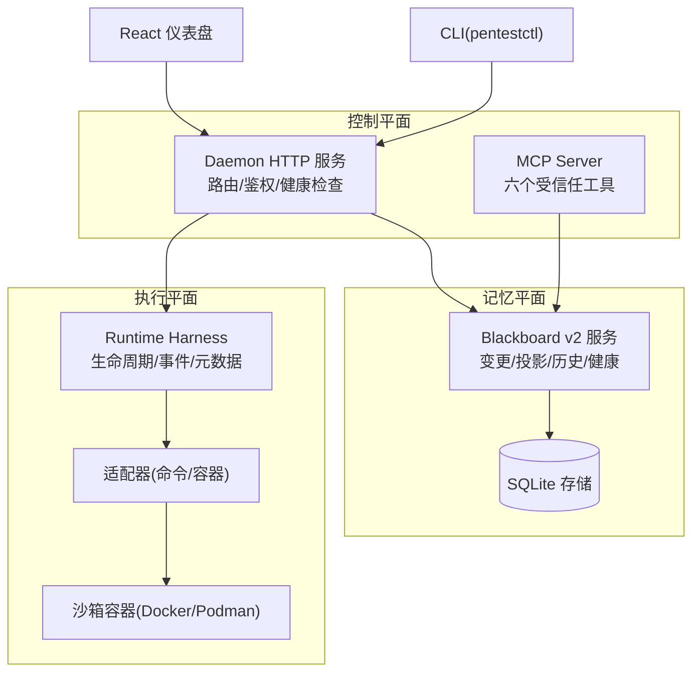
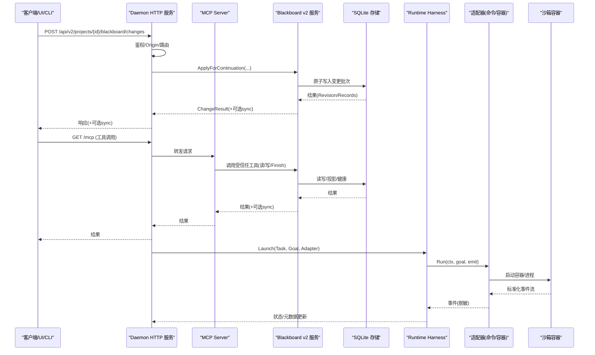
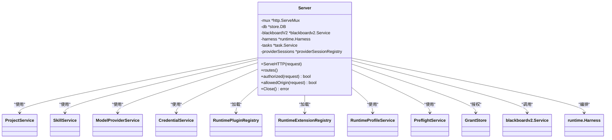
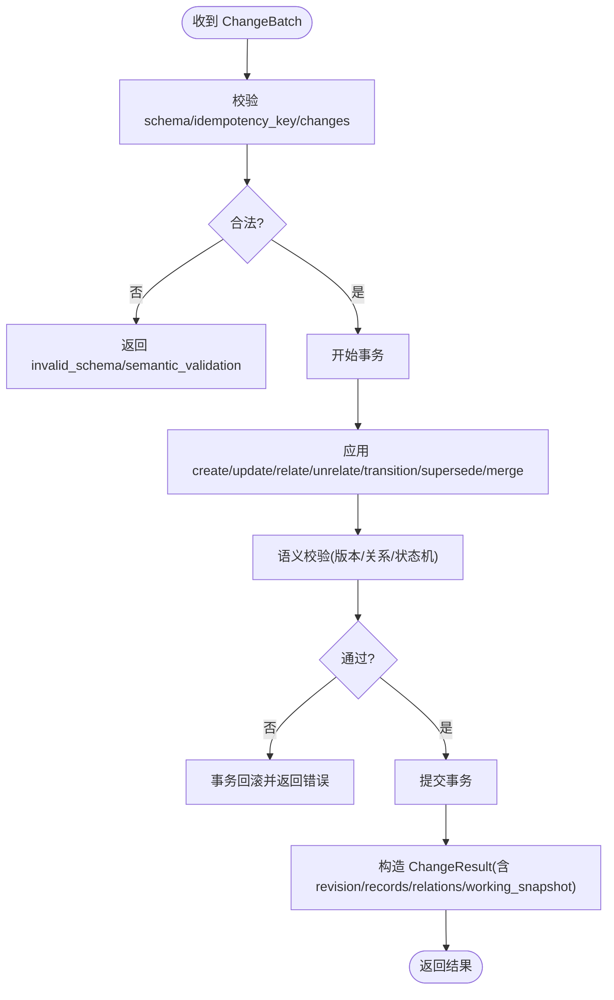
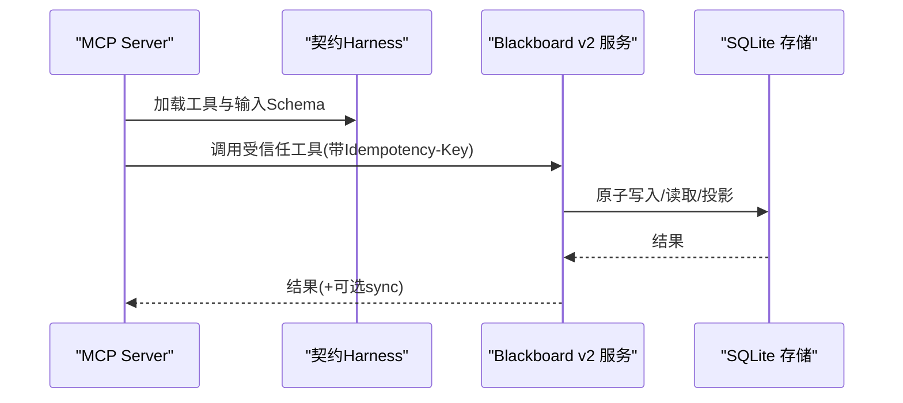
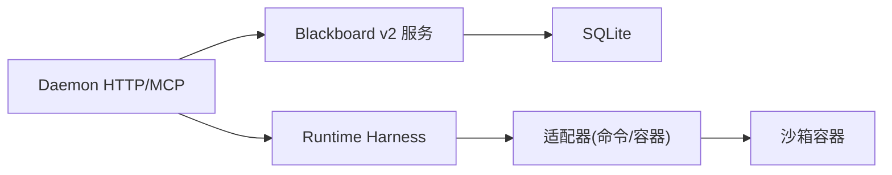

# 架构概览

<cite>
**本文引用的文件**   
- [README.md](file://README.md)
- [server.go](file://internal/daemon/server.go)
- [blackboard_v2_http.go](file://internal/daemon/blackboard_v2_http.go)
- [v2.go](file://internal/mcpserver/v2.go)
- [service.go](file://internal/blackboardv2/service.go)
- [runtime.go](file://internal/runtime/runtime.go)
- [pi_sandbox.go](file://internal/runner/pi_sandbox.go)
</cite>

## 目录
1. [简介](#简介)
2. [项目结构](#项目结构)
3. [核心组件](#核心组件)
4. [架构总览](#架构总览)
5. [详细组件分析](#详细组件分析)
6. [依赖关系分析](#依赖关系分析)
7. [性能与一致性](#性能与一致性)
8. [故障排查指南](#故障排查指南)
9. [结论](#结论)

## 简介
CyberPenda 是一个本地优先的渗透测试代理，采用 Go 守护进程 + React 仪表盘 + 沙箱化运行时的组合。系统以“控制平面（Daemon HTTP/MCP）—记忆平面（Blackboard v2 语义系统）—执行平面（Runtime/Sandbox）”三层解耦为核心，通过 SQLite 持久化、容器隔离和受信任工具边界，实现安全、可审计、可恢复的自动化渗透流程。

- 本地优先：默认将数据落盘到本机 SQLite 与任务工作目录；非回环绑定需强制鉴权。
- 三大子系统：
  - Daemon HTTP 服务层（控制平面）：HTTP API、MCP Server、任务生命周期、认证与路由。
  - Blackboard v2 语义系统（记忆平面）：实体/关系/证据/发现/目标/尝试等语义记录与变更流水线，原子提交、幂等与同步附件。
  - Runtime/Sandbox 运行时（执行平面）：Docker/Podman 容器隔离或宿主进程执行，声明式适配器（Codex/Claude Code/Pi），Profile 解析与扩展包加载。

## 项目结构
- cmd/pentestd：守护进程入口
- internal/daemon：HTTP 路由、认证、MCP 注册、任务编排
- internal/blackboardv2：语义服务与存储契约
- internal/mcpserver：MCP 工具集（六个受信任能力）
- internal/runtime：运行时 Harness、适配器抽象、命令封装
- internal/runner：Runner 适配（如 Pi 在沙箱中的引导包装）
- web：React 前端（嵌入至 daemon）
- docker：守护进程与沙箱镜像构建
- docs/specs：规范与 ADR



图表来源
- [server.go:587-643](file://internal/daemon/server.go#L587-L643)
- [v2.go:34-44](file://internal/mcpserver/v2.go#L34-L44)
- [service.go:40-49](file://internal/blackboardv2/service.go#L40-L49)
- [runtime.go:46-69](file://internal/runtime/runtime.go#L46-L69)

章节来源
- [README.md:1-173](file://README.md#L1-L173)

## 核心组件
- Daemon HTTP 服务层
  - 负责监听地址、鉴权（Bearer/token）、Origin 校验、静态资源放行、路由分发、健康探针、任务生命周期、Provider Session 工厂、插件与扩展加载。
  - 关键职责：统一入口、安全边界、跨模块装配、错误归一化。
- Blackboard v2 语义系统
  - 提供 ChangeBatch 原子写入、当前/历史读取、投影快照、健康诊断、证据保留、Checkpoint、Finish 等受信任能力；支持同步附件与幂等重放。
  - 关键职责：语义契约、版本化、事务性、审计与可恢复。
- Runtime/Sandbox 运行时
  - Harness 管理 Task/Continuation 生命周期，适配器抽象不同 Provider（Codex/Claude Code/Pi），命令封装与输出扫描，容器隔离启动与清理。
  - 关键职责：进程/容器隔离、事件标准化、元数据记录、停止/完成协调。

章节来源
- [server.go:38-118](file://internal/daemon/server.go#L38-L118)
- [service.go:40-49](file://internal/blackboardv2/service.go#L40-L49)
- [runtime.go:19-69](file://internal/runtime/runtime.go#L19-L69)

## 架构总览
下图展示从外部调用到内部执行的端到端路径，以及数据流向与隔离边界。



图表来源
- [blackboard_v2_http.go:97-125](file://internal/daemon/blackboard_v2_http.go#L97-L125)
- [v2.go:70-156](file://internal/mcpserver/v2.go#L70-L156)
- [service.go:644-680](file://internal/blackboardv2/service.go#L644-L680)
- [runtime.go:75-179](file://internal/runtime/runtime.go#L75-L179)

## 详细组件分析

### Daemon HTTP 服务层（控制平面）
- 启动与装配
  - 打开 SQLite、加载插件与扩展、初始化 Profile/Model Providers/Skills/Credentials/Task/Harness/Blackboard v2 服务、恢复中断任务、注册路由。
- 安全与鉴权
  - Origin 白名单（仅允许回环、host.docker.internal、同源）；非回环绑定强制 Bearer token；公开路径放行静态资源与健康检查。
- 路由组织
  - 项目/运行时配置/模型提供者/技能/凭证/任务/黑板 v2/MCP/SPA 静态资源等。
- 错误与日志
  - 统一状态码映射、结构化错误信封、请求与任务生命周期日志。



图表来源
- [server.go:83-118](file://internal/daemon/server.go#L83-L118)
- [server.go:587-643](file://internal/daemon/server.go#L587-L643)
- [server.go:383-411](file://internal/daemon/server.go#L383-L411)
- [server.go:431-461](file://internal/daemon/server.go#L431-L461)
- [server.go:518-534](file://internal/daemon/server.go#L518-L534)

章节来源
- [server.go:120-248](file://internal/daemon/server.go#L120-L248)
- [server.go:383-411](file://internal/daemon/server.go#L383-L411)
- [server.go:431-461](file://internal/daemon/server.go#L431-L461)
- [server.go:518-534](file://internal/daemon/server.go#L518-L534)
- [server.go:587-643](file://internal/daemon/server.go#L587-L643)

### Blackboard v2 语义系统（记忆平面）
- 数据模型与契约
  - ChangeBatch/Change 为封闭语义操作集合；Record 为当前详情联合类型；History/RuntimeSnapshot 为只读投影。
- 原子写入与幂等
  - Apply/ApplyForContinuation 对同一 IdempotencyKey 保证幂等；失败时整体回滚；支持 Finish/supersession 后的精确重放。
- 权威性与作用域
  - Operator 与 Continuation 两种主体；Continuation 绑定后限制读写范围与能力（证据保留、Checkpoint、Finish）。
- 同步附件与重试
  - 服务端可在错误/成功响应中附加 SynchronizationAttachment，客户端据此进行确定性重投与合并。
- 健康与投影
  - Health 提供语义健康；Runtime Snapshot 提供最小可见面给运行时消费。



图表来源
- [service.go:72-120](file://internal/blackboardv2/service.go#L72-L120)
- [service.go:122-232](file://internal/blackboardv2/service.go#L122-L232)
- [service.go:644-680](file://internal/blackboardv2/service.go#L644-L680)

章节来源
- [service.go:40-49](file://internal/blackboardv2/service.go#L40-L49)
- [service.go:72-120](file://internal/blackboardv2/service.go#L72-L120)
- [service.go:122-232](file://internal/blackboardv2/service.go#L122-L232)
- [service.go:644-680](file://internal/blackboardv2/service.go#L644-L680)

### Runtime/Sandbox 运行时（执行平面）
- 生命周期与事件
  - Harness.Launch 标记任务运行、发射生命周期事件、等待适配器退出、最终化状态；Stop/StopAndWait 支持优雅终止与确认。
- 适配器抽象
  - Adapter 接口定义 Name/Run；commandAdapter 基于 exec.CommandContext 启动真实进程，stdout/stderr 扫描并脱敏敏感值。
- 容器隔离
  - Runner 根据 Profile 选择 Docker/Podman 或宿主模式；Pi 在沙箱中可通过 npm 自动安装引导脚本。
- 元数据与续接
  - 支持 RebindContinuation 切换续接 ID 而不重启进程；记录 ContainerID/NativeSessionID/Path 等元数据。

```mermaid
classDiagram
class Harness {
+Launch(ctx, req) error
+Stop(taskID) void
+StopAndWait(taskID, timeout) bool
+RebindContinuation(taskID, continuationID) error
-active map[string]*activeRun
}
class Adapter {
<<interface>>
+Name() string
+Run(ctx, goal, emit) error
}
class commandAdapter {
-config CommandAdapterConfig
+SetMetadataRecorder(func)
+Run(ctx, goal, emit) error
}
class ActiveRun {
-cancel context.CancelFunc
-done chan struct{}
-continuationID string
-finishRequested bool
}
Harness --> Adapter : "调用"
commandAdapter ..|> Adapter
Harness --> ActiveRun : "跟踪"
```

图表来源
- [runtime.go:46-69](file://internal/runtime/runtime.go#L46-L69)
- [runtime.go:75-179](file://internal/runtime/runtime.go#L75-L179)
- [runtime.go:333-481](file://internal/runtime/runtime.go#L333-L481)
- [pi_sandbox.go:14-47](file://internal/runner/pi_sandbox.go#L14-L47)

章节来源
- [runtime.go:75-179](file://internal/runtime/runtime.go#L75-L179)
- [runtime.go:333-481](file://internal/runtime/runtime.go#L333-L481)
- [pi_sandbox.go:14-47](file://internal/runner/pi_sandbox.go#L14-L47)

### MCP 受信任工具（控制平面→记忆平面）
- 六个受信任工具：change/read/history/retain_evidence/checkpoint_attempt/finish
- 输入由冻结契约生成 JSON Schema 严格校验，错误统一为 invalid_schema 信封
- 与 HTTP 一致的鉴权与同步附件机制，确保离线重放与一致性



图表来源
- [v2.go:34-44](file://internal/mcpserver/v2.go#L34-L44)
- [v2.go:70-156](file://internal/mcpserver/v2.go#L70-L156)
- [v2.go:168-192](file://internal/mcpserver/v2.go#L168-L192)

章节来源
- [v2.go:34-44](file://internal/mcpserver/v2.go#L34-L44)
- [v2.go:70-156](file://internal/mcpserver/v2.go#L70-L156)
- [v2.go:168-192](file://internal/mcpserver/v2.go#L168-L192)

## 依赖关系分析
- 低耦合高内聚
  - Daemon 通过 Service 接口与 Blackboard v2、Task、Runtime 交互，避免直接访问存储细节。
  - Blackboard v2 独立于传输层（HTTP/MCP/CLI），通过 DTO 与错误信封对外暴露。
  - Runtime 通过 Adapter 抽象屏蔽具体 Provider 差异，Harness 专注生命周期与事件。
- 外部依赖
  - SQLite 作为本地首选存储；Docker/Podman 用于容器隔离；npm 用于 Pi 引导。
- 潜在循环依赖
  - 各层通过接口/DTO 解耦，未见直接循环导入；Daemon 装配期注入依赖，运行时再调用。



图表来源
- [server.go:120-248](file://internal/daemon/server.go#L120-L248)
- [service.go:40-49](file://internal/blackboardv2/service.go#L40-L49)
- [runtime.go:46-69](file://internal/runtime/runtime.go#L46-L69)

章节来源
- [server.go:120-248](file://internal/daemon/server.go#L120-L248)
- [service.go:40-49](file://internal/blackboardv2/service.go#L40-L49)
- [runtime.go:46-69](file://internal/runtime/runtime.go#L46-L69)

## 性能与一致性
- 原子性与幂等
  - ChangeBatch 原子提交，失败回滚；Idempotency-Key 保障重复投递不产生副作用。
- 并发与锁
  - SQLite 写入争用会返回 storage_busy，HTTP 层映射为 503 并提示 Retry-After；建议客户端指数退避重试。
- 投影与缓存
  - Runtime Snapshot 仅提供最小必要字段，减少序列化开销；Health 提供轻量可读视图。
- 资源隔离
  - 沙箱容器隔离进程与文件系统，降低宿主污染风险；宿主模式需显式启用。

章节来源
- [blackboard_v2_http.go:564-584](file://internal/daemon/blackboard_v2_http.go#L564-L584)
- [service.go:644-680](file://internal/blackboardv2/service.go#L644-L680)

## 故障排查指南
- 常见错误码与定位
  - invalid_schema：请求体/参数不符合封闭契约，检查字段与类型。
  - authority_denied：缺少或无效 Continuation Interface 能力/Operator Token。
  - semantic_validation：语义规则不满足（版本冲突、关系约束、状态机非法）。
  - storage_busy：SQLite 写入忙，稍后重试。
  - not_found/closed_continuation：对象不存在或已关闭的续接。
- 快速定位步骤
  - 查看 Health 与 Semantic Health 获取系统状态与 Revision。
  - 核对 Idempotency-Key 是否一致且唯一。
  - 检查 Origin 与 Authorization 头是否符合预期。
  - 观察 Runtime 事件与元数据，确认容器/进程是否正常退出。

章节来源
- [blackboard_v2_http.go:564-584](file://internal/daemon/blackboard_v2_http.go#L564-L584)
- [blackboard_v2_http.go:612-642](file://internal/daemon/blackboard_v2_http.go#L612-L642)
- [v2.go:305-315](file://internal/mcpserver/v2.go#L305-L315)

## 结论
CyberPenda 通过清晰的分层与严格的契约，实现了“控制—记忆—执行”的解耦架构。Daemon 提供统一的安全入口与编排，Blackboard v2 提供强一致的记忆与审计，Runtime/Sandbox 提供安全的执行环境。结合本地优先与容器化隔离，系统在易用性与安全性之间取得平衡，适合本地渗透测试与 CTF 场景的自动化探索与报告生成。