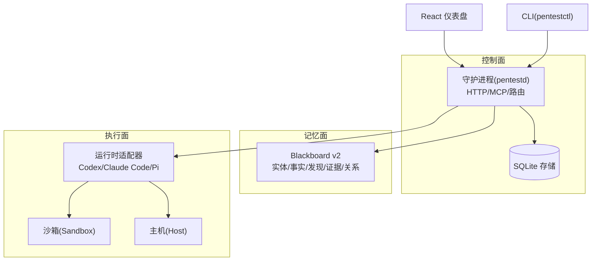
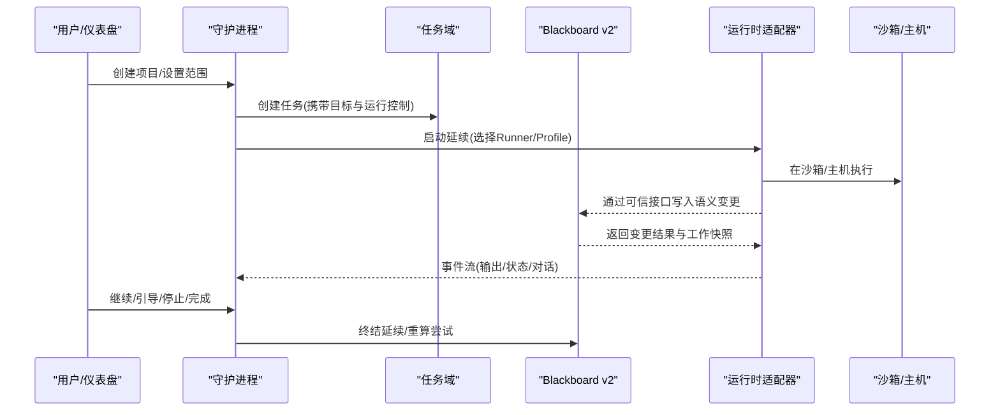
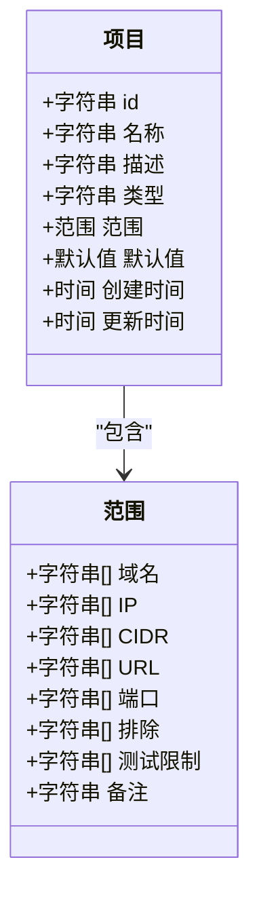
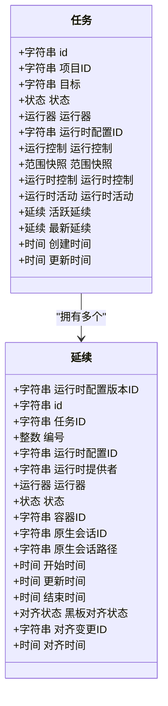
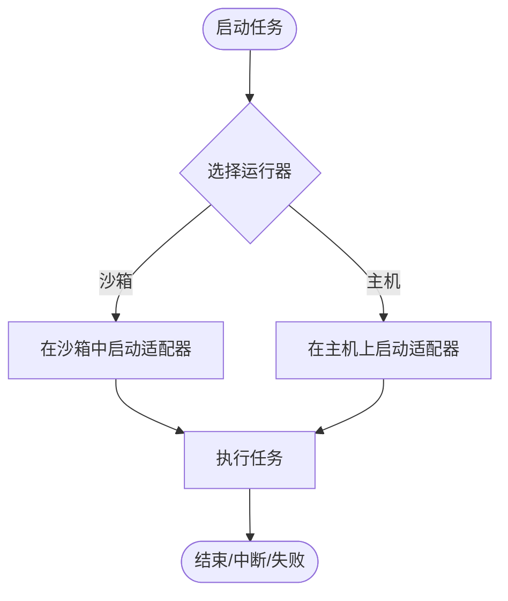
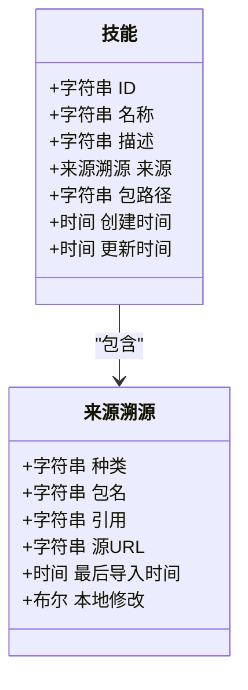
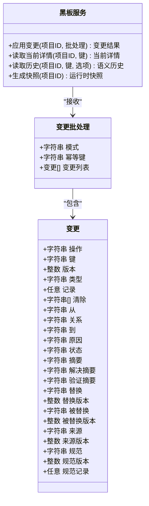
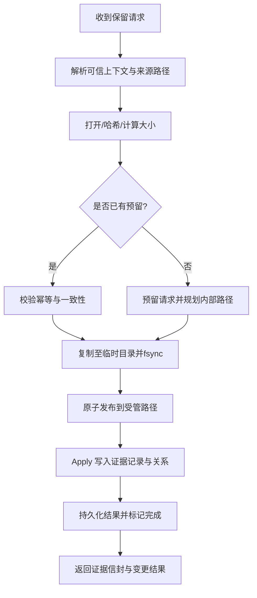
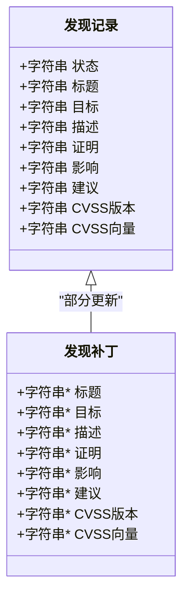
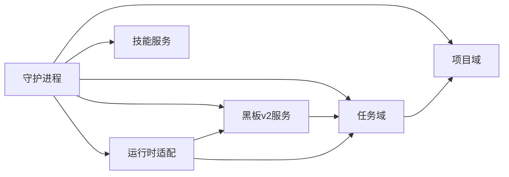

# 核心概念

<cite>
**本文引用的文件**   
- [README.md](file://README.md)
- [CONTEXT.md](file://CONTEXT.md)
- [internal/project/project.go](file://internal/project/project.go)
- [internal/task/task.go](file://internal/task/task.go)
- [internal/blackboardv2/service.go](file://internal/blackboardv2/service.go)
- [internal/blackboardv2/evidence.go](file://internal/blackboardv2/evidence.go)
- [internal/daemon/server.go](file://internal/daemon/server.go)
- [internal/runtime/runtime.go](file://internal/runtime/runtime.go)
- [internal/skill/skill.go](file://internal/skill/skill.go)
- [docs/specs/blackboard-v2-spec.md](file://docs/specs/blackboard-v2-spec.md)
</cite>

## 目录
1. [引言](#引言)
2. [项目结构](#项目结构)
3. [核心组件](#核心组件)
4. [架构总览](#架构总览)
5. [详细组件分析](#详细组件分析)
6. [依赖关系分析](#依赖关系分析)
7. [性能与一致性考量](#性能与一致性考量)
8. [故障排查指南](#故障排查指南)
9. [结论](#结论)
10. [附录：术语对照与最佳实践](#附录术语对照与最佳实践)

## 引言
本文件为 CyberPenda 的核心概念文档，面向初学者与跨角色读者，系统化解释 Project（项目）、Task（任务）、Scope（范围）、Blackboard v2（语义黑板）、Continuation（延续）、Evidence（证据）、Finding（发现）、Runtime（运行时）、Sandbox（沙箱）、Skill（技能）等关键术语及其相互关系与数据流转。同时强调授权安全测试的重要性，并说明与传统渗透测试工具的区别。

## 项目结构
CyberPenda 采用“本地优先”的架构：Go 守护进程提供控制面、记忆面与报告面；React 仪表盘提供交互界面；运行时在沙箱或主机中执行；通过 Blackboard v2 作为项目的持久化语义记忆平面。

图表来源
- [README.md:11-24](file://README.md#L11-L24)
- [internal/daemon/server.go:587-643](file://internal/daemon/server.go#L587-L643)
- [internal/blackboardv2/service.go:40-49](file://internal/blackboardv2/service.go#L40-L49)

章节来源
- [README.md:1-24](file://README.md#L1-L24)
- [internal/daemon/server.go:587-643](file://internal/daemon/server.go#L587-L643)

## 核心组件
- 项目(Project)：一个受控的安全测试参与单元，包含范围、默认配置、任务集合、记忆、证据与报告。
- 范围(Scope)：资产边界与测试限制，定义代理被授权的范围。
- 任务(Task)：以自然语言目标驱动的一次运行，绑定一次运行时配置与执行边界。
- 延续(Continuation)：一次具体的运行时实例，贯穿一次启动到终止的生命周期。
- 运行时(Runtime)：执行任务的本地代理或助手进程，由守护进程编排。
- 沙箱(Sandbox)：隔离的执行环境，默认执行边界。
- 技能(Skill)：运行时无关的技能包，可被运行时加载使用。
- 语义黑板 v2(Blackboard v2)：项目的持久化语义记忆，承载实体、探索目标、尝试、事实、发现、解决方案与证据引用及关系。
- 证据(Evidence)：对事实或发现的原始或派生证明引用，具备完整性校验与幂等保留。
- 发现(Finding)：可报告的漏洞问题，含严重性、影响、建议与状态。

章节来源
- [CONTEXT.md:11-13](file://CONTEXT.md#L11-L13)
- [CONTEXT.md:87-101](file://CONTEXT.md#L87-L101)
- [CONTEXT.md:23-36](file://CONTEXT.md#L23-L36)
- [CONTEXT.md:119-126](file://CONTEXT.md#L119-L126)
- [CONTEXT.md:103-113](file://CONTEXT.md#L103-L113)
- [CONTEXT.md:439-453](file://CONTEXT.md#L439-L453)
- [CONTEXT.md:307-326](file://CONTEXT.md#L307-L326)
- [docs/specs/blackboard-v2-spec.md:12-24](file://docs/specs/blackboard-v2-spec.md#L12-L24)
- [CONTEXT.md:631-638](file://CONTEXT.md#L631-L638)
- [CONTEXT.md:591-610](file://CONTEXT.md#L591-L610)

## 架构总览
CyberPenda 将“控制面—记忆面—执行面”解耦：
- 控制面：守护进程负责 HTTP API、MCP 服务、任务生命周期、认证与路由。
- 记忆面：Blackboard v2 提供原子化的语义变更、快照、历史与投影合并。
- 执行面：运行时适配器在沙箱或主机上执行，通过可信接口写入黑板与证据。

图表来源
- [internal/daemon/server.go:587-643](file://internal/daemon/server.go#L587-L643)
- [internal/task/task.go:315-374](file://internal/task/task.go#L315-L374)
- [internal/blackboardv2/service.go:644-656](file://internal/blackboardv2/service.go#L644-L656)
- [internal/runtime/runtime.go:75-179](file://internal/runtime/runtime.go#L75-L179)

## 详细组件分析

### 项目与范围
- 项目是受控的安全测试参与单元，包含名称、描述、类型、范围与默认值。
- 范围定义了域名、IP、CIDR、URL、端口、排除项与测试限制，并附带备注。
- 更新支持部分字段覆盖，避免误清空已配置的边界。

图表来源
- [internal/project/project.go:20-72](file://internal/project/project.go#L20-L72)

章节来源
- [internal/project/project.go:20-72](file://internal/project/project.go#L20-L72)
- [internal/project/project.go:176-213](file://internal/project/project.go#L176-L213)

### 任务与延续
- 任务是一次用户目标驱动的运行，记录目标、运行控制、范围快照与运行时活动。
- 延续是任务内的一次具体运行时实例，跟踪容器/会话标识、状态、黑板对齐状态等。
- 任务删除仅从常规表面隐藏，保留最小必要状态用于历史与可信来源完整性。

图表来源
- [internal/task/task.go:201-218](file://internal/task/task.go#L201-L218)
- [internal/task/task.go:98-118](file://internal/task/task.go#L98-L118)

章节来源
- [internal/task/task.go:315-374](file://internal/task/task.go#L315-L374)
- [internal/task/task.go:410-442](file://internal/task/task.go#L410-L442)

### 运行时与沙箱
- 运行时是执行任务的本地代理或助手进程，由守护进程编排。
- 守护进程根据 Runner 选择沙箱或主机执行，默认沙箱隔离文件系统、依赖与环境。
- 宿主运行器需显式激活，不会自动回退。

图表来源
- [internal/daemon/server.go:587-643](file://internal/daemon/server.go#L587-L643)
- [internal/runtime/runtime.go:75-179](file://internal/runtime/runtime.go#L75-L179)
- [CONTEXT.md:439-453](file://CONTEXT.md#L439-L453)

章节来源
- [internal/runtime/runtime.go:75-179](file://internal/runtime/runtime.go#L75-L179)
- [CONTEXT.md:439-453](file://CONTEXT.md#L439-L453)

### 技能
- 技能是运行时无关的可复用扩展包，通过管理页面导入、编辑与启用。
- 技能包格式围绕指令文档与可选脚本/资源，不包含凭据。
- 默认启用策略允许新技能对所有当前和未来运行时配置生效，除非显式禁用。

图表来源
- [internal/skill/skill.go:25-40](file://internal/skill/skill.go#L25-L40)
- [internal/skill/skill.go:9-23](file://internal/skill/skill.go#L9-L23)

章节来源
- [internal/skill/skill.go:25-40](file://internal/skill/skill.go#L25-L40)
- [CONTEXT.md:307-326](file://CONTEXT.md#L307-L326)

### 语义黑板 v2
- 黑板是项目的持久化语义记忆，包含工作区（开放目标与尝试）与知识（实体、事实、发现、解决方案、证据引用）以及当前关系。
- 变更以语义批处理形式原子提交，支持幂等键与版本约束。
- 运行时快照提供拓扑完整的当前图视图，不含审计细节与敏感内容。

图表来源
- [internal/blackboardv2/service.go:72-147](file://internal/blackboardv2/service.go#L72-L147)
- [docs/specs/blackboard-v2-spec.md:93-110](file://docs/specs/blackboard-v2-spec.md#L93-L110)

章节来源
- [docs/specs/blackboard-v2-spec.md:12-24](file://docs/specs/blackboard-v2-spec.md#L12-L24)
- [internal/blackboardv2/service.go:644-656](file://internal/blackboardv2/service.go#L644-L656)

### 证据保留流程
- 证据保留通过可信延续身份进行，具备幂等键、来源路径校验、内容哈希与大小校验。
- 流程包括预留请求、临时拷贝、发布到受管路径、原子写入语义记录与关系、持久化结果。
- 崩溃恢复保证：文件发布后进程死亡可恢复；图提交后丢失响应可重放；源变化或冲突会拒绝。

图表来源
- [internal/blackboardv2/evidence.go:194-360](file://internal/blackboardv2/evidence.go#L194-L360)
- [docs/specs/blackboard-runtime-protocol.md:396-417](file://docs/specs/blackboard-runtime-protocol.md#L396-L417)

章节来源
- [internal/blackboardv2/evidence.go:194-360](file://internal/blackboardv2/evidence.go#L194-L360)
- [docs/specs/blackboard-runtime-protocol.md:396-417](file://docs/specs/blackboard-runtime-protocol.md#L396-L417)

### 发现
- 发现是可报告的漏洞问题，包含标题、目标、描述、证明、影响与建议。
- 严重性与 CVSS 待决状态由服务推导，非直接可写字段。
- 确认的发现需有充分的事实或证据支撑，且具备完整向量。

图表来源
- [internal/blackboardv2/service.go:296-321](file://internal/blackboardv2/service.go#L296-L321)

章节来源
- [internal/blackboardv2/service.go:296-321](file://internal/blackboardv2/service.go#L296-L321)
- [CONTEXT.md:591-610](file://CONTEXT.md#L591-L610)

## 依赖关系分析
- 守护进程依赖项目、任务、运行时、技能、模型提供者、凭证、预检、黑板 v2 与连续性服务。
- 任务域依赖项目域以捕获范围快照；黑板 v2 提供延续终态后的尝试重算与清理。
- 运行时适配器通过守护进程的事件通道与任务域交互，并通过可信接口写入黑板与证据。

图表来源
- [internal/daemon/server.go:83-118](file://internal/daemon/server.go#L83-L118)
- [internal/task/task.go:275-313](file://internal/task/task.go#L275-L313)
- [internal/blackboardv2/service.go:658-680](file://internal/blackboardv2/service.go#L658-L680)

章节来源
- [internal/daemon/server.go:83-118](file://internal/daemon/server.go#L83-L118)
- [internal/task/task.go:275-313](file://internal/task/task.go#L275-L313)
- [internal/blackboardv2/service.go:658-680](file://internal/blackboardv2/service.go#L658-L680)

## 性能与一致性考量
- 语义变更批量提交与幂等键保障重复提交的稳定性。
- 证据保留的多阶段检查点与原子发布确保崩溃恢复能力。
- 任务事件追加使用事务与单调序列号保证顺序与可见性。
- 快照与投影减少模型注意力负担，提升运行时推理效率。

章节来源
- [internal/blackboardv2/service.go:72-147](file://internal/blackboardv2/service.go#L72-L147)
- [internal/blackboardv2/evidence.go:194-360](file://internal/blackboardv2/evidence.go#L194-L360)
- [internal/task/task.go:481-551](file://internal/task/task.go#L481-L551)
- [docs/specs/blackboard-v2-spec.md:93-110](file://docs/specs/blackboard-v2-spec.md#L93-L110)

## 故障排查指南
- 守护进程重启后，活跃任务会被标记为中断，残留容器或进程将被清理，并在事件流中记录原因。
- 若延续终态未正确对齐，黑板服务会触发尝试重算，将未完成的尝试标记为中断并提示修复。
- 证据保留失败时，系统会在不同失败点注入诊断信息，便于定位是文件发布前还是图提交后失败。

章节来源
- [internal/daemon/server.go:250-304](file://internal/daemon/server.go#L250-L304)
- [internal/blackboardv2/service.go:682-800](file://internal/blackboardv2/service.go#L682-L800)
- [internal/blackboardv2/evidence.go:312-342](file://internal/blackboardv2/evidence.go#L312-L342)

## 结论
CyberPenda 通过清晰的概念分层与强一致的语义记忆，将授权安全测试过程结构化、可追溯与可协作。项目与范围明确授权边界，任务与延续组织执行生命周期，运行时与沙箱保障安全隔离，技能提供可复用的能力，而 Blackboard v2 作为记忆平面确保知识的稳定演进与证据的可靠留存。相比传统工具，它强调“人主导、机器辅助”的协作式渗透测试，并以严格的授权与范围控制为核心原则。

## 附录：术语对照与最佳实践
- 授权优先：仅在获得明确授权的范围内进行测试，范围扩展需经审批。
- 使用范围快照：任务启动时捕获范围快照，避免后续范围变更影响历史任务。
- 合理使用技能：通过管理页面导入与启用技能，遵循默认启用策略与显式禁用。
- 谨慎使用宿主运行器：宿主运行器需显式激活，不应作为沙箱失败的自动回退。
- 证据保留：使用幂等键与受管路径，确保完整性与可恢复性。
- 发现完善：逐步补充证明、影响与建议，确保确认发现满足严格条件。

章节来源
- [README.md:9-10](file://README.md#L9-L10)
- [CONTEXT.md:87-101](file://CONTEXT.md#L87-L101)
- [CONTEXT.md:439-453](file://CONTEXT.md#L439-L453)
- [CONTEXT.md:307-326](file://CONTEXT.md#L307-L326)
- [internal/blackboardv2/evidence.go:194-360](file://internal/blackboardv2/evidence.go#L194-L360)
- [CONTEXT.md:591-610](file://CONTEXT.md#L591-L610)