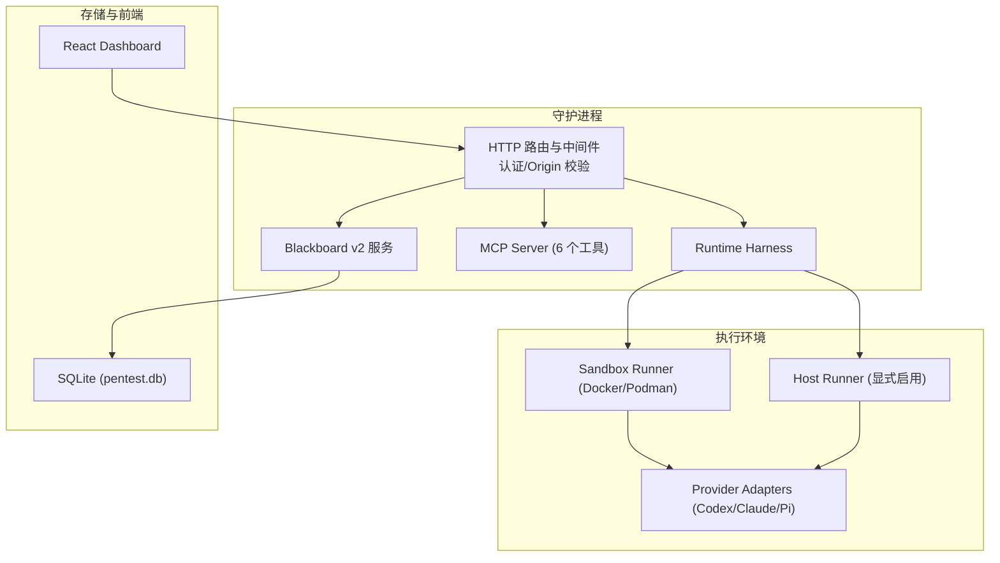
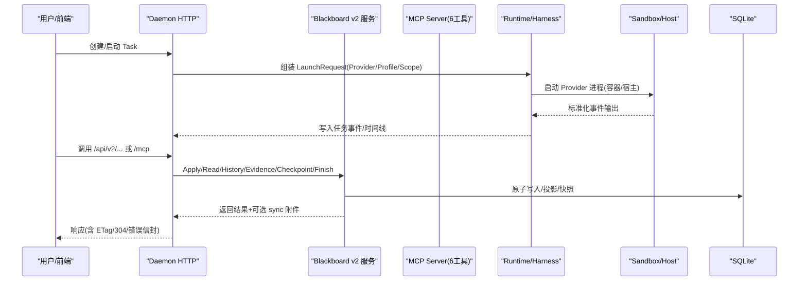
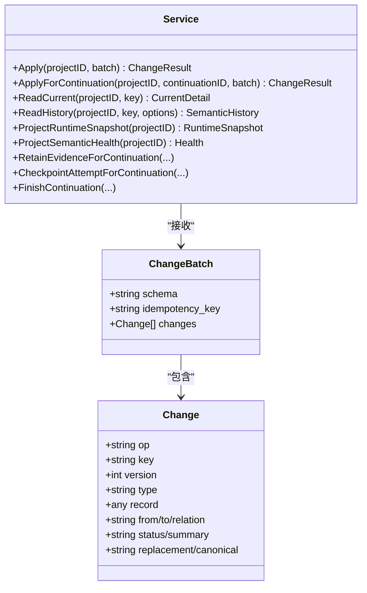
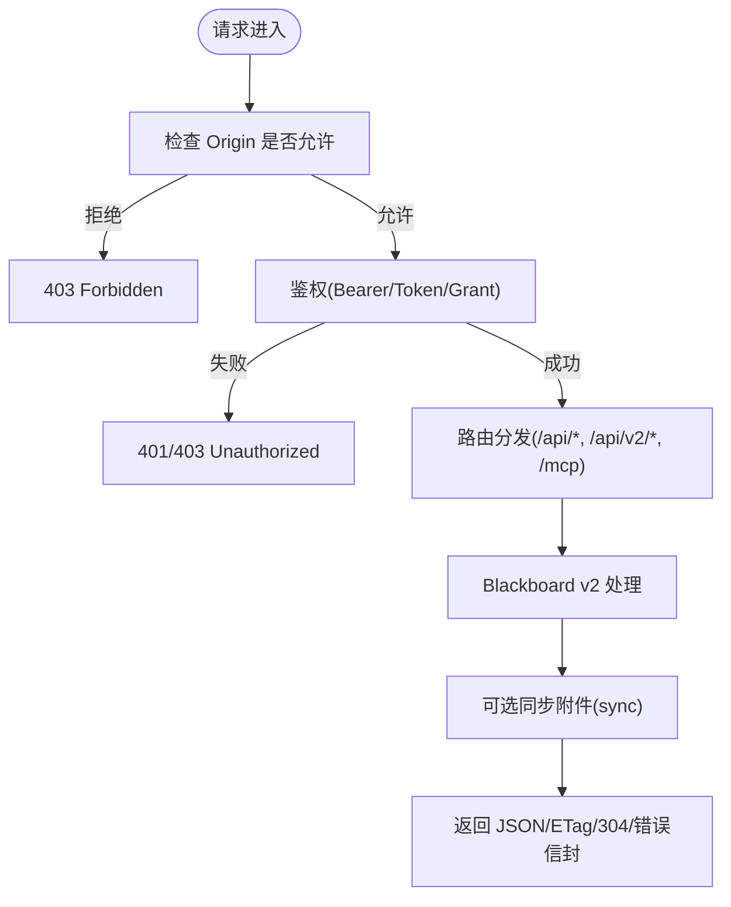
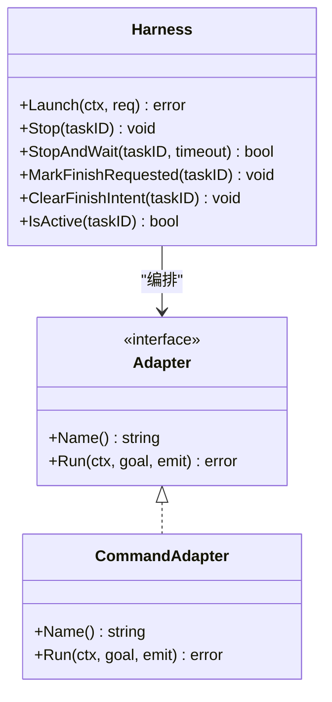
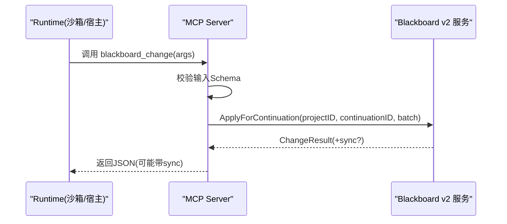
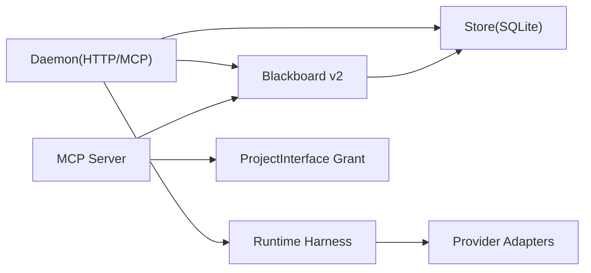

# 项目概述

<cite>
**本文引用的文件**   
- [README.md](file://README.md)
- [CONTEXT.md](file://CONTEXT.md)
- [server.go](file://internal/daemon/server.go)
- [blackboard_v2_http.go](file://internal/daemon/blackboard_v2_http.go)
- [v2.go](file://internal/mcpserver/v2.go)
- [service.go](file://internal/blackboardv2/service.go)
- [runtime.go](file://internal/runtime/runtime.go)
- [mcp.go](file://internal/runner/mcp.go)
</cite>

## 目录
1. [简介](#简介)
2. [项目结构](#项目结构)
3. [核心组件](#核心组件)
4. [架构总览](#架构总览)
5. [详细组件分析](#详细组件分析)
6. [依赖关系分析](#依赖关系分析)
7. [性能与可靠性](#性能与可靠性)
8. [故障排查指南](#故障排查指南)
9. [结论](#结论)
10. [附录：快速开始与典型工作流](#附录快速开始与典型工作流)

## 简介
CyberPenda 是一个本地优先的渗透测试代理，围绕“授权安全测试”的目标，将 Go 守护进程、React 仪表盘、沙箱化运行时（Codex、Claude Code、Pi）、项目范围控制、语义化 Blackboard v2、技能包与运行时扩展、以及 Markdown 报告生成整合在一起。其核心理念是：
- 数据默认落盘于本机（SQLite、任务运行目录、受管证据根），避免云端泄露风险。
- 真正的渗透工具在选定的运行时环境中执行，而非通过守护进程作为“工具代理”。
- 以 Blackboard v2 为记忆平面，提供可审计、可合并、可投影的语义状态；以 Daemon 为控制平面，提供 HTTP API、MCP Server、任务生命周期管理；以 Runtime/Sandbox 为执行平面，提供容器隔离或宿主直连的安全边界。

与传统渗透测试工具相比，CyberPenda 强调：
- 明确的授权与范围约束（Scope）贯穿任务全生命周期。
- 结构化语义知识（实体、事实、发现、证据、尝试等）持久化并可被多轮任务复用。
- 可信 MCP 工具集仅暴露最小能力面，且与 Continuation 绑定，具备幂等与同步附件机制。
- 可恢复的任务与运行时会话，支持断点续跑与一致性快照。

**章节来源**
- [README.md:1-173](file://README.md#L1-L173)
- [CONTEXT.md:1-800](file://CONTEXT.md#L1-L800)

## 项目结构
仓库采用分层组织方式：
- cmd：可执行程序入口（pentestd、pentestctl 等）
- internal：领域服务、适配器、Daemon HTTP、Runner、Store 等核心实现
- web：React + Vite 前端仪表盘
- docker：守护进程与沙箱镜像构建
- skills/bundles：内置技能内容
- docs：产品文档与 ADR
- scripts：发布与冒烟脚本

**图表来源**
- [server.go:587-643](file://internal/daemon/server.go#L587-L643)
- [blackboard_v2_http.go:29-46](file://internal/daemon/blackboard_v2_http.go#L29-L46)
- [v2.go:34-44](file://internal/mcpserver/v2.go#L34-L44)
- [runtime.go:46-70](file://internal/runtime/runtime.go#L46-L70)

**章节来源**
- [README.md:149-161](file://README.md#L149-L161)

## 核心组件
- Blackboard v2 语义系统：定义并原子应用语义变更批次，维护实体/关系/证据/发现/尝试/目标等记录，提供运行时快照与健康诊断，支持投影合并与历史回溯。
- Daemon HTTP 服务层：统一鉴权（Bearer/token 与 Project Interface Grant）、Origin 防护、路由分发、Blackboard v2 HTTP 接口、MCP Server、任务生命周期与仪表板静态资源。
- Runtime/Sandbox 运行时：基于 Adapter 抽象封装具体 Provider（Codex/Claude/Pi），由 Harness 管理进程生命周期、事件上报、停止/完成语义，并通过 Runner 注入可信 MCP 配置与上下文。

**章节来源**
- [service.go:40-70](file://internal/blackboardv2/service.go#L40-L70)
- [server.go:83-118](file://internal/daemon/server.go#L83-L118)
- [runtime.go:19-30](file://internal/runtime/runtime.go#L19-L30)

## 架构总览
下图展示从用户操作到语义落盘的端到端路径，包括可信 MCP 工具调用与沙箱隔离的执行边界。

**图表来源**
- [server.go:587-643](file://internal/daemon/server.go#L587-L643)
- [blackboard_v2_http.go:97-125](file://internal/daemon/blackboard_v2_http.go#L97-L125)
- [v2.go:71-156](file://internal/mcpserver/v2.go#L71-L156)
- [service.go:644-656](file://internal/blackboardv2/service.go#L644-L656)
- [runtime.go:71-179](file://internal/runtime/runtime.go#L71-L179)

## 详细组件分析

### Blackboard v2 语义系统
- 语义变更批次：ChangeBatch 包含 schema、idempotency_key、changes 数组，严格字段白名单校验，确保不可知字段被拒绝。
- 变更记录：Change 支持 create/update/relate/unrelate/transition/supersede/merge 等语义动词，附带版本控制与冲突检测。
- 记录类型：Entity/Fact/Finding/Solution/Evidence/Attempt/Objective 等，均提供只读快照视图与当前详情视图。
- 原子性与幂等：Apply/ApplyForContinuation 保证事务性写入；对 Finish/RetainEvidence/Checkpoint 等支持精确重放与同步附件。
- 运行时快照：ProjectRuntimeSnapshot 提供拓扑完整的紧凑视图，供运行时消费与工作副本推进。
- 健康诊断：ProjectSemanticHealth 用于监控语义一致性与完整性。

**图表来源**
- [service.go:40-70](file://internal/blackboardv2/service.go#L40-L70)
- [service.go:72-147](file://internal/blackboardv2/service.go#L72-L147)
- [service.go:644-656](file://internal/blackboardv2/service.go#L644-L656)

**章节来源**
- [service.go:72-147](file://internal/blackboardv2/service.go#L72-L147)
- [service.go:525-614](file://internal/blackboardv2/service.go#L525-L614)

### Daemon HTTP 服务层
- 安全边界：
  - Origin 校验：拒绝非回环且非 host.docker.internal 的跨站请求，防止 DNS Rebinding。
  - 鉴权：支持 Bearer token 与 query token（兼容无法设置头的 MCP 传输）；Blackboard v2 使用 Project Interface Grant 进行细粒度授权。
- 路由组织：
  - /health、/api/* 业务接口、/api/v2/projects/{id}/blackboard/* Blackboard v2 专用接口、/mcp MCP Server、SPA 静态资源。
- Blackboard v2 HTTP：
  - 统一认证与权限解析，区分 operator 与 trusted Continuation。
  - 支持 ETag/If-None-Match 条件读取、幂等键 Idempotency-Key、同步附件 sync 携带 Pending 通知。
  - 错误信封标准化，映射 storage_busy 为 503，authority_denied 为 401/403。

**图表来源**
- [server.go:383-411](file://internal/daemon/server.go#L383-L411)
- [server.go:518-534](file://internal/daemon/server.go#L518-L534)
- [blackboard_v2_http.go:52-95](file://internal/daemon/blackboard_v2_http.go#L52-L95)
- [blackboard_v2_http.go:368-438](file://internal/daemon/blackboard_v2_http.go#L368-L438)

**章节来源**
- [server.go:587-643](file://internal/daemon/server.go#L587-L643)
- [blackboard_v2_http.go:29-46](file://internal/daemon/blackboard_v2_http.go#L29-L46)
- [blackboard_v2_http.go:97-125](file://internal/daemon/blackboard_v2_http.go#L97-L125)
- [blackboard_v2_http.go:465-493](file://internal/daemon/blackboard_v2_http.go#L465-L493)

### Runtime/Sandbox 运行时执行环境
- Adapter 抽象：Name() 标识提供者，Run(ctx, goal, emit) 执行单次 Continuation，标准化事件输出，不泄露密钥。
- Harness 生命周期：Launch 注册活动运行、标记任务状态、转发事件、最终化状态；Stop/StopAndWait 中断与优雅退出；FinishIntent 协调 Operator Finish 与 Run 退出顺序。
- 命令适配器：CommandAdapter 负责进程启动、标准输出/错误扫描、元数据提取（容器 ID/原生会话 ID/路径）。
- Runner 集成：注入可信 MCP 服务器 URL、API 根地址、作用域快照、技能根目录、AGENTS.md 提示，并在沙箱中将回环地址重写为 host.docker.internal。

**图表来源**
- [runtime.go:19-30](file://internal/runtime/runtime.go#L19-L30)
- [runtime.go:46-70](file://internal/runtime/runtime.go#L46-L70)
- [runtime.go:71-179](file://internal/runtime/runtime.go#L71-L179)
- [runtime.go:333-481](file://internal/runtime/runtime.go#L333-L481)

**章节来源**
- [runtime.go:71-179](file://internal/runtime/runtime.go#L71-L179)
- [mcp.go:43-63](file://internal/runner/mcp.go#L43-L63)
- [mcp.go:86-122](file://internal/runner/mcp.go#L86-L122)

### MCP 可信工具集
- 六个受控工具：blackboard_change、blackboard_read、blackboard_history、blackboard_retain_evidence、blackboard_checkpoint_attempt、blackboard_finish。
- 输入契约：基于冻结的 v2 合同 Schema 校验，失败返回 compact invalid_schema 信封。
- 同步与幂等：按 Idempotency-Key 生成指纹，支持 exact replay 与 Pending 抢占，错误时也可携带 sync 附件。

**图表来源**
- [v2.go:71-156](file://internal/mcpserver/v2.go#L71-L156)
- [v2.go:198-248](file://internal/mcpserver/v2.go#L198-L248)
- [service.go:644-656](file://internal/blackboardv2/service.go#L644-L656)

**章节来源**
- [v2.go:34-44](file://internal/mcpserver/v2.go#L34-L44)
- [v2.go:168-192](file://internal/mcpserver/v2.go#L168-L192)

## 依赖关系分析
- Daemon 依赖：
  - Store（SQLite）、Project、Task、Credential、ModelProvider、Skill、RuntimePlugin、RuntimeExtension、Preflight、Harness、Blackboard v2、ProjectInterface Grants。
- Blackboard v2 依赖：
  - Store、EvidenceConfig（ArtifactRoot/RuntimeRoot）、ContinuityService（用于同步与恢复）。
- Runtime 依赖：
  - Task Service（事件/状态）、Adapter（Provider 适配）、Runner（MCP/技能/作用域注入）。
- MCP 依赖：
  - Blackboard v2 服务、ProjectInterface Grant、Contract Harness（Schema 校验）。

**图表来源**
- [server.go:83-118](file://internal/daemon/server.go#L83-L118)
- [service.go:40-70](file://internal/blackboardv2/service.go#L40-L70)
- [v2.go:19-29](file://internal/mcpserver/v2.go#L19-L29)
- [runtime.go:46-70](file://internal/runtime/runtime.go#L46-L70)

**章节来源**
- [server.go:120-248](file://internal/daemon/server.go#L120-L248)
- [service.go:62-70](file://internal/blackboardv2/service.go#L62-L70)
- [v2.go:34-44](file://internal/mcpserver/v2.go#L34-L44)
- [runtime.go:67-70](file://internal/runtime/runtime.go#L67-L70)

## 性能与可靠性
- 原子写入与并发：Blackboard v2 使用事务与写锁保障一致性；SQLite 忙锁映射为 503 并建议重试。
- 幂等与重放：所有写操作要求 Idempotency-Key，支持精确重放与同步附件，降低网络抖动影响。
- 条件读取：ETag/If-None-Match 减少带宽与 CPU 消耗，提升仪表盘刷新效率。
- 资源清理：守护进程重启后自动清理僵尸容器/进程组，避免资源泄漏。
- 输出限流：Blackboard v2 输入限制 4 MiB，避免过大负载。

[本节为通用指导，无需特定文件引用]

## 故障排查指南
- 常见错误码与状态：
  - authority_denied：缺少或无效的 Continuation Interface capability 或 Bearer token。
  - invalid_schema：请求体/参数不符合 v2 契约。
  - storage_busy：SQLite 写入锁忙，客户端应重试。
  - not_found/closed_continuation/version_conflict 等：根据 path/details 定位问题。
- 诊断要点：
  - 确认 Origin 是否为回环或 host.docker.internal。
  - 检查 Authorization 头或 ?token= 是否匹配。
  - 查看 sync 附件中的 Pending 通知，必要时触发下一次拉取。
  - 关注任务事件时间线与 Runtime Activity 指示器，判断是否处于 live/busy。

**章节来源**
- [blackboard_v2_http.go:512-542](file://internal/daemon/blackboard_v2_http.go#L512-L542)
- [blackboard_v2_http.go:612-642](file://internal/daemon/blackboard_v2_http.go#L612-L642)
- [server.go:383-411](file://internal/daemon/server.go#L383-L411)

## 结论
CyberPenda 通过“本地优先 + 语义记忆 + 可控执行”的设计，将传统渗透测试流程升级为可审计、可复用、可恢复的结构化工程实践。Blackboard v2 提供稳定的知识基座，Daemon 提供安全的控制面，Runtime/Sandbox 提供可靠的执行边界。三者协同，使得授权安全测试更加透明、可追踪、可协作。

[本节为总结性内容，无需特定文件引用]

## 附录：快速开始与典型工作流

### 系统要求
- Go（参见 go.mod）
- Node.js 20+（UI 构建与开发）
- Docker 或 Podman（沙箱运行器）

**章节来源**
- [README.md:28-33](file://README.md#L28-L33)

### 快速开始
- 安装 Git Hooks：make install-git-hooks
- 本地开发：make dev（后端 :8787 + Vite 前端，/api 代理）
- 构建自包含守护进程：make build-ui && make build，然后 ./pentestd
- Docker Compose：设置 PENTEST_AUTH_TOKEN 后 docker compose up -d，访问 http://127.0.0.1:8787/?token=<token>

**章节来源**
- [README.md:34-70](file://README.md#L34-L70)

### 典型工作流程
1. 创建项目并定义范围（Scope）。
2. 配置全局模型提供者与 API Key 环境变量。
3. 可选配置运行时 Profile 预设、凭据绑定、MCP 与技能。
4. 通过“启动选择”（运行时 + 模型提供者 + 模型）或高级预设发起任务。
5. 默认走沙箱运行器；随工作进展引导/继续同一任务。
6. 运行时通过可信 MCP/CLI 写入持久化语义知识与证据。
7. 从语义快照生成 Markdown 报告。

**章节来源**
- [README.md:82-92](file://README.md#L82-L92)
- [CONTEXT.md:495-586](file://CONTEXT.md#L495-L586)