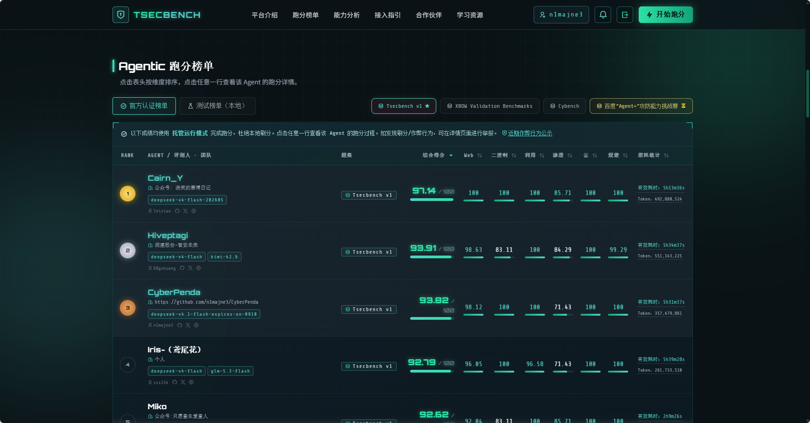

# CyberPenda

[English](README.md) · [中文](README.zh-CN.md)

本机跑的授权渗透测试 Agent。Go 控制面、React 控制台，接 Codex / Claude Code / Pi；项目有范围和审批，Goal / Step / Fact 记在黑板上，工具在沙箱里跑，不经 daemon 代理。

> **只可对你有权测试的系统使用。** 范围、审批、主机 Runner 激活都是产品一等能力，不是事后补丁。

**[打开在线 Demo →](https://cyberpenda-demo.vercel.app)** · 只读样例项目（没有 `pentestd`、没有运行时、没有利用工具）

### TSecBench v1 成绩

官方 [TSecBench](https://tsecbench.zc.tencent.com/) Agentic 榜（**TSecBench v1**）：**第 3 名 · 93.82 / 100**

| Web | 二进制 | 利用 | 渗透 | 云 | 规避 |
| --- | --- | --- | --- | --- | --- |
| 98.12 | 100 | 100 | 71.43 | 100 | 100 |

榜单记录配置：`deepseek-v4.1-flash-expires-on-0910` · 有效耗时约 5h 31m。Hosted Mode 镜像与评测说明见英文 README 的 [TSecBench Hosted evaluation](README.md#tsecbench-hosted-evaluation)，以及 [docs/tsecbench/README.md](docs/tsecbench/README.md)。



### 适合谁

红队 / AppSec 想在本机留一个能沉淀 findings 的 Agent 工作区。

已经在用 Codex、Claude Code 或 Pi，需要带范围约束的渗透会话。

目标凭证和浏览器会话不想丢进云端 Agent 浏览器。

### 为什么看这个仓库

| | CyberPenda | 常见 CLI skill 包 | 云端渗透 / AI 浏览器 |
| --- | --- | --- | --- |
| 跑在哪 | 本机（SQLite + 本地 UI） | 终端 | 厂商云 |
| 运行时 | Codex、Claude Code、Pi 插件 | 通常单一模型 / CLI | 仅内置 Agent |
| 范围与审批 | 一等项目控制 | 主要靠提示词 | 厂商策略 |
| 工具执行 | 沙箱 / 主机 Runner 内 | 临时 shell | 厂商沙箱 |

## 架构（短版）

| 组件 | 做什么 |
| --- | --- |
| `pentestd` | 本地 HTTP daemon：SQLite、Runtime Harness、FGS 接收、内嵌 UI |
| React 控制台 | 项目面板、启动、黑板、结果、设置 |
| Sandbox runner | 默认 Runner，隔离 runtime home / workdir / 进程环境（Docker / Podman） |
| Host runner | 显式开启；不会从沙箱自动降级 |
| Runtime Outbox | 按 continuation 作用域的 FGS 更新与持久 Receipt |
| `pentestctl` | 投影 Runtime 里发 / 读 FGS；保留遗留命令 |
| Runtime 插件 | 声明式适配器（Codex、Claude Code、Pi、fake） |
| Skills / 扩展 | 运行时无关 skill 包 + 运行时专用扩展 |

默认数据都在本机：`pentest.db`、任务运行目录、托管产物根目录。

## 快速开始

### 前置

- Go（见 `go.mod`）
- Node.js 20.19+ 或 22.12+（UI / `make dev`）
- GNU Make
- Sandbox Runner 要有 Linux 容器引擎：
  - macOS：建议 [OrbStack](https://orbstack.dev/) + Docker 兼容 CLI
  - Linux：Docker Engine 或 Podman
  - Windows：原生 `pentestd.exe` + Docker Desktop / Podman Desktop（Desktop WSL 里的 Linux 容器）

引擎矩阵见 [ADR 0025](docs/adr/0025-container-engine-support-matrix.md) 与 [docs/platform-engines.md](docs/platform-engines.md)。

### 本地开发

```sh
# 后端 :8787 + Vite UI（/api 代理）
make dev
```

打开前端打印的 Vite URL。构建、Compose、沙箱镜像、Hosted 评测等长步骤看 [英文 README](README.md)，这里不复读。

### 构建自包含 daemon

```sh
make build      # 先把 UI 打进本地 embed 路径，再编 pentestd
./pentestd
```

默认监听 `http://127.0.0.1:8787`。

## 文档

- [文档索引](docs/README.md)
- [领域词汇](CONTEXT.md)
- [FGS Runtime 协议](docs/specs/fgs-runtime-outbox-protocol.md)
- [ADRs](docs/adr/)
- [TSecBench](docs/tsecbench/README.md)
- 完整英文说明：[README.md](README.md)

## 许可 / 授权声明

CyberPenda **只用于授权安全测试**。范围、凭证、合规由操作者自己负责。禁止在未获许可的系统上使用。

本仓库以 [MIT License](LICENSE) 发布。
